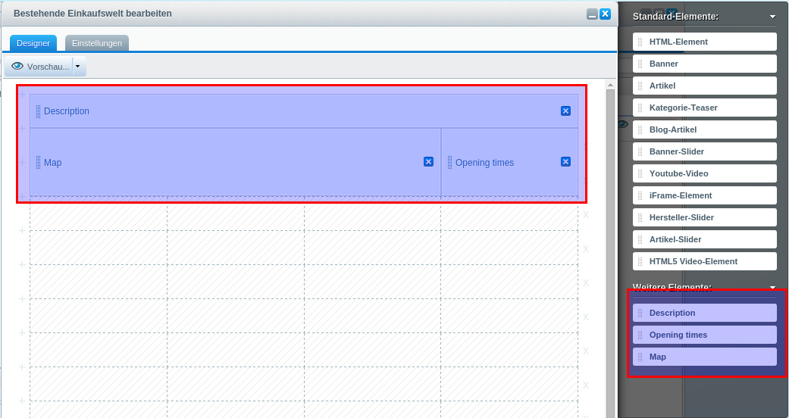

# SwagDynamicEmotion
This plugin will create a reusable shopping world, that is dynamically filled with content.

In this example, we have a "store" page, with several stores. The store page is entirely created using shopping worlds,
so the map, the description and other information are "components" of the shopping world.

# Screens
Designing the store page layout in the backend

The store layout is the same for all stores

# Details
This plugin will
* create a single "store" shopping world which configures the template of the store pages
* hides this store shopping world in the default shopping world module
* create an own "store management" backend module
* allows the user to modify the store shopping world directly from this module
* the "dynamic" shopping world components will be hidden in the default shopping world module and only appear
in the "store" shopping world