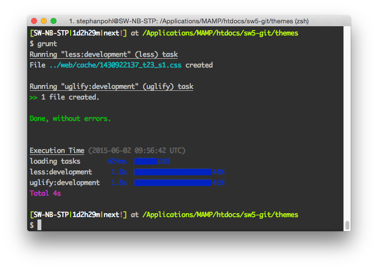

## Introducing

Introduced in Shopware 5.0.1, we ship our software with a `Gruntfile`, which helps you to create your own themes faster than ever before. [Grunt](http://gruntjs.com/) is a JavaScript task runner. When you're working on a JavaScript project, there are several things you'll want to do regularly, like concatenating given files or running JSHint on your code. You can achieve this with command line tools, but it would be nice to have a single, unified set of commands for all those extra tasks. That's what Grunt aims to be. It has several built-in tasks and can be extended with over 4.000 plugins.

In Shopware, we use Grunt to speed up the development of themes. In detail, we implemented a LESS and Uglify.js tasks, which compiles the LESS file based on the backend configuration in a single CSS file. It then concatenates all JavaScript files into a single file, to reduce the amount of HTTP requests.


## Installation

LESS and Grunt are based on Node.js, which makes it necessary to have [Node.js](https://nodejs.org/) and [npm](https://www.npmjs.com/) installed on your system. Node.js is available on a majority of systems and distrubition. If your system isn't listed below, please use the [official Node.js installation guide](https://github.com/joyent/node/wiki/Installation).

### Install Node.js/npm on Ubuntu 14.04

```
sudo apt-get update
sudo apt-get install nodejs-legacy npm
```

### Install Node.js/npm on Mac OS X
You can install `Node.js` and `npm` on Mac OS X using the provided [installer package](http://nodejs.org/#download) or you can use either [Homebrew](http://brew.sh/) or [MacPorts](http://www.macports.org/) as an alternative. If you want to use a package manager to install `Node.js` on your system, please install [Xcode](https://developer.apple.com/xcode/) first.

#### Using Homebrew
```
brew install node
```

#### Using MacPorts
```
port install nodejs
```


### Install the Grunt CLI
In order to use Grunt in your project, you need to install [Grunt CLI](https://github.com/gruntjs/grunt-cli).

```
sudo npm install -g grunt-cli
```
Install this globally and you'll have access to the ```grunt``` command anywhere on your system. **Note:** The job of the ```grunt``` command is to load and run the version of Grunt you have installed locally in your project, regardless of its version. Starting with Grunt v0.4, you should never install Grunt itself globally.

## How to use it

<div class="alert alert-warning"><strong>Note:</strong> The grunt tasks are only meant for development purpose. We can't guarantee that the compiled files are working in your production enviroment, therefore use the built-in LESS compiler in Shopware.</div>


### Dump theme configuration
Starting in Shopware 5, themes can be configured using the `Theme Manager` administration module. Before we can use the Grunt tasks, we have to dump the theme configuration using the Shopware console.

```
./bin/console sw:theme:dump:configuration
```

Running this command creates a JSON file named ```config_[shopid].json```, which contains the configuration of the theme and the LESS / JS files, which should be compiled using either LESS or Uglify.

### Install project dependencies
Now we need to install the dependencies. We install the Grunt library and additional Grunt plugins, which are necessary to compile LESS files for example:

```
cd themes/
npm install
```

### Start file watch
We have installed everything that we need to start working with Grunt. The default task will call the LESS compiler, concatenate all necessary files together and start watching your files. The `watch` command will track changes in your files as you save them and automatically process them.

```
grunt
grunt --shopId 1 # optionally specify shopId
```


