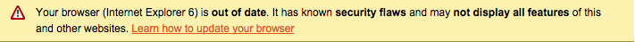

In this quick tip we like to explain how to integrate a notification bar in your web shop using the code snippet from [browser-update.org](http://browser-update.org). We'll end up with the following result:



* First of all create a new theme either using the [function in theme manager](http://localhost:8000/designers-guide/getting-started/#custom-themes) or using the Shopware Console.
* Now select the theme as active.
* Open up your ```Theme.php``` file which is located in your custom theme.
* Now insert the following code snippet in the file: 

```
protected $javascript = [
    'src/js/browser-notification.js'
];
```
* Save the file and head to the directory ```frontend/_public/src/js``` in your theme.
* Now create a new file named ```browser-notification.js``` and insert the following code:

```
;(function(window, document) {
    var $buoop = {c:2};
     
    function $buo_f(){ 
        var e = document.createElement("script"); 
        e.src = "//browser-update.org/update.js"; 
        document.body.appendChild(e);
    };
    
    try {
        document.addEventListener("DOMContentLoaded", $buo_f,false);
    } catch(e) {
        window.attachEvent("onload", $buo_f);
    }
})(window, document);
```
* As a last step, clean your theme cache and you have a new notification bar when the user opens the page with a outdated browser.

## Tips & Tricks
Additionally you can customize the script to your needs. Here are all available options which you can insert into the ```$buoop``` object:

```
var $buoop = {
    vs: {i:6,f:2,o:9.63,s:2,c:10},  // browser versions to notify
    reminder: 24,                   // atfer how many hours should the message reappear
                                    // 0 = show all the time
    reminderClosed: 150             // if the user closes message it reappears after x hours
    onshow: function(infos){},      // callback function after the bar has appeared
    onclick: function(infos){},     // callback function if bar was clicked
    onclose: function(infos){},     //

    l: false,                       // set a language for the message, e.g. "en"
                                    // overrides the default detection
    test: false,                    // true = always show the bar (for testing)
    text: "",                       // custom notification html text
    text_xx: "",                    // custom notification text for language "xx"
                                    // e.g. text_de for german and text_it for italian
    newwindow: true                 // open link in new window/tab
};
```

### Edit the CSS
The following CSS rules are applied by the script. You can overwrite them in your own CSS. To do so you need to add some more specifity to the css-rules:

```
.buorg {
    position: absolute;
    width: 100%;
    top: 0;
    left: 0;
    border-bottom: 1px solid #A29330;
    background: #FDF2AB no-repeat 1em 0.55em url(http://browser-update.org/img/dialog-warning.gif);
    text-align: left;
    cursor: pointer;
    font-family: Arial,Helvetica,sans-serif; color:#000;
    font-size: 12px;
}
.buorg div {
    padding: 5px 36px 5px 40px;
}
.buorg a {
    color: #E25600;
}
#buorgclose {
    position: absolute;
    right: .5em;
    top:.2em;
    height: 20px;
    width: 12px;
    font-weight: bold;
    font-size:14px;
    padding:0;
}
```


