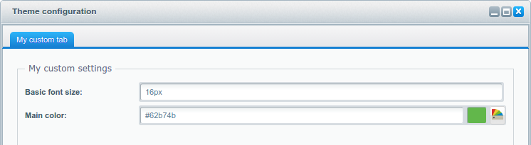
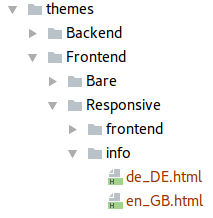
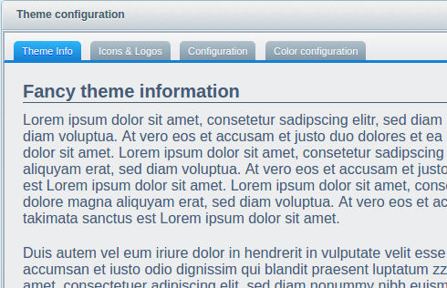
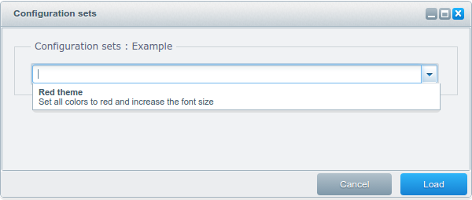

<div class="toc-list"></div>

## Introduction

The `Theme.php` is the base file of each Shopware theme. It contains the basic information like the name, author, description and the license, which are displayed in the Theme Manager:

```php
<?php
namespace Shopware\Themes\Example;

use Doctrine\Common\Collections\ArrayCollection;
use Shopware\Components\Form as Form;
use Shopware\Components\Theme\ConfigSet;

class Theme extends \Shopware\Components\Theme
{
    /** @var string Defines the parent theme */
    protected $extend = 'Responsive';

    /** @var string Defines the human readable name */
    protected $name = 'Example';

    /** @var string Description of the theme */
    protected $description = 'An example theme';

    /** @var string The author of the theme */
    protected $author = 'shopware AG';

    /** @var string License of the theme */
    protected $license = 'MIT';
}
```

The `Theme.php` can also contain the theme's custom configuration and included files like JavaScript or CSS. In this guide you will learn how to customize your own theme's configuration and how to deal with additional files.

## Adding JavaScript and CSS

Working with compressors isn't always as easy as adding the files to your HTML structure using `script` tags. The built-in JavaScript compressor is as easy as this, and perfectly suited your workflow as a web developer.

### Adding JavaScript

Simply place your JavaScript files in the `frontend/_public` directory and add their paths to the `$javascript` array in your `Theme.php`:

```php
/** @var array Defines the files which should be compiled by the javascript compressor */
protected $javascript = array(
    'src/js/jquery.my-plugin.js'
);
```

### Adding CSS

You can add a `$css` array to your `Theme.php` file, similar to the `$javascript` array, with the paths of your CSS files:

```php
/** @var array Defines the files which should be compiled by the javascript compressor */
protected $css = array(
    'src/css/my-styles.css'
);
```

## Customizing the theme configuration

It's possible to add custom configuration options to your theme. Using this method, the user can fully customize the theme without having to edit any CSS files.

To create configuration elements it's necessary to add a `createConfig()` method to your `Theme.php`. This method specifies the elements you need for the configuration form. The first parameter is the container element of type `Shopware\Components\Form\Container\TabContainer` where you can add additional fields as well as other container elements:

```php
/**
 * @param Form\Container\TabContainer $container
 */
public function createConfig(Form\Container\TabContainer $container)
{
    $tab = $this->createTab(
        'my_custom_tab',
        'My custom tab'
    );
    
    $container->addTab($tab);
}
```

### Container elements

The `$container` also accepts other container elements like a tab or a fieldset:

```php
/**
 * @param Form\Container\TabContainer $container
 */
public function createConfig(Form\Container\TabContainer $container)
{
    $fieldset = $this->createFieldSet(
        'my_custom_settings',
        'My custom settings'
    );
    
    $tab = $this->createTab(
        'my_custom_tab',
        'My custom tab'
    );
    
    $tab->addElement($fieldset);

    $container->addTab($tab);
}

```

### Adding elements to the configuration container

Now you can add the necessary elements to the `$container`. The following elements are available:

- `createTextField`
- `createNumberField`
- `createCheckboxField`
- `createDateField`
- `createEmField`
- `createColorPickerField`
- `createMediaField`
- `createPercentField`
- `createPixelField`
- `createSelectField`
- `createTextAreaField`

All elements have a similar syntax:

```
$this->createTextField([unique name], [label], [default value]);
```

In the following example, we create a text and a color picker fields. The name of any field is mandatory and has to be unique. It will be used to assign the value of the field to the storefront:

```php
/**
 * @param Form\Container\TabContainer $container
 */
public function createConfig(Form\Container\TabContainer $container)
{
    // Create the fieldset which is the container of our field
    $fieldset = $this->createFieldSet(
        'my_custom_settings',
        'My custom settings'
    );

    // Create the textfield
    $textField = $this->createTextField(
        'basic_font_size',
        'Basic font size',
        '16px'
    );
    
    // Create the color picker field
    $colorPickerField = $this->createColorPickerField(
        'custom-color-main',
        'Main color',
        '#62b74b'
    );

    // Adding the fields to the fieldset
    $fieldset->addElement($textField);
    $fieldset->addElement($colorPickerField);

    // Create the tab which will be named "My custom colors"
    $tab = $this->createTab(
        'my_custom_tab',
        'My custom tab'
    );

    // ...add the fieldset to the tab
    $tab->addElement($fieldset);

    // ...last but not least add the tab to the container, which is a tab panel.
    $container->addTab($tab);
}

```

After saving the `Theme.php`, you will be able to see your new settings inside the additional tab "My custom tab":


Now you can use the value of the fields inside the template files of the storefront:

```
{$theme.basic_font_size}
```

The field values are also automatically available inside your LESS files. You can use them by inserting a variable which has the unique name of the configuration field:

```
@custom-color-main;
```

### Further customization

Helper methods like `createTab()` or `createFieldSet()` automatically create ExtJs components for you, so that you don't have to write any JavaScript code when creating your theme configuration. The `createFieldSet()` method accepts a third optional parameter which is an attributes array. This array can contain several ExtJs properties which can customize a field set. 

This attributes array creates a two-column layout for the field set from the previous example:

```php
$fieldset = $this->createFieldSet(
    'my_custom_settings',
    'My custom settings',
    array(
        'attributes' => array(
            'layout' => 'column',
            'flex' => 0,
            'defaults' => array(
                'columnWidth' => 0.5,
                'labelWidth' => 180,
                'margin' => '2 15 2 0'
            )
        )
    )
);
```


<div class="alert alert-info">
If you'd like to learn more about the layout options which can be used in the attributes array, you can take a look at the <a href="https://docs.sencha.com/extjs/4.1.1/#!/api">ExtJs documentation</a>.
</div>

## Creating a blank theme configuration

It is also possible to create a completely blank theme configuration. To prevent your theme configuration from showing the parent theme configuration you can add the `$inheritanceConfig` variable to your `Theme.php`:

```php
protected $inheritanceConfig = false;
```

As you can see, the "My custom tab" is the only one which is displayed inside the theme configuration:



Now you can either override the default unique names like e.g. `brand-primary` or create your own.

<div class="alert alert-warning">
Every existing field which is not overwritten in your <code>Theme.php</code> will use the default value of your parent theme.
</div>

## Create a theme info tab

In order to create a new tab containing information about your theme, create a new sub-directory in your theme directory called **info**. Add HTML files named like the language ISO you want support.



If the current backend language ISO is not found, Shopware uses the fallback en_GB.html. 

Use HTML and CSS in your file to style and describe the information as you want.

```html
<style type="text/css">
    .yourBodyContainer {
        ...
    }
</style>

<div class="yourBodyContainer">
    ...
</div>
```
 


## Configuration sets

With every theme configuration you have the ability to create custom configuration sets. Inside those configuration sets you can apply a specific value to each configuration field using the `setValues()` method. In this example the color field gets a hex value for red and the font size field gets an increased value of 20px:

```php
public function createConfigSets(ArrayCollection $collection)
{
    $set = new ConfigSet();
    $set->setName('Red theme');
    $set->setDescription('Set all colors to red and increase the font size');
    $set->setValues(array(
        'basic_font_size' => '20px',
        'custom-color-main' => '#ff0000'
    ));

    $collection->add($set);
}
```

After saving the `Theme.php` you should see your configuration set inside the configuration sets window:


