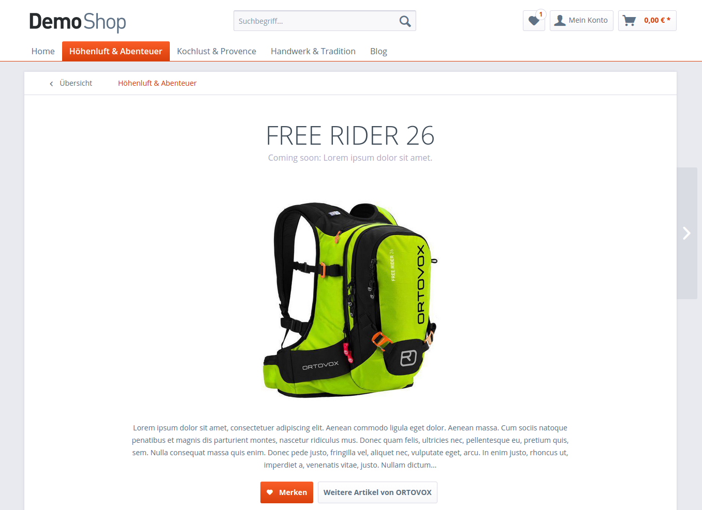
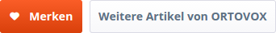
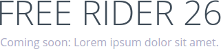
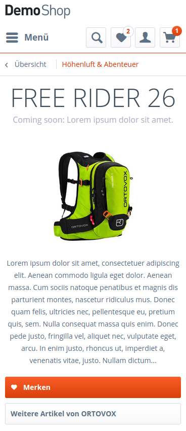
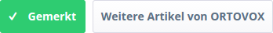

## Introduction

In this tutorial you will learn how to create your own custom template for detail pages. In this example we want to get rid of the default detail page layout and create a more minimalistic layout for marketing purposes. This custom template could be used for products which are not yet in stock, but should be mentioned or announced to the customer.

<div class="alert alert-warning" role="alert">
    <strong>Warning:</strong> Before you start modifying any template file, please make sure that you use a custom theme. If you'd like to have a more general introduction in working with themes please read our <a href="https://developers.shopware.com/designers-guide/">getting started tutorials</a>.
</div>



## Table of contents

- [Preparation](#preparation)
- [Structure](#structure)
   - [Product header](#product-header)
   - [Product description](#product-description)
   - [Product actions](#product-actions)
   - [Smarty code overview](#smarty-code-overview-custom_deta)
- [Styling](#styling)
   - [Styling the product header](#styling-the-product-header)
   - [Styling the Product image](#styling-the-product-image)
   - [Styling the Product description](#styling-the-product-description)
   - [Styling the Product actions](#styling-the-product-actions)
   - [LESS code overview](#less-code-overview-custom-detail)
- [JavaScript](#javascript)
- [Download theme plugin](#download-theme-plugin)

## Preparation

First of all we have to create a new template file within the `frontend/detail` directory of our own theme. In this tutorial we'll name the file `custom_detail.tpl`:

```
CustomDetailTheme
 └── frontend
     └── detail
         └── custom_detail.tpl
```

Then we extend our new template from `frontend/detail/index.tpl`:

```
{extends file='frontend/detail/index.tpl'}
```

We will add some custom LESS/CSS modifications later. Therefore, we add a wrapping div container with an individual class `custom-detail`:

```
{block name='frontend_index_content'}
    <div class="custom-detail">
        {$smarty.block.parent}
    </div>
{/block}
```

<div class="alert alert-info">
    If you want to know how to use your custom template for a specific detail page <a href="https://developers.shopware.com/designers-guide/custom-templates/">please take a look at out tutorial</a>.
</div>

## Structure

In order to get a more minimalistic design we want to remove the default product buybox from the detail page. Don't worry: We will insert the most necessary product information like e.g. the product description back to the template later.

This override makes the whole container with the primary buy options disappear:

```
{block name='frontend_detail_index_buy_container'}
{/block}
```

### Product header

The product header contains the product title as well es the rating stars and the supplier logo. In our example we only want to show the product title and the short description. To achieve that we override the product header block. Inside this block we only want to output `$sArticle.articleName` and `$sArticle.description`. The `custom-detail--claim` container is defined inside a condition and will only be shown, when the `$sArticle.description` exists. We also add individual classes for styling purposes:

```
{block name='frontend_detail_index_header_inner'}
    <h1 class="custom-detail--title">
        {$sArticle.articleName}
    </h1>

    {if $sArticle.description}
        <div class="custom-detail--claim">
            {$sArticle.description}
        </div>
    {/if}
{/block}
```

### Product description
In the next step we will replace the default product description and rating tabs by overriding the `frontend_detail_index_detail` block. Due to our minimalistic design we only want to output the product description with 450 characters:

```
{block name='frontend_detail_index_detail'}
    <div class="custom-detail--description">
        {$sArticle.description_long|truncate:450}
    </div>
{/block}
```

### Product actions

The last thing we need to do in terms of the structure is adding the necessary product actions. In our example we want to show two buttons: A link to other products of the supplier and a "Remember" button to save the product to the wishlist. The code for this two buttons will also be inside the `frontend_detail_index_detail` block.

To add the "Remember" button we create an `<a>` tag with the class `btn`. This will apply the general button appearance. The button will be a large and primary button with an icon. Therefore, we have to add further helper classes: `is--primary`, `is--large` and `is--icon-left`. It is also **very important** to add the `link--notepad` class. This class is required by the `swAjaxWishlist` jQuery plugin which adds the current product to the wishlist without a page reload. To make the button work properly we need to add the following action to the `href` attribute:

```
{url controller='note' action='add' ordernumber=$sArticle.ordernumber}
```

*Explanation: We call the add action of the note controller and use the current order number as a parameter.*

To keep all ajax functionality we have to add a data-attribute `data-ajaxUrl` and do basically the same thing, except that we use the `ajaxAdd` action:

```
{url controller='note' action='ajaxAdd' ordernumber=$sArticle.ordernumber}
```

For the button texts we use the existing snippets `DetailLinkNotepadShort` and `DetailLinkNotepad` and set the namespace manually to `frontend/detail/actions`. To make sure that the button text changes to "Remembered" when clicking on it, we wrap the actual button text inside the `action--text` class. This class is also used by the `swAjaxWishlist` plugin:

```
<div class="custom-detail--actions">
    <a class="link--notepad btn is--primary is--large is--icon-left"
       href="{url controller='note' action='add' ordernumber=$sArticle.ordernumber}"
       data-ajaxUrl="{url controller='note' action='ajaxAdd' ordernumber=$sArticle.ordernumber}"
       title="{"{s name='DetailLinkNotepad' namespace="frontend/detail/actions"}{/s}"|escape}">
        <i class="icon--heart"></i>
        <span class="action--text">
            {s name="DetailLinkNotepadShort" namespace="frontend/detail/actions"}{/s}
        </span>
    </a>
</div>
```

Adding the "More from supplier" button is a little easier. For the value of the `href` attribute we only need to call the manufacturer action of the listing controller and use `$sArticle.supplierID` as a parameter:

```
{url controller='listing' action='manufacturer' sSupplier=$sArticle.supplierID}
```

The button styling is almost the same and we also use an existing snippet `DetailDescriptionLinkInformation` for both `title` attribute and button text:

```
<a class="btn is--large"
   href="{url controller='listing' action='manufacturer' sSupplier=$sArticle.supplierID}"
   title="{"{s name="DetailDescriptionLinkInformation" namespace="frontend/detail/description"}{/s}"|escape}">
    {s name="DetailDescriptionLinkInformation" namespace="frontend/detail/description"}{/s}
</a>
```

When using the shopware default components you should already get a proper button appearance:



<div class="alert alert-info">
    Do you need more information about the default components? <a href="https://developers.shopware.com/designers-guide/responsive-theme-default-components/">Using the Responsive theme default components</a>
</div>

### Smarty code overview `custom_detail.tpl`

```
{extends file='parent:frontend/detail/index.tpl'}

{block name='frontend_index_content'}
    <div class="custom-detail">
        {$smarty.block.parent}
    </div>
{/block}

{block name='frontend_detail_index_buy_container'}
{/block}

{block name='frontend_detail_index_header_inner'}
    <h1 class="custom-detail--title">
        {$sArticle.articleName}
    </h1>

    {if $sArticle.description}
        <div class="custom-detail--claim">
            {$sArticle.description}
        </div>
    {/if}
{/block}

{block name="frontend_detail_index_detail"}
    <div class="custom-detail--description">
        {$sArticle.description_long|truncate:450}
    </div>

    <div class="custom-detail--actions">
        <a class="link--notepad btn is--primary is--large is--icon-left"
           href="{url controller='note' action='add' ordernumber=$sArticle.ordernumber}"
           data-ajaxUrl="{url controller='note' action='ajaxAdd' ordernumber=$sArticle.ordernumber}"
           title="{"{s name='DetailLinkNotepad' namespace="frontend/detail/actions"}{/s}"|escape}">
            <i class="icon--heart"></i>
            <span class="action--text">
                {s name="DetailLinkNotepadShort" namespace="frontend/detail/actions"}{/s}
            </span>
        </a>
        <a class="btn is--large"
           href="{url controller='listing' action='manufacturer' sSupplier=$sArticle.supplierID}"
           title="{"{s name="DetailDescriptionLinkInformation" namespace="frontend/detail/description"}{/s}"|escape}">
            {s name="DetailDescriptionLinkInformation" namespace="frontend/detail/description"}{/s}
        </a>
    </div>
{/block}
```

## Styling

<div class="alert alert-info" role="alert">
Need help with LESS? Have a look at our <a href="https://developers.shopware.com/designers-guide/less/">Getting started with LESS</a> guide.
</div>

Because of the changes we have made to the structure we need to adjust the styling. To stay organized we create a new file named `custom-detail.less`:

```
CustomDetailTheme
 └── frontend
     └── _public
         └── src
             └── less
                 ├── all.less
                 └── custom-detail.less
```

Don't forget to import the file inside the `all.less`:

```
@import "custom-detail";
```

To ensure, that our styling adjustments only work on the custom detail page, we wrap our code inside the class we have created before:

```
.custom-detail {
    // Custom styling here
}
```

First of all we want to center the product title, description and action buttons:

```
.product--header,
.custom-detail--description,
.custom-detail--actions {
    text-align: center;
}
```

### Styling the product header
To get a modern and minimalistic design we increase the `font-size` of the product title to `50px` and set the `font-weight` to `300`. The product's short description inside the `custom-detail--claim` gets a smaller `font-size` and a gray color:



```
.custom-detail--title {
    .unitize(font-size, 50);
    .unitize(line-height, 45);
    .unitize-margin(10, 0, 10, 0);
    font-weight: 300;
}

.custom-detail--claim {
    .unitize(font-size, 16);
    .unitize(margin-bottom, 30);
    color: darken(@gray-dark, 15%);
}
```

<div class="alert alert-warning">
    Always use the <strong>.unitize()</strong> mixin when you are dealing with sizes.
</div>

### Styling the product image

Due to the fact that we have removed the default buybox, we can center the product image in the middle of the main content area. To achieve that, we give the the default `product--image-container` a `width: 100%` and remove the floating with `float: none;`:

```
.product--image-container {
    float: none;
    width: 100%;
}
```

When the product has more than one image, the product slider with slider dots and thumbnails will show up on the detail page. The slider dots are positioned absolute by default. We don't want the slider dots to be absolute and we give them a `position: relative` so they are displayed as a normal block element right underneath the product image:

```
.image-slider--dots {
    .unitize-padding(15, 0);
    position: relative;
    top: auto;
}
```

We also don't want the thumbnails of the image slider to be shown on the page:

```
.image-slider--thumbnails { 
    display: none; 
}
```

The image slider container has a bottom margin for those thumbnails by default. Because we have removed it, we can also get rid of the bottom margin:

```
.image-slider--container {
    margin-bottom: 0;
}
```

### Styling the product description

On tablet landscape and desktop viewports we want the product description to be centered and 75% wide:

```
@media screen and (min-width: @tabletLandscapeViewportWidth) {
    .custom-detail {
        .custom-detail--description {
            margin: 0 auto;
            width: 75%;
        }
    }
}
```

### Styling the product actions

To add a bit more spacing between the product action buttons and the further page content, we apply some margin and padding as well as a horizontal line:

```
.custom-detail--actions {
   .unitize(padding-bottom, 30);
   .unitize(margin-bottom, 30);
   border-bottom: 1px solid @border-color;
}
```

We also want the buttons to be block elements on the phone viewport:



```
.btn {
    .unitize(margin-bottom, 10);
    display: block;
}
```

As mentioned before the text of the "Remember" button should change to "Remembered" when you add an item to the wishlist. We want to give this behavior a nice touch and change the background to a success color:



```
.link--notepad.js--is-saved {
    color: #fff;
    background: @highlight-success;
}
```

Now we can set the buttons back to `inline-block` when the phone landscape viewport is reached:

```
@media screen and (min-width: @phoneLandscapeViewportWidth) {
    .custom-detail {
        .custom-detail--actions {
            .btn {
                .unitize(margin-right, 5);
                display: inline-block;
            }
        }
    }
}
```

### LESS code overview `custom-detail.less`

```
.custom-detail {
    .product--header,
    .custom-detail--description,
    .custom-detail--actions {
        text-align: center;
    }

    .custom-detail--title {
        .unitize(font-size, 50);
        .unitize(line-height, 45);
        .unitize-margin(10, 0, 10, 0);
        font-weight: 300;
    }

    .custom-detail--claim {
        .unitize(font-size, 16);
        .unitize(margin-bottom, 30);
        color: darken(@gray-dark, 15%);
    }

    .product--image-container {
        float: none;
        width: 100%;
    }

    .image-slider--dots {
        .unitize-padding(15, 0);
        position: relative;
        top: auto;
    }

    .image-slider--thumbnails {
        display: none;
    }

    .image-slider--container {
        margin-bottom: 0;
    }

    .custom-detail--actions {
        .unitize(padding-bottom, 30);
        .unitize(margin-bottom, 30);
        border-bottom: 1px solid @border-color;

        .btn {
            .unitize(margin-bottom, 10);
            display: block;
        }

        .link--notepad.js--is-saved {
            color: #fff;
            background: @highlight-success;
        }
    }
}

@media screen and (min-width: @phoneLandscapeViewportWidth) {
    .custom-detail {
        .custom-detail--actions {
            .btn {
                .unitize(margin-right, 5);
                display: inline-block;
            }
        }
    }
}

@media screen and (min-width: @tabletLandscapeViewportWidth) {
    .custom-detail {
        .custom-detail--description {
            margin: 0 auto;
            width: 75%;
        }
    }
}
```

## JavaScript

Because of the new layout we don't have enough space to show the mouseover image zoom which is displayed on the desktop viewport. We will remove the specific jQuery plugin on our custom detail page.

To add JavaScript functionality we create a new JavaScrip file named `jquery.custom-detail.js`:

```
CustomDetailTheme
 └── frontend
     └── _public
         └── src
             └── js
                 └── jquery.custom-detail.js
```

We also need to mention the new file inside the `Theme.php` of our custom theme:

```
protected $javascript = array(
    'src/js/jquery.custom-detail.js'
);
```

The code to remove the image zoom is pretty simple. At first we check if the main `content-wrapper` has a child `div` with the class `custom-detail`. If this is the case, we can remove the plugin for the `xl` viewport using the `removePlugin` method of the `StateManager`.

```
(function($, window) {
    if($('.content--wrapper').children('div').hasClass('custom-detail')) {
        window.StateManager.removePlugin('.product--image-zoom', 'swImageZoom', 'xl');
    }
}(jQuery, window));
```

## Download theme plugin

If you want to take a closer look at all the code we have written in this tutorial you can download this plugin:

<strong><a href="{{ site.url }}/exampleplugins/SwagCustomDetailTheme.zip">Plugin download</a></strong>