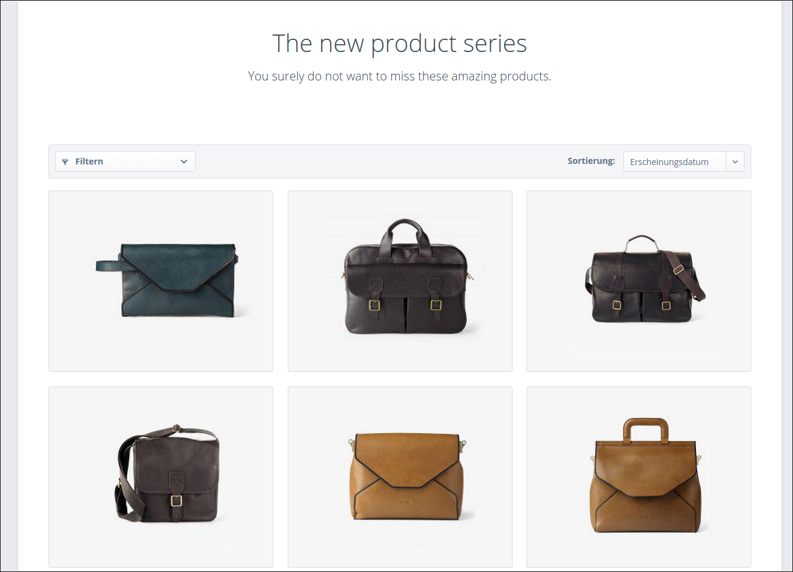

<div class="toc-list"></div>

## Introduction

In this tutorial you will learn how to create your own custom template for category listing pages. In this example we want to customize the CMS content, replace the default product listing, extend the default product box and add a few styling adjustments. This custom template can be used for products (or product streams) that should be distinctively presented, like a new clothing series.

<div class="alert alert-warning" role="alert">
    <strong>Warning:</strong> Before you start modifying any template file, please make sure that you use a custom theme. If you'd like to have a more general introduction to working with themes, please read our <a href="/designers-guide/theme-startup-guide/">theme startup guide</a>.
</div>



## Preparation

First of all we have to create a new template file inside the `frontend/listing` directory of our own theme. The directory of the file is very important for the inheritance system of Shopware and has to be correct in order to work properly. In this tutorial we'll name the file `custom_listing.tpl`:

```
CustomListing
 └── frontend
     └── listing
         └── custom_listing.tpl
```

Then we extend our new template from `frontend/listing/index.tpl`:

```
{extends file='parent:frontend/listing/index.tpl'}
```

We will add some custom LESS/CSS modifications later. Therefore, we add a wrapping element with an individual `custom-detail` class as a container class:

```html
{block name='frontend_index_content'}
    <div class="custom-listing">
        {$smarty.block.parent}
    </div>
{/block}
```

<div class="alert alert-info">
    If you want to know how to use your custom template for a specific detail page, please take a look at our <a href="/designers-guide/custom-templates/">custom template tutorial</a>.
</div>


## Structure

### Exclude elements

We will manually exclude the `sidebar` and the `topseller-slider` from our custom listing template by overwriting the specific blocks with empty content. These are the blocks that contain the specific definitions:

```html
{block name='frontend_index_content_left'}
{/block}

{block name="frontend_listing_index_topseller"}
{/block}
```

### CMS content

We want to overwrite the default CMS content output of the listing and implement some custom markup and styling to it. This is the original block we will overwrite to add our new CMS markup:

```html
{block name="frontend_listing_index_text"}
```

The CMS content that can be added to a category in the backend is optional, so in order to not display an empty element if no content is added, we will create a prompt that checks if the `cmsHeadline` or `cmsText` contain any information.

```html
{if $sCategoryContent.cmsHeadline || $sCategoryContent.cmsText}
    <div class="custom-listing--intro">
        <h1 class="intro--cmsHeadline">{$sCategoryContent.cmsHeadline}</h1>
        <span class="intro--cmsText">{$sCategoryContent.cmsText}</span>
    </div>
{/if}
```

### Actual listing

We will overwrite the default listing and include our own customized product box for each article inside the category. This is the block that handles the iteration through the `$sArticles` variable, which contains all articles that are accessible on the current page:

```
{block name="frontend_listing_list_inline"}
```

We will simply overwrite the default listing block and add our own iteration through the products with an `{foreach}` tag. For every article that is found we will include a custom product box, that we will create next. We also define the `$productBoxLayout` variable of Shopware as `custom`:

```html
{block name="frontend_listing_list_inline"}
    {$productBoxLayout = "custom"}
    <div class="custom-listing--listing">
        {foreach $sArticles as $sArticle}
            {include file="frontend/listing/box-custom.tpl"}
        {/foreach}
    </div>
{/block}
```

### Custom product box

The new product box is separated into its own `box-custom.tpl` file and extends the default `box-basic` product box of the bare theme. When we added the `{extends}` command of Smarty and chose the correct path, we can now overwrite every part of the product box inside our newly created file:

```html
{extends file="parent:frontend/listing/product-box/box-basic.tpl"}
```

When we take a look at the `box-basic.tpl` file of the bare theme, we can find the `frontend_listing_box_article` block that contains the whole content of the product box. We will take that block and overwrite it completely:

```html
{block name="frontend_listing_box_article_content"}
```

After defining the block we are ready to add some markup to our template file. We can adopt the `box--content` element and the helper class `is--rounded` that adds a border radius to the product box. Inside the `box--content` element we will add an `<a>`, which will later be the hovering layer. We also add some additional information like the `articleName` and `price` properties. The article image will be included from the bare theme with the `{include file="parent: ... "}` tag, with which you can import partials of the inherited theme:

```html
<div class="box--content is--rounded">
    <a class="box-custom--info" href="{$sArticle.linkDetails|rewrite:$sArticle.articleName}">
        <div class="info--wrapper">
        <span class="info--name">
            {$sArticle.articleName|escape}
        </span>
        <span class="info--price">
            {$sArticle.price|currency}
        </span>
        </div>
    </a>

    <div class="box-custom--image">
        {include file="parent:frontend/listing/product-box/product-image.tpl"}
    </div>
</div>
```

## Styling

The structural changes that we added require a styling adjustment in the frontend in order to work and look correctly. We will add two new `less` files to our theme, first the required `all.less` file and a `custom-listing.less` which will contain our style adjustments. The `all.less` file is automatically recognized by Shopware and all we need to do is import our new created file.

<div class="alert alert-info" role="alert">
Need help with LESS? Have a look at our <a href="https://developers.shopware.com/designers-guide/less/">Getting started with LESS</a> guide.
</div>

```
CustomListingTheme
 └── frontend
     └── _public
         └── src
             └── less
                 ├── all.less
                 └── custom-listing.less
```

Don't forget to import the `custom-listing` stylesheet into the `all.less` file:

```less
@import "custom-listing";
```

To ensure that our styling adjustments are only applied on the custom detail page, we wrap our code inside the class we have created before:

```less
.custom-listing {
    // Custom styling here
}
```

### Styling the CMS header

Here we add a bit of styling to our CMS header content.

```less
.custom-listing--cms {
    .unitize(margin-bottom, 100);

    .cms--headline {
        .unitize(font-size, 40);
        .unitize(line-height, 45);
        font-weight: 300;
        text-align: center;
    }

    .cms--text h2 {
        .unitize(font-size, 20);
        font-weight: 300;
        margin: 0;
        text-align: center;
    }
}   
```

### Changing the default product box behavior

When our custom product box is active, we want to change the responsive behavior of the product boxes and define new breakpoints. In order to do that, we will use media queries for the specific viewports that are defined in Shopware and define new `width` properties inside them.

```less
@media screen and (min-width: @phoneLandscapeViewportWidth) {
    .box--custom {
        width: 100%;
    }
}

@media screen and (min-width: @tabletViewportWidth) {
    .box--custom {
        width: 50%;
    }
}

@media screen and (min-width: @tabletLandscapeViewportWidth) {
    .box--custom {
        width: 33.33333%;
    }
}
```

### Styling the product box

In the last step we will add styling to the product box itself, add the hover effects and finalize the look of our listing. Notice that we are using the `.unitize()` mixin to calculate the `pixel` values into `rem` values. Also, our product images in this example have a transparent / single color background, which allows us to simply set the background of our product box to the same color. We are also using the `top / translate` solution to center the product image horizontally:

```less
.box--custom {
    
    .box--content {
        .unitize(height, 300);
        background-color: #F6F6F6;
    }
    
    .box-custom--info {
        background-color: rgba(218, 218, 218, 0.74);
        display: none;
        height: 100%;
        left: 0;
        position: absolute;
        top: 0;
        width: 100%;
        z-index: 2;
    }
    
    &:hover .box-custom--info {
        display: block;
    }
    
    .info--wrapper {
        .unitize(padding, 35);
        bottom: 0;
        display: block;
        height: 45%;
        position: absolute;
        width: 100%;
    
        .info--name {
            .unitize(font-size, 30px);
            color: #000;
            display: block;
            font-weight: 300;
            text-align: center;
        }
    
        .info--price {
            .unitize(font-size, 22px);
            display: block;
            text-align: center;
        }
    }
    
    .image--element {
        position: absolute;
        top: 50%;
        transform: translate(0, -50%);
    
        .image--media img {
            .unitize(padding, 30px);
            height: 100%;
        }
    }
}
```

## Download theme plugin

If you want to take a closer look at all the code we have written in this tutorial you can download this plugin:

<strong><a href="{{ site.url }}/exampleplugins/SwagCustomListingTheme.zip">Plugin download</a></strong>
