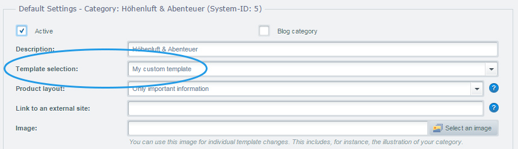
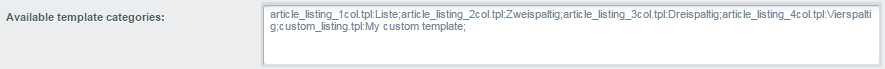
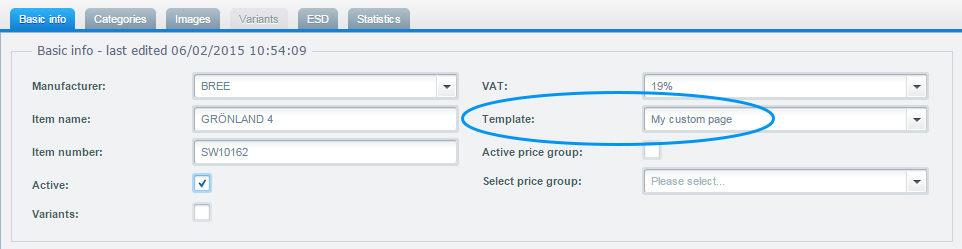
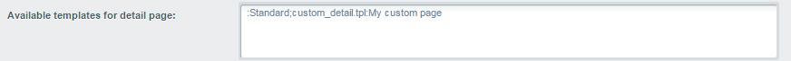

## Custom category templates
To be more flexible when building different product pages you are able to create your own custom category templates. Your template will be selectable in the backend category settings and can be configured for every single category.

First create a new template file in the `frontend/listing/` directory of your theme. This is your base file for your new template. If you don't want to rebuild everything from scratch you can use the `{extends}` method to extend the original category template und just edit the necessary blocks. See the <a href="{{ site.url }}/designers-guide/smarty/" target="_blank"><strong>Smarty 101</strong></a> guide for more information about extending templates.
 
 
To make your new file selectable in the category settings you have to add it in the basic settings of your shop.  
You go to *Configuration* -> *Basic settings* -> *Frontend* -> *Categories / lists* -> *Available template categories*. 

You can add your template by extending the string with the name of your new template file and the name for the label. In our example it is `custom_listing.tpl:My custom template`. After saving you have to clear the configuration cache to make your new template option appear in the category settings.

## Custom detail page templates
You cannot only create custom templates for category, but also for detail pages. It works quite the same way.

First you create the corresponding template file in the `frontend/detail/` directory of your theme. To also make this file selectable in the product settings we have to add it in the basic settings.
Go to *Configuration* -> *Basic settings* -> *Frontend* -> *Shopping cart / item details* -> *Available templates for detail page*

Add the template file and the name for the label to the string in the input field. In our example it is `;custom_detail.tpl:My custom page`. After clearing the configuration cache you can select your new template in the product settings.

