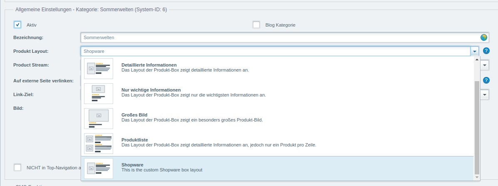

<div class="toc-list"></div>

## Custom category templates
To be more flexible when building different product pages you are able to create your own custom category templates. Your template will be selectable in the backend category settings and can be configured for every single category.


First create a new template file in the `frontend/listing/` directory of your theme. This is your base file for your new template. If you don't want to rebuild everything from scratch you can use the `{extends}` method to extend the original category template und just edit the necessary blocks. See the <a href="{{ site.url }}/designers-guide/smarty/" target="_blank"><strong>Smarty 101</strong></a> guide for more information about extending templates.
<br />
<br />
To make your new file selectable in the category settings you have to add it in the basic settings of your shop.  
You go to *Configuration* -> *Basic settings* -> *Frontend* -> *Categories / lists* -> *Available template categories*. 


You can add your template by extending the string with the name of your new template file and the name for the label. In our example it is `custom_listing.tpl:My custom template`. After saving you have to clear the configuration cache to make your new template option appear in the category settings.

## Custom detail page templates
You cannot only create custom templates for category, but also for detail pages. It works quite the same way.


First you create the corresponding template file in the `frontend/detail/` directory of your theme. To also make this file selectable in the product settings we have to add it in the basic settings.
Go to *Configuration* -> *Basic settings* -> *Frontend* -> *Shopping cart / item details* -> *Available templates for detail page*


Add the template file and the name for the label to the string in the input field. In our example it is `;custom_detail.tpl:My custom page`. After clearing the configuration cache you can select your new template in the product settings.

## Custom product box layouts
<div class="alert alert-info" role="alert">
Only for Shopware >= 5.5.4
</div>
<br />

You can add custom product box layouts by extending the `ProductBoxLayout` store with an ExtJS Plugin. By extending this store it is possible to select an additional item from the Product Layout dropdown at the category's detail view. 
This could look like this:



To add a new product layout you have to override the `createLayoutData` method in `themes/Backend/ExtJs/backend/base/store/product_box_layout.js` and push your new product layout item to the `data` array. This could look as following:
```javascript
//{namespace name=backend/base/product_box_layout}
//{block name="backend/base/store/product_box_layout" append}
Ext.override(Shopware.apps.Base.store.ProductBoxLayout, {

    createLayoutData: function(config) {
        var me = this,
            data = me.callParent(arguments);

        data.push({
            key: 'shopware',
            label: '{s name=box_layout_shopware_label}Shopware{/s}',
            description: '{s name=box_layout_shopware_description}This is the custom Shopware box layout{/s}',
            image: '{link file="backend/_resources/images/category/layout_box_basic.png"}'
        });

        return data;
    }
});
//{/block}
```

The chosen key is important as you have to create a new template file that contains your key (e.g. `box-shopware.tpl` corresponding to the previous lines of code) in `frontend/listing/product-box/`. This template-file contains the new product box layout and is displayed in the frontend. 

For creating new product layouts easily, we provide the `SwagCustomProductBoxLayout`-Plugin which can be downloaded <a href="{{ site.url }}/exampleplugins/SwagCustomProductBoxLayout.zip">here</a>.
A default product layout has already been created. You can change the existing layout or create new ones within this plugin. Just **check the front- and backend resources**. 
