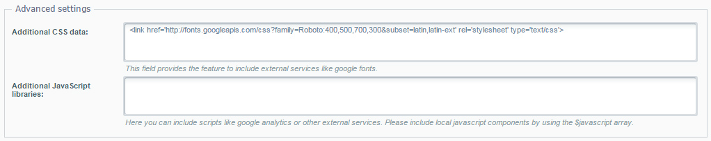

In Shopware 5 we created the possibility to embed external resources directly via the backend. In the theme configuration of the new Shopware Responsive theme you will find two input fields for additional CSS and JavaScript files. This enables you to simply add external resources like for example a web font or a tracking code to your theme.

To embed the resource add the code with the necessary HTML tags, `<link>` for CSS and `<script>` for JavaScript, into the corresponding configuration field. Additional CSS files will be included before the normal theme stylesheets so your styles can also use the external resources.

Of course this is just a very simple way to include other resources. As a designer or developer you should use either the new compiler or the common way to embed resources in you theme. 