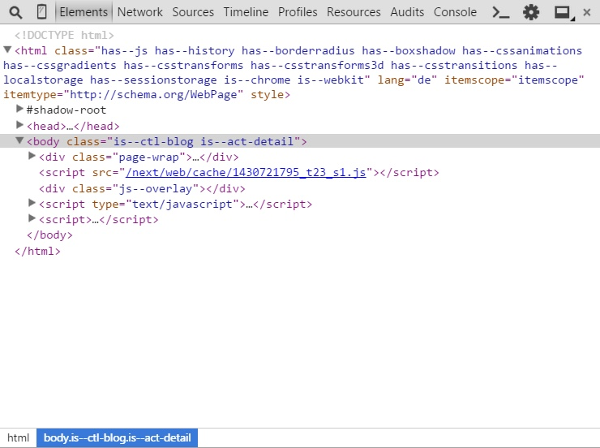

<div class="toc-list"></div>

## Introduction
In the following we'll guide you through the process of how to find Smarty blocks in the Shopware template files. It does not always seem easy, but here are some tips to help you find the necessary block.

## Anatomy of Shopware - A templater's perspective
First of all, we would like to start with the anatomy of Shopware. If you understand the structure of the system, you'll know where to search for a block.

### Modules
The main parts of the application are called modules. Here are the currently available modules in Shopware:

* API
* Backend
* Frontend
* Widgets

Apart from the frontend, a theme can also include modules such as newsletter and document templates. Here's the typical directory structure of a storefront theme:

```
.
├── documents
├── frontend
├── newsletter
├── documents
└── Theme.php
```
*Directory structure of a typical theme*

As you can see, the mentioned modules are available as separate directories within the theme.

### Sections
The next divisions in the modules are called "sections". Sections are parts of modules. For example, we have the section "detail" which represents the product detail page. We're using the sections to separate the different views of the frontend. Here's a full list of all available sections in the frontend:

* account 
* blog
* campaign
* checkout
* compare
* custom
* detail
* error
* forms
* home
    * Contains the homepage of the storefront 
* index
    * Contains the HTML skeleton 
* listing
* newsletter
    * Contains the newsletter signup for the frontend, it has nothing to do with the newsletter templates 
* note
* register
* robots_txt
    * Contains template for the robots.txt
* search
* sitemap
    * Contains the sitemap which is accessible in the storefront 
* sitemap_mobile_xml
    * Contains the template for the sitemap_mobile.xml. You can find [more information here](https://support.google.com/webmasters/answer/34648?hl=en).
* sitemap_xml
    * Contains the sitemap.xml which will be used by web crawlers like the Google or Bing bots.
* tellafriend

If you're a developer, you'll notice that the sections match our frontend controllers.

### Actions
We've further divided our sections into parts called "actions". Actions represent a part of the storefront. For example, we have the actions "index" and "detail" in the blog section. The "index" action represents the listing of all available blog articles. On the other hand, we have the "detail" action which represents the detail page of a blog article.

Please keep in mind that actions can be omitted. In this case, Shopware always assumes that you want to jump to the "index" action.


## How to find a Smarty block
Now you know all about the anatomy of Shopware, you have the necessary knowledge to find almost any block in the storefront.

Let us take a closer look at the blog directory of your theme which is located under ```frontend/blog```. Here's the directory structure of it:

```
.
├── comment
├── atom.tpl
├── bookmarks.tpl
├── box.tpl
├── comments.tpl
├── detail.tpl
├── filter.tpl
├── header.tpl
├── images.tpl
├── index.tpl
├── listing.tpl
├── listing_actions.tpl
├── listing_sidebar.tpl
└── rss.tpl
```
*Directory structure of the "frontend/blog" directory*

As you can see, there's a bunch of files in the directory. Don't get confused. There are several ways to determine the action and therefore the associated template file in your theme.

### Using the web developer console in your favorite browser
To make your life easier, we've added both the section and the action as ```class``` attributes to the ```<body>``` element. You can use your web developer console to see them:



*Inspection of the "body" element*

In the screenshot above, we're using the Chrome web developer tools and we're on the detail page of a blog article. As you can see, there are two classes on the ```body``` element. The classes can help you determine the currently active section and action. The syntax looks like this:

```
is--ctl-[section]
```
*Syntax example for the currently active section*

```
is--act-[action]
```
*Syntax example for the currently active action*

Based on this information, you know that the template file ```detail.tpl``` (the action) in the directory ```frontend/blog``` (the section) will be used.

## Example: Removing the comments from the blog detail page
Now let's work on a real-world example. Let's say we want to remove the comment section of the blog's detail page. In order to do this, we'll need to find the corresponding Smarty block in our parent theme and overwrite it in our own theme. Here's how to find it:

1. Determine the correct template file using the two classes on the ```<body>``` element. In our case, it's the ```detail.tpl``` in the theme directory ```frontend/blog```.
2. Now we need a class in the HTML source which can be used to determine the comment section. In this example, we'll use the HTML class ```blog--comments-wrapper``` which can be used to search for a wrapping block.
3. Using the search function in your IDE, you'll find the template file ```frontend/blog/comments.tpl```.
4. When you open up the file, however, you'll see that there's no Smarty block around the outer ```<div>```-box. We'll have to go up one level.
5. The next step is to find where this file is being included. Once again use the search function in your IDE and search for the path of the file, e.g. ```frontend/blog/comments.tpl```.
6. You'll end up with the file ```frontend/blog/detail.tpl``` which contains the specific ```include``` we're looking for.

Now we have found the Smarty block named ```frontend_blog_detail_comments``` and we can overwrite it in our theme like this:

```html
{extends file="parent:frontend/blog/detail.tpl"}

{* Remove the comment section *}
{block name='frontend_blog_detail_comments'}{/block}
```

## A special note on widget templates
It might happen that you simply can't find the necessary template file. This usually means that you're searching for a Smarty block or template file that is used or defined by a widget. A widget is an independent module within Shopware that controls itself and comes with a separate template file.

We've classified widgets as a separate section in Shopware, which means that the template files are not located in the ```frontend``` directory of your theme. You can find them in the ```widgets``` directory.

You might see a call to the Smarty ```action``` plugin in a template file like this:

```html
{action module=widgets controller=listing action=tag_cloud sController=index}
```

The ```action``` plugin works with a similar approach as the rest of the Shopware template system. Let's take a look at the plugin syntax.

* module
    * Basically the module we [outlined above](#modules)
* controller
    * The controller that, for example, fetches the necessary data from the database. The template files for the controller are located in the directory ```widgets/[controller]``` in your theme.
* action
    * The action that will be called in the controller. The action name defines the template filename as well. For the above example, the template filename is ```tag_cloud.tpl```

Therefore, the template file for the Smarty ```action``` plugin is located under ```widgets/listing/tag_cloud.tpl```.
