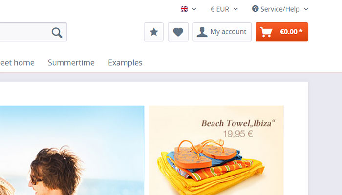
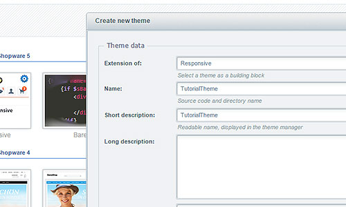
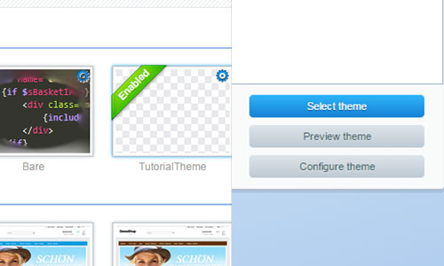

<div class="toc-list"></div>

## Introduction
This guide will provide you a quick overview on basic templating in Shopware 5 by providing a step by step explanation based on an example project. The content is aimed at beginners and lays the groundwork for templating and styling of Shopware themes. It shows the creation of a new theme and the usage of the Smarty template blocks to customize and add elements to the custom theme.

## Preview of the guide


This guide explains how to add a new theme to the shop, implement a new element into the template and add styling by using the CSS pre-processor Less. The first task is to add a new theme and select it. In the second step, we want to add a button into the shop navigation of the frontend and style it correctly, so it fits on any device size. And as a last task we change the color of the cart button to a gradient that matches the default primary colors.

# Templating
## Bare and responsive
The default template directory of Shopware 5 is the `Themes` directory in the root directory.
Inside the `frontend` directory, which is the focus of this guide, you can find our two default Shopware 5 themes.

+   The `Bare` theme is the base of the Shopware frontend. It contains the basic element structure.
+   The `Responsive` theme contains the default Shopware 5 Responsive theme styling based on the Bare theme.

__Important:__ Do not change the Bare/Responsive themes themselves, as the changes might be overwritten by future updates.

## Custom themes

### Creating a theme with the Theme Manager


In order to create your theme, you have to click on the `Create theme` button inside the `Theme manager` and give it a suiting name (in this example: `TutorialTheme`) and some additional information.
It will automatically create a directory inside the `themes` directory and add the required files for it to work.

The frontend directory now contains 3 themes:

- `Bare`
- `Responsive`
- `TutorialTheme`

### Creating a theme with the Shopware CLI tools

You can also create a new custom theme by using the `sw:theme:create` CLI command:

```
sw:theme:create --description="Text" --author="shopware AG" --license="MIT" Responsive TutorialThemeDirectory TutorialTheme
```
If you need a general introduction regarding the CLI commands you can take a look at our [Shopware 5 CLI commands article](https://developers.shopware.com/developers-guide/shopware-5-cli-commands/).

## Selecting themes


Before you can see any changes made to the files you are editing, you have to select the new theme. To choose the theme, first refresh the themes using the `Refresh themes` button and then simply click on the thumbnail image of your own created template and press the `Select theme` button.

## Directory structure
The Shopware directory structure that is located in the `Bare/Frontend` directory contains subdirectories (named after the controllers) that separate the template files by the specific frontend areas they relate to.

```
frontend
 ├── _includes
 ├── account
 ├── blog
 │   └── comment
 ├── campaign
 ├── checkout
 │   └── items
 ├── compare
 ├── custom
 ├── detail
 │   ├── comment
 │   └── tabs
 ├── error
 ├── forms
 ├── home
 ├── index
 ├── listing
 │   ├── actions
 │   ├── filter
 │   └── product-box
 ├── newsletter
 ├── note
 ├── paypal
 ├── plugins
 │   ├── compare
 │   ├── index
 │   ├── notification
 │   ├── payment
 │   └── seo
 ├── register
 ├── robots_txt
 ├── search
 ├── sitemap
 ├── sitemap_xml
 └── tellafriend
```

## Template inheritance
While creating the theme you have the ability to choose an existing theme you want to inherit from. In this case you would want to inherit from the responsive theme. In other words, our new theme is based on Shopware's `Responsive` theme which, in turn, inherits from the `Bare` theme.

If you want to edit a specific store section inside your new template, you would __extend__ the already existing files that the `Bare` theme provides. In order to do that, you have to __maintain the same directory structure__ that the `Bare` theme uses.

So, for instance, if you would like to modify the `header`, you would want to recreate the specific directory structure in order to be able to overwrite or extend the already existing elements. The frontend header in the `shop-navigation.tpl` file (which is later included into the `index.tpl`) is located inside the `Frontend/Index` directory.

This is how your template directory should look like.
```
TutorialTheme
 ├── frontend
 │   └── index
 │      └── shop-navigation.tpl
```

Inside your new `shop-navigation.tpl` file, you will have to extend the `Bare` theme's default `shop-navigation.tpl` file by adding a `extends` function call. this allows you to keep the original elements from the `Bare` theme's file, but also add other elements and overwrite existing ones.
The file path of the `extends` function call has to match the directory structure of the `Bare` theme.

```
{extends file="parent:frontend/index/shop-navigation.tpl"}
```

Had we chosen not to use the `extends` function call, the content of the `shop-navigation.tpl` file from the inherited theme would be ignored when rendering our theme, and our empty file would be used instead.

You can find a complete guide to the template inheritance in the [Smarty 101 guide](https://developers.shopware.com/designers-guide/smarty/#template-inheritance).

## Template blocks
The `Bare` theme's HTML structure is wrapped in Smarty's `block` elements. These block elements group the frontend components into small, isolated blocks that can be edited/overwritten individually. To add changes to the elements of the `Bare` theme, you __can't__ simply write code inside your file. To customize a block, you have to call the correct Shopware block name.

You can override the whole content of an inherited block like this:
```smarty
{block name='frontend_index_checkout_actions'}
    // place your new element here
{/block}
```

The variable `{$smarty.block.parent}` contains the content of the inherited block.
So you can use it to add the initial content of the block in your block.

If you wish to add your content __after__ the initial block content you can do it like this:
```smarty
{block name='frontend_index_checkout_actions'}
    {$smarty.block.parent}
    // place your new element here
{/block}
```

Of cause the other way around will also work, if you wish to add your content __before__ the content of the initial block:
```smarty
{block name='frontend_index_checkout_actions'}
    // place your new element here
    {$smarty.block.parent}
{/block}
```

For example, in order to add a new button to your navigation menu, you would search for a fitting block and insert a new element to it, so it displays before or after the already existing buttons inside the shop navigation menu.

```smarty
{extends file="parent:frontend/index/shop-navigation.tpl"}

{block name='frontend_index_checkout_actions'}
    // place your new element here
    
    {$smarty.block.parent}
{/block}
```

The navigation menu uses `<li>` elements to wrap its entries. In the example below, an icon is also added to the button.

```html
{extends file="parent:frontend/index/shop-navigation.tpl"}

{block name='frontend_index_checkout_actions'}
    <li class="navigation--entry">
        <a href="" class="btn starButton"> {* Add an URL to the href attribute to make your link work *}
            <i class="icon--star"></i>
        </a>
    </li>
    
    {$smarty.block.parent}
{/block}
```

<div class="alert alert-warning"> 
    <strong>Attention:</strong> It is recommended to not use the smarty block parameter <strong>append</strong> and <strong>prepend</strong>, so other templates or plugins can overwrite the same block without problems.
</div>

## Add Less files
Less files can be added in a similar way to template files. The directory structure has to match the structure of the source files of the `Responsive` template. The sample directory structure would look like this:

```
TutorialTheme
 ├── frontend
 │   └── index
 │      └── shop-navigation.tpl
 │   └── _public
 │      └── src
 │          └── less
 │              └── all.less
```

To add new Less files, you need to create a new `all.less` file. This file is required, and should be used exclusively to import other Less files, in which you will define your custom styling. Your custom Less files can be imported by using the `@import` function on your `all.less` file. If you have extensive theme changes, it's recommended to adapt the Less file subdirectories of the `Responsive` theme to have a better overview, but in this case we will just create a new Less file called `navigation.less`.

```less
//inside the all.less file
@import 'navigation';
```

The first step is to add some simple styling rules to the new button we just created, so that the icon is centered inside it. Inside the Less files, you are able to use all the Less __mixins__ and __variables__ that Shopware provides (e.g. the `unitize` mixin, that helps convert __px__ values into relative __rem__ values).

```less
.starButton i.icon--star {
    .unitize(font-size, 18);
}

a.btn.starButton {
    .unitize(padding-top, 5);
}
```

Additionally, a few changes have to be made in order for the button to fit completely in the design for mobile devices. To address all problems, the search bar width has to be reduced and the mobile menu text has to be hidden to avoid any element overlapping.

To hide the menu text, take the `offcanvas_left_trigger` block inside the `shop-navigation.tpl` file, and __overwrite__ it (without append or prepend) with a new block, without the description inside it.

```html
{block name='frontend_index_offcanvas_left_trigger'}
    <li class="navigation--entry entry--menu-left" role="menuitem">
        <a class="entry--link entry--trigger btn is--icon-left" href="#offcanvas--left" data-offcanvas="true" data-offCanvasSelector=".sidebar-main">
            <i class="icon--menu"></i>
        </a>
    </li>
{/block}
```
To change the search bar width, you can overwrite the default media query with the new width percentage.

```less
.starButton i.icon--star {
    .unitize(font-size, 18);
}

a.btn.starButton {
    .unitize(padding-top, 5);
}

@media screen and (min-width: 30em) {
    .entry--search {
        width: 30%;
    }
}
```

As the last step, the cart button color needs to be changed. As said before, inside the Less files you have the ability to use all Less __mixins__ and __variables__ that Shopware provides. To create a gradient that matches the default store color you can use the `@brand-primary` and `@brand-primary-light` variables together with the `.linear-gradient` Less mixin. The last step is to change the colors of the icon and price inside the cart button.
```less
.starButton i.icon--star {
    .unitize(font-size, 18);
}

a.btn.starButton {
    .unitize(padding-top, 5);
}

@media screen and (min-width: 30em) {
    .entry--search {
        width: 30%;
    }
}

@media screen and (min-width: 64em) {
    .navigation--list .entry--cart .cart--link .cart--amount {
        color: #fff;
    }
}

a.btn.is--icon-left.cart--link {
    .linear-gradient(@brand-primary-light, @brand-primary);
    border-color: @brand-primary;
    color: #fff;
}
```

# Result


This guide provided you a simple tutorial on how to do a small template change with the following topics:

+   Creating a new theme
+   Extending the default theme with a new element
+   Adding custom styles to the new theme
