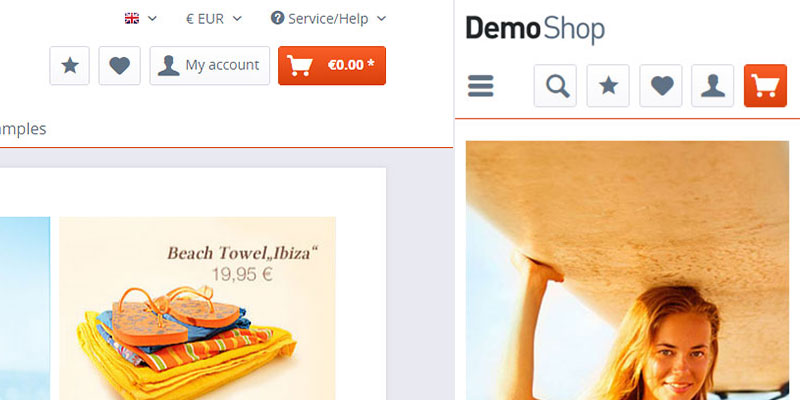

#Getting started with shopware 5 templating

##Introduction
This guide will provide you a quick overview on basic templating in Shopware 5 by providing a step-by-step explanation based on an example project. The content is aimed at beginners and lays the groundwork for templating and styling of shopware themes. It shows the creation of a new theme and the usage of the smarty template-blocks to customize and add elements to the custom theme.

##Table of contents
-   [Preview of the guide](#preview-of-the-guide)
-   [Bare and responsive theme](#bare-and-responsive)
-   [Adding custom theme](#custom-themes)
-   [Selecting the new theme](#selecting-themes)
-   [Directory structure](#directory-structure)
-   [Template inheritance](#template-inheritance)
-   [Template blocks](#template-blocks)
-   [Adding LESS Files](#add-less-files)
-   [Result and summary](#result)

##Preview of the guide


This guide explains how to add a new theme to the shop, implement a new element into the template and add styling by using the css preprocessor less. The first task is to add a new theme and select it. As the second step, we want to add a button into the shop-navigation of the storefront and style it correctly, so it fits on any device size. And as a last task we change the color of the cart button to a gradient that matches the default primary colors.

#Templating
##Bare and responsive
The default template folder of shopware 5 is the **Themes** folder in the root directory.    
Inside the **frontend** folder, which is the focus of this guide, you can find our two default shopware 5 themes.

+   The **bare** theme is the base of the shopware storefront. It contains the basic element structure.
+   The **responsive** theme contains the default shopware 5 responsive theme styling based on the bare theme.

**Important:** Do not change the bare/responsive themes itself, otherwise the changes could be overwritten by future updates.

##Custom themes


In order to create your theme you have to click on the **create theme** button inside the **backend theme manager** and give it a suiting name (in this example: TutorialTheme) and some additional information. 
It will automatically create a folder inside the themes directory and add the required files for it to work.

The frontend folder now contains 3 themes:
```
Bare
Responsive
TutorialTheme
```

##Selecting themes


Before you can see any changes of the files you are editing, you have to select the new theme. To choose the theme, first refresh the themes using the **refresh themes** button and then simply click on the thumbnail image of your own created template and press the **Select theme** button.

##Directory structure
The shopware directory structure that is located in the **Bare/Frontend** folder, contains subfolders (named after the controllers) that separate the template files into the specific storefront-areas they relate to.

```
frontend
 ├── _includes
 ├── account
 ├── blog
 │   └── comment
 ├── campaign
 ├── checkout
 │   └── items
 ├── compare
 ├── custom
 ├── detail
 │   ├── comment
 │   └── tabs
 ├── error
 ├── forms
 ├── home
 ├── index
 ├── listing
 │   ├── actions
 │   ├── filter
 │   └── product-box
 ├── newsletter
 ├── note
 ├── paypal
 ├── plugins
 │   ├── compare
 │   ├── index
 │   ├── notification
 │   ├── payment
 │   └── seo
 ├── register
 ├── robots_txt
 ├── search
 ├── sitemap
 ├── sitemap_xml
 └── tellafriend
```

##Template inheritance
While creating the theme you have the ability to choose an existing theme you want to inherit from. In this case you would want to inherit from the responsive theme. In other words, our new theme is based on both the shopware bare and responsive theme and can be easily overwritten by your new settings.

If you want to edit a specific store region inside your new template, you would **extend** the already existing files that the bare theme provides. In order to do that, you have to **maintain the same directory structure** that the bare theme uses.

So for instance, if you would like to modify the **header**, you would want to adopt the specific directories in order to be able to overwrite or extend the already existing elements. The storefront-header in the **shop-navigation.tpl** file (which is later included into the index.tpl) is located inside the **Frontend/Index** folder.

This is how your template directory should look like.
```
TutorialTheme
 ├── frontend
 │   └── index
 │      └── shop-navigation.tpl
```

Inside your **new shop-navigation.tpl** file, you will have to extend the bare theme's **default shop-navigation.tpl** file by adding the **{extends}** command. It allows you to keep the original elements inside the bare theme's file, but also add other elements and overwrite the existing ones.
The file path of the extends command has to fit the directory structure of the bare theme.

```
{extends file="parent:frontend/index/shop-navigation.tpl"}
```

If we wouldn't use the extends command, the whole shop-navigation.tpl file would be **overwritten** by our new empty file.

##Template blocks
The bare theme's html structure is covered in smarty's **{block}** elements. These block elements group the storefront components into small isolated blocks that can be edited without having to touch the whole file. To add changes to the elements of the bare theme, you **can't** simply write code inside your file. To customize a block you have to call the correct shopware block name.

You have 3 ways to interact with blocks and add your changes inside your new template file:

+   append (adds content **after** the selected block)
+   prepend (adds content **before** the selected block)
+   overwrite (without calling append/prepend, **overwrites** the whole block)

In order to add a new button to your navigation, you would search for a fitting block and **append/prepend** a new element to it so it displays before or after the other buttons inside the shop navigation.

```
{extends file="parent:frontend/index/shop-navigation.tpl"}

{block name='frontend_index_checkout_actions' prepend}
    // place your new element here
{/block}
```

Now add the button between, which in the shop-navigation is placed inside a `<li>` element, to the start and the end of the block. In this example an icon is added to the button aswell.

```
{extends file="parent:frontend/index/shop-navigation.tpl"}

{block name='frontend_index_checkout_actions' prepend}
    <li class="navigation--entry">
        <a href="" class="btn starButton">
            <i class="icon--star"></i>
        </a>
    </li>
{/block}
```
(Add a destination for the href attribute, to make your link work)


##Add LESS files
Less files can be added in a similar way as the template files. The directory structure has to match the structure of the source files of the responsive template. The sample directory structure would look like this:

```
TutorialTheme
 ├── frontend
 │   └── index
 │      └── shop-navigation.tpl
 │   └── _public   
 │      └── src
 │          └── less
 │              └── all.less
```

To add new less files, you need to create a new **all.less** file, which is required. Now you are able to create your own less files, add styling to them and simply import them into the all.less file.
You can do that by using the **@import** command. If you have larger theme changes it is adviced to adapt the less-file subfolders of the responsive theme to have a better overview, but in this case we will just create a new less file called **navigation.less**.

```
//inside the all.less file
@import 'navigation';
```

First of all you would add a bit of styling to the new button, so the icon is centered inside it. Inside the less files you are able to use all less **mixins** and **variables** of shopware itself (e.g. the unitize mixin, that helps to calculate the **px**-values into relative **rem**-values).
```
.starButton i.icon--star {
    .unitize(font-size, 18);
}

a.btn.starButton {
    .unitize(padding-top, 5);
}
```

In addition a few changes have to be made to fit the button completely into the design on mobile devices. To resolve all problems the
search-bar width has to be reduced and the mobile menu text has to be hidden to avoid any element overlapping.

To hide the menu text, take the `offcanvas_left_trigger` block inside the shop-navigation.tpl file, and **overwrite** it (without append or prepend) with a new block without the description inside it.

```
{block name='frontend_index_offcanvas_left_trigger'}
    <li class="navigation--entry entry--menu-left" role="menuitem">
        <a class="entry--link entry--trigger btn is--icon-left" href="#offcanvas--left" data-offcanvas="true" data-offCanvasSelector=".sidebar-main">
            <i class="icon--menu"></i>
        </a>
    </li>
{/block}
```
To change the search-bar width you can overwrite the default media query with the new width percentage.

```
.starButton i.icon--star {
    .unitize(font-size, 18);
}

a.btn.starButton {
    .unitize(padding-top, 5);
}

@media screen and (min-width: 30em) {
    .entry--search {
        width: 30%;
    }
}
```

As the last step, the cart button color needs to be changed. As said before, inside the less files you have the ability to use all less mixins and variables that shopware provides. So to create a gradient that matches the default store color you can use the `@brand-primary` and `@brand-primary-light` variables in a combination with the `.linear-gradient` less mixin. The last step is to change the colors of the icon and price inside the cart button.
```
.starButton i.icon--star {
    .unitize(font-size, 18);
}

a.btn.starButton {
    .unitize(padding-top, 5);
}

@media screen and (min-width: 30em) {
    .entry--search {
        width: 30%;
    }
}

@media screen and (min-width: 64em) {
    .navigation--list .entry--cart .cart--link .cart--amount {
        color: #fff;
    }
}

a.btn.is--icon-left.cart--link {
    .linear-gradient(@brand-primary-light, @brand-primary);
    border-color: @brand-primary;
    color: #fff;
}
```

#Result


This guide provided you a simple tutorial on how to do a small template change with the following topics:

+   Creating a new theme
+   Extending the default theme with a new element
+   Adding custom styles to the new theme