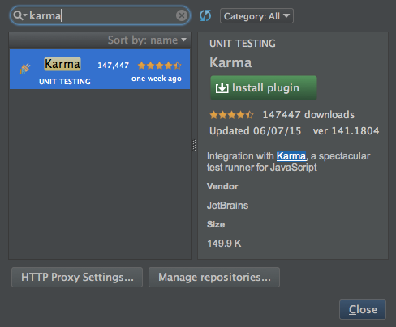
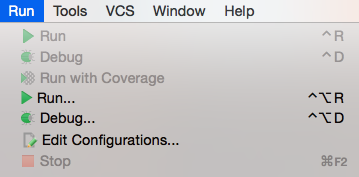
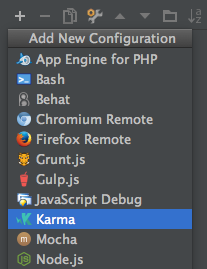
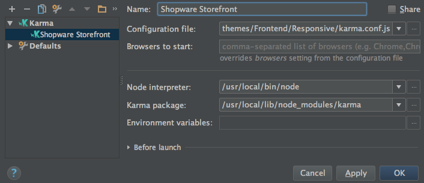
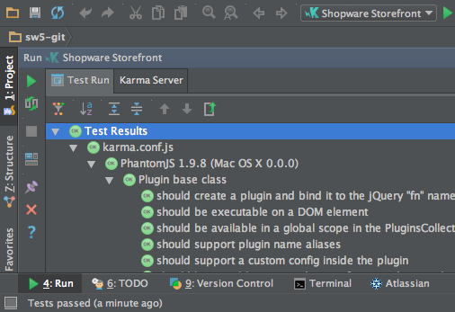

## Introducing
[Karma](http://karma-runner.github.io/) is a test runner for JavaScript tests for the storefront of Shopware. The tests itself are written in [Jasmine](http://jasmine.github.io/).

The main goal for Karma is to bring a productive testing environment to developers. The environment being one where they don't have to set up loads of configurations, but rather a place where developers can just write the code and get instant feedback from their tests.

## Requirements 
Karma is based on Node.js, which makes it necessary to have [Node.js](https://nodejs.org/) and [npm](https://www.npmjs.com/) installed on your system. Node.js is available on a majority of systems and distrubition. If your system isn't listed below, please use the [official Node.js installation guide](https://github.com/nodesource/distributions).

### Install Node.js/npm on Ubuntu

```bash
curl -sL https://deb.nodesource.com/setup_0.12 | sudo bash -
# Then install with:
sudo apt-get install -y nodejs
```

### Install Node.js/npm on Mac OS X
You can install `Node.js` and `npm` on Mac OS X using the provided [installer package](http://nodejs.org/#download) or you can use either [Homebrew](http://brew.sh/) or [MacPorts](http://www.macports.org/) as an alternative. If you want to use a package manager to install `Node.js` on your system, please install [Xcode](https://developer.apple.com/xcode/) first.

#### Using Homebrew
```bash
brew install node
```

#### Using MacPorts
```bash
port install nodejs
```

## Installation
Now we solved all requirements and we can proceed installing Karma and the dependencies. First of all, please switch to the directory ```themes/Frontend/Responsive``` and execute the following command:

```bash
npm install karma karma-phantomjs-launcher karma-jasmine karma-junit-reporter
```

## Running tests using the command line
Running the storefront tests is easy. Start up for favorite terminal application, switch to your Shopware installation and go to the directory ```themes/Frontend/Responsive```. Now you can run the tests using the following command:

```bash
karma start karma.conf.js
```

### Using the build script
If you're feeling more comfortable using our build script, you can use it as well to run the tests. Head over to your Shopware installation and go to the directory ```build```. You can execute the testing using the following command:

```bash
ant karma-shopware-continuous
```

## Integrate Karma in PhpStorm
[PhpStorm](https://www.jetbrains.com/phpstorm/) is our recommended IDE. In the plugin repository, you can find a [Karma plugin](https://plugins.jetbrains.com/plugin/7287?pr=) which makes running storefront tests. Here's how you can install and use it:

* Open up your PhpStorm and open up the settings
* Now head to `Plugins` sections and click `Browse repositories...`
* Search for the term `karma` <br> 
* After installing the plugin please make sure to restart your IDE
* The next step is select to "Run" -> "Edit Configurations..." in the menu bar of your IDE <br> 
* Click the "+" in configuration window and select "Karma" from the drop down menu <br> 
* Name the test runner as you like and set the configuration file to ```themes/Frontend/Responsive/karma.conf.js``` and click "Apply" <br> 
* Now you can use the "play" button in the toolbar in your IDE to start the tests <br> 