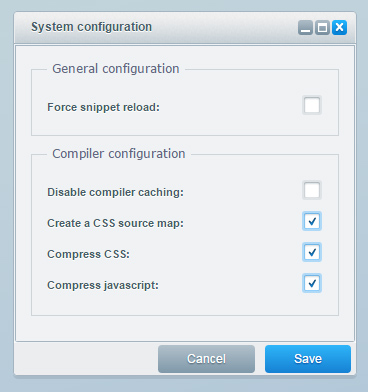
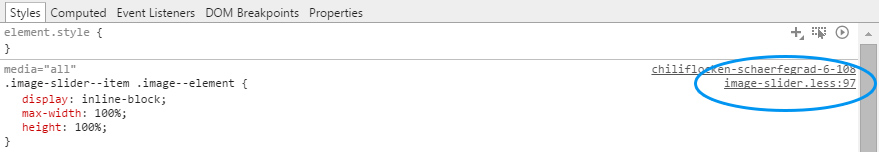

<div class="toc-list"></div>

## What is LESS?
> Less is a CSS pre-processor, meaning that it extends the CSS language, adding features that allow variables, mixins, functions and many other techniques that allow you to make CSS that is more maintainable, themable and extendable.
> 
> *- www.lesscss.org -*

In Shopware 5 we included a PHP-parser for LESS. It enables the designer to use it as a CSS pre-processor in Shopware themes, which brings the advantage of several interesting features like variables or mixins. We do not want to explain every detail of LESS in this article, but show you how to use it in your Shopware theme. The official documentation provides you with all information about the features of LESS.

- [Language Features](http://lesscss.org/features/)
- [Function Reference](http://lesscss.org/functions/)

## Why LESS?
We often get asked why we decided to use LESS instead of SASS or something else. Without starting a discussion war about CSS pre-processors we want to provide you with some arguments why we decided to use LESS in Shopware.

- LESS is very lightweight and easy to learn for third party developers who never worked with CSS pre-processors
- There is a stable PHP-parser for LESS
- No dependency to other languages like Ruby etc.

No reason to get sad, SASS-lovers. Keep in mind that LESS is just a recommendation by us and the compiler a tool we wanted to provide to third party developers. You can use the pre-processor of your choice at any time. Feel free to compile files with other tools and add the compiled CSS to your theme.

## Using LESS in your theme
It is very easy to use LESS in your own custom Shopware theme. Just create the corresponding directory in your public resources: `frontend/_public/src/less/`. In the `less/` directory you have to create an `all.less` file which will be added to the Shopware compiler automatically. Of course you can put all your code into one file, but for a better structure we recommend to create separate files for each part of your theme and include them by using the `@import` method in the `all.less`.

## Responsiveness in Shopware
We use LESS for some special purposes which are very helpful when creating full responsive themes.

### The .unitize() mixin
In a full responsive template you cannot rely on fixed pixel values. The site has to scale dynamically to fit the screen size, pixel density and browser fontsize. Therefore we decided to build a central measurement mixin, which can convert pixel values to other measurement units. This has the advantage to use readable pixel values in your LESS files, but the compiled CSS will have dynamic measurement units and the type of unit can be changed at a central point. In the Shopware Responsive theme we decided to convert to `rem` values, so all measurements get scalable by the basic fontsize.
<br />
<br />
**Example:** *Using the unitize mixin*

```

.my--class {

    .unitize(font-size, 16);             // Single properties

    .unitize-width(200);                // Helpers for width and height

    .unitize-padding(20, 20);            // Helper for padding accepting the four value syntax

    .unitize-margin(10, 0, 0, 0);        // Helper for margin accepting the four value syntax

    // ...
}

```

### Breakpoint variables
For the Responsive theme we use CSS media queries to create different device breakpoints, so the template can be adjusted to fit the corresponding device type. To be more flexible we created configuration variables which are used in all media queries.
<br />
```

@phoneLandscapeViewportWidth: 30em;     // 480px
@tabletViewportWidth: 48em;             // 768px
@tabletLandscapeViewportWidth: 64em;    // 1024px
@desktopViewportWidth: 78.75em;         // 1260px

```
**Example:** *Using breakpoint variables in media queries*

```less

.my--class {
    .unitize-padding(10, 0);
}

@media screen and(min-width: @tabletViewportWidth) {

    .my--class {
        .unitize-padding(20, 0);
    }

}
```

Following the mobile first concept you start creating your styles for the mobile viewport and proceed upwards by using the `min-width` media query to start a new breakpoint at the given minimum screen size.

## Predefined mixins and components
We already created several mixins for CSS3 cross-browser support and some other useful features. Also when extending from the Shopware Responsive theme you have access to all standard components like buttons, alerts, and so on. They all follow a simple CSS class syntax which you might know from other frameworks. For example creating a basic button you just add the class `btn` to your element. To make it a highlighted primary button you can extend the styles by adding additional configuration classes like `is--primary`. We have a complete documentation of all Shopware basic components in the **[Shopware UI components overview](https://developers.shopware.com/styletile/)**.

### All Shopware mixins
- appearance.less
- backface-visibility.less
- border-radius.less
- box-shadow.less
- box-sizing.less
- clearfix.less
- linear-gradient.less
- icon-element.less
- opacity.less
- rotate.less
- scale.less
- touch-callout.less
- transform-style.less
- transform-origin.less
- transition.less
- translate.less
- unitize.less
- user-select.less
- transform.less
- tap-highlight-color.less
- keyframes.less
- animation.less
- column-count.less
- hyphens.less
- cursor.less

## LESS variables in Shopware
Here you get an overview about all defined LESS variables in the Shopware Responsive theme.
```less
// Breakpoints
@phoneLandscapeViewportWidth: 30em;     // 480px
@tabletViewportWidth: 48em;             // 768px
@tabletLandscapeViewportWidth: 64em;    // 1024px
@desktopViewportWidth: 78.75em;         // 1260px

// Basic color definition
@brand-primary: #d9400b;
@brand-primary-light: saturate(lighten(@brand-primary,12%), 5%);
@brand-secondary: #5f7285;
@brand-secondary-dark: darken(@brand-secondary, 15%);

// Grey tones
@gray: #f5f5f8;
@gray-light: lighten(@gray, 1%);
@gray-dark:  darken(@gray-light, 10%);
@border-color: @gray-dark;

// Highlight colors
@highlight-success: #2ecc71;
@highlight-error: #e74c3c;
@highlight-notice: #f1c40f;
@highlight-info: #4aa3df;

//Scaffolding
@body-bg: darken(@gray-light, 5%);
@overlay-bg: #555555;
@text-color: @brand-secondary;
@text-color-dark: @brand-secondary-dark;
@link-color: @brand-primary;
@link-hover-color: darken(@brand-primary, 10%);
@rating-star-color: @highlight-notice;

// Base configuration
@font-size-base: 14;
@font-base-weight: 500;
@font-light-weight: 300;
@font-bold-weight: 600;
@font-base-stack: "Open Sans", "Helvetica Neue", Helvetica, Arial, "Lucida Grande", sans-serif;
@font-headline-stack: @font-base-stack;

// Heading font sizes
@font-size-h1: 26;
@font-size-h2: 21;
@font-size-h3: 18;
@font-size-h4: 16;
@font-size-h5: @font-size-base;
@font-size-h6: 12;

// Shopware font directory
@font-directory: "../../fonts/";

// Open Sans font directory
@OpenSansPath: "../../fonts/open-sans-fontface";

// Button text sizes
@btn-font-size: 14;
@btn-icon-size: 10;

// Default Button
@btn-default-top-bg: #FFFFFF;
@btn-default-bottom-bg: @gray-light;
@btn-default-hover-bg: #FFFFFF;
@btn-default-text-color: @text-color;
@btn-default-hover-text-color: @brand-primary;
@btn-default-border-color: @border-color;
@btn-default-hover-border-color: @brand-primary;

// Primary Button
@btn-primary-top-bg: @brand-primary-light;
@btn-primary-bottom-bg: @brand-primary;
@btn-primary-hover-bg: @brand-primary;
@btn-primary-text-color:#FFFFFF;
@btn-primary-hover-text-color: @btn-primary-text-color;

// Secondary Button
@btn-secondary-top-bg: @brand-secondary;
@btn-secondary-bottom-bg: @brand-secondary-dark;
@btn-secondary-hover-bg: @brand-secondary-dark;
@btn-secondary-text-color: #FFFFFF;
@btn-secondary-hover-text-color: @btn-secondary-text-color;

// Panels
@panel-header-bg: @gray-light;
@panel-header-font-size: 14;
@panel-header-color: @text-color;
@panel-border: @border-color;
@panel-bg: #FFFFFF;

// Labels
@label-font-size: 12;
@label-color: @text-color;

// Form base
@input-font-size: 16;
@input-bg: @gray-light;
@input-color: @brand-secondary;
@input-placeholder-color: lighten(@text-color, 15%);
@input-border: @border-color;

// Form states
@input-focus-bg: #FFFFFF;
@input-focus-border: @brand-primary;
@input-focus-color: @brand-secondary;
@input-error-bg: desaturate(lighten(@highlight-error, 38%), 20%);
@input-error-border: @highlight-error;
@input-error-color: @highlight-error;
@input-success-bg: #FFFFFF;
@input-success-border: @highlight-success;
@input-success-color: @brand-secondary-dark;

// Tables
@panel-table-header-bg: @brand-secondary-dark;
@panel-table-header-color: #FFFFFF;
@table-row-bg: #FFFFFF;
@table-row-color: @brand-secondary;
@table-row-highlight-bg: darken(@table-row-bg, 4%);
@table-header-bg: @brand-secondary;
@table-header-color: #FFFFFF;

// Badges, Hints
@badge-discount-bg: @highlight-error;
@badge-discount-color: #FFFFFF;
@badge-newcomer-bg: @highlight-notice;
@badge-newcomer-color: #FFFFFF;
@badge-recommendation-bg: @highlight-success;
@badge-recommendation-color: #FFFFFF;
@badge-download-bg: @highlight-info;
@badge-download-color: #FFFFFF;
```

## Creating CSS source maps
To make a designers life easier when working with LESS we added the possibility to automatically create CSS source maps. This is very useful when debugging existing styles.



To enable the CSS source maps go to *Configuration* -> *Theme Manager* -> *Settings* -> *Create a CSS source map*.

After clearing the theme cache you can see the mapping to the LESS files in your developer console.


