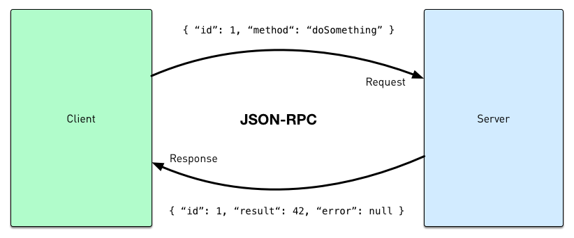

## Introducing
Shopware 5.1 comes with a pretty cool feature which is especially interesting for developers which would love to create a backend module for their plugin but don't want to deal with the steep learning curve of ExtJS. In the following article you'll learn anything about the new technology.

## Concept
The basic idea behind the lightweight backend modules is quite simple. We want to allow third party developers to create simple backend modules in a breeze, therefore we want to come up with a solution which allows to create the modules using vanilla HTML, CSS and JavaScript without the headache to learn ExtJS.

This means we have to encapsulate the module from the rest of the Shopware backend using an `iframe` element which includes the module content.

Due to the fact that the `iframe` element is basically a website in another website, we had to find a way to communicate with the `iframe` and on the other hand the `iframe` needs a way to communicate with the backend as well.

### HTML5's cross document messaging

In the [HTML5 Web Messaging Draft](https://w3c.github.io/webmessaging/#web-messaging) a new API called `Window.postMessage()` was introduced which safely enables cross-origin communication using an defined message bus. It gives the recipient of a message a reliable way to know its real origin. The current HTML5 specification allows the payload to be either a string or a JavaScript object. In either case, there's no message structure semantics built into the specification which means there's no standard way to handle the message payload and process the message.

### Message structure

We're using the `Window.postMessage` API for the inter-process communication between module content and the rest of the backend. We overcome the missing message structure with another established standard protocol named [JSON-RPC 2.0](http://www.jsonrpc.org). It is a stateless, light-weight remote procedure call protocol encoded in `JSON`. The general mechanism consists of two peers establishing a data connection. During the lifetime of a connection, peers may invoke methods provided by the other peer.



*JSON-RPC scheme*


## The communication layer
As mentioned above, we're using [JSON-RPC 2.0](http://www.jsonrpc.org/specification) for the communication. We extended the specification with several modifications to support our use case. A RPC call is represented by sending a Request object to a Server, the object has the following members by default.

```js
{
	"jsonrpc": "2.0",
	"method": "substract",
	"params": [42, 23],
	"id": 1
}
```

Our modification of the Request objects contains additional information about the module instance (`instance`), window instance (`component`) which has sent the Request to Server. The `target` member defines the Shopware modules containing the method which should be called. Due to the asynchronous nature of JavaScript the Request object contains an `async` member. The member defines that the result isn't available immediately after the method call but rather once the callback of the called method was invoked.

```js
{
	"jsonrpc": "2.0",
	"method": "createSubWindow",
	"params": { "name": "Custom window" },
	"target": "Shopware.ModuleManager",
	"component": "main",
	"instance": "550e8400-e29b-11d4-a716-446655440000",
	"async": true,
	"id": 1
}
```

The Response object contains the result of the called method and contains the following members:

```js
{
	"jsonrpc": "2.0",
	"result": [ "some": "data" ],
	"error": null,
	"component": "main",
	"instance": "550e8400-e29b-11d4-a716-446655440000",
	"id": 1
}
```

A response will always be sent from the Server to the Client which has sent the Request object. The `result` member can be `null` if an error occused on the Server and the value of this member is determined by the method invoked on the Server. Please keep in mind that the entire inter-process communication is asynchronous, therefore the processing of the Response object has to be handled in a callback method.

## How to create a simple backend module?
Creating a new backend module using the lightweight backend module is super easy. Basically you just have to create a new menu entry in the Shopware administration and register a backend controller to get it working. Let's start with the menu entry. In our plugin install method we call the method `$this->createMenuItem()` to the new entry:

```php
public function install()
{
    try {
        $this->registerController();
        $this->createMenu();
        return array(
            'success' => true,
            'invalidateCache' => array('backend')
        );

    } catch (Exception $e) {
        return array('success' => false, 'message' => $e->getMessage());
    }
}
```

Now let's implement the actual menu entry:

```php
$this->createMenuItem(array(
    'label' => 'PlainHTML Modul',
    'onclick' => 'createSimpleModule("ExampleModulePlainHtml", { "title": "Plain HTML Module" })',
    'class' => 'sprite-star',
    'active' => 1,
    'parent' => $this->Menu()->findOneBy('label', 'Einstellungen')
));
```

Please note that we call JavaScript method `createSimpleModule()` in the `onclick` property of the menu entry which means when the user clicks on the menu entry the `onclick` method will be called and the backend module will be create. The first argument of the `createSimpleModule()` is the name of the backend controller and the second argument is a object to customize the appearance of the window. You can set the title, width or / and the height of the window.

### Registering a custom backend controller

The next step is to register the new backend controller in the `Bootstrap.php` file of your plugin. In the example above we registering the controller path dispatch event in the method `$this->registerController()`:

```php
function registerController()
{
	$this->subscribeEvent(
	    'Enlight_Controller_Dispatcher_ControllerPath_Backend_ExampleModulePlainHtml',
	    'onGetBackendController'
	);
}

public function onGetBackendController()
{
    $this->Application()->Template()->addTemplateDir($this->Path() . 'Views/');
    return $this->Path() . 'Controllers/ExampleModulePlainHtml.php';
}
```

Okay, our custom backend controller is registered in the application, now we can implement the controller. Please note we already registered our template directory in the `onGetBackendController()` event handler method.

The minimum requirement for the controller is that it extends from `Enlight_Controller_Action` and have the method `indexAction` implemented. The actual function body of the method can be leave empty.

```php
class Shopware_Controllers_Backend_ExampleModulePlainHtml extends Enlight_Controller_Action {
    public function indexAction() {

    }
}
```

### Layout your module

Now let's start templating our backend module our backend module. We recommend [Bootstrap](http://getbootstrap.com/) as the frontend framework what you should use. First let's take a look on the directory structure in the `Views/backend` folder of our plugin:

```bash
|-- _base
|   `-- layout.tpl
|-- _resources
|   |-- css
|   |   |-- bootstrap-theme.min.css
|   |   `-- bootstrap.min.css
|   |-- fonts
|   `-- js
|       |-- bootstrap.min.js
|       `-- jquery-2.1.4.min.js
`-- example_module_plain_html
    `-- index.tpl
```

As you can see there's a file called `_base/layout.tpl`. It's best practice to create a basic layout file which contains the HTML head and the necessary structure for you module. The block system of [Smarty](http://www.smarty.net/) from the storefront is also available in your backend module, therefore it's recommend to create your own Smarty blocks in the `_base/layout.tpl`, there's an example:

```html
<!DOCTYPE html>
<html lang="en">
<head>
    <meta charset="utf-8">
    <meta name="viewport" content="width=device-width, initial-scale=1">
    <link rel="stylesheet" href="{link file="backend/_resources/css/bootstrap.min.css"}">
    
    {block name="content/header_tags"}{/block}
</head>
<body role="document" style="padding-top: 80px">

<!-- Fixed navbar -->
<nav class="navbar navbar-inverse navbar-fixed-top">
	{block name="content/navigation"}{/block}
</nav>

<div class="container theme-showcase" role="main">
    {block name="content/main"}{/block}
</div> <!-- /container -->

<script type="text/javascript" src="{link file="backend/base/frame/postmessage-api.js"}"></script>
<script type="text/javascript" src="{link file="backend/_resources/js/jquery-2.1.4.min.js"}"></script>
<script type="text/javascript" src="{link file="backend/_resources/js/bootstrap.min.js"}"></script>
{block name="content/javascript"}{/block}
</body>
</html>
```

The only requirement is to import the file `backend/base/frame/postmessage-api.js`. The file provides the post message api which initialized itself and connects to the Shopware backend. 


## postMessage API
Our postMessage API is event-driven and uses an [observer pattern](https://en.wikipedia.org/wiki/Observer_pattern) to provide an easy extend the functionality of the API. Every method fires an event which can be used to hook your own logic into the API. One of the most important events is the `initialized-api` which let's you know that the API is ready for further usage. Here's an example how to use events:

```
var subscription = windows.events.subscribe('initialized-api', function(obj) {
    // Do something now that the event has occurred
});

// ...sometime later where I no longer want subscription...
subscription.remove();
```

Here's a entire list of all available events:

* send-rpc-request-object
* initialized-api
* get-post-message
* open-module
* open-subwindow
* send-message-to-subwindow
* create-growl-message
* create-confirm-message
* create-prompt-message
* create-alert-message
* set-title
* component/get-width
* component/set-width
* component/get-height
* component/set-height
* component/show
* component/hide
* component/destroy
* component/minimize
* component/maximize
* component/restore
* component/toggle-maximize
* component/set-body-style


## postMessage API documentation

`getInfo()` 

Returns information about the API

**Returns**: `Object`

---

`getVersion()` 

Returns the version string of the API

**Returns**: `string`

---

`getName()` 

Returns the name of the api

**Returns**: `string`

---

`getInstance()` 

Returns the instance uuid which is used for the communication of an app

**Returns**: `string | null`

---

`getComponentName()` 

Returns the techName of the module window.

**Returns**: `string | null`

---

`isInitialized()` 

Returns if the api is initialized.

**Returns**: `boolean`

---

`openModule(payload)`

Opens a module in the shopware backend.

**Parameters**

**payload**: `Object`, Opens a module in the shopware backend.

**Example**:
```js
postMessageApi.openModule({
    name: 'Shopware.apps.Article'
});
```

---

`createSubWindow(payload)`

Creates a subwindow for the module.

**Parameters**

**payload**: `Object`, Creates a subwindow for the module.

**Example**:
```js
postMessageApi.createSubWindow({
    width: 500,
    height: 500,
    component: 'customSubWindow',
    url: 'your/url',
    title: 'Plugin Konfiguration'
});
```

---

`sendMessageToSubWindow(payload)`

Sends a message to a subwindow

**Parameters**

**payload**: `Object`, Sends a message to a subwindow

**Returns**: `RpcRequestObject`

**Example**:
```js
postMessageApi.sendMessageToSubWindow({
    name: 'customSubWindow',
    params: {
        msg: 'Your message',
        foo: [ 'bar', 'batz' ]
    }
});
```

---


`createGrowlMessage(title, text, sticky, log, opts)` 

Provides the ability to create growl messages. The method can create normal or sticky messages.

**Parameters**

**title**: `String`, Title of the growl message

**text**: `String`, Text of the growl message

**sticky**: `Boolean`, Truthy to get a sticky growl message, default: false

**log**: `Boolean`, Enable logging the message of the message, default: true

**opts**: `Object`, Additional configuration params for the sticky growl message, please see Shopware.Notification.createStickyGrowlMessage

**Returns**: `RpcRequestObject`

---

`createConfirmMessage(title, msg, callback, scope, eOpts)`

Displays a confirmation message box with Yes and No buttons (comparable to JavaScript's confirm).

**Parameters**

**title**: `String`, Displays a confirmation message box with Yes and No buttons (comparable to JavaScript's confirm).

**msg**: `String`, Displays a confirmation message box with Yes and No buttons (comparable to JavaScript's confirm).

**callback**: `function`, Displays a confirmation message box with Yes and No buttons (comparable to JavaScript's confirm).

**scope**: `Object`, Displays a confirmation message box with Yes and No buttons (comparable to JavaScript's confirm).

**eOpts**: `Object`, Displays a confirmation message box with Yes and No buttons (comparable to JavaScript's confirm).

**Returns**: `RpcRequestObject`

---

```createPromptMessage(title, msg, callback, scope, eOpts)```

Displays a message box with OK and Cancel buttons prompting the user to enter some text (comparable
to JavaScript's prompt).

**Parameters**

**title**: `String`, Displays a message box with OK and Cancel buttons prompting the user to enter some text (comparable
to JavaScript's prompt).

**msg**: `String`, Displays a message box with OK and Cancel buttons prompting the user to enter some text (comparable
to JavaScript's prompt).

**callback**: `function`, Displays a message box with OK and Cancel buttons prompting the user to enter some text (comparable
to JavaScript's prompt).

**scope**: `Object`, Displays a message box with OK and Cancel buttons prompting the user to enter some text (comparable
to JavaScript's prompt).

**eOpts**: `Object`, Displays a message box with OK and Cancel buttons prompting the user to enter some text (comparable
to JavaScript's prompt).

**Returns**: `RpcRequestObject`

---


`createAlertMessage(title, msg)`

Displays a standard read-only message box with an OK button (comparable to the basic JavaScript alert prompt).

**Parameters**

**title**: `String`, Displays a standard read-only message box with an OK button (comparable to the basic JavaScript alert prompt).

**msg**: `String`, Displays a standard read-only message box with an OK button (comparable to the basic JavaScript alert prompt).

**Returns**: `RpcRequestObject`

---


`setTitle(title)`

Sets the window title

**Parameters**

**title**: `String`, Sets the window title

**Returns**: `RpcRequestObject`

**Example**:
```js
postMessageApi.window.setTitle('Your title');
```

---

`getWidth(callback, scope, eOpts)`

Gets the window width from the backend and fires the callback method.

**Parameters**

**callback**: `function`, Gets the window width from the backend and fires the callback method.

**scope**: `Object`, Gets the window width from the backend and fires the callback method.

**eOpts**: `Object`, Gets the window width from the backend and fires the callback method.

**Returns**: `RpcRequestObject`

**Example**:
```js
postMessageApi.window.getWidth(function(width) {
    console.log(width);
});
```

--- 


`setWidth(width)`

Sets the width of the backend window.

**Parameters**

**width**: `String | Number`, Sets the width of the backend window.

**Returns**: `RpcRequestObject`

**Example**:
```js
postMessageApi.window.setWidth(500);
```

----

`getHeight(callback, scope, eOpts)`

Gets the window height from the backend and fires the callback method.

**Parameters**

**callback**: `function`, Gets the window height from the backend and fires the callback method.

**scope**: `Object`, Gets the window height from the backend and fires the callback method.

**eOpts**: `Object`, Gets the window height from the backend and fires the callback method.

**Returns**: `RpcRequestObject`

**Example**:
```js
postMessageApi.window.getHeight(function(height) {
    console.log(height);
});
```

---

`setHeight(height)`

Sets the height of the backend window.

**Parameters**

**height**: `String | Number`, Sets the height of the backend window.

**Returns**: `RpcRequestObject`

**Example**:
```js
postMessageApi.window.setHeight(800);
```

---

`show()`

Shows the backend window.

**Returns**: `RpcRequestObject`

**Example**:
```js
postMessageApi.window.show();
```

---

`hide()`

Hides the backend window

**Returns**: `RpcRequestObject`

**Example**:
```js
postMessageApi.window.hide();
```

---

`destroy()`

Destroys the window and the application.

**Returns**: `RpcRequestObject`

**Example**:
```js
postMessageApi.window.destroy();
```

---

`minimize()`

Minimizes the window to the task bar


**Example**:
```js
postMessageApi.window.minimize();
```

---


`maximize()`

Maximizes the window to the full width and height of the window.


**Example**:
```js
postMessageApi.window.maximize();
```

---

`restore()`

Restores a maximized window back to its original size and position prior to being maximized.


**Example**:
```js
postMessageApi.window.restore();
```

---

`toggleMaximize()`

A shortcut method for toggling between maximize and restore based on the current maximized state of the window.


**Example**:
```js
postMessageApi.window.toggleMaximize();
```

---

`setBodyStyle(payload)`

Sets the body style according to the passed parameters.

**Parameters**

**payload**: `Object`, Sets the body style according to the passed parameters.


**Example**:
```js
postMessageApi.window.setBodyStyle({
    border: '1px solid red',
    padding: '20px 10px'
});
```