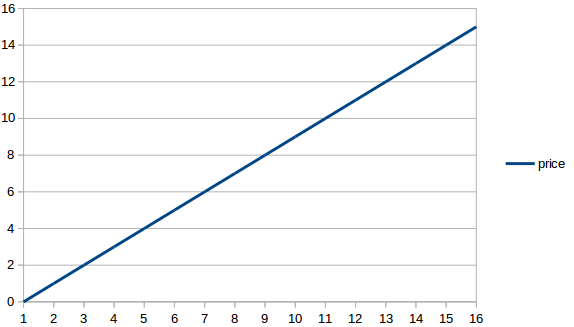
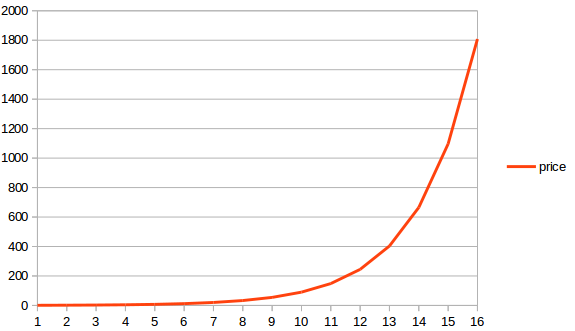

## The Problem

In Shopware 5, we introduced our new filter system. With this new filter system, there is a range slider which is used as price range slider too.

Imagine one of your categories is full of articles with prices between 4,50 EUR and 70,00 EUR and you have some products around 850,00 EUR. That would result in very high price differences with a very high maximal range. If you start to slide, you will see that the first slide step would be about 40 EUR. Your lower priced products won't be visible anymore. By default, the slider calculates 20 steps between the minimal and the maximal price with a linear function. So basically, the step width is calculated by the highest price divided by the step count.

In 5.0.3, we added the log algorithm for calculation to cover this scenario too.

## What is the difference?

### Linear

Just like described above, the calculation is simple. Given a maximum price of 850 EUR and a step count of 20, the step width would be 42,50 EUR. So every slide step would increase the value by 42,50 EUR. 

Take a look at the graph to get an idea of it.

### Log

In Shopware 5.0.3, we introduced the `log` function. The calculation is based on exponents. Given a maximum price of 850 EUR and a step count of 20, the step width would be dynamic, since it's based on the range slider position. So every slide step would increase the value by an exponential function.

Basically, it starts low but heavily increases over time, just like seen in the graph.

## Template Customization

To take advantage of this algorithm, you need to customize your templates.

You may find the `frontend_listing_filter_facet_range_slider_config` block in the following files:
* frontend/listing/filter/facet-range.tpl
* frontend/listing/filter/facet-currency-range.tpl

In order to use the log function, simply change the value of **$stepCurve** from `linear` to `log`. After that, you should clean-up all shop caches.
