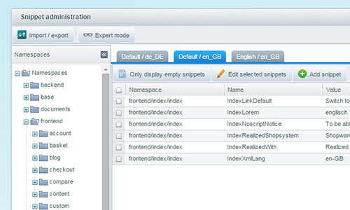

Snippets are an extremely easy and useful way to translate and customize the Shopware storefront texts. By using snippets, you are able to determine the content of a specific text part of the theme individual for every shop. The part you would like to edit has to be wrapped inside a snippet tag. Every snippet is editable in the Shopware 5 backend by using the snippet administration module.

<div class="toc-list"></div>

## Snippets during plugin/theme development 

### Creating snippets

Snippets can be added inside the template files of Shopware using the Smarty snippet tag `{s}`. Each snippet has several values associated to it:

- `name`: This is a required parameter, and must be unique inside each snippet namespace. Usually, the snippet name reflects its usage or purpose inside the specific namespace (context) to which it belongs

- `namespace`: Also required, the namespace is a string that identifies the context to which the snippet belongs. Traditionally, similar functionalities share a common context. 

- `default value`: optional but highly recommended. This is the fallback value used for your snippet, in case a value is not present in the database or .ini files. It's recommended that you set a snippet's default value to the snippets "real" English value.

Inside a Smarty file, you can declare snippets like so:

```
{s name="frontend/checkout/cart/separate_dispatch" namespace="frontend/listing/box_article"}example text{/s}
```

Like mentioned before, namespaces identify the context of the snippet's usage. As such, it usually makes sense that all the snippets inside a template file share a common context. Should you decide to use this best practice, you can declare a general namespace for the whole file at its start:

```
{namespace name="frontend/listing/box_article"}
```

If you use this feature, your snippets will no longer require an explicit declaration of namespace, and you can remove it:

```
{s name="frontend/checkout/cart/separate_dispatch"}example text{/s}
```

You can optionally still declare the namespace in that snippet. The namespace declared in the snippets takes precedence over the file's global namespace. Use this if you need to reuse, in your current namespace, a snippet from another namespace. Keep in mind that this is not recommended, as later changes to that snippet will impact multiple points of your plugin, potentially causing undesired consequences.

Remember that the namespaces of snippets that are defined by using `.ini` files in your theme's `_private` directory will have the `theme/<theme name>` prefix automatically added to them.

### Using snippets

As a rule of thumb, all interface texts that will be visible to the end user should be a snippet. The main advantage of snippet usage is internationalization. If your plugin uses snippets, it will be easy to identify and fix missing translations, making your plugin compatible with Shopware shops aimed at different markets.

Another advantage is that snippets can be customized by the shop owner. Should he have special naming conventions for his shop, he will be able to adapt your plugin to his needs, instead of looking for an alternative solution.

While snippets are mostly used to translate plain text, they are flexible enough to be used in other scenarios. For example, snippets can contain HTML code, including inline CSS (which is, of course, not recommended), giving you and your customers even more customization possibilities.

```
{s name="frontend/checkout/cart/separate_dispatch"}<strong>bold example text</strong>{/s}
```

### Understanding snippet handling

Snippet handling is configurable, so you can decide exactly how snippets are loaded and saved by Shopware. This can be changed in your `config.php` file, inside the `snippet` section:

```php
array(
    'db' => array(
        // your database configuration
    ),
    'snippet' => array(
        'readFromDb' => true,
        'writeToDb' => true,
        'readFromIni' => false,
        'writeToIni' => false,
        'showSnippetPlaceholder' => false //introduced in Shopware 5.0.2
    ),
)
```

When handling snippets while rendering templates, the following workflow is used:

+ If `readFromDb` is `true`, Shopware will look for your snippet value in the database
+ If the snippet is not present in the database, has a default value set and `writeToDb` is `true`, Shopware will write that value into the database.
+ If `readFromIni` is `true`, Shopware will look for your snippet value in your .ini files.
+ If the snippet is not present in the .ini file, has a default value set and `writeToIni` is `true`, Shopware will write that value into an .ini file.

The additional `showSnippetPlaceholder` (introduced in Shopware 5.0.2) option allows you to specify how you want Shopware to display empty and undefined snippets (snippets that are declared in your template files, but are not defined or defined as empty in your database and/or .ini files). By default, these snippets are displayed as an empty string, which is recommended for production environments. If you set this option to `true`, these snippets will be rendered as their name wrapped in hash signs. This makes it easier for you to identify and handle missing or empty snippets during development.

The above example configuration values represent the default values that are used in Shopware. They are optimized for production environments, and should be used in those scenarios. You can change those values, at any time, for example, for development purposes.

### Setting snippet values

While developing with snippets, you need to declare them in your template files and, later on, assign them values besides the default ones. These values can be set inside .ini files:

<div class="alert alert-warning">
<strong>Note:</strong> When you create <code>.ini</code> files in the <code>_private</code> directory of your theme, the namespace will not match the default namespace of your template files, to avoid namespace collision. The namespace of all snippets from the <code>.ini</code> files will be prefixed with <code>themes/<theme name>/</code>.<br>
<strong>Example:</strong> <code>_private/snippets/frontend/index/shop-navigation.ini</code> will require the <code>themes/<theme name>/frontend/index/shop-navigation</code> namespace in order to work properly inside your theme. The namespace can either be set for the whole file (affecting the namespaces of all snippets, which will possibly break the default Shopware snippets) or can be set manually for each snippet tag.
</div>

```
[en_GB]
frontend/checkout/cart/separate_dispatch = "example text"

[de_DE]
frontend/checkout/cart/separate_dispatch = "Beispieltext"
```

.ini files are divided internally in groups, names after the locales to which those snippets belong. The example above translated the snippets from the example above into UK English and German. You can add as many sections to your .ini files as you want, as long as they match the locale definitions of Shopware's core (see the `s_core_locales` database table).

Like mentioned before, snippets require a `name` and a `namespace`. The above .ini file contains only one snippet, but more can be added, as long as they all have a common namespace. The file's location in the filesystem *must* match the snippet's namespace. So, to match the snippet declaration in our template file, this .ini file must be in the following location:

```
ThemeDirectory
    _private
        snippets
            frontend
                listing
                    box_article.ini
```

Keep in mind that snippets defined inside a theme's `_private` directory will have their namespace automatically prefixed with `themes/<theme name>/`.

The `ThemeDirectory` location will depend on where you are developing. You might have to create the `_private` directory manually.

### Developing with snippets

Manually generating .ini files, however, is a task you don't have to do. You can just define the snippets in your template files and, when you navigate to that page on your browser, Shopware can automatically create those snippets for you.

```php
array(
    'db' => array(
        // your database configuration
    ),
    'snippet' => array(
        'readFromDb' => false,
        'writeToDb' => false,
        'readFromIni' => true,
        'writeToIni' => true,
        'showSnippetPlaceholder' => true //introduced in Shopware 5.0.2
    ),
)
```

The above settings illustrate an example development configuration. In this scenario, snippets are read and written 
into the .ini files automatically. So, suppose you just added a new snippet to your template, and refresh the browser
page to see your result. As the template is rendered, Shopware will look for that snippet in your .ini files because
we set `readFromDB` to `false`. As it's new, it won't find it, but it will write it. If the particular .ini file for
that namespace doesn't exist already, it will be created automatically, and the snippet will be added to the file
automatically.

As you no longer have to worry about creating .ini files, you can focus on developing your templates. When you are
finished with that, should check your .ini files, and manually add translations for other languages, or make sure
all your snippets are there.

A few things to keep in mind when using this approach:
- Snippet values are only written automatically to the .ini file when the snippet is first detected in the frontend. Further changes to the snippet's default value will not be written to the file automatically
- Only snippets rendered in the frontend will be written automatically to .ini files (or database, if `writeToDb` is `true`).
- Snippet are written to the current locale of your shop. You can duplicate those sections manually for creating translations.
- Changes made to snippets in the backend are not saved to .ini files
- The automatically generated .ini files might not be so inside your plugin directory, but directly in Shopware's root directory. However, the internal directory structure is the same, so you can just move that directory inside your plugin once you are finished
- Enabling `writeToIni` will write *ALL* missing snippets to .ini files. This means that if, for some reason, a missing snippet that does not belong to your template file is detected, it will also be written to .ini file, and might get mixed with your new snippets. For this reason it's recommended that you carefully review your .ini files once you are finished developing your plugin/theme.
- If your template files have snippets with an empty default value, they will also be written to db/.ini file as an empty string. The `showSnippetPlaceholder` only affects the rendered value, not the value that is written into storage.  
- If `readFromDb` is `true` your .ini files will be ignored and all snippets are read from database

**Note: Shopware 5 includes some CLI commands that can prove useful when handling snippets. Please refer to [the related section](#snippet-cli-commands) for more details.**

### Snippets during plugin installation

If your plugin/theme uses snippets, they should be placed inside the corresponding directory in your plugin/theme. If that is done correctly, when the plugin is installed in another Shopware installation, those snippets will be automatically imported from the .ini file into the database. This minimizes the number of file reads in production environments, maximizing performance.

## Snippets during installation/production phases


The snippet administration allows you to translate the existing snippets directly from the Shopware 5 backend. You have the ability to add content to the snippets individually for every existing subshop, even if multiple subshops share a common language. You can also configure your shop to inherit another shop's custom translations in the `shop` tab on `basic settings`


## Snippet CLI commands
  
Shopware includes some CLI tools that you can use to better manage your snippets, and are particularly useful if you are handling a large amount of snippets at once. For instructions on how to use Shopware CLI commands, please refer to [this page](/developers-guide/shopware-5-cli-commands/).

### sw:snippets:find:missing

This command expects a `locale` key (e.g. `en_GB`, see all possible value in `s_core_locales`) as a required argument. For that locale, it will check the snippets database table to find unique snippets (defined by a unique `name`-`namespace` pair) that are defined for other locales but not the given one. Those snippets are then exported into the ´snippets´ directory of your Shopware installation (by default, it doesn't exist in Shopware 5 installations, and it will be automatically created if needed) as .ini files. If the target file already exists, the new snippets will be appended to it.

The command accepts two optional arguments:

- `target`: Directory to which the snippets will be written. Defaults to `snippets`

- `fallback`: By default, the exported snippets are left with empty values. If you provide a locale key in this argument, the snippets are exported with the value of the matching snippet in the fallback language (if available).

This command is useful in many situations. It can be used to find missing translations for your plugin's snippets, or to export complete snippet sets, if you wish to create a new translation plugin for Shopware.

### sw:snippets:remove

This command requires a `directory` argument. It scans that directory (and subdirectories) for .ini snippet files and, for those found, removes them from the database.

### sw:snippets:to:db

This command loads all snippets from the .ini files inside the`snippets` directory in your Shopware installation path into the database. 

- `include-plugins`: If provided, the command will also search all your active plugins for a `snippets` directory, and import those too.

- `force`: By default, if a snippet being imported already exists in the database, it will not be overwritten. Use the `force` argument to change this behaviour

- `source`: use this argument if your wish to import snippets from a directory other that then `snippets` directory in the root of your Shopware installation.

### sw:snippets:to:ini

Exports snippets from the database into .ini files. It requires a ´locale´ argument (e.g. `en_GB`, see all possible value in `s_core_locales`) indicating which snippet set to export. If a file for a given namespace already exists, the snippets will be appended to the existing content.

- `target`: Directory to which the snippets will be written. Defaults to `snippets`


### sw:snippets:to:sql

Loads snippets from the `snippets` directory of your Shopware installation and creates a SQL file that, when executed, will insert those snippets into the `s_core_snippets` table. It requires a `file` argument containing the desired location of the SQL file. 

- `force`: By default, if the target `file` already exists, it will not be overwritten. Use this argument to change this behaviour.

- `include-default-plugins`: Set this option to also export snippets included in Shopware's core plugins

- `include-plugins`: If set, active plugin snippets will also be exported.

- `update`: By default, the generated SQL script only performs inserts. If the `update` option is provided, it will also handle update scenarios when duplicates are found. If the existing database snippet has `dirty` = 0, the value will be overwritten. If `dirty` is 1, it's not changed. Please note that, for a large number of snippets, enabling update support will make the SQL statements significantly slower to execute upon importing.
