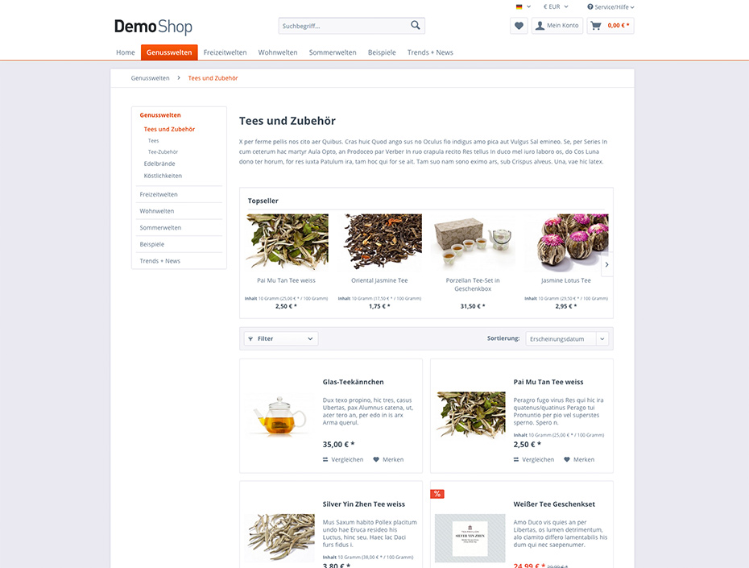
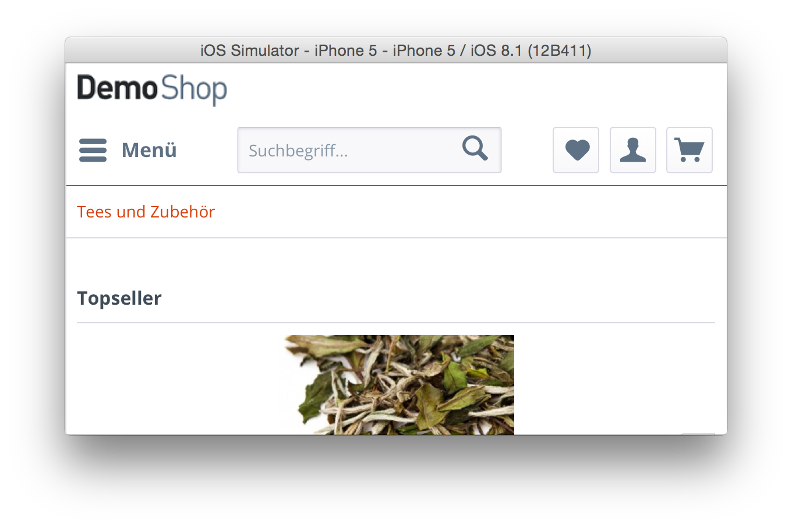
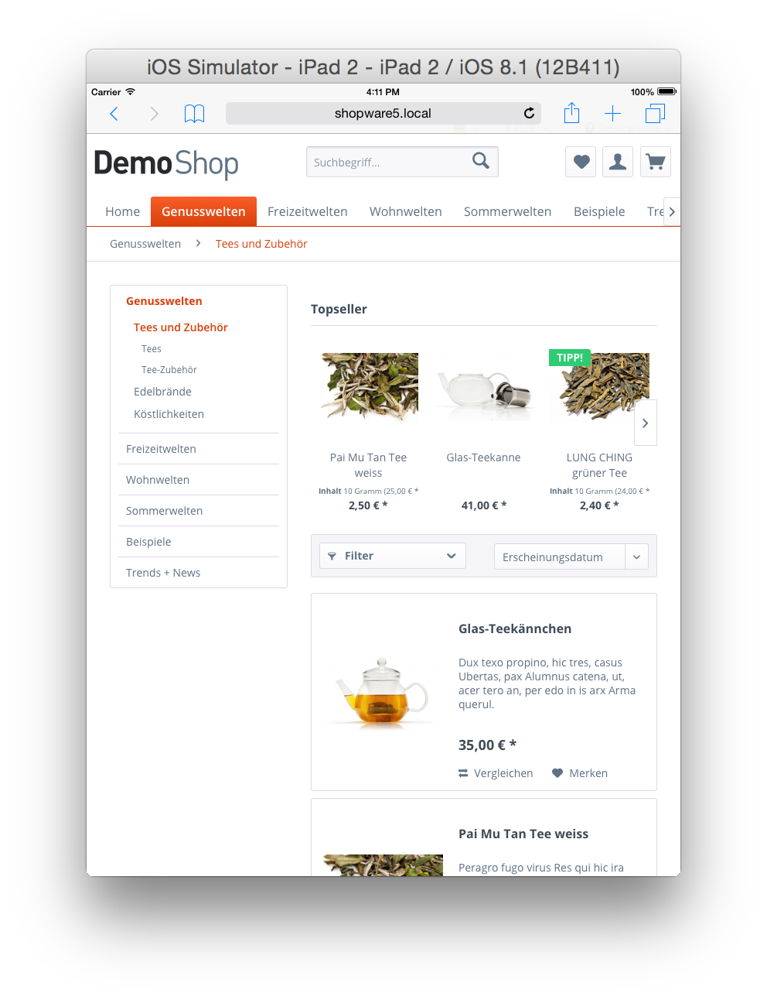
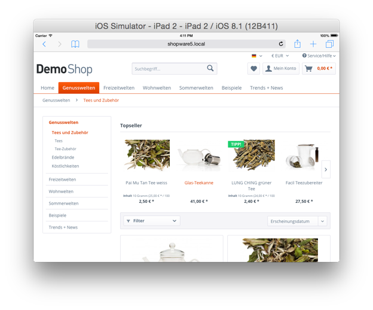

<div class="toc-list"></div>

## Introduction
This guide will introduce you to the new features and additions to the new Shopware 5 default "Responsive" theme, which is a cross browser compatible, retina ready, responsive HTML5 / CSS3 theme with touch support. It features a clean and unique design and many new features, such as a powerful backend module, new product displays and infinite scrolling. We've optimized the Responsive theme for the following devices:

- Smartphones in portrait and landscape modes
- Tablets in portrait and landscape modes
- Nettops, Notebooks and Desktop PCs



## Feature overview
- Theme inheritance system is now totally transparent and can easily be modified
- Theme specific registration of Smarty Plugins
- Snippets are now be directly included in the theme directory
- Fully restructured HTML5 structure with backward compatibility in mind
    - Mobile first approach
    - HTML5 form validation
    - Rich snippets based on [schema.org](http://schema.org)
    - Massive increase of Smarty blocks in the theme
- Retina ready adaptive images
    - State of the art implementation using the HTML5 ```picture``` element
    - Automatically creation of high dpi images for products and emotion worlds using the Media Manager module
- Fully configurable using the Theme Manager
    - Easily change the color of the complete theme
    - 9 pre-configured color sets
    - Changing your logo is as easy as selecting an image in the Media Manager module
- Built-in LESS compiler
    - CSS source maps for easier debugging
    - Component based styling
    - Over 20 provided mixins
    - All variables are configurable using the Theme Manager module in the Shopware backend
- Built-in Javascript compressor
    - Concatenates all provided files to reduce the amount of HTTP requests
    - Strips all whitespaces and inline comments for a smaller footprint
- Responsive Javascript State Manager and own jQuery plugin system
    - Runs your jQuery plugin only for a specific breakpoint
    - Simplifies the development of jQuery plugins
    - Automatically unbinding of event listeners
    - Destroys automatically jQuery plugins which aren't used in the certain viewport
    - Global event system for easier communication between jQuery plugins
- Fully customizable off-canvas panel
- Infinite scrolling mode for the product listings
- State of the art technologies
    - [bower](http://bower.io/) as the package manager for third-party components
    - Feature detection using [Modernizr](http://modernizr.com/)
    - Pure CSS responsive grid system using [PocketGrid](http://arnaudleray.github.io/pocketgrid/)
    - [jQuery](http://jquery.com/) 2.1.11 included
    - CSS3 Animations with a jQuery fallback using [jQuery Transit](http://ricostacruz.com/jquery.transit/)
    - Scalable icon set with 295 pre defined icons
- Ajaxified the emotion worlds, note functionality and compare function

## Compatibility note
We built the theme with maximal backward compatibility in mind and are proud to announce that all Smarty blocks which were be available in the "Emotion" template can also be found in the new "Responsive" theme.

As part of the restructuring of the theme, we updated the list of browsers which are officially supported:

* Chrome version 34 or above
* Firefox version 29 or above
* Safari, Mac OS X only. Support for the windows version has been discontinued
* Opera version 15 with Blink engine or above
* Internet Explorer version 9 or above

Please keep in mind that older browsers don't support all available HTML5 and CSS3 features.

## Comparison with the Shopware 4 template

|                                | Shopware 4 | Shopware 5 |
|--------------------------------|------------|------------|
| Total Smarty blocks            |        918 |       1831 |
| Javascript file size in total  |      365KB |      295KB |
| CSS file size in total         |    325.9KB |      279KB |
| HTTP requests on home page*    |         32 |         11 |

*Bare installation without any demo data.

## Device examples
##### Mobile view




##### Tablet view





## Theme.php
The ```Theme.php``` is the base file of each and every theme. It provides the basic information about the author, the license and a short description for the Theme Manager. Additionally, it provides access to the following features:

- LESS compiler
- Javascript compiler
- Adding customizable options for the theme user
- Adding configuration sets

The following example shows a demo ```Theme.php``` file for a theme named "Example":

```php
<?php
namespace Shopware\Themes\Example;

use Doctrine\Common\Collections\ArrayCollection;
use Shopware\Components\Form as Form;
use Shopware\Components\Theme\ConfigSet;

class Theme extends \Shopware\Components\Theme
{
    /** @var string Defines the parent theme */
    protected $extend = 'Bare';

    /** @var string Defines the human readable name */
    protected $name = 'Example';

    /** @var string Description of the theme */
    protected $description = 'An awesome Shopware theme';

    /** @var string The author of the theme */
    protected $author = 'shopware AG';

    /** @var string License of the theme */
    protected $license = 'MIT';
}
```

### Adding javascript files to your theme
Working with compressors isn't always as easy as adding the files to your HTML structure using ```script``` tags. The built-in javascript compressor is as easy as this and perfectly suited your workflow as a web developer.

Simply place your javascript files in the ```frontend/_public``` directory and add their paths to the ```$javascript``` array in your ```Theme.php```, and you're good to go.

```php
/** @var array Defines the files which should be compiled by the javascript compressor */
protected $javascript = array(
    'src/js/jquery.my-plugin.js'
);
```

### Adding LESS files to your theme
The built-in LESS compiler searches for a file named ```all.less``` in the ```frontend/_public/src/less``` directory. You just have to create the necessary directory structure and your LESS code will automatically converted to CSS on the fly.

### I don't know LESS, what can I do?
You can add a ```$css``` array to your ```Theme.php``` file, similar to the ```$javascript``` array, with the paths of your CSS files:

```php
/** @var array Defines the files which should be compiled by the javascript compressor */
protected $css = array(
    'src/css/my-styles.css'
);
```

## What should I know about the LESS integration?
Less is a CSS pre-processor, meaning that it extends the CSS language, adding features that allow variables, mixins, functions and many other techniques that allow you to make CSS that is more maintainable, customizable and extendable.

### Responsive adjustment with LESS
We're using relative measuring units, like ```em``` or ```rem``` throughout the code base. Working with them can be at times troublesome. To simplify the process, we include a LESS mixin called ```unitize```.

It provides the ability to create ```rem``` values with a pixel based fallback for older browser.

The following example shows how to use the mixin using a ```12px font-size```:

```
p {
    .unitize(font-size, 12);
}
```

Relative measuring units are always based on the ```font-size``` of the ```html``` element. In almost every case, the default browsers ```font-size``` is 16px and that's why the mixin uses 16 as default base value for the ```rem``` calculation. If you want to use a different base value you can simply add it as a third parameter.

## Customizing your theme
It's possible to add custom configuration options to your theme. Using this method, the user can fully customize the theme without having to edit any CSS files.

### Creating configuration elements
To create configuration elements it's necessary to add a ```createConfig()``` method to your ```Theme.php```. The method specifies the elements you need for the configuration form. The first parameter is the container element of type ```Shopware\Components\Form\Container\TabContainer``` where you can add additional fields as well as other container elements.

```php
/**
 * @param Form\Container\TabContainer $container
 */
public function createConfig(Form\Container\TabContainer $container)
{

    $tab = $this->createTab(
        'responsive_colors_tab',
        'Responsive colors'
    );
    $container->addTab($tab);
}
```

#### Container elements
The ```$container``` also accepts other container elements like a tab or a fieldset.

```php
/**
 * @param Form\Container\TabContainer $container
 */
public function createConfig(Form\Container\TabContainer $container)
{
    $fieldset = $this->createFieldSet(
        'responsive_fieldset',
        'My responsive settings'
    );
    $tab = $this->createTab(
        'responsive_colors_tab',
        'Responsive colors'
    );
    $tab->addElement($fieldset);

    $container->addTab($tab);
}

```

#### Adding elements to the configuration container
Now you can add the necessary elements to the ```$container```. The following elements are available:

- ```createTextField```
- ```createNumberField```
- ```createCheckboxField```
- ```createDateField```
- ```createEmField```
- ```createColorPickerField```
- ```createMediaField```
- ```createPercentField```
- ```createPixelField```
- ```createSelectField```
- ```createTextAreaField```


All elements have a similar syntax:

```
$this->createTextField([unique name], [label], [default value]);
```


In the following example we created a textfield with the label ```Basic font size``` and the name ```basic_font_size```. The name of any field is mandatory and has to be unique. It will be used to assign the value of the field to the storefront.

```php
/**
 * @param Form\Container\TabContainer $container
 */
public function createConfig(Form\Container\TabContainer $container)
{
    // Create the fieldset which is the container of our field
    $fieldset = $this->createFieldSet(
        'responsive_fieldset',
        'My responsive settings'
    );

    // Create the textfield
    $textField = $this->createTextField(
        'basic_font_size',
        'Basic font size',
        '16px'
    );

    $fieldset->addElement($textField);

    // Create the tab which will be named "Responsive settings"
    $tab = $this->createTab(
        'responsive_colors_tab',
        'Responsive settings'
    );

    // ...add the fieldset to the tab
    $tab->addElement($fieldset);

    // ...last but not least add the tab to the container, which is a tab panel.
    $container->addTab($tab);
}

```

After saving the ```Theme.php```, you will be able to get the value of the field in the storefront like so:

```
{$theme.basic_font_size}
```

## The "Bare" theme
We're aware that our theme is used by thousands of customers and agencies. To simplifying the process of creating your very own theme for Shopware 5, we are pleased to introduce our "Bare" theme. It's built using the latest web standards and provides a rock solid foundation which helps you build fast, robust and adaptable web shops.

### Using the "Bare" theme as a parent theme
Using the "Bare" theme as the foundation for your own theme is easy.

To modify the parent theme of your custom theme, open your ```Theme.php``` file and modify the following property:

```php
<?php
namespace Shopware\Themes\Example;

use Doctrine\Common\Collections\ArrayCollection;
use Shopware\Components\Form as Form;
use Shopware\Components\Theme\ConfigSet;

class Theme extends \Shopware\Components\Theme
{
    /** @var string Defines the parent theme */
    protected $extend = 'Bare';
}
```

### Theme structure
The structure of a Shopware 5 theme is very similar to the one already existing in Shopware 4. It is still based on the available sections of Shopware, but it has been refined for easier maintaining. The new structure looks like:

```
├── documents
├── frontend
│   ├── _includes
│   ├── account
│   ├── blog
│   │   └── comment
│   ├── campaign
│   ├── checkout
│   │   └── items
│   ├── compare
│   ├── custom
│   ├── detail
│   │   ├── comment
│   │   └── tabs
│   ├── error
│   ├── forms
│   ├── home
│   ├── index
│   ├── listing
│   │   ├── actions
│   │   ├── filter
│   │   └── product-box
│   ├── newsletter
│   ├── note
│   ├── paypal
│   ├── plugins
│   │   ├── compare
│   │   ├── index
│   │   ├── notification
│   │   ├── payment
│   │   └── seo
│   ├── register
│   ├── robots_txt
│   ├── search
│   ├── sitemap
│   ├── sitemap_xml
│   └── tellafriend
├── newsletter
│   ├── alt
│   ├── container
│   └── index
└── widgets
    ├── checkout
    ├── compare
    ├── emotion
    │   └── components
    ├── index
    ├── listing
    └── recommendation
```

### Differences between the Shopware 4 and Shopware 5 structure
Shopware 5 themes, like in Shopware 4, are still divided in great sections, with multiple subsections each. In addition we've divided the template files even smaller parts to increase the reusability and maintainability.

For example, we splitted the product box template file ```box_article.tpl``` in smaller parts which can be found in the ```listing/product-box``` directory.

We've also created a new directory named ```_includes```, which contains components which are used across the whole Shopware theme.

## The "Responsive" theme
The "Responsive" theme is our new default theme in Shopware 5. It is based on the "Bare" theme and provides its styling and client side functionalities.

### Theme structure
As it's based on the "Bare" theme, the "Responsive" theme only contains the LESS and javascript files, as well as the third party libraries:

```
└── _public
    ├── src
    │   ├── css
    │   ├── fonts
    │   ├── img
    │   │   ├── icons
    │   │   └── logos
    │   ├── js
    │   │   └── vendors
    │   │       ├── modernizr
    │   │       └── raphael
    │   └── less
    │       ├── _components
    │       ├── _mixins
    │       ├── _modules
    │       └── _variables
    └── vendors
        ├── css
        │   └── pocketgrid
        ├── fonts
        │   └── open-sans-fontface
        │       ├── Bold
        │       ├── ExtraBold
        │       ├── Light
        │       ├── Regular
        │       └── Semibold
        ├── js
        │   ├── jquery
        │   ├── jquery.event.move
        │   ├── jquery.event.swipe
        │   ├── jquery.transit
        │   ├── masonry
        │   └── picturefill
        └── less
            ├── normalize-less
            └── open-sans-fontface
```

Please notice that the ```_resources``` directory was renamed to ```_public```. This directory now contains separated third-party and Shopware specific source files in its subdirectories.

The third-party libraries can now be found under ```_public/vendors``` and the Shopware specific code under ```_public/src```. 

When developing with Grunt, the third-party assets can be installed via the frontend package manager Bower, which is explained [here](/designers-guide/managing-third-party-dependencies-with-bower).

## License
The themes are licensed under the MIT License.

> Copyright (c) shopware AG and individual contributors.
>
> Permission is hereby granted, free of charge, to any person obtaining a copy
> of this software and associated documentation files (the "Software"), to deal
> in the Software without restriction, including without limitation the rights
> to use, copy, modify, merge, publish, distribute, sublicense, and/or sell
> copies of the Software, and to permit persons to whom the Software is
> furnished to do so, subject to the following conditions:
>
> The above copyright notice and this permission notice shall be included in
> all copies or substantial portions of the Software.
>
> THE SOFTWARE IS PROVIDED "AS IS", WITHOUT WARRANTY OF ANY KIND, EXPRESS OR
> IMPLIED, INCLUDING BUT NOT LIMITED TO THE WARRANTIES OF MERCHANTABILITY,
> FITNESS FOR A PARTICULAR PURPOSE AND NONINFRINGEMENT. IN NO EVENT SHALL THE
> AUTHORS OR COPYRIGHT HOLDERS BE LIABLE FOR ANY CLAIM, DAMAGES OR OTHER
> LIABILITY, WHETHER IN AN ACTION OF CONTRACT, TORT OR OTHERWISE, ARISING FROM,
> OUT OF OR IN CONNECTION WITH THE SOFTWARE OR THE USE OR OTHER DEALINGS IN
> THE SOFTWARE.
