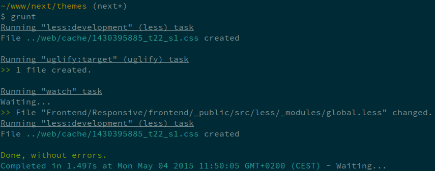

[Grunt](http://gruntjs.com/) is a JavaScript task runner. When you're working on a Javascript project, there are a bunch of things you'll want to do regularly like concatenating given files or running JSHint on your code. You can archieve this with command line tools but it would be nice to have a single, unified set of commands for all those extra tasks. That's what Grunt aims to be. It has a bunch of built-in tasks and can be extended with over 4.000 plugins.

## Installation

Make sure you have installed [Node.js](https://nodejs.org/) and [npm](https://www.npmjs.com/) on your system:

### Install Node.js/npm on Ubuntu 14.04

```
sudo apt-get update
sudo apt-get install nodejs npm
sudo ln -s /usr/bin/nodejs /usr/bin/node
```

### Install Node.js/npm on Mac OS X
You can install Node.js and npm on Mac OS X using the provided [installer package](http://nodejs.org/#download).

As an alternative you can either [Homebrew](http://brew.sh/) or [MacPorts](http://www.macports.org/).

#### Using Homebrew
```
brew install node
```

#### Using MacPorts
```
port install nodejs
```


### Install the Grunt CLI
In order to get started, you'll want to install Grunt's command line interface globally.

```
sudo npm install -g grunt-cli
```
This will put the ```grunt``` command in your system path, allowing it to be run from any directory.

## Dump theme configuration
Themes starting with Shopware 5 are providing the ability to configure them using an adminstiration module named "Theme Manager". Before we can use the Grunt tasks, we have to dump the theme configuration using the Shopware console.

```
./bin/console sw:theme:dump:configuration
```

## Install project dependencies
Now we need to install the dependencies. We install the Grunt library and additional Grunt plugins, which are necessary to compile LESS files for example:

```
cd themes/
npm install
```

## Start file watch

```
grunt
grunt --shopId 1 # optionally specify shopId
```


