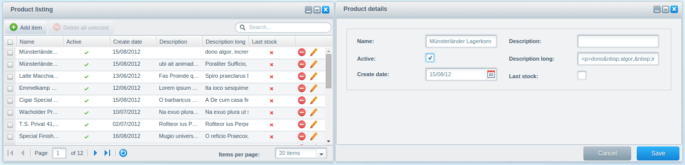
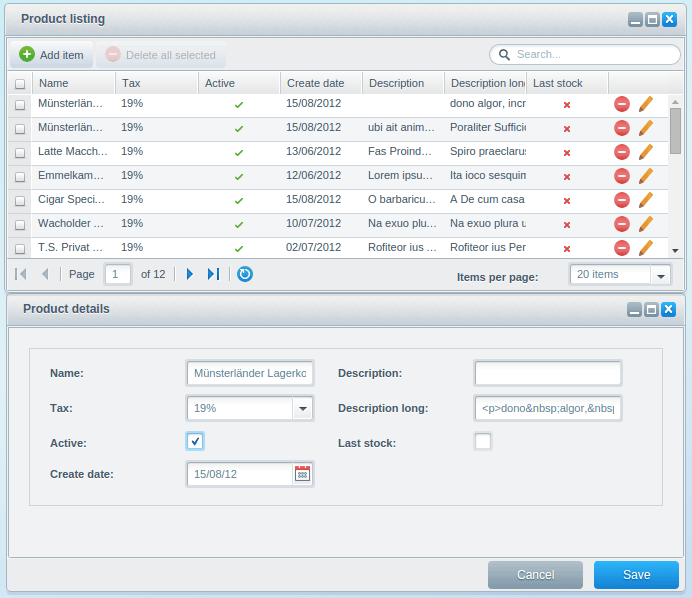
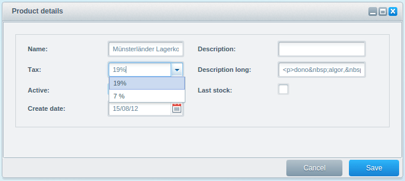
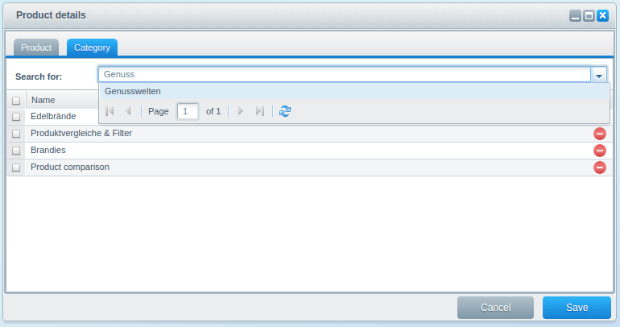
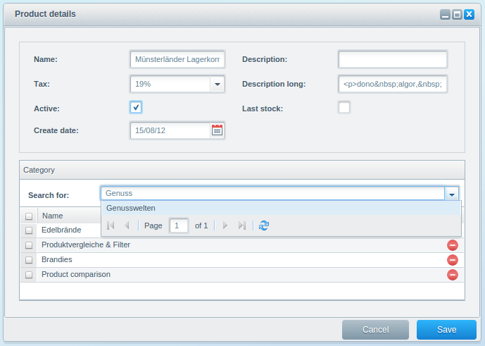
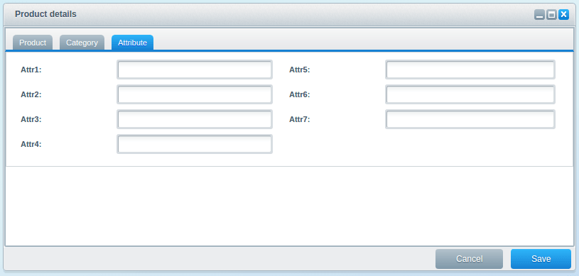
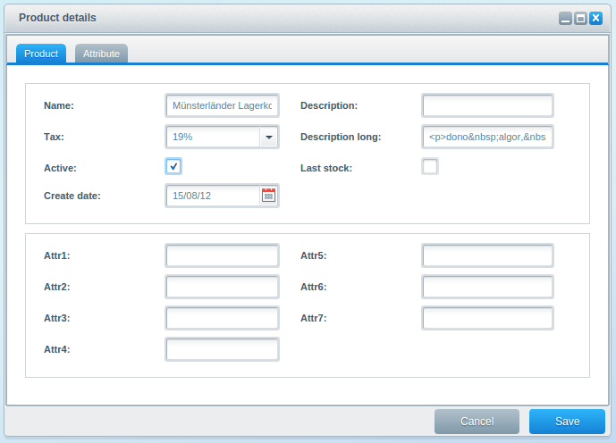
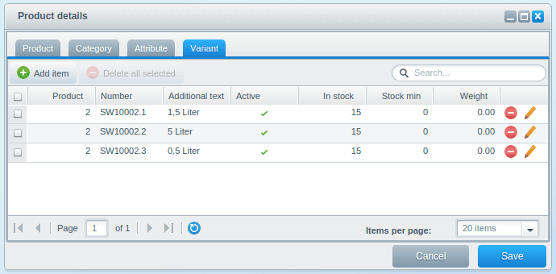
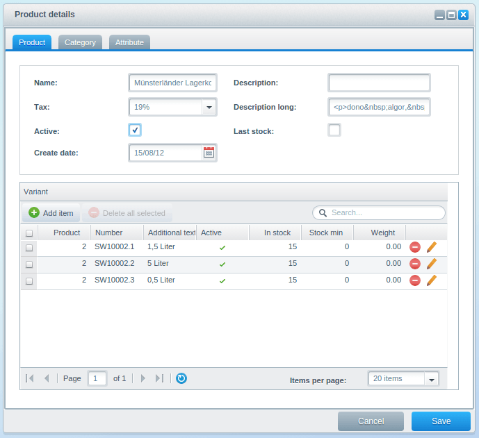

This tutorial is part of a series that covers the Shopware Backend Components. In the [Backend Components - Detail](/developers-guide/backend-components/detail/) tutorial we covered the different configuration options of the detail window. In this tutorial, you'll learn the basics about the implementation of associations.

We will take the plugin result from the last tutorial as basis for this tutorial. If you don't have it already, you can download this plugin here: [SwagProductDetail.zip](/exampleplugins/SwagProductDetail.zip)

The detail and listing windows are already defined, but not customized yet. Therefore all fields are displayed:

<a href="img/assoc_1.png" style="text-align:center;">



</a>

<div class="toc-list"></div>

## PHP Implementation

The previous tutorials described how to display simple data structures. This tutorial will extend the product model with the following elements:

* Link products to tax rates (`ManyToOne`)
* Link products to categories (`ManyToMany`)
* Link products to attributes (`OneToOne`)
* Link products to variants (`OneToMany`)

Before you start to implement the ExtJS part, you have to modify the PHP implementation because you will not have enough data transferred to the backend. Because of that, you will now implement the relations seen above before implementing the ExtJS part.

Shopware uses Doctrine 2 to manage models and their corresponding associations. The way in which you can define these associations is not part of the scope of this document, but you can read more about them in the [Official Doctrine 2 documentation page](http://doctrine-orm.readthedocs.org/projects/doctrine-orm/en/latest/reference/association-mapping.html).

However, as these associations are required before we can continue our Backend module development, you should copy the following model code into your plugin (or, as an alternative, replace your `Models` directory with the corresponding content from [SwagProductAssoc.zip](/exampleplugins/SwagProductAssoc.zip))

### The Product model (`\Models\Product.php`)

```php
<?php

namespace SwagProductAssoc\Models;

use Shopware\Components\Model\ModelEntity;
use Doctrine\Common\Collections\ArrayCollection;
use Doctrine\ORM\Mapping as ORM;

/**
 * @ORM\Entity
 * @ORM\Table(name="s_product")
 */
class Product extends ModelEntity
{
    /**
     * @var integer $id
     *
     * @ORM\Id
     * @ORM\Column(type="integer")
     * @ORM\GeneratedValue(strategy="IDENTITY")
     */
    private $id;

    /**
     * @var string $name
     *
     * @ORM\Column()
     */
    private $name;

    /**
     * @var boolean $active
     *
     * @ORM\Column(type="boolean")
     */
    private $active = false;

    /**
     * @var string $description
     *
     * @ORM\Column(type="text", nullable=true)
     */
    private $description = null;

    /**
     * @var string $descriptionLong
     *
     * @ORM\Column(type="text", nullable=true)
     */
    private $descriptionLong = null;

    /**
     * @var integer $lastStock
     *
     * @ORM\Column(type="boolean", nullable=false)
     */
    private $lastStock = false;

    /**
     * @var \DateTime $added
     *
     * @ORM\Column(type="date", nullable=true)
     */
    private $createDate = null;

    /**
     * @var Variant[]
     * @ORM\OneToMany(
     *      targetEntity="SwagProductAssoc\Models\Variant",
     *      mappedBy="product",
     *      cascade={"persist", "remove"}
     * )
     */
    protected $variants;

    /**
     * @var Attribute
     * @ORM\OneToOne(
     *      targetEntity="SwagProductAssoc\Models\Attribute",
     *      mappedBy="product",
     *      cascade={"persist", "remove"}
     * )
     */
    protected $attribute;

    /**
     * @var
     * @ORM\Column(name="tax_id", type="integer")
     */
    protected $taxId;

    /**
     * @var
     * @ORM\ManyToOne(targetEntity="Shopware\Models\Tax\Tax")
     * @ORM\JoinColumn(name="tax_id", referencedColumnName="id")
     */
    protected $tax;

    /**
     * @var ArrayCollection
     *
     * @ORM\ManyToMany(targetEntity="Shopware\Models\Category\Category")
     * @ORM\JoinTable(name="s_product_categories",
     *      joinColumns={
     *          @ORM\JoinColumn(
     *              name="product_id",
     *              referencedColumnName="id"
     *          )
     *      },
     *      inverseJoinColumns={
     *          @ORM\JoinColumn(
     *              name="category_id",
     *              referencedColumnName="id"
     *          )
     *      }
     * )
     */
    protected $categories;

    public function __construct()
    {
        $this->variants = new ArrayCollection();
        $this->categories = new ArrayCollection();
    }


    /**
     * @return int
     */
    public function getId()
    {
        return $this->id;
    }


    /**
     * @param bool $active
     */
    public function setActive($active)
    {
        $this->active = $active;
    }

    /**
     * @return bool
     */
    public function getActive()
    {
        return $this->active;
    }

    /**
     * @param \DateTime $createDate
     */
    public function setCreateDate($createDate)
    {
        $this->createDate = $createDate;
    }

    /**
     * @return \DateTime
     */
    public function getCreateDate()
    {
        return $this->createDate;
    }

    /**
     * @param string $description
     */
    public function setDescription($description)
    {
        $this->description = $description;
    }

    /**
     * @return string
     */
    public function getDescription()
    {
        return $this->description;
    }

    /**
     * @param string $name
     */
    public function setName($name)
    {
        $this->name = $name;
    }

    /**
     * @return string
     */
    public function getName()
    {
        return $this->name;
    }

    /**
     * @param string $descriptionLong
     */
    public function setDescriptionLong($descriptionLong)
    {
        $this->descriptionLong = $descriptionLong;
    }

    /**
     * @return string
     */
    public function getDescriptionLong()
    {
        return $this->descriptionLong;
    }

    /**
     * @param int $lastStock
     */
    public function setLastStock($lastStock)
    {
        $this->lastStock = $lastStock;
    }

    /**
     * @return int
     */
    public function getLastStock()
    {
        return $this->lastStock;
    }

    /**
     * @return \Doctrine\Common\Collections\ArrayCollection
     */
    public function getCategories()
    {
        return $this->categories;
    }

    /**
     * @param \Doctrine\Common\Collections\ArrayCollection $categories
     */
    public function setCategories($categories)
    {
        $this->categories = $categories;
    }

    /**
     * @return Attribute
     */
    public function getAttribute()
    {
        return $this->attribute;
    }

    /**
     * @param Attribute $attribute
     * @return \Shopware\Components\Model\ModelEntity
     */
    public function setAttribute($attribute)
    {
        return $this->setOneToOne(
            $attribute,
            Attribute::class,
            'attribute',
            'product'
        );
    }

    /**
     * @return Variant[]
     */
    public function getVariants()
    {
        return $this->variants;
    }

    /**
     * @param Variant[] $variants
     * @return \Shopware\Components\Model\ModelEntity
     */
    public function setVariants($variants)
    {
        return $this->setOneToMany(
            $variants,
            Variant::class,
            'variants',
            'product'
        );
    }

    /**
     * @return mixed
     */
    public function getTax()
    {
        return $this->tax;
    }

    /**
     * @param mixed $tax
     */
    public function setTax($tax)
    {
        $this->tax = $tax;
    }
}
```

### The Product Attribute model (`Models\Attribute.php`)

```php
<?php

namespace SwagProductAssoc\Models;

use Shopware\Components\Model\ModelEntity;
use Doctrine\ORM\Mapping as ORM;

/**
 * @ORM\Entity
 * @ORM\Table(name="s_product_attribute")
 */
class Attribute extends ModelEntity
{
    /**
     * @var integer $id
     *
     * @ORM\Id
     * @ORM\Column(type="integer")
     * @ORM\GeneratedValue(strategy="IDENTITY")
     */
    private $id;


    /**
     * @var string $attr1
     *
     * @ORM\Column(type="string", nullable=true)
     */
    protected $attr1 = null;


    /**
     * @var string $attr2
     *
     * @ORM\Column(type="string", nullable=true)
     */
    protected $attr2 = null;


    /**
     * @var string $attr3
     *
     * @ORM\Column(type="string", nullable=true)
     */
    protected $attr3 = null;


    /**
     * @var string $attr4
     *
     * @ORM\Column(type="string", nullable=true)
     */
    protected $attr4 = null;


    /**
     * @var string $attr5
     *
     * @ORM\Column(type="string", nullable=true)
     */
    protected $attr5 = null;

    /**
     * @var
     * @ORM\OneToOne(targetEntity="SwagProductAssoc\Models\Product", inversedBy="attribute")
     * @ORM\JoinColumn(name="product_id", referencedColumnName="id")
     */
    protected $product;

    /**
     * @return int
     */
    public function getId()
    {
        return $this->id;
    }

    /**
     * @param mixed $product
     */
    public function setProduct($product)
    {
        $this->product = $product;
    }

    /**
     * @return mixed
     */
    public function getProduct()
    {
        return $this->product;
    }

    /**
     * @param string $attr1
     */
    public function setAttr1($attr1)
    {
        $this->attr1 = $attr1;
    }

    /**
     * @return string
     */
    public function getAttr1()
    {
        return $this->attr1;
    }

    /**
     * @param string $attr2
     */
    public function setAttr2($attr2)
    {
        $this->attr2 = $attr2;
    }

    /**
     * @return string
     */
    public function getAttr2()
    {
        return $this->attr2;
    }

    /**
     * @param string $attr3
     */
    public function setAttr3($attr3)
    {
        $this->attr3 = $attr3;
    }

    /**
     * @return string
     */
    public function getAttr3()
    {
        return $this->attr3;
    }

    /**
     * @param string $attr4
     */
    public function setAttr4($attr4)
    {
        $this->attr4 = $attr4;
    }

    /**
     * @return string
     */
    public function getAttr4()
    {
        return $this->attr4;
    }

    /**
     * @param string $attr5
     */
    public function setAttr5($attr5)
    {
        $this->attr5 = $attr5;
    }

    /**
     * @return string
     */
    public function getAttr5()
    {
        return $this->attr5;
    }
}
```

### The Product Variant model (`Models\Variant.php`)

```php
<?php

namespace SwagProductAssoc\Models;

use Shopware\Components\Model\ModelEntity;
use Doctrine\ORM\Mapping as ORM;

/**
 * @ORM\Entity
 * @ORM\Table(name="s_product_variant")
 */
class Variant extends ModelEntity
{
    /**
     * @var integer $id
     *
     * @ORM\Id
     * @ORM\Column(type="integer")
     * @ORM\GeneratedValue(strategy="IDENTITY")
     */
    private $id;

    /**
     * @ORM\Column(name="product_id", type="integer")
     */
    protected $productId;

    /**
     * @var string
     * @ORM\Column(type="string")
     */
    private $number;

    /**
     * @var string $additionalText
     *
     * @ORM\Column(type="string", nullable=true)
     */
    private $additionalText = null;

    /**
     * @var integer $active
     *
     * @ORM\Column(type="integer", nullable=false)
     */
    private $active = false;

    /**
     * @var integer $inStock
     *
     * @ORM\Column(type="integer", nullable=true)
     */
    private $inStock = null;

    /**
     * @var integer $stockMin
     *
     * @ORM\Column(type="integer", nullable=true)
     */
    private $stockMin = null;

    /**
     * @var float $weight
     *
     * @ORM\Column(type="decimal", nullable=true, precision=3)
     */
    private $weight = null;

    /**
     * @var
     * @ORM\ManyToOne(targetEntity="SwagProductAssoc\Models\Product", inversedBy="variants")
     * @ORM\JoinColumn(name="product_id", referencedColumnName="id")
     */
    protected $product;

    /**
     * @return int
     */
    public function getId()
    {
        return $this->id;
    }

    /**
     * @param mixed $product
     */
    public function setProduct($product)
    {
        $this->product = $product;
    }

    /**
     * @return mixed
     */
    public function getProduct()
    {
        return $this->product;
    }

    /**
     * @param int $active
     */
    public function setActive($active)
    {
        $this->active = $active;
    }

    /**
     * @return int
     */
    public function getActive()
    {
        return $this->active;
    }

    /**
     * @param string $additionalText
     */
    public function setAdditionalText($additionalText)
    {
        $this->additionalText = $additionalText;
    }

    /**
     * @return string
     */
    public function getAdditionalText()
    {
        return $this->additionalText;
    }

    /**
     * @param int $inStock
     */
    public function setInStock($inStock)
    {
        $this->inStock = $inStock;
    }

    /**
     * @return int
     */
    public function getInStock()
    {
        return $this->inStock;
    }

    /**
     * @param string $number
     */
    public function setNumber($number)
    {
        $this->number = $number;
    }

    /**
     * @return string
     */
    public function getNumber()
    {
        return $this->number;
    }

    /**
     * @param int $stockMin
     */
    public function setStockMin($stockMin)
    {
        $this->stockMin = $stockMin;
    }

    /**
     * @return int
     */
    public function getStockMin()
    {
        return $this->stockMin;
    }

    /**
     * @param float $weight
     */
    public function setWeight($weight)
    {
        $this->weight = $weight;
    }

    /**
     * @return float
     */
    public function getWeight()
    {
        return $this->weight;
    }
}
```

### Extend the PHP Controller

You have to extend the `Controllers/Backend/Product.php` controller in order to load associated models data and serve it to the backend modules. To do this, you have to extend the detail and listing queries.

Both queries have their own method for generating a query builder. They are named `getListQuery()` and `getDetailQuery()`. You can just overwrite these methods.

As a rule of thumb, you should always call the parent method and then extend the query:

```php
<?php

use SwagProductAssoc\Models\Product;

class Shopware_Controllers_Backend_SwagProductAssoc extends Shopware_Controllers_Backend_Application
{
    protected $model = Product::class;
    protected $alias = 'product';

    protected function getListQuery()
    {
        $builder = parent::getListQuery();

        $builder->leftJoin('product.tax', 'tax');
        $builder->addSelect(array('tax'));

        return $builder;
    }

    protected function getDetailQuery($id)
    {
        $builder = parent::getDetailQuery($id);

        $builder->leftJoin('product.tax', 'tax')
                ->leftJoin('product.attribute', 'attribute');

        $builder->addSelect(array('tax', 'attribute'));

        return $builder;
    }
}
```

The detail query might grow fast in different scenarios, therefore it's not recommended to select `@ORM\ManyToMany` and `@ORM\OneToMany` associations in the same query. But since the `getDetailQuery()` method always has to return a query builder, this isn't possible. For those cases you can use the `getAdditionalDetailData()` which gets the result of the query builder as an array. You can now modify the array to your needs and return it:

```php
<?php

use SwagProductAssoc\Models\Product;

class Shopware_Controllers_Backend_SwagProductAssoc extends Shopware_Controllers_Backend_Application
{
    protected $model = Product::class;
    protected $alias = 'product';

    protected function getListQuery()
    {
        $builder = parent::getListQuery();

        $builder->leftJoin('product.tax', 'tax');
        $builder->addSelect(array('tax'));

        return $builder;
    }

    protected function getDetailQuery($id)
    {
        $builder = parent::getDetailQuery($id);

        $builder->leftJoin('product.tax', 'tax')
            ->leftJoin('product.attribute', 'attribute');

        $builder->addSelect(array('tax', 'attribute'));

        return $builder;
    }

    protected function getAdditionalDetailData(array $data)
    {
        $data['categories'] = $this->getCategories($data['id']);
        $data['variants'] = array();
        return $data;
    }

    protected function getCategories($productId)
    {
        $builder = $this->getManager()->createQueryBuilder();
        $builder->select(array('products', 'categories'))
            ->from(Product::class, 'products')
            ->innerJoin('products.categories', 'categories')
            ->where('products.id = :id')
            ->setParameter('id', $productId);

        $paginator = $this->getQueryPaginator($builder);

        $data = $paginator->getIterator()->current();

        return $data['categories'];
    }
}

```

### Table Generation
Now, the data is going to be selected and returned to the backend application. To create the database table for the variant and attribute models, you have to modify the `install()` and `uninstall()` methods to tell doctrine what to do. You have to add the class metadata of the models to an array and use `createSchema()` to create a table or `dropSchema()` to drop a table respectively:

```php
<?php

namespace SwagProductAssoc;

use Doctrine\DBAL\Connection;
use Doctrine\ORM\Tools\SchemaTool;
use Shopware\Components\Plugin;
use Shopware\Components\Plugin\Context\ActivateContext;
use Shopware\Components\Plugin\Context\InstallContext;
use Shopware\Components\Plugin\Context\UninstallContext;
use SwagProductAssoc\Models\Attribute;
use SwagProductAssoc\Models\Product;
use SwagProductAssoc\Models\Variant;

class SwagProductAssoc extends Plugin
{
    /**
     * {@inheritdoc}
     */
    public function install(InstallContext $installContext)
    {
        $this->createDatabase();

        $this->addDemoData();
    }

    /**
     * {@inheritdoc}
     */
    public function activate(ActivateContext $activateContext)
    {
        $activateContext->scheduleClearCache(ActivateContext::CACHE_LIST_DEFAULT);
    }

    /**
     * {@inheritdoc}
     */
    public function uninstall(UninstallContext $uninstallContext)
    {
        if (!$uninstallContext->keepUserData()) {
            $this->removeDatabase();
        }
    }

    private function createDatabase()
    {
        $modelManager = $this->container->get('models');
        $tool = new SchemaTool($modelManager);

        $classes = $this->getClasses($modelManager);

        $tool->updateSchema($classes, true); // make sure use the save mode
    }

    private function removeDatabase()
    {
        $modelManager = $this->container->get('models');
        $tool = new SchemaTool($modelManager);

        $classes = $this->getClasses($modelManager);

        $tool->dropSchema($classes);
    }
    
    /**
     * @param ModelManager $modelManager
     * @return array
     */
    private function getClasses(ModelManager $modelManager)
    {
        return [
            $modelManager->getClassMetadata(Product::class),
            $modelManager->getClassMetadata(Variant::class),
            $modelManager->getClassMetadata(Attribute::class)
        ];
    }

    ...
}
```

### Insert Demo Data

Last, you have to add some demo data to the tables. For this task, append the `addDemoData()` method with the following code:

```php
<?php

namespace SwagProductAssoc;

use Doctrine\DBAL\Connection;
use Doctrine\ORM\Tools\SchemaTool;
use Shopware\Components\Plugin;
use Shopware\Components\Plugin\Context\ActivateContext;
use Shopware\Components\Plugin\Context\InstallContext;
use Shopware\Components\Plugin\Context\UninstallContext;
use SwagProductAssoc\Models\Attribute;
use SwagProductAssoc\Models\Product;
use SwagProductAssoc\Models\Variant;

class SwagProductAssoc extends Plugin
{
    ...

    private function addDemoData()
    {
        $connection = $this->container->get('dbal_connection');

        $this->createProductDemoData($connection);
        $this->createProductVariantDemoData($connection);
        $this->createProductAttributeDemoData($connection);

        $sql = "
            SET FOREIGN_KEY_CHECKS = 0;
            INSERT IGNORE INTO s_product_categories (product_id, category_id)
            SELECT
              a.articleID as product_id,
              a.categoryID as category_id
            FROM s_articles_categories a
        ";

        $connection->exec($sql);
    }

    private function createProductDemoData(Connection $connection)
    {
        $sql = 'INSERT IGNORE INTO s_product (id, name, active, description, descriptionLong, lastStock, createDate, tax_id)
            SELECT
                a.id,
                a.name,
                a.active,
                a.description,
                a.description_long as descriptionLong,
                a.laststock as lastStock,
                a.datum as createDate,
                a.taxID as tax_id
            FROM s_articles a
        ';

        $connection->exec($sql);
    }

    private function createProductVariantDemoData(Connection $connection)
    {
        $sql = 'SET FOREIGN_KEY_CHECKS = 0;
            INSERT IGNORE INTO s_product_variant (id, product_id, number, additionalText, active, inStock, stockMin, weight)
            SELECT
              a.id,
              a.articleID,
              a.ordernumber,
              a.additionaltext,
              a.active,
              a.instock,
              a.stockmin,
              a.weight
            FROM s_articles_details a
        ';

        $connection->exec($sql);
    }

    private function createProductAttributeDemoData(Connection $connection)
    {
        $sql = 'SET FOREIGN_KEY_CHECKS = 0;
            INSERT IGNORE INTO s_product_attribute
            SELECT
              a.id,
              a.articleID as product_id,
              a.attr1,
              a.attr2,
              a.attr3,
              a.attr4,
              a.attr5
            FROM s_articles_attributes a
        ';

        $connection->exec($sql);
    }
    
    ...
    
}
```

With this change, you are done implementing associations in PHP. Next up is the implementation in ExtJS.

## ExtJS Implementation

Since we return the product including its associations, you now have to define them in ExtJS too. In addition, you have to define which type of association you are using and how you want them to be displayed.

In the following sections of the tutorial, multiple models and views will be created. You always have to register them in the `app.js` file. Below you'll find the final `app.js` with some commented lines so we don't have to show you the whole file every time we create a component. To enable a component, just uncomment the appropriate line and reload the application:

```javascript
Ext.define('Shopware.apps.SwagProductAssocAssoc', {
    extend: 'Enlight.app.SubApplication',

    name:'Shopware.apps.SwagProductAssocAssoc',

    loadPath: '{url action=load}',
    bulkLoad: true,

    controllers: [ 'Main' ],

    views: [
        'list.Window',
        'list.Product',

        'detail.Product',
        'detail.Window',

//        'detail.Category',
//        'detail.Attribute',
//        'detail.Variant'
    ],

    models: [
        'Product',
//        'Category',
//        'Attribute',
//        'Variant'
    ],
    stores: [
        'Product',
//        'Variant'
    ],

    launch: function() {
        return this.getController('Main').mainWindow;
    }
});
```

### The Detail Window

To implement associations in the detail window, you first have to understand how the detail window assembles the different components. The definition of how a model is represented in a specific detail window is based on the association definition and the configured view component in the model.

Such definition has already been implemented in the first tutorial of our Shopware Backend Components series, in the detail window of the product model:

```php
Ext.define('Shopware.apps.SwagProductAssoc.model.Product', {
    extend: 'Shopware.data.Model',

    configure: function() {
        return {
            detail: 'Shopware.apps.SwagProductAssoc.view.detail.Product'
        };
    },
    ...
});
```

Here you defined that the detail window should always display the `Shopware.app.SwagProduct.view.detail.Product` component. If you provide a `Shopware.apps.SwagProductAssoc.model.Product` entry to the `Shopware.window.Detail` component, the detail window will recognize the entry as a main entry and check the `detail` parameter of the model.

Associations work in a similar way, but you first have to look up which type of association is configured. To keep things simple, there is a simplified model with four possible associations below:

```php
Ext.define('Shopware.apps.SwagProductAssoc.model.Product', {
    extend: 'Shopware.data.Model',
    ...

    associations: [{
        relation: 'ManyToOne',
        model: 'Shopware.apps.Base.model.Tax',
    }, {
        relation: 'ManyToMany',
        model: 'Shopware.apps.SwagProductAssoc.model.Category',
    }, {
        relation: 'OneToOne',
        model: 'Shopware.apps.SwagProductAssoc.model.Attribute'
    }, {
        relation: 'OneToMany',
        model: 'Shopware.apps.SwagProductAssoc.model.Variant'
    }]
});
```

Every association type exists with their appropriate configuration option / view definition in the `Shopware.data.Model`.

* `field` <> ManyToOne
* `related` <> ManyToMany
* `detail` <> OneToOne / Also used for the provided main model in the detail window
* `listing` <> OneToMany

If the `ManyToOne` association from the example above is displayed in a detail window, the detail window will check which component has been configured using the `field` property of the `Shopware.apps.Base.model.Tax` component.

If the `ManyToMany` association is displayed in a detail window, the detail window will check which component has been configured using the `related` property of the `Shopware.apps.SwagProductAssoc.model.Category` component.

Because associations may be displayed in the same way, the `Shopware.data.Model` already has some views pre-configured. For example, `ManyToOne` associations (e.g. product & tax) always display a combobox:

```php
Ext.define('Shopware.data.Model', {
    extend: 'Ext.data.Model',

    statics: {
        displayConfig: {
            listing: 'Shopware.grid.Panel',
            detail:  'Shopware.model.Container',
            related: 'Shopware.grid.Association',
            field:   'Shopware.form.field.Search',
        },
        ...
    }
    ...
});
```

In case that they don't fit your needs, you can overwrite them with your own components.

### ManyToOne Associations - Products & Tax Rates
To implement a `ManyToOne` association using the Shopware backend components, you have to do the following things first:

* Implement the `taxId` field
* Implement the association in the product model
* Configure the association type & foreign keys

The `ManyToOne` association is the easiest type to configure. This association is commonly used to link data between applications. In most of cases, the foreign model already exists and therefore does not need be implemented again.

To link a product to a tax rate, you have to extend the product model:

```php
Ext.define('Shopware.apps.SwagProductAssoc.model.Product', {
    extend: 'Shopware.data.Model',

    configure: function() {
        ...
    },

    fields: [
        { name : 'id', type: 'int' },
        { name : 'taxId', type: 'int' },
        ...
    ],

    associations: [{
        relation: 'ManyToOne',
        field: 'taxId',

        type: 'hasMany',
        model: 'Shopware.apps.Base.model.Tax',
        name: 'getTax',
        associationKey: 'tax'
    }]
});
```

<div class="is-center">



</div>

First, you add the line `{ name: 'taxId', type: 'int' },`, which adds this field to the product model. This field contains the id of the stored tax rate - the foreign key.

Additionally, a new association has been defined, which links the product model to the `Shopware.app.Base.model.Tax` model. The association type is defined by the required property `relation: 'ManyToOne',`.

To combine this information into a single field, you provide the option `field: 'taxId',` which tells the application to replace the default input field with the appropriate component configured earlier.

#### Shopware.form.field.Search

`ManyToOne` associations are usually displayed by a `Shopware.form.field.Search` component, which is an extension of the `Ext.form.field.ComboBox`. A dynamic store will be assigned to the search field which looks as follow:

```php
return Ext.create('Ext.data.Store', {
    model: 'Shopware.apps.Base.model.Tax',
    proxy: {
        type: 'ajax',
        url: '{url controller="SwagProduct" action="searchAssociation"}',
        reader: { type: 'json', root: 'data', totalProperty: 'total' },
        extraParams: { association: 'tax' }
    }
});
```

<div class="is-center">



</div>

The tax data will be determined using an AJAX request to the plugin controller method `searchAssociationAction()`.

Since all association data will be determined using this method, you'll get the property name of the association, e.g. `tax`, as a parameter. The `Shopware.form.field.Search` also supports searching through all fields using the user's input.

### ManyToMany Associations - Products & Categories
The following tasks are necessary to use the `ManyToMany` association using the Shopware backend components:

* Defining the association in the product model
* Creating the category model
* Defining the category view
* Defining where the category view should be displayed

First, the product model will be extended with the category association. At the same time, you should create the category model in `Views/backend/swag_product/model/category.js`:

**SwagProduct/Views/backend/swag_product/model/product.js**
```php
Ext.define('Shopware.apps.SwagProductAssoc.model.Product', {
   extend: 'Shopware.data.Model',
   configure: function() { ... },
   fields: [ ... ],

   associations: [{
     relation: 'ManyToMany',

     type: 'hasMany',
     model: 'Shopware.apps.SwagProductAssoc.model.Category',
     name: 'getCategory',
     associationKey: 'categories'
   } ... ]
});
```

**SwagProduct/Views/backend/swag_product/model/category.js**
```php
Ext.define('Shopware.apps.SwagProductAssoc.model.Category', {

     extend: 'Shopware.apps.Base.model.Category',

     configure: function() { 
        return {
           related: 'Shopware.apps.SwagProductAssoc.view.detail.Category'
        }
     }
});
```

Since only the related view in the category model should be modified, you can create your own category model and extend the standard category model `Shopware.apps.Base.model.Category`. The upside is that you don't have to create all the fields again, and can just modify the things you need to change.

Because you are using the `ManyToMany` association, we have to define the `related` option.

This option has a new view component assigned to it, which is implemented in `Views/backend/swag_product/view/detail/category.js`:

```php
Ext.define('Shopware.apps.SwagProductAssoc.view.detail.Category', {
    extend: 'Shopware.grid.Association',
    alias: 'widget.product-view-detail-category',
    height: 300,
    title: 'Category',

    configure: function() {
        return {
            controller: 'SwagProductAssoc',
            columns: {
                name: {}
            }
        };
    }
});
```

`ManyToMany` associations use the `Shopware.grid.Association` component by default. To not modify the default functionality, you should create a new component which extends the `Shopware.grid.Association`. A more in depth description of the `Shopware.grid.Association` can be found [here](#shopwaregridassociation).

Now you have to tell the backend components where to display these associations. There are two places which are supported by the backend components:

* `Shopware.window.Detail` - As tab on in the detail window
* `Shopware.model.Container` - Inside the detail window of a model

Both places have the same API to assign associations. For this, the `associations` option in the `configure()` method needs to modified. This can be an array with the names of the associations. The names are the name of the properties in the doctrine models of the association.

To display the category view as a new tab, you have to modify the detail window (`Views/backend/swag_product/view/detail/window.js`) with the following code:

```php
Ext.define('Shopware.apps.SwagProductAssoc.view.detail.Window', {
    extend: 'Shopware.window.Detail',
    alias: 'widget.product-detail-window',
    title : '{s name=title}Product details{/s}',
    height: 270,
    width: 680,
    configure: function() {
        return {
            associations: [ 'categories' ]
        }
    }
});
```

<div class="is-center">



</div>

The category view can also be displayed right inside the product container. For this, you have to extend the product container (`Views/backend/swag_product/view/detail/product.js`) with the following code:

```php
Ext.define('Shopware.apps.SwagProductAssoc.view.detail.Product', {
    extend: 'Shopware.model.Container',
    alias: 'widget.product-detail-container',
    padding: 20,

    configure: function() {
        return {
            controller: 'SwagProductAssoc',
            associations: [ 'categories' ]
        };
    }
});
```

<div class="is-center">



</div>

<div class="alert alert-info">
<strong>Important</strong>: To make these changes visible, you have to uncomment the elements in the <code>app.js</code> file.
</div>

#### Shopware.grid.Association
By default, `ManyToMany` associations will be displayed as a `Shopware.grid.Association` component. This component derives from the `Shopware.grid.Panel` component, but disables all its unnecessary features. For example, the grid association does not contain an add or edit button. Like the `Shopware.grid.Panel`, the association grid requires an `Ext.data.Store` to generate the columns and display the data.

In addition, the association grid contains a `Shopware.form.field.Search` in the toolbar to search and add new entries. Refer to [Shopware.form.field.Search Documentation](#shopwareformfieldsearch) to learn more.

<div class="alert alert-info">
<b>Important</b>: You have to provide the <code>controller</code> property, because search requests from the `Shopware.form.field.Search` or from the ComboBox will be send to this controller.
</div>

### OneToOne Association - Products & Attributes
The following tasks are necessary to use the `OneToOne` association using the Shopware backend components:

* Implement the association in the product model
* Integrate the attribute model
* Define the attribute view
* Define where the attribute view should be displayed

First, you have to extend the product model by adding the association and create a new file containing the attribute model in `Views/backend/swag_product/model/attribute.js`:

**SwagProduct/Views/backend/swag_product/model/product.js**
```php
Ext.define('Shopware.apps.SwagProductAssoc.model.Product', {
    extend: 'Shopware.data.Model',
    configure: function() { ... },
    fields: [ ... ],

    associations: [{
      relation: 'OneToOne',

      type: 'hasMany',
      model: 'Shopware.apps.SwagProductAssoc.model.Attribute',
      name: 'getAttribute',
      associationKey: 'attribute'
    } ... ]
});
```

**SwagProduct/Views/backend/swag_product/model/attribute.js**
```php
Ext.define('Shopware.apps.SwagProductAssoc.model.Attribute', {
    extend: 'Shopware.data.Model',

    configure: function() {
        return {
            detail: 'Shopware.apps.SwagProductAssoc.view.detail.Attribute'
        };
    },

    fields: [
        { name: 'id', type: 'int' },
        { name: 'attr1', type: 'string' },
        { name: 'attr2', type: 'string' },
        { name: 'attr3', type: 'string' },
        { name: 'attr4', type: 'string' },
        { name: 'attr5', type: 'string' },
        { name: 'attr6', type: 'string' },
        { name: 'attr7', type: 'string' }
    ]
});
```

Because the attribute model is not part of Shopware's base models, you cannot extend an existing model and you have to implement it manually.

The attribute model has been linked with a `OneToOne` association and therefore the configuration option `detail` needs to be implemented. The attribute view will be a new file in `Views/backend/swag_product/view/detail/attribute.js`:

```php
Ext.define('Shopware.apps.SwagProductAssoc.view.detail.Attribute', {
    extend: 'Shopware.model.Container',
    padding: 20,

    configure: function() {
        return {
            fieldAlias: 'attribute'
        }
    }
});
```

By default, a `Shopware.model.Container` will be created in order to display the `OneToOne` association. Every `Shopware.model.Container` need a `fieldAlias` and should be equal to the property name of the doctrine association. The `fieldAlias` is also required in order to display fields of multiple models inside of the same form panel. The fields of the attribute model will therefore be named like seen below:

* attr1 > attribute[attr1]
* attr2 > attribute[attr2]
* attr3 > attribute[attr3]
* ...

That makes it possible to display attribute fields of different models inside of the same form panel without getting into conflict with the data indexing.

Lastly, you have to define, where the attribute data in the detail window should be displayed. As like the `ManyToMany` association, there are two different ways:

* `Shopware.window.Detail` - As tab on in the detail window
* `Shopware.model.Container` - Inside the detail window of an model

To display the attribute data as a new tab, you have to modify the detail window (`Views/backend/swag_product/view/detail/window.js`) with the following code:

```php
Ext.define('Shopware.apps.SwagProductAssoc.view.detail.Window', {
    extend: 'Shopware.window.Detail',
    alias: 'widget.product-detail-window',
    title : '{s name=title}Product details{/s}',
    height: 270,
    width: 680,
    configure: function() {
        return {
            associations: [ 'categories', 'attribute' ]
        }
    }
});
```

<div class="is-center">



</div>

Alternatively, you can display the attribute view in a `Shopware.model.Container` and you would be able to display the attribute view right inside of the product container. For this you just have to move the association from the detail window into the product container (`Views/backend/swag_product/view/detail/product.js`):

```php
Ext.define('Shopware.apps.SwagProductAssoc.view.detail.Product', {
    extend: 'Shopware.model.Container',
    alias: 'widget.product-detail-container',
    padding: 20,

    configure: function() {
        return {
            controller: 'SwagProductAssoc',
            associations: [ 'attribute' ]
        };
    }
});
```

<div class="is-center">



</div>

<div class="alert alert-info">
<strong>Important</strong>: To make these changes visible, you have to uncomment the elements in the <code>app.js</code> file.
</div>

### OneToMany Association - Products & Variants
The following tasks are necessary to use the `OneToMany` association using the Shopware backend components:

* Implementation of the association in the product model
* Integration of the variant model
* Definition of the variant view
* Definition of where the variant view should be displayed

First, you have to extend the product model by adding the variant association and create a new file containing the varaint model in `Views/backend/swag_product/model/variant.js`:

**SwagProduct/Views/backend/swag_product/model/product.js**
```php
Ext.define('Shopware.apps.SwagProductAssoc.model.Product', {
    extend: 'Shopware.data.Model',

    configure: function() { ... },
    fields: [ ... ],

    associations: [{
        relation: 'OneToMany',

        type: 'hasMany',
        model: 'Shopware.apps.SwagProductAssoc.model.Variant',
        name: 'getVariants',
        associationKey: 'variants'
    } ...]
});
```

**SwagProduct/Views/backend/swag_product/model/variant.js**
```php
Ext.define('Shopware.apps.SwagProductAssoc.model.Variant', {
    extend: 'Shopware.data.Model',

    configure: function() {
        return {
            listing: 'Shopware.apps.SwagProductAssoc.view.detail.Variant'
        };
    },

    fields: [
        { name: 'id', type: 'int' },
        { name: 'productId', type: 'int' },
        { name: 'number', type: 'string' },
        { name: 'additionalText', type: 'string' },
        { name: 'active', type: 'boolean' },
        { name: 'inStock', type: 'int' },
        { name: 'stockMin', type: 'int' },
        { name: 'weight', type: 'float' }
    ]
});
```

Since the variants have been implemented as an `OneToMany` association, you have to set `listing` property. The variant view component will be created in `Views/backend/swag_product/view/detail/variant.js`:

```php
Ext.define('Shopware.apps.SwagProductAssoc.view.detail.Variant', {
    extend: 'Shopware.grid.Panel',
    alias: 'widget.shopware-product-variant-grid',
    title: 'Variant',
    height: 300
});
```

By default, a `Shopware.grid.Panel` will be created in order to display `OneToMany` associations. The `Shopware.grid.Panel` component can then implement their own detail view in order to edit the variants.  Alternatively, you can implement a [Ext.grid.plugin.RowEditing](http://docs.sencha.com/extjs/4.1.1/#!/api/Ext.grid.plugin.RowEditing) component to edit the data directly inside of the grid.

Like the `OneToMany` and `OneToOne` associations, you have to define where the variant view should be displayed. Like seen in previous section, you can display the view in a new tab or inside of a model container.

To display the variant view as a new tab, you have to modify the detail window (`Views/backend/swag_product/view/detail/window.js`) with the following code:

```php
Ext.define('Shopware.apps.SwagProductAssoc.view.detail.Window', {
    extend: 'Shopware.window.Detail',
    alias: 'widget.product-detail-window',
    title : '{s name=title}Product details{/s}',
    height: 270,
    width: 680,
    configure: function() {
        return {
            associations: [ 'attribute', 'categories', 'variants' ]
        }
    }
});
```

<div class="is-center">



</div>

As an alternative, you can display the association right inside of the product container. For this, you have to move the association from the detail window to the product container in `Views/backend/swag_product/view/detail/product.js`:

```php
Ext.define('Shopware.apps.SwagProductAssoc.view.detail.Product', {
    extend: 'Shopware.model.Container',
    alias: 'widget.product-detail-container',
    padding: 20,

    configure: function() {
        return {
            controller: 'SwagProductAssoc',
            associations: [ 'variants' ]
        };
    }
});
```

<div class="is-center">



</div>

<div class="alert alert-info">
<strong>Important</strong>: To make these changes visible, you have to uncomment the elements in the <code>app.js</code> file.
</div>

#### Lazy Loading
So far, the data for the detail window will always be completely selected by the `getDetailQuery()`. But this can lead to bad performance since we don't need all of the associated data right from the start. Therefore, the data should be loaded, if we activate a tab. A good example for that is the product's variant tab. If an user only wants to edit the basic data of a product, he has to wait until every association including all variants have been loaded. The might take some time on big variant configurations. But we've covered this scenario too and have a solution called **Lazy-Loading associations**.

To load the variant grid data as the tab gets active, you have to do the following tasks:

* Extend the variant association
* Implement an association store
* Remove the variant selection in the PHP controller

At first, you have to extend the variant association in the product model:

```php
Ext.define('Shopware.apps.SwagProductAssoc.model.Product', {
    extend: 'Shopware.data.Model',

    configure: function() { ... },
    fields: [ ... ],

    associations: [{
        relation: 'OneToMany',
        storeClass: 'Shopware.apps.SwagProductAssoc.store.Variant',
        lazyLoading: true,

        type: 'hasMany',
        model: 'Shopware.apps.SwagProductAssoc.model.Variant',
        name: 'getVariants',
        associationKey: 'variants'
    } ...]
});
```

The option `lazyLoading` defines, that the association should only be loaded, if the variant grid gets into visible range. 

The option `storeClass` defines, which store component should be used. By default, ExtJS creates an `Ext.data.Store` for every association, but without an proxy configuration which is needed to load the data from the controller. The store will be implemented in `Views/backend/swag_product/store/variant.js`:

```php
Ext.define('Shopware.apps.SwagProductAssoc.store.Variant', {
    extend: 'Shopware.store.Association',
    model: 'Shopware.apps.SwagProductAssoc.model.Variant',
    configure: function() {
        return {
            controller: 'SwagProductAssoc'
        };
    }
});
```

For `OneToMany` association stores, it is important to derive from the `Shopware.store.Association` component, otherwise you will be missing some features of the variant view.

Because the data is now lazy loaded, you have to remove the selection from the `getDetailQuery()` method in the PHP controller. However, the `variants` property needs still to be set to an empty array, because ExtJS needs it to create an empty store. We recommend you to extend the `getAdditionalDetailData()` method to implement this.

```php
class Shopware_Controllers_Backend_SwagProduct extends Shopware_Controllers_Backend_Application
{
    protected $model = Product::class;
    protected $alias = 'product';

    protected function getListQuery()
    {
        ...
    }
 
    protected function getDetailQuery($id)
    {
        $builder = parent::getDetailQuery($id);

        $builder->leftJoin('product.tax', 'tax')
                ->leftJoin('product.attribute', 'attribute');

        $builder->addSelect(array('tax', 'attribute'));

        return $builder;
    }

    protected function getAdditionalDetailData(array $data)
    {
        $data['categories'] = $this->getCategories($data['id']);
        $data['variants'] = array();
        return $data;
    }

    protected function getCategories($productId)
    {
        ...
    }
}
```

## Plugin Download - [SwagProductAssoc.zip](/exampleplugins/SwagProductAssoc.zip)

Congratulations! You've just learned how to use associations using Shopware backend components. The basic development of Shopware backend components is therefore done. You should now be able to write your own backend applications.

## Further Tutorials

The next tutorial will cover extensions for the listing component.

Proceed to [Backend Components - Listing Extensions](/developers-guide/backend-components/listing-extensions/).
