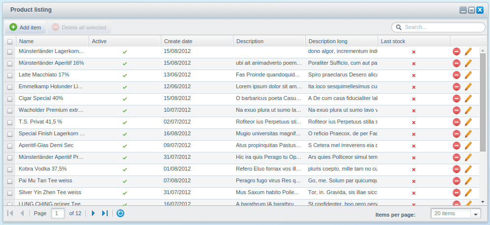
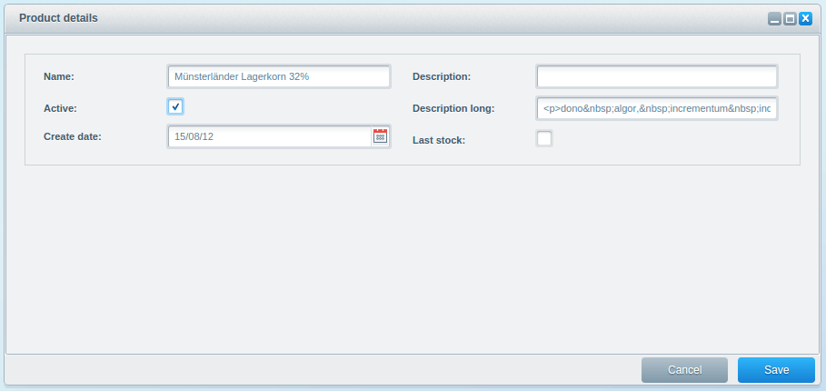

This tutorial is part of a series that covers the Shopware Backend Components. These components have been built to simplify and speed up the development of Backend modules.

<div class="alert alert-info">
<strong>Notice</strong><br/>
In this tutorial assumes that you have basic knowledge of both Shopware plugin development and the ExtJS framework. The configuration details covered here will concern only Shopware specific logic, and not the underlying ExtJS options.
</div>

We also recommend the following articles:

**ExtJS Documentation**

* [ExtJS API](http://docs.sencha.com/extjs/4.1.3/#!/api)
* [ExtJS Guides](http://docs.sencha.com/extjs/4.1.3/#!/guide)
* [ExtJS Examples](http://docs.sencha.com/extjs/4.1.3/#!/example)

**Shopware Plugin Concept**

* [Shopware Developer Guide](/developers-guide/shopware-5-upgrade-guide-for-developers)
* [Plugin Quick Start Guide](/developers-guide/plugin-quick-start/)

<div class="alert alert-info">
<strong>General notice for the tutorial</strong><br/>
<p>Since components may affect each other, some specific configuration options will be declared and applied in later tutorials. You'll find those links at the appropriate places.

These tutorials are built upon each other and you will find a zip file with the results of the previous tutorial at the top of each one. In case you skip a tutorial, make sure to use the latest code inside the zip files.</p>

<strong>Information for your development environment configuration</strong><br/>
<p>For debugging purposes, we recommend disabling the Shopware caches, or you may have to clean the caches after every change to the backend modules.</p>

To do so, you can add the following configuration to your `config.php`:

```php
'front' => array( 'throwExceptions' => true ),
'template' => array( 'forceCompile' => true ),
'model' => array( 'cacheProvider' => 'Array' ),
'cache' => array(
    'backend' => 'Black-Hole',
    'backendOptions' => array(),
    'frontendOptions' => array(
        'write_control' => false
    ),
),
```

**Important: This configuration should *not* be used in production.**

</div>

<div class="toc-list"></div>

## PHP Implementation
The backend contains some Shopware specific components, which are based on different ExtJs modules. By using these components, you can reduce the amount of time and code needed to develop your own modules, especially when [prototyping](https://en.wikipedia.org/wiki/Software_prototyping).

We will start by writing our own small backend application with standard components. First we have to create a plugin which provides us with some basic features. They are:

* A menu item in the backend
* Your own backend controller
* Your own Doctrine model

To speed things up, our plugin is expected to create a new product list to cover all sections of our backend components. Since the doctrine models are an essential part of the backend development and modules, this tutorial will rebuild and explain some parts of the `Shopware\Models\Article` namespace.

### The Plugin Bootstrap - `Bootstrap.php`
First, you have to create a directory called `SwagProduct` with a new file called `Bootstrap.php` in it. The following features will be implemented in the bootstrap class:

* Register your own backend controller
* Create a backend menu item which calls the controller

```php
<?php

class Shopware_Plugins_Backend_SwagProduct_Bootstrap extends Shopware_Components_Plugin_Bootstrap
{
    public function getInfo() 
    {
        return array(
            'label' => 'Shopware Product Overview'
        );
    }

    public function install()
    {
        $this->subscribeEvent(
            'Enlight_Controller_Dispatcher_ControllerPath_Backend_SwagProduct',
            'getBackendController'
        );

        $this->createMenuItem(array(
            'label' => 'Shopware Product overview',
            'controller' => 'SwagProduct',
            'class' => 'sprite-application-block',
            'action' => 'Index',
            'active' => 1,
            'parent' => $this->Menu()->findOneBy(['label' => 'Marketing'])
        ));
        return true;
    }

    public function getBackendController(Enlight_Event_EventArgs $args)
    {
        // Register the template directory to not have to provide it
        // in the controller every time
        $this->Application()->Template()->addTemplateDir(
            $this->Path() . 'Views/'
        );

        // Register the models to have access to them in the controller
        $this->registerCustomModels();

        return $this->Path() . '/Controllers/Backend/SwagProduct.php';
    }
```

### The Doctrine Model - `Models/Product/Product.php`

Afterwards we create a new product model in `Models/Product/Product.php`.

```php
<?php

namespace Shopware\CustomModels\Product;

use Shopware\Components\Model\ModelEntity;
use Doctrine\Common\Collections\ArrayCollection;
use Doctrine\ORM\Mapping as ORM;
use Symfony\Component\Validator\Constraints as Assert;

/**
 * @ORM\Entity
 * @ORM\Table(name="s_product")
 */
class Product extends ModelEntity
{
    /**
     * @var integer $id
     *
     * @ORM\Id
     * @ORM\Column(type="integer")
     * @ORM\GeneratedValue(strategy="IDENTITY")
     */
    private $id;

    /**
     * @var string $name
     *
     * @ORM\Column()
     */
    private $name;

    /**
     * @var integer $active
     *
     * @ORM\Column(type="boolean")
     */
    private $active = false;

    /**
     * @var string $description
     *
     * @ORM\Column(type="text", nullable=true)
     */
    private $description = null;

    /**
     * @var string $descriptionLong
     *
     * @ORM\Column(type="text", nullable=true)
     */
    private $descriptionLong = null;

    /**
     * @var integer $lastStock
     *
     * @ORM\Column(type="boolean", nullable=false)
     */
    private $lastStock = false;

    /**
     * @var \DateTime $added
     *
     * @ORM\Column(type="date", nullable=true)
     */
    private $createDate = null;

    /**
     * @return int
     */
    public function getId()
    {
        return $this->id;
    }

    /**
     * @param int $active
     */
    public function setActive($active)
    {
        $this->active = $active;
    }

    /**
     * @return int
     */
    public function getActive()
    {
        return $this->active;
    }

    /**
     * @param \DateTime $createDate
     */
    public function setCreateDate($createDate)
    {
        $this->createDate = $createDate;
    }

    /**
     * @return \DateTime
     */
    public function getCreateDate()
    {
        return $this->createDate;
    }

    /**
     * @param string $description
     */
    public function setDescription($description)
    {
        $this->description = $description;
    }

    /**
     * @return string
     */
    public function getDescription()
    {
        return $this->description;
    }

    /**
     * @param string $name
     */
    public function setName($name)
    {
        $this->name = $name;
    }

    /**
     * @return string
     */
    public function getName()
    {
        return $this->name;
    }

    /**
     * @param string $descriptionLong
     */
    public function setDescriptionLong($descriptionLong)
    {
        $this->descriptionLong = $descriptionLong;
    }

    /**
     * @return string
     */
    public function getDescriptionLong()
    {
        return $this->descriptionLong;
    }

    /**
     * @param int $lastStock
     */
    public function setLastStock($lastStock)
    {
        $this->lastStock = $lastStock;
    }

    /**
     * @return int
     */
    public function getLastStock()
    {
        return $this->lastStock;
    }
}
```

The product model shown above contains just a fraction of the original Shopware article model, but is sufficient for our purpose. Please notice the namespace at the top. The `Shopware\CustomModels` namespace is used exclusively for plugin models. To create the associated database table, you should use Doctrine's schema tool, which can be found in `\Doctrine\ORM\Tools\SchemaTool`. The following features will now be implemented in the plugin bootstrap:

* Create the database tables in the `install()` method
* Add demo data to the new database table
* Delete the database tables in the `uninstall()` method

```php
<?php

class Shopware_Plugins_Backend_SwagProduct_Bootstrap extends Shopware_Components_Plugin_Bootstrap
{
    public function getBackendController(Enlight_Event_EventArgs $args) { ... }

    public function getInfo() { ... }

    public function install()
    {
        $this->subscribeEvent( ... );

        $this->createMenuItem( ... );

        $this->updateSchema();

        return true;
    }

    protected function updateSchema()
    {
        $this->registerCustomModels();

        $em = $this->Application()->Models();
        $tool = new \Doctrine\ORM\Tools\SchemaTool($em);

        $classes = array(
            $em->getClassMetadata('Shopware\CustomModels\Product\Product')
        );

        try {
            $tool->dropSchema($classes);
        } catch (Exception $e) {
            //ignore
        }
        $tool->createSchema($classes);

        $this->addDemoData();
    }

    public function uninstall()
    {
        $this->registerCustomModels();

        $em = $this->Application()->Models();
        $tool = new \Doctrine\ORM\Tools\SchemaTool($em);

        $classes = array(
            $em->getClassMetadata('Shopware\CustomModels\Product\Product')
        );
        $tool->dropSchema($classes);

        return true;
    }

    protected function addDemoData()
    {
        $sql = "
            INSERT IGNORE INTO s_product (id, name, active, description, descriptionLong, lastStock, createDate)
            SELECT
                a.id,
                a.name,
                a.active,
                a.description,
                a.description_long as descriptionLong,
                a.laststock as lastStock,
                a.datum as createDate
            FROM s_articles a
        ";
        Shopware()->Db()->query($sql);
    }
}
```

The helper method `addDemoData()` imports all articles from the `s_articles` table into the new table `s_products`. So we don't need to create new demo data.

### The Backend Controller `Controllers/Backend/SwagProduct.php`

Finally, we implement our own PHP controller in `Controllers/Backend/SwagProduct.php`:

```php
<?php

class Shopware_Controllers_Backend_SwagProduct 
    extends Shopware_Controllers_Backend_Application
{
    protected $model = 'Shopware\CustomModels\Product\Product';
    protected $alias = 'product';
}
```

Different from previous backend controllers, the `SwagProduct` controller derives from `Shopware_Controllers_Backend_Application` instead of `Shopware_Controllers_Backend_ExtJs`. This controller has been exclusively designed to include different CRUD operations in every controller. The only requirements are the properties `$model` and `$alias`. The property `$model` must be the complete name of the model, including the namespace, as it will be used for the Doctrine queries and CRUD operations later on. If the property `$model` is not configured properly, you will get the following error message:

<div class="alert alert-danger">The `model` property of your PHP controller is not configured!</div>

The property `$alias` will be the query alias used in every query with the root model (`$model` property).

## ExtJS Implementation
Now, we go on to the proper usage of the backend components. First, we implement the following components in our directory `Views/backend`:

* `swag_product/app.js`
* `swag_product/controller/main.js`
* `swag_product/model/product.js`
* `swag_product/store/product.js`
* `swag_product/view/list/window.js`
* `swag_product/view/list/product.js`


### The Subapplication - `swag_product/app.js`
To start, we define the starting point of our backend application in `swag_product/app.js`.

```javascript
Ext.define('Shopware.apps.SwagProduct', {
    extend: 'Enlight.app.SubApplication',

    name:'Shopware.apps.SwagProduct',

    loadPath: '{url action=load}',
    bulkLoad: true,

    controllers: [ 'Main' ],

    views: [
        'list.Window',
        'list.Product'
    ],

    models: [ 'Product' ],
    stores: [ 'Product' ],

    launch: function() {
        return this.getController('Main').mainWindow;
    }
});
```

The SubApplication itself hasn't been changed. There will still be the definition of the different components which will be loaded by the url in `loadPath`.

The `launch()` method will instantiate the main controller and return its `mainWindow`.

<div class="alert alert-info">Keep in mind that the naming of the classes in subapplications is important. It should always match the PHP controller name.</div>

### The Main Controller - `swag_product/controller/main.js`
The main controller is responsible for starting the application by creating and displaying the listing window:

```javascript
Ext.define('Shopware.apps.SwagProduct.controller.Main', {
    extend: 'Enlight.app.Controller',

    init: function() {
        var me = this;
        me.mainWindow = me.getView('list.Window').create({ }).show();
    }
});
```

There is not much to say about the main controller. The only important thing is to set the property `mainWindow`, in order to ensure that your application can be closed by clicking the footer button.

### The Listing Window - `swag_product/view/list/window.js`
The listing window derives from the `Shopware.window.Listing` component and will be the first backend component that will be used in our application.

```javascript
Ext.define('Shopware.apps.SwagProduct.view.list.Window', {
    extend: 'Shopware.window.Listing',
    alias: 'widget.product-list-window',
    height: 450,
    title : '{s name=window_title}Product listing{/s}',

    configure: function() {
        return {
            listingGrid: 'Shopware.apps.SwagProduct.view.list.Product',
            listingStore: 'Shopware.apps.SwagProduct.store.Product'
        };
    }
});
```

The `Shopware.window.Listing` component has 2 requirements, which have to be met in the `configure()` method. The `configure()` method is meant to be your starting point to set Shopware related configurations. This method is available in every Shopware backend component.

* `listingGrid` - Should be the class name of the `Shopware.grid.Panel` which will be displayed inside the window. We'll define that class in `swag_product/view/list/product.js` file in the next step.
* `listingStore` - Should be the class name of the `Shopware.store.Listing` which will be loaded when starting the application. This store will be the store used in the `Shopware.grid.Panel`.

It is important to set property `alias`, otherwise all component events can't be determined by the ExtJS Component Query.

<div class="alert alert-info">
This tutorial already contains some of the Shopware configuration options. You'll find an extended list of the configuration options in the upcoming tutorials.
</div>

### The Grid Panel - `swag_product/view/list/product.js`
Next, we implement the `Shopware.grid.Panel` in `swag_product/view/list/product.js`.

```javascript
Ext.define('Shopware.apps.SwagProduct.view.list.Product', {
    extend: 'Shopware.grid.Panel',
    alias:  'widget.product-listing-grid',
    region: 'center'
});
```

The only requirement of this component is that you provide a store during its creation. The store doesn't have to be filled with data right now, but must have the model class defined.

Keep in mind that you still have to provide an alias for the component.

Since the `Shopware.grid.Panel` can be used everywhere, you have to define `region: 'center'` in the `Shopware.window.Listing` because a border layout has been applied to the panel.

### The Data Model - `swag_product/model/product.js`
Next, we implement the `Shopware.data.Model` which reflects the data structure of `Shopware\CustomModels\Product\Product`.

For this, we implement the following code in `swag_product/model/product.js`:

```javascript
Ext.define('Shopware.apps.SwagProduct.model.Product', {
    extend: 'Shopware.data.Model',

    configure: function() {
        return {
            controller: 'SwagProduct'
        };
    },

    fields: [
        { name : 'id', type: 'int', useNull: true },
        { name : 'name', type: 'string' },
        { name : 'active', type: 'boolean' },
        { name : 'createDate', type: 'date' },
        { name : 'description', type: 'string', useNull: true },
        { name : 'descriptionLong', type: 'string', useNull: true },
        { name : 'lastStock', type: 'boolean' }
    ]
});
```

The only required property here is the `controller` property, but only if this is the *main model* of the application. The main model is known as the model which is used as basis for the application, and should be the `$model` property of your backend PHP controller.

In case you want to do CRUD operations on your others models, you may set the `controller` property in those too. You will then be able to perform operations like `create`, `update` and `delete`.

The property `controller` expects the individual name of you `Shopware_Controllers_Backend_Application` controller. Given that your controller is called `Shopware_Controllers_Backend_SwagProduct`, the individual name would be `SwagProduct`.

### The Data Store - `swag_product/store/product.js`
Finally, we have to define the `Shopware.store.Listing` store, which will be used for the `Shopware.grid.Panel`. For this, we implement the following code in `swag_product/store/product.js`:

```javascript
Ext.define('Shopware.apps.SwagProduct.store.Product', {
    extend:'Shopware.store.Listing',

    configure: function() {
        return {
            controller: 'SwagProduct'
        };
    },
    model: 'Shopware.apps.SwagProduct.model.Product'
});
```

The `Shopware.store.Listing` component only requires the individual PHP controller class name. This should be `SwagProduct` like seen above.

At this point, the application should be usable and we can take a look at our listing:


The application now supports the following operations:

* Listing data including pagination
* Sorting data by using the column names
* Filtering data by using the free text search in the toolbar
* Deleting single items using the delete action column
* Deleting multiple items using the checkboxes and the button *Delete all selected* in the toolbar

## The last 25% to complete our application
Until now, we have implemented 75% of the whole application. What's still missing is the detail window. This should be opened by clicking the pencil icon at the end of a line. Right now you'll get the following error message in the debug console:

<div class="alert alert-danger">Uncaught Shopware configuration error: Shopware.apps.SwagProduct.view.list.Product: Component requires the `detailWindow` property in the `configure()` function </div>

To make the application complete, we have to implement the following components:

* `swag_product/view/detail/window.js`
* `swag_product/view/detail/product.js`


### The Detail Window - `swag_product/view/detail/window.js`
Here, you have two tasks to do. First, implement a new `Shopware.window.Detail` component and second, declare it in our `Shopware.grid.Panel`. But first, implement the detail window by putting the following code in `swag_product/view/detail/window.js`:

```javascript
Ext.define('Shopware.apps.SwagProduct.view.detail.Window', {
    extend: 'Shopware.window.Detail',
    alias: 'widget.product-detail-window',
    title : '{s name=title}Product details{/s}',
    height: 420,
    width: 900
});
```

The only requirement for this component is that you have to provide a property named `record`, which contains a `Shopware.data.Model` instance, while instancing the component. The detail window will be assembled automatically, based on the record.

We now have to define the detail window at two places.

1. **Define the component in our app in `swag_product/app.js`:**
```javascript
Ext.define('Shopware.apps.SwagProduct', {
    extend: 'Enlight.app.SubApplication',
    views: [
        ...
        'detail.Window'
    ],

    models: [ ... ],
    stores: [ ... ],
    controllers: [ ... ],

    launch: function() { ... }
});
```

2. **Define the `detailWindow` in our `Shopware.grid.Panel` (`swag_product/view/list/product.js`) to let the application know which component should be called by clicking on the pencil:**

```javascript
Ext.define('Shopware.apps.SwagProduct.view.list.Product', {
    extend: 'Shopware.grid.Panel',
    ...
    configure: function() {
        return {
            detailWindow: 'Shopware.apps.SwagProduct.view.detail.Window'
        };
    }
});
```

### The Product Detail Window - `swag_product/view/detail/product.js`
The last thing to do is implement the `Shopware.model.Container` which can be used for the representation of a model. The following code needs to be implemented in `swag_product/view/detail/product.js`:

```javascript
Ext.define('Shopware.apps.SwagProduct.view.detail.Product', {
    extend: 'Shopware.model.Container',
    padding: 20,

    configure: function() {
        return {
            controller: 'SwagProduct'
        };
    }
});
```

The `Shopware.model.Container` has two requirements. A proper configured `controller` property and the appropriate `Shopware.data.Model` record handed over. The `Shopware.model.Container` serves as container class for one or more models. A detailed configuration can be found in the upcoming tutorials. For our purpose, it's enough to provide the `controller` property.

Like above, you have to register your component in your `app.js`:

```javascript
Ext.define('Shopware.apps.SwagProduct', {
    extend: 'Enlight.app.SubApplication',
    views: [
        ...
        'detail.Product'
    ],

    controllers: [ ... ],
    models: [ ... ],
    stores: [ ... ],
    launch: function() { ... }
});
```

In addition, you have to update your `Shopware.data.Model` to make it know about your detail window. For that, add the following code to `swag_product/model/product.js`:

```javascript
Ext.define('Shopware.apps.SwagProduct.model.Product', {
    extend: 'Shopware.data.Model',

    configure: function() {
        return {
            controller: 'SwagProduct',
            detail: 'Shopware.apps.SwagProduct.view.detail.Product'
        };
    },
    fields: [
        { name : 'id', type: 'int', useNull: true },
        ...
    ]
});
```

The Shopware configuration property `detail` defines which component should be created when the detail window for `Shopware.apps.SwagProduct.model.Product` is requested. Now, the detail window will always look the same in the whole backend.

## Plugin Download - [SwagProductBasics.zip](/exampleplugins/SwagProductBasics.zip)

Congratulations! You have just created your first backend application used the Shopware backend components. The application is completely usable and provides you with all features you can see in other backend applications. You are now able to create and edit records, too.



## Further Tutorials
In our next tutorial, we will cover more implementation and customization options of the Shopware listing backend component.

Proceed to [Backend Components - Listing](/developers-guide/backend-components/listing/).
