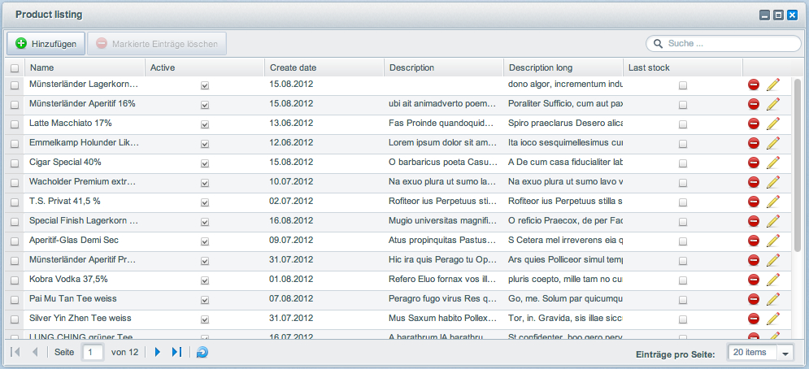

Die nachfolgenden Tutorials befassen sich mit den Standard Backend Komponenten von Shopware. Diese Komponenten wurden entworfen, um die Entwicklung von Backend Modulen einfacher und schneller zu gestalten.

<div class="alert alert-info">
	<strong>Hinweis</strong><br/>
	Sollten Sie sich bisher noch nicht mit Ext JS und der Plugin Entwicklung von Shopware ausseinander gesetzt haben, empfehlen wir Ihnen sich vorher die Grundlagen der Plugin Entwicklung anzueignen. Zudem sollte Sie sich bereits mit dem Ext JS Framework von Sencha ausseinander gesetzt haben, da in diesen Tutorials nicht auf die Konfigurationsmöglichkeiten der Ext JS Komponenten eingegangen wird sondern auf die Konfiguration die Shopware zur Verfügung stellt.
</div>

Wir empfehlen Ihnen hierzu die folgenden Artikel:

**Ext JS Dokumentationen**

* [Ext JS API](http://docs.sencha.com/extjs/4.1.2/#!/api)
* [Ext JS Guides](http://docs.sencha.com/extjs/4.1.2/#!/guide)
* [Ext JS Examples](http://docs.sencha.com/extjs/4.1.2/#!/example)

**Shopware Plugin Grundkonzept**

* [Shopware Developer Guide](/developers-guide/shopware-5-upgrade-guide-for-developers)
* [Plugin Grundlagen](http://community.shopware.com/Grundlagen_cat_866.html)
* [Plugin Beispiele](http://community.shopware.com/Beispiele_cat_868.html)

<div class="alert alert-info">
	<strong>Allgemeiner Hinweis zu den Tutorials</strong><br/>
<p>Da die Komponenten untereinander Auswirkungen haben können, werden bestimmte Konfigurationsmöglichkeiten erst in späteren Tutorials erklärt und angewendet. Dazu finden Sie an den entsprechenden Stellen Links zu den weiterführenden Tutorials.
Die Tutorials sind aufeinander aufbauend, am Anfang jedes Tutorials finden Sie einen Download Link zur Zip Datei des letzten Tutorial Ergebnisses. Sollten Sie sich dafür entscheiden Tutorials zu überspringen, stellen Sie bitte sicher, dass Sie immer mit der Vorgänger Version des Plugins arbeiten.</p>
	<strong>Hinweis zur Konfiguration der Entwicklungsumgebung</strong><br/>
<p>Wir empfehlen Ihnen in Ihrer Entwicklungsumgebung zu Debugzwecken die Shopware Caches zu deaktivieren, da Sie sonst bei jeder Änderung in Backend Modulen die Caches vorher löschen müssten, damit Ihre Änderungen greifen.</p>
	
Hierfür können Sie folgende Konfiguration in der config.php hinzufügen:

```php
'front' => array( 'noErrorHandler' => true, 'throwExceptions' => true ),
'template' => array( 'forceCompile' => true ),
'model' => array( 'cacheProvider' => 'Array' ),
'cache' => array(
    'backend' => 'Black-Hole',
    'backendOptions' => array(),
    'frontendOptions' => array(
        'write_control' => false
    ),
),
```

**Wichtig: Die hier empfohlene Konfiguration ist nicht für Produktivsysteme geeignet!**

</div>

## PHP Implementierung
Weiter im Text. Die Backend Komponenten beinhalten bestimmte Shopware Standards, die aus einer Schnittmenge der verschiedenen bestehenden Backend Module zusammen gestellt wurden. Die Auslagerung dieser Standards in eigene Komponenten reduziert die Anzahl an benötigten Source Code Zeilen für einzelne Komponenten um ein vielfaches. Vor allem im Bereich <a href="http://de.wikipedia.org/wiki/Prototyping_(Softwareentwicklung)" target="_blank">Prototyping</a> lässt sich ein extremer Zeitgewinn nachweisen.

Soweit, so gut, fangen wir an eine kleine eigene Backend Applikation mit den Standard Komponenten zu schreiben. 
Zunächst einmal müssen wir uns ein Plugin erstellen, welches uns bestimmte Grundvorraussetzungen bereit stellt um eine Backend Applikation zu schreiben. Dies wären:

* Menü Punkt im Backend
* Eigenen Backend Controller
* Eigenes Doctrine Model

Damit wir sämtliche Bereiche der Standard Komponenten abdecken können, ohne uns wilde Datenkonstrukte ausdenken zu müssen, erstellen wir in unserem Plugin eine neue Produkt Liste für das Backend. Da die Doctrine Models ein essentieller Bestandadteil der Backend Entwicklung und auch der Standard Komponenten sind, werden in diesem Tutorial bestimmte Doctrine Models des <code>Shopware\Models\Article</code> Namepaces nachgebaut und erläutert.

### Die Plugin Bootstrap `SwagProduct/Bootstrap.php`
Zunächst wird der Plugin Ordner `SwagProduct` mit einer Bootstrap.php Datei darin erstellt. Innerhalb der Bootstrap Klasse implementieren wir folgende Funktionalitäten:

* Eigenen Backend Controller Registrieren
* Backend Menü Eintrag erstellen welcher den Controller aufruft

```php
<?php

class Shopware_Plugins_Backend_SwagProduct_Bootstrap extends Shopware_Components_Plugin_Bootstrap
{
    public function getInfo() 
    {
        return array(
            'label' => 'Shopware Produktübersicht'
        );
    }

    public function install()
    {
        $this->subscribeEvent(
            'Enlight_Controller_Dispatcher_ControllerPath_Backend_SwagProduct',
            'getBackendController'
        );

        $this->createMenuItem(array(
            'label' => 'Shopware Produktübersicht',
            'controller' => 'SwagProduct',
            'class' => 'sprite-application-block',
            'action' => 'Index',
            'active' => 1,
            'parent' => $this->Menu()->findOneBy('label', 'Marketing')
        ));
        return true;
    }

    public function getBackendController(Enlight_Event_EventArgs $args)
    {
        //Registrierung des Template Verzeichnisses, 
        //damit dieses im Controller nicht immer angegeben werden muss.
        $this->Application()->Template()->addTemplateDir(
            $this->Path() . 'Views/'
        );

        //Registrierung der Plugin Models damit diese immer im Controller zur Verfügung stehen
        $this->registerCustomModels();

        return $this->Path() . '/Controllers/Backend/SwagProduct.php';
    }
```

### Das Doctrine Model `SwagProduct/Models/Product/Product.php`

Anschließend erstellen wir uns ein neues Product Model in der Datei `SwagProduct/Models/Product/Product.php`.
```php
<?php

namespace Shopware\CustomModels\Product;

use Shopware\Components\Model\ModelEntity;
use Doctrine\Common\Collections\ArrayCollection;
use Doctrine\ORM\Mapping as ORM;
use Symfony\Component\Validator\Constraints as Assert;

/**
 * @ORM\Entity
 * @ORM\Table(name="s_product")
 */
class Product extends ModelEntity
{
    /**
     * @var integer $id
     *
     * @ORM\Id
     * @ORM\Column(type="integer")
     * @ORM\GeneratedValue(strategy="IDENTITY")
     */
    private $id;

    /**
     * @var string $name
     *
     * @ORM\Column()
     */
    private $name;

    /**
     * @var integer $active
     *
     * @ORM\Column(type="boolean")
     */
    private $active = false;

    /**
     * @var string $description
     *
     * @ORM\Column(type="text", nullable=true)
     */
    private $description = null;

    /**
     * @var string $descriptionLong
     *
     * @ORM\Column(type="text", nullable=true)
     */
    private $descriptionLong = null;

    /**
     * @var integer $lastStock
     *
     * @ORM\Column(type="boolean", nullable=false)
     */
    private $lastStock = false;

    /**
     * @var \DateTime $added
     *
     * @ORM\Column(type="date", nullable=true)
     */
    private $createDate = null;

    /**
     * @return int
     */
    public function getId()
    {
        return $this->id;
    }


    /**
     * @param int $active
     */
    public function setActive($active)
    {
        $this->active = $active;
    }

    /**
     * @return int
     */
    public function getActive()
    {
        return $this->active;
    }

    /**
     * @param \DateTime $createDate
     */
    public function setCreateDate($createDate)
    {
        $this->createDate = $createDate;
    }

    /**
     * @return \DateTime
     */
    public function getCreateDate()
    {
        return $this->createDate;
    }

    /**
     * @param string $description
     */
    public function setDescription($description)
    {
        $this->description = $description;
    }

    /**
     * @return string
     */
    public function getDescription()
    {
        return $this->description;
    }

    /**
     * @param string $name
     */
    public function setName($name)
    {
        $this->name = $name;
    }

    /**
     * @return string
     */
    public function getName()
    {
        return $this->name;
    }

    /**
     * @param string $descriptionLong
     */
    public function setDescriptionLong($descriptionLong)
    {
        $this->descriptionLong = $descriptionLong;
    }

    /**
     * @return string
     */
    public function getDescriptionLong()
    {
        return $this->descriptionLong;
    }

    /**
     * @param int $lastStock
     */
    public function setLastStock($lastStock)
    {
        $this->lastStock = $lastStock;
    }

    /**
     * @return int
     */
    public function getLastStock()
    {
        return $this->lastStock;
    }
}
```

Das hier angelegt Product Model beinhaltet nur einen Bruchteil des eigentlichen Shopware Artikel Models, jedoch ist der Bestandteil ausreichend für unsere Zwecke. Hier zu beachten ist der Model Namespace der auf `Shopware\CustomModels` verweist. Dieser Namespace ist ausschließlich für Plugin Models reserviert. Um die zugehörigen Datenbanktabellen zu erstellen, kann das Schema Tool von Doctrine verwendet werden. Dieser steht unter `\Doctrine\ORM\Tools\SchemaTool` zur Verfügung. In der Plugin Bootstrap werden nun die folgenden Funktionalitäten implementiert:

* Anlegen der Datenbanktabellen in der `install()` Funktion
* Löschen der Datenbanktabellen in der `uninstall()` Funktion
* Hinzufügen von Demodaten in die neue Datenbanktabelle

```php
<?php

class Shopware_Plugins_Backend_SwagProduct_Bootstrap extends Shopware_Components_Plugin_Bootstrap
{
    public function getBackendController(Enlight_Event_EventArgs $args) { ... }

    public function getInfo() { ... }

    public function install()
    {
        $this->subscribeEvent( ... );

        $this->createMenuItem( ... );

        $this->updateSchema();

        return true;
    }

    protected function updateSchema()
    {
        $this->registerCustomModels();

        $em = $this->Application()->Models();
        $tool = new \Doctrine\ORM\Tools\SchemaTool($em);

        $classes = array(
            $em->getClassMetadata('Shopware\CustomModels\Product\Product')
        );

        try {
            $tool->dropSchema($classes);
        } catch (Exception $e) {
            //ignore
        }
        $tool->createSchema($classes);

        $this->addDemoData();
    }

    public function uninstall()
    {
        $this->registerCustomModels();

        $em = $this->Application()->Models();
        $tool = new \Doctrine\ORM\Tools\SchemaTool($em);

        $classes = array(
            $em->getClassMetadata('Shopware\CustomModels\Product\Product')
        );
        $tool->dropSchema($classes);

        return true;
    }

    protected function addDemoData()
    {
        $sql = "
            INSERT IGNORE INTO s_product (id, name, active, description, descriptionLong, lastStock, createDate)
            SELECT
                a.id,
                a.name,
                a.active,
                a.description,
                a.description_long as descriptionLong,
                a.laststock as lastStock,
                a.datum as createDate
            FROM s_articles a
        ";
        Shopware()->Db()->query($sql);
    }
}
```

Die Helfer Funktion `addDemoData()` importiert die Shopware Artikel aus der `s_articles` in die neue Tabelle `s_products`. So brauchen wir uns um Testdaten keine Gedanken machen. 

### Der Backend Controller `SwagProduct/Controllers/Backend/SwagProduct.php`

Zuletzt implementieren wir nun noch einen PHP Controller in der Datei `SwagProduct/Controllers/Backend/SwagProduct.php`:

```php
<?php

class Shopware_Controllers_Backend_SwagProduct 
    extends Shopware_Controllers_Backend_Application
{
    protected $model = 'Shopware\CustomModels\Product\Product';
    protected $alias = 'product';
}
```

Anders als in bisherigen Backend Controllern leitet sich der SwagProduct Controller nicht vom `Shopware_Controllers_Backend_ExtJs` ab, sondern von einem neuen Backend Controller namens `Shopware_Controllers_Backend_Application`. Dieser Controller wurde speziell für die Shopware Backend Komponenten entwickelt um bestimmte CRUD Operationen bereits vorgefertigt mit zu liefern.
Die einzigen Requirements die dieser neue Controller hat, sind die Properties `$model` und `$alias`. Das `$model` Property muss den vollständigen Namen des Models beinhalten. Über diesen Namen werden später die Doctrine Queries und CRUD Operationen ausgeführt. Sollte das `$model` Property nicht konfiguriert sein, erhalten Sie eine Fehlermeldung:

<div class="alert alert-danger">The `model` property of your PHP controller is not configured!</div>

Das `$alias` Property wird als Query Alias für das Root Model (`$model` Property) in jedem Query Builder verwendet. Dieser kann nach belieben frei gewählt werden.

<h2>Ext JS Implementierung</h2>
Nun kommen wir zu der Implementierung der eigentlichen Shopware Backend Komponenten. Für das Backend Module implementieren wir zunächst die folgenden Komponenten im Ordner `SwagProduct/Views/backend`.

* `swag_product/app.js`
* `swag_product/controller/main.js`
* `swag_product/model/product.js`
* `swag_product/store/product.js`
* `swag_product/view/list/window.js`
* `swag_product/view/list/product.js`


### Die Subapplikation - `swag_product/app.js`
Als erstes definieren wir die `swag_product/app.js` denn hier wird unsere Backend Applikation definiert und gestartet.

```javascript
Ext.define('Shopware.apps.SwagProduct', {
    extend: 'Enlight.app.SubApplication',

    name:'Shopware.apps.SwagProduct',

    loadPath: '{url action=load}',
    bulkLoad: true,

    controllers: [ 'Main' ],

    views: [
        'list.Window',
        'list.Product'
    ],

    models: [ 'Product' ],
    stores: [ 'Product' ],

    launch: function() {
        return this.getController('Main').mainWindow;
    }
});
```

An der SubApplication hat sich nichts geändert. Hier werden wie immer die verschiedenen Komponenten der Subapplikation definiert und über die `loadPath` Url geladen. 

In der `launch` Methode der Applikation wird dann der Main Controller instanziert und das Property `mainWindow` des Controllers wird als Rückgabewert gesetzt.

<div class="alert alert-info">Wichtig bei Subapplikation ist vor allem das Naming der Klasse. Der Klassenname sollte dem PHP Controller Namen entsprechen.</div>

### Der Main Controller `swag_product/controller/main.js`
Der Main Controller ist für den Applikationsstart verantwortlich und soll die Aufgabe übernehmen das Listing Window zu instanzieren und anzuzeigen:

```javascript
Ext.define('Shopware.apps.SwagProduct.controller.Main', {
    extend: 'Enlight.app.Controller',

    init: function() {
        var me = this;
        me.mainWindow = me.getView('list.Window').create({ }).show();
    }
});
```

Zu dem Main Controller gibt es nicht viel zu sagen. Hier ist nur wichtig, dass das Property `mainWindow` gesetzt wird, damit die Applikation auch sauber über den Footer Button beendet werden kann.

### Das Listing Window `swag_product/view/list/window.js`
Das Listing Window ist die erste Shopware Standard Komponete die in unserer Applikation zum Einsatz kommt. Diese leitet sich von der Komponente `Shopware.window.Listing` ab. 

```javascript
Ext.define('Shopware.apps.SwagProduct.view.list.Window', {
    extend: 'Shopware.window.Listing',
    alias: 'widget.product-list-window',
    height: 450,
    title : '{s name=window_title}Product listing{/s}',

    configure: function() {
        return {
            listingGrid: 'Shopware.apps.SwagProduct.view.list.Product',
            listingStore: 'Shopware.apps.SwagProduct.store.Product'
        };
    }
});
```

Die `Shopware.window.Listing` Komponenten besitzt zwei Requirements, welche in der `configure()` Funktion gesetzt werden müssen. Die `configure()` Funktion dient als Einstiegspunkt um die Shopware Konfigurationen einer Komponente zu setzen. Diese Funktion steht Ihnen in allen Shopware Backend Komponenten zur Verfügung.

* `listingGrid` - Klassenname des `Shopware.grid.Panel` welches im Fenster angezeigt werden soll > In unserem Fall wird diese Klasse gleich unter `swag_product/view/list/product.js` definiert
* `listingStore` - Klassenname des `Shopware.store.Listing` Stores, welcher bei Applikationsstart geladen werden soll und als Store für das `Shopware.grid.Panel` dient.


Wichtig bei der Komponente ist, dass ein `alias` vergeben wird, da die Komponentenevents sonst nicht über die Ext JS Component Query ermittelt werden können.

<div class="alert alert-info">
In diesem Tutorial werden bereits bestimmte Shopware Konfiguration angesprochen, eine Auflistung aller Verfügbaren Shopware Konfigurationen einer Komponente finden Sie in weiterführenden Tutorials.
</div>

### Das Grid Panel `swag_product/view/list/product.js`
Als nächstes wird das `Shopware.grid.Panel` in der Datei `swag_product/view/list/product.js` implementiert. 

```javascript
Ext.define('Shopware.apps.SwagProduct.view.list.Product', {
    extend: 'Shopware.grid.Panel',
    alias:  'widget.product-listing-grid',
    region: 'center'
});
```

Diese Komponente besitzt als einziges Requirement, dass beim erstellen der Komponenten ein Store übergeben wird. Dieser muss zum Erstellungszeitpunkt des Grids nicht einmal mit Daten befüllt sein, sondern nur eine Model Klasse konfiguriert haben.

Auch hier ist es wichtig, einen Komponenten Alias zu vergeben, da sonst die Komponentenevents nicht von den entsprechenden Controllern abgefangen werden können.

Da das `Shopware.grid.Panel` überall verwendet werden kann, muss in diesem Fall die `region: 'center'` hinterlegt werden, da das `Shopware.window.Listing` ein Border Layout zugewiesen bekommen hat.

### Das Data Model `swag_product/model/product.js`
Als nächstes implementieren wir das `Shopware.data.Model` welches die Datenstruktur des `Shopware\CustomModels\Product\Product` wieder spiegelt.

Hierfür implementieren wir folgenden Source Code in der `swag_product/model/product.js` Datei:

```javascript
Ext.define('Shopware.apps.SwagProduct.model.Product', {
    extend: 'Shopware.data.Model',

    configure: function() {
        return {
            controller: 'SwagProduct'
        };
    },

    fields: [
        { name : 'id', type: 'int', useNull: true },
        { name : 'name', type: 'string' },
        { name : 'active', type: 'boolean' },
        { name : 'createDate', type: 'date' },
        { name : 'description', type: 'string', useNull: true },
        { name : 'descriptionLong', type: 'string', useNull: true },
        { name : 'lastStock', type: 'boolean' }
    ]
});
```

Das `Shopware.data.Model` besitzt als einziges Requirement das `controller` Property. Dies jedoch auch nur, wenn es sich um das `Hauptmodel` der Applikation handelt. Als `Hauptmodel` bezeichnet man das Model, welches als Grundlage für die Applikation dient und auch im `Shopware_Controller_Backend_Applikation` Controller im `$model` Property konfiguriert wurde.

Sollte es sich nicht um das `Hauptmodel` handeln, muss das `controller` Property nicht gesetzt werden. 
Sollte das `controller` Property gesetzt sein, so stehen auf dem Model die CRUD Operationen `create`, `update`, `delete` zur Verfügung.

Das controller Property erwartet als Wert den Namen des `Shopware_Controllers_Backend_Application` Controllers. Hier ist wichtig, dass nur der individuelle Namensteil des Controllers angeben wird. Der Plugin Controller heißt vollständig: `Shopware_Controllers_Backend_SwagProduct`, daher muss als Wert `SwagProduct` gesetzt werden. 

### Der Data Store - `swag_product/store/product.js`
Zuletzt müssen wir noch den `Shopware.store.Listing` Store definieren, welches als Grid Store für das `Shopware.grid.Panel` verwendet wird. Hierfür implementieren wir folgenden Source Code in der `swag_product/store/product.js` Datei:

```javascript
Ext.define('Shopware.apps.SwagProduct.store.Product', {
    extend:'Shopware.store.Listing',

    configure: function() {
        return {
            controller: 'SwagProduct'
        };
    },
    model: 'Shopware.apps.SwagProduct.model.Product'
});
```

Die `Shopware.store.Listing` Komponente besitzt als einziges Requirement den PHP Controller Klassennamen. Als Wert wird der letzte Teil des Controllernamens angegeben. 

Ab diesem Zeitpunkt ist die Applikation lauffähig und wir können uns das Listing bereits ansehen:


Die Applikation unterstützt nun die folgenden Operationen:

* Laden der Listing Daten + Paginierung
* Sortierung des Listings über die Spaltenheader
* Filter des Listings über die Freitextsuche in der Toolbar
* Löschen von einzelnen Datensätzen über die Delete Action Column
* Löschen von mehreren Datensätzen über den Markierte Einträge löschen Button in der Toolbar


## Die letzten 25% zur vollständigen Applikation
Damit haben wir unsere Backend Applikation zu 75% implementiert. Was noch fehlt ist die Detailseite. Dies wird erkenntlich beim Klick auf das Stift Icon am Ende jeder Zeile. Hier erscheint die folgende Fehlermeldung in der Debugkonsole:

<div class="alert alert-danger">Uncaught Shopware configuration error: Shopware.apps.SwagProduct.view.list.Product: Component requires the `detailWindow` property in the `configure()` function </div>


Damit die Applikation vollständig ist müssen wir die folgenden Komponenten implementieren:

* `swag_product/view/detail/window.js`
* `swag_product/view/detail/product.js`


### Das Detail Window `swag_product/view/detail/window.js`
Als nächstes implementieren wir nun das `Shopware.window.Detail` dies muss nicht nur als Komponente registriert werden sondern auch noch im `Shopware.grid.Panel` hinterlegt werden. Zunächst implementieren wir das Detail Window in dem wir folgenden Source Code in die `swag_product/view/detail/window.js` einfügen:

```javascript
Ext.define('Shopware.apps.SwagProduct.view.detail.Window', {
    extend: 'Shopware.window.Detail',
    alias: 'widget.product-detail-window',
    title : '{s name=title}Product details{/s}',
    height: 420,
    width: 900
});
```

Das `Shopware.window.Detail` besitzt als einziges Requirement dass bei der Instanzierung des Windows ein `Shopware.data.Model` als `record` Property übergeben wird. Anhand dieses Records baut sich das Detail Window vollständig automatisch zusammen.

Das gerade erstellt Detail Window müssen wir nun noch an zwei Stellen hinterlegen.

1. **Wir müssen in der `swag_product/app.js` die neue Komponente registrieren:**
```javascript
Ext.define('Shopware.apps.SwagProduct', {
    extend: 'Enlight.app.SubApplication',
    views: [
        ...
        'detail.Window'
    ],

    models: [ ... ],
    stores: [ ... ],
    controllers: [ ... ],

    launch: function() { ... }
});
```

2. **Wir müssen im `Shopware.grid.Panel` (`swag_product/view/list/product.js`) den vollen Klassennamen hinterlegen, damit das `Shopware.grid.Panel` weiß, welche Detailansicht beim klick auf den Stift geöffnet werden soll:**

```javascript
Ext.define('Shopware.apps.SwagProduct.view.list.Product', {
    extend: 'Shopware.grid.Panel',
    ...
    configure: function() {
        return {
            detailWindow: 'Shopware.apps.SwagProduct.view.detail.Window'
        };
    }
});
```

### Die Produkt Detailansicht `swag_product/view/detail/product.js`
Als letztes implementieren wir nun noch den `Shopware.model.Container` welcher für die Darstellung eines Models verwendet werden kann. Hierfür fügen wir in der Datei `swag_product/view/detail/product.js` den folgenden Source Code ein:

```javascript
Ext.define('Shopware.apps.SwagProduct.view.detail.Product', {
    extend: 'Shopware.model.Container',
    padding: 20,

    configure: function() {
        return {
            controller: 'SwagProduct'
        };
    }
});
```

Der `Shopware.model.Container` besitzt zwei Requirements, das konfigurierte `controller` Property und bei Instanzierung der Komponenten muss das entsprechende `Shopware.data.Model` übergeben werden. Der `Shopware.model.Container` dient als Container Klasse für ein oder mehrere Models, doch die genauen Konfigurationsmöglichkeiten folgenden in weiteren Tutorials. Zunächst reicht es das `controller` Property zu konfigurieren.

Diese gerade erstellt Komponente müssen wir nun auch wieder in der `app.js` registrieren:

```javascript
Ext.define('Shopware.apps.SwagProduct', {
    extend: 'Enlight.app.SubApplication',
    views: [
        ...
        'detail.Product'
    ],

    controllers: [ ... ],
    models: [ ... ],
    stores: [ ... ],
    launch: function() { ... }
});
```

Zudem müssen wir diese Detailansicht noch für unser `Shopware.data.Model `konfigurieren. Hierfür fügen wir folgenden Source Code in der `swag_product/model/product.js` Datei ein:

```javascript
Ext.define('Shopware.apps.SwagProduct.model.Product', {
    extend: 'Shopware.data.Model',

    configure: function() {
        return {
            controller: 'SwagProduct',
            detail: 'Shopware.apps.SwagProduct.view.detail.Product'
        };
    },
    fields: [
        { name : 'id', type: 'int', useNull: true },
        ...
    ]
});
```

Der Shopware Konfigurationsparemeter `detail` definiert, welche Komponenten erstellt werden soll, wenn das `Shopware.apps.SwagProduct.model.Product` detailiert dargestellt werden soll. So wird nun in der Backend Applikation, welche die Standard Komponenten verwendet, das Produkt Model immer auf die selbe Art und Weise dargestellt.

### Plugin Download - [SwagProduct.zip](http://community.shopware.com/files/downloads/swagproduct-14024152.zip)

Herzlichen Glückwunsch zu Ihrer ersten Backend Applikation mit den Shopware Backend Komponenten. Die Applikation ist vollständig lauffähig und bietet alle Funktionalitäten die Sie in anderen Backend Applikationen wieder finden. Ab diesem Stand können nun auch Datensätze editiert und angelegt werden.


### FAQ

**Warum muss ich soviele fast leere Klassen definieren?**  
Wir bei Shopware haben uns lange Gedanken zur automatisierten Generierung von Backend Applikationen gemacht und sind zu dem Schluss gekommen, dass aufgrund von Übersetzung und Individualisierung der Applikationen in 99% der Fälle die View Komponenten angepasst werden sollen. Daher müssen die View Komponenten immer definiert werden. Das Controlling der Komponenten übernimmt Shopware jedoch vollständig, oder haben Sie bis jetzt ein Event abfangen müssen um zum Beispiel den "Markierte Einträge löschen" Button zu aktivieren oder zu deaktivieren? ;)

### Weitere Tutorials
In dem nächsten Tutorial wird genauer auf die Implementierungs- und Individualisierungsmöglichkeiten der Listingansicht der Shopware Backend Komponenten eingeangenen.
Weiter mit <a href="http://community.shopware.com/Shopware-Backend-Komponenten-Listingansicht_detail_1406_871.html">Shopware Backend Komponenten - Listingansicht</a>.