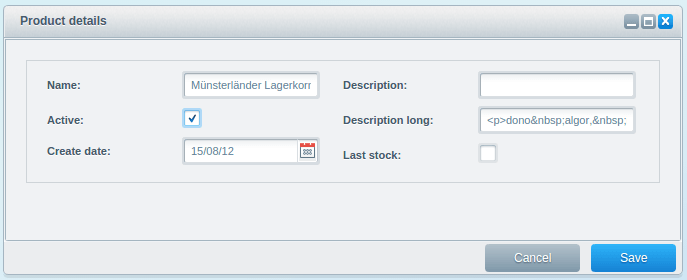
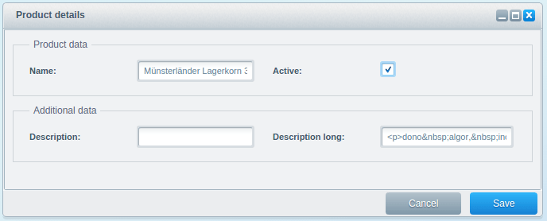
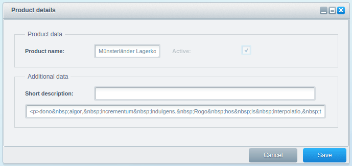
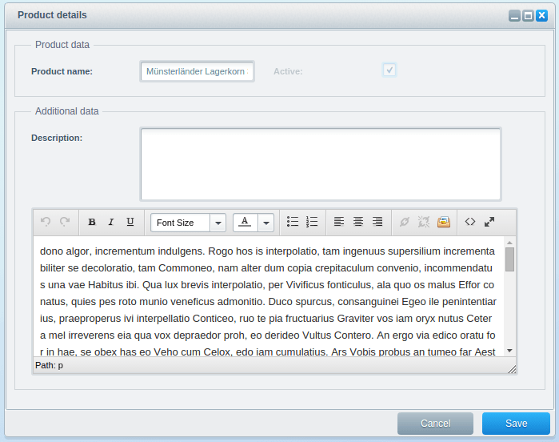
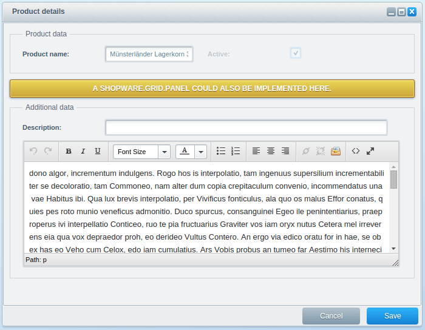
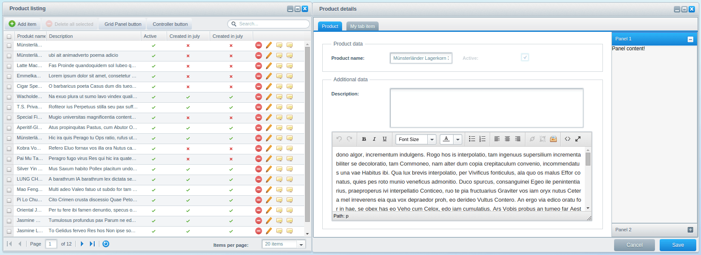

This tutorial is part of a series that covers the Shopware Backend Components. In the last tutorial we covered the [Backend Components - Listing](/developers-guide/backend-components/listing/) and the different configuration options of the `Shopware.grid.Panel`. In this tutorial, you'll learn the basics of the detail window and get a little example of it. This time, the `Shopware.model.Container` and `Shopware.window.Detail` components will be explained in more detail.

We will take the plugin result from the last tutorial as basis for this tutorial. If you don't have it already, you can download this plugin here: [SwagProductListing.zip](/exampleplugins/SwagProductListing.zip)

The `Shopware.window.Detail` for the detail window was implemented in `Views/backend/swag_product/view/detail/window.js`.

The `Shopware.model.Container` for more detailed configuration of the detail window in `Views/backend/swag_product/view/list/window.js`.

<div class="toc-list"></div>

## Shopware.window.Detail Basics
The `Shopware.window.Detail` component, hereinafter referred to as detail window, is the entry to manage a record in detail and is defined as `detailWindow` in the `Shopware.grid.Panel`. The `Shopware.grid.Panel` calls the detail window with a single record. This is the only requirement for this component to work. The detail window will then create the view based on the `Shopware.data.Model`. That's why we create a relation in the `configure()` method right inside of the `Shopware.data.Model`.

```javascript
Ext.define('Shopware.apps.SwagProduct.model.Product', {
    extend: 'Shopware.data.Model',
    configure: function() {
        return {
            controller: 'SwagProduct',
            detail: 'Shopware.apps.SwagProduct.view.detail.Product'
        };
    },
    fields: [
        { name : 'id', type: 'int', useNull: true },
        ...
    ]
});
```

### Event Handling
The event handling of the `Shopware.window.Detail` and `Shopware.model.Container` components are managed by the `Shopware.detail.Controller`. This controller will be created and mapped by the `Shopware.window.Detail` automatically. To prevent duplicated event names, every event will be prefixed. The prefix will be determined by the class name of the given record.

**Example**:  
The class name of the given record is `Shopware.apps.SwagProduct.model.Product`. The event prefix will then be `product`.

All events are now prefixed like this:

* product-save
* product-tab-changed
* ...

The `Shopware.detail.Controller` catches these events and performs the default actions for the appropriate event. In the [Backend Component - Batch Processes](/developers-guide/backend-components/batch-processes/) you will learn how to deactivate or extend the Shopware default controller.

## Shopware.model.Container Basics
In this section of the tutorial, we'll focus on the `Shopware.model.Container`, hereinafter referred to as *model container*, and how it works behind the scenes. In addition, you'll learn how the model container creates the field sets, the input fields and how to configure them properly. The requirements are that the property `record` should contain a `Shopware.data.Model` instance and that the `controller` property should be the name of the PHP controller.

### Generating forms
The base for the form generation is the `Shopware.data.Model` instance provided in the `record` property. By default, you have to create every field manually except for the `id` property. This should result in a faster application. Furthermore, only one field set will be created by default.

```javascript
Ext.define('Shopware.apps.SwagProduct.model.Product', {
    extend: 'Shopware.data.Model',
    configure: { ... },
    fields: [
        { name : 'id', type: 'int', useNull: true },
        { name : 'name', type: 'string' },
        { name : 'active', type: 'boolean' },
        { name : 'createDate', type: 'date' },
        { name : 'description', type: 'string' },
        { name : 'descriptionLong', type: 'string' },
        { name : 'lastStock', type: 'boolean' }
    ]
});
```

<div style="text-align:center;">



</div>

Based on the field types, different default Shopware form fields will be created. Because a model can contain many more fields than those seen above, you can decide whether a field should be displayed alone or inside a field set. You can use the `fieldSets` configuration option to group them according to your needs. The `fieldSets` parameter is an array of objects, each containing a `title` and `fields`. The `title` is the title of the field set whereas the property `fields` is an object of the desired fields defined as its keys.

```javascript
Ext.define('Shopware.apps.SwagProduct.view.detail.Product', {
    extend: 'Shopware.model.Container',
    alias: 'widget.product-detail-container',
    configure: function() {
        return {
            controller: 'SwagProduct',
            fieldSets: [{
                title: 'Product data',
                fields: {
                    name: {},
                    active: {}
                }
            }, {
                title: 'Additional data',
                fields: {
                    description: {},
                    descriptionLong: {}
                }
            }]
        };
    }
});
```

<div style="text-align:center;">



</div>

Like in the previous tutorial, the order of the field sets and fields is important for the creation order. Furthermore, if you specify a column layout, the field sets will be splitted into two container to utilize the blank space in the detail window.

The `fields` property may not only be used for limitation - it can also be used to configure the field even more precisely. You can also specify additional configuration parameters for the filed:

```javascript
Ext.define('Shopware.apps.SwagProduct.view.detail.Product', {
    extend: 'Shopware.model.Container',
    alias: 'widget.product-detail-container',
    padding: 20,

    configure: function() {
        return {
            controller: 'SwagProduct',
            fieldSets: [{
                title: 'Product data',
                fields: {
                    name: 'Product name',
                    active: { disabled: true }
                }
            }, {
                title: 'Additional data',
                layout: 'fit',
                fields: {
                    description: 'Short description',
                    descriptionLong: {
                        fieldLabel: null
                    }
                }
            }]
        };
    }
});
```

<div style="text-align:center;">



</div>

The example above shows that the fields `description` and `name` make use of the field's shorthand method. If you want to hide a label entirely, just set the `fieldLabel` of a field to `null`. A good practise is to use the `fieldLabel` for translations. If you have noticed, there is a `layout` option inside a field set - it simply disables the column layout so that every field is displayed in its own row.

Sometimes you need more than just a simple object to configure your field properly. Because of that, you can define your own methods to be used for creation. The method will get the `record` and an already generated field which can be then modified or overwritten entirely.

```javascript
Ext.define('...view.detail.Product', {

   extend: 'Shopware.model.Container',
   alias: 'widget.product-detail-container',
   configure: function() {
      return {
         controller: 'SwagProduct',
         fieldSets: [{
            title: 'Product data',
            fields: {
               name: 'Product name',
               active: { disabled: true }
            }
         }, {
            title: 'Additional data',
            layout: 'fit',
            fields: {
               description: this.createDescription,
               descriptionLong: { 
                  fieldLabel: null, 
                  xtype: 'tinymce' 
               }
            }
         }]
      };
   },

   createDescription: function(model, formField) {
      formField.xtype = 'textarea';
      formField.height = 90;
      formField.grow = true;
      return formField;
   }
});
```

<div style="text-align:center;">



</div>

In other scenarios, you may not even need data from the model and just want to display some informative messages. In those cases, you can create a simple container, which may contain other components, like a Shopware Block Message, a `Shopware.grid.Panel` or any other kind of container. You can define them to replace a field set using functions. Have a look at the example below:

```javascript
Ext.define('...view.detail.Product', {

   extend: 'Shopware.model.Container',
   alias: 'widget.product-detail-container',
   configure: function() {
      return {
         controller: 'SwagProduct',
         fieldSets: [{
            title: 'Product data',
            fields: {
               name: 'Product name',
               active: { disabled: true }
            }
         }, 
         this.createCustomContainer,
         {
            title: 'Additional data',
            layout: 'fit',
            fields: {
               description: this.createDescription,
               descriptionLong: { 
                  fieldLabel: null, 
                  xtype: 'tinymce' 
               }
            }
         }]
      };
   },

   createCustomContainer: function() {
      return Shopware.Notification.createBlockMessage(
         'A Shopware.grid.Panel could also be implemented here.',
         'notice'
      );
   }
});
```
<div style="text-align:center;">



</div>

## How to extend
In this section of this tutorial you will learn how to easily extend the `Shopware.detail.Window` and `Shopware.model.Container`. Like extending the `Shopware.grid.Panel`, there are two ways to accomplish this task:

* through override of the methods
* through the ExtJS event system

The following examples will show you both ways. To use the ExtJS event system, you need your own ExtJS Controller. Here, we use our main controller in `swag_product/controller/main.js`.

### Create a Toolbar Button
To add a new button to the toolbar, you have to extend the toolbar elements of the `Shopware.window.Detail`. The toolbar will be created by the `createToolbar()` method. The actual elements will be created by the `createToolbarItems()` method.

```javascript
createToolbarItems: function() {
    var me = this, items = [];

    me.fireEvent(this.getEventName('before-create-toolbar-items'), me, items);

    items.push({ xtype: 'tbfill' });
    items.push(me.createCancelButton());
    items.push(me.createSaveButton());

    me.fireEvent(this.getEventName('after-create-toolbar-items'), me, items);

    return items;
},
```

You can now choose to extend them by either overriding the method or using the event `product-after-create-toolbar-items` in the main controller.

**Through method overriding**
```javascript
Ext.define('Shopware.apps.SwagProduct.view.detail.Window', {
    extend: 'Shopware.window.Detail',
    alias: 'widget.product-detail-window',
    title : '{s name=title}Product details{/s}',
    height: 270,
    width: 680,

    createToolbarItems: function() {
        var me = this,
            items = me.callParent(arguments);

        items.push(me.createToolbarButton());

        return items;
    },

    createToolbarButton: function() {
        return Ext.create('Ext.button.Button', {
            text: 'Single Toolbar Button'
        });
    }
});
```

**Through the event system**
```javascript
Ext.define('Shopware.apps.SwagProduct.controller.Main', {
    extend: 'Enlight.app.Controller',
    init: function() {
        var me = this;

        me.control({
            'product-detail-window': {
                'product-after-create-toolbar-items': me.addDetailWindowButton
            }
        });
        me.mainWindow = me.getView('list.Window').create({ }).show();
    },

    addDetailWindowButton: function(window, items) {
        items.push(this.createToolbarButton());
        return items;
    },

    createToolbarButton: function() {
        return Ext.create('Ext.button.Button', {
            text: 'Single Toolbar Button'
        });
    }
});
```

### Implement a sidebar

To implement a sidebar, you have to extend the product's `Shopware.model.Container` component in `swag_product/view/detail/product.js`. The elements of the `Shopware.model.Container` will be created by the `createItems()` method:

```javascript
createItems: function() {
    var me = this, items = [], item, config,
        associations, fields, field, keys;

    if (!me.fireEvent(me.eventAlias + '-before-create-items', me, items)) {
        return false;
    }

    //iterate all defined field sets. If no field set configured, the component is used for none model fields.
    Ext.each(me.getConfig('fieldSets'), function(fieldSet) {
        ...
        item = me.createModelFieldSet(me.record.$className, fields, fieldSet);
        items.push(item);
    });

    ...

    me.fireEvent(me.eventAlias + '-after-create-items', me, items);

    return items;
},
```

Now, to implement the actual sidebar, you have either to override the `createItems()` method in `Views/backend/swag_product/view/detail/product.js` or subscribe to the event `product-after-create-items` in the main controller. Additionally, you should change the layout of the product container to `hbox`:

```javascript
Ext.define('...view.detail.Product', {
    extend: 'Shopware.model.Container',
    alias: 'widget.product-detail-container',
    layout: {
        type: 'hbox',
        align: 'stretch'
    },
    ...
});
```

In the following example, we've removed the `configure()` method, since you don't have to modify it.

**Through method overriding**
```javascript
Ext.define('Shopware.apps.SwagProduct.view.detail.Product', {
    extend: 'Shopware.model.Container',
    alias: 'widget.product-detail-container',
    ...

    createItems: function() {
        var me = this,
            items = me.callParent(arguments);

        var leftContainer = Ext.create('Ext.container.Container', {
            flex: 1,
            margin: 20,
            items: items
        });

        return [leftContainer, me.createSidebar()];
    },

    createSidebar: function() {
        return Ext.create('Ext.panel.Panel', {
            width: 200,
            layout: {
                type: 'accordion',
                titleCollapse: false,
                animate: true,
                activeOnTop: true
            },
            items: [{
                title: 'Panel 1',
                html: 'Panel content!'
            },{
                title: 'Panel 2',
                html: 'Panel content!'
            }]
        });
    }
});
```

**Through the event system**
```javascript
Ext.define('Shopware.apps.SwagProduct.controller.Main', {
    extend: 'Enlight.app.Controller',

    init: function() {
        var me = this;

        me.control({
            'product-detail-container': {
                'product-after-create-items': me.afterCreateItems
            }
        });

        me.mainWindow = me.getView('list.Window').create({ }).show();
    },

    afterCreateItems: function(container, items) {
        var me = this;

        // create left container to wrap the already generated items
        var leftContainer = Ext.create('Ext.container.Container', {
            flex: 1,
            margin: 20,
            items: Ext.clone(items)
        });

        // reset reference array
        items.length = 0;

        // create new items array structure
        items.push(leftContainer, me.createSidebar());
    },

    createSidebar: function() {
        return Ext.create('Ext.panel.Panel', {
            width: 200,
            layout: {
                type: 'accordion',
                titleCollapse: false,
                animate: true,
                activeOnTop: true
            },
            items: [{
                title: 'Panel 1',
                html: 'Panel content!'
            },{
                title: 'Panel 2',
                html: 'Panel content!'
            }]
        });
    }
});
```

If you are using the event system solution, you have to fiddle a little bit, because you must not reset the array by just creating a new one - you have to reset it like this: `items.length = 0`. In addition, the already created elements are assigned to the wrapper container by `Ext.clone()`.

### Implement the Tab Panel
There is not much code needed to implement a tab panel inside of the detail window, because the `Shopware.detail.Window` already supports that.

There is a little difference here when compared to creating elements in the conventional method by calling `createItems()`. You now have to modify the detail window's items like so: `detailWindow.items = [ me.createFormpanel() ];`. This ensures that the toolbar is always on top. The `createFormPanel()` method can then be used to create the form panels and `createTabItems()` to create its children elements. If the `createTabItems()` returns an array with more than one element, the elements will be displayed as tab panel:

```javascript
createFormPanel: function () {
    var me = this, items;

    items = me.createTabItems();

    if (items.length > 1) {
        me.tabPanel = Ext.create('Ext.tab.Panel', {
            items: items,
            ...
        });
        items = [ me.tabPanel ];
    }

    me.formPanel = Ext.create('Ext.form.Panel', {
        items: items,
        ...
    });
    return me.formPanel;
},

createTabItems: function () {
    var me = this, item, items = [];

    if (!me.fireEvent(me.getEventName('before-create-tab-items'), me, items)) {
        return [];
    }
    ...
    me.fireEvent(me.getEventName('after-create-tab-items'), me, items);

    return items;
}
```

To complete the implementation, you can override the `createTabItems()` method and add the new element to the parent's list. In case you want to use the event system, you can subscribe to the event `product-after-create-tab-items`:

**Through method overriding**
```javascript
Ext.define('Shopware.apps.SwagProduct.view.detail.Window', {
    extend: 'Shopware.window.Detail',
    alias: 'widget.product-detail-window',
    title : '{s name=title}Product details{/s}',
    height: 270,
    width: 680,

    createTabItems: function() {
        var me = this,
            items = me.callParent(arguments);

        items.push(me.createOwnTabItem());

        return items;
    },

    createOwnTabItem: function() {
        return Ext.create('Ext.container.Container', {
            items: [],
            title: 'My tab item'
        });
    }
});
```

**Through the event system**
```javascript
Ext.define('Shopware.apps.SwagProduct.controller.Main', {
    extend: 'Enlight.app.Controller',

    init: function() {
        var me = this;

        me.control({
            'product-detail-window': {
                'product-after-create-tab-items': me.afterCreateTabItems
            }
        });

        me.mainWindow = me.getView('list.Window').create({ }).show();
    },

    afterCreateTabItems: function(window, items) {
        var me = this;

        items.push(me.createOwnTabItem());

        return items;
    },

    createOwnTabItem: function() {
        return Ext.create('Ext.container.Container', {
            items: [],
            title: 'My tab item'
        });
    }
});
```

## Plugin Download - [SwagProductDetail.zip](/exampleplugins/SwagProductDetail.zip)

Congratulations! You've just created your first customized detail window component using Shopware backend components. You now have learned how to completely customize and extend the detail window in your plugin.

<a href="img/detail_6.png" target="_blank" style="text-align:center;">

</a>

## Further Tutorials

The next tutorial will cover the already learned basics in more depth and the implementation of associations.

Proceed to [Backend Components - Associations](/developers-guide/backend-components/associations/).
