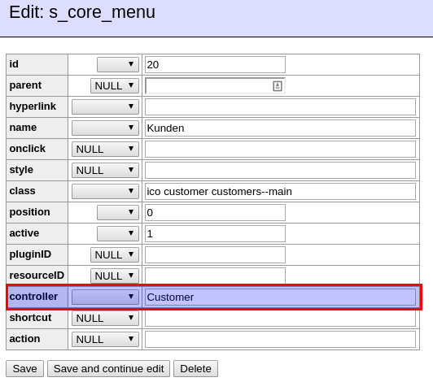
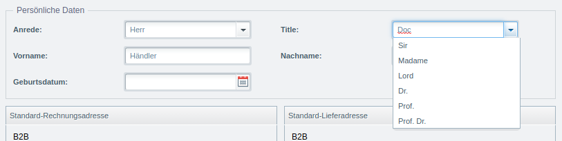

The Shopware backend, with its powerful JavaScript framework, offers many tools to design nice interfaces for the end user.
This document will describe how existing modules can be extended.

<div class="toc-list"></div>

## The general mechanism
This is a technical description of the mechanisms you might find helpful when extending backend applications. If you want, you can fast forward to the [next section](#extending).

Usually, opening a backend module involves 4 steps:

* a menu entry
* a connected controller
* bootstrapping the ExtJS application
* loading the dependencies

### The menu entry
Every menu item can be found in the `s_core_menu` table of your Shopware database.



As you can see, there is a database field `controller` which references the controller that will load the backend application.
In this case, it is the `Customer` controller.

### The Controller
In order to be capable of loading backend applications, we use special controllers in Shopware. By default, they will
inherit from `Shopware_Controllers_Backend_ExtJs`. If the module is built using the new backend components, the base
controller `Shopware_Controllers_Backend_Application` is used.

In order to connect the controller to a backend module, naming conventions are used. In our example the controller is
called `Customer`, so Shopware will search for a backend application in `backend/customer/app.js`. If your controller
was called `NewsletterManager`, the backend path would be `backend/newsletter_manager/app.js`. So basically, controllers
names are in CamelCase, backend paths are in snake_case.

### Bootstrapping
When clicking the menu item, Shopware will trigger the following request to the configured controller's `index` action:

```text
http://localhost/training/backend/Customer?file=app
```

The controller will then respond with the content of the `app.js` file from the path `backend/customer/app.js`:

```js
//{block name="backend/customer/application"}
Ext.define('Shopware.apps.Customer', {
    name:'Shopware.apps.Customer',
    extend:'Enlight.app.SubApplication',

    bulkLoad:true,

    loadPath:'{url controller="customer" action=load}',

    controllers:[ 'Main', 'List', 'Detail', 'Order' ],

    views:[
        'detail.Window',
        'detail.Base',
        'detail.Billing',
        'detail.Shipping',
        'detail.Debit',
        'detail.Comment',
        'detail.Additional' ,
        'list.List',
        'main.Window',
        'order.List',
        'order.Chart'
    ],

    stores:[ 'Detail', 'List', 'Orders', 'Chart', 'Batch' ],

    models:[ 'Customer', 'Billing', 'Shipping', 'Debit', 'PaymentData', 'List', 'Order', 'Chart', 'BillingAttributes', 'ShippingAttributes', 'Attribute', 'Batch'  ],

    launch: function() {
        var me = this,
            mainController = me.getController('Main');

        return mainController.mainWindow;
    }
});
//{/block}
```

This `app.js` is basically a definition of dependencies, as you can see in the `views`, `controllers`, `stores` and `models`
arrays.  The `app.js` is then executed by the JavaScript framework and will lazy load the dependencies.

### Loading dependencies
This is done by performing another Ajax request to the configured controller. As Shopware uses some minification here, usually
the request will look like this:

```
http://localhost/training/backend/customer/load/?f=m/Customer|m/Billing|m/Shipping|m/Debit|m/PaymentData|m/List|m/Order|m/Chart|m/BillingAttributes|m/ShippingAttributes|m/Attribute|m/Batch|v/detail/Window|v/detail/Base|v/detail/Billing|v/detail/Shipping|v/detail/Debit|v/detail/Comment|v/detail/Additional|v/list/List|v/main/Window|v/order/List|v/order/Chart|store/Detail|store/List|store/Orders|store/Chart|store/Batch|c/Main|c/List|c/Detail|c/Order&no-cache=1448265316+1+1
```

As you can see, the `load` action of the controller is used in this case. Shopware will then concatenate all requested dependencies and return them to the JavaScript application, which will then be able to show the backend module.

### Round up
Generally speaking, we need to remember that a given backend controller `Customer` is linked to the `backend/customer/app.js`
 file. The `index` action of the controller will be used to load that `app.js`, which in turn will be used to load all other components.

## Extending
Extending backend modules is done by injecting custom JavaScript into Shopware's default modules. This is done using
`PostDispatch` events on the original controller and Smarty for the data inclusion. This is also the reason, why all
our backend components are wrapped in Smarty blocks like `{block name="backend/customer/application"}`.

The rule of thumb here is the following: In order to add *new* components, append them to the `app.js` - therefore
you will need to insert your JavaScript in the `index` action (see description above). In order to overwrite *existing*
components (e.g. a grid in the customer module), you will need to insert your overwrite in the `load` action - as this
is where all the components are loaded.

### Example #1: Simple extension



In this example, an extension for Shopware's default customer module is implemented. First of all, an existing free
text field should be changed ComboBox with preset titles.

In order to do so, we need to know where the original text field is created. This happens in
`themes/Backend/ExtJs/backend/customer/view/detail/window.js` in the method `createPersonalFieldSet`. This method
will return all fields for the right side of the billing info overview as a FieldSet. In order to modify this method, we subscribe to
the `PostDispatchSecure` event of the customer controller in the service.xml:

```xml
<container xmlns="http://symfony.com/schema/dic/services"
           xmlns:xsi="http://www.w3.org/2001/XMLSchema-instance"
           xsi:schemaLocation="http://symfony.com/schema/dic/services http://symfony.com/schema/dic/services/services-1.0.xsd">

    <services>
        <service id="swag_extend_customer.subscriber.templates" class="SwagExtendCustomer\Subscriber\ExtendCustomer">
            <argument>%swag_extend_customer.plugin_dir%</argument>
            <tag name="shopware.event_subscriber"/>
        </service>
    </services>
</container>
```

```php
<?php

namespace SwagExtendCustomer\Subscriber;

use Enlight\Event\SubscriberInterface;

class ExtendCustomer implements SubscriberInterface
{
    /**
     * @var string
     */
    private $pluginDirectory;

    /**
     * @param $pluginDirectory
     */
    public function __construct($pluginDirectory)
    {
        $this->pluginDirectory = $pluginDirectory;
    }
    /**
     * {@inheritdoc}
     */
    public static function getSubscribedEvents()
    {
        return [
            'Enlight_Controller_Action_PostDispatchSecure_Backend_Customer' => 'onCustomerPostDispatch'
        ];
    }

    public function onCustomerPostDispatch(\Enlight_Event_EventArgs $args)
    {
        /** @var \Shopware_Controllers_Backend_Customer $controller */
        $controller = $args->getSubject();

        $view = $controller->View();
        $request = $controller->Request();

        $view->addTemplateDir($this->pluginDirectory . '/Resources/views');

        if ($request->getActionName() == 'load') {
            $view->extendsTemplate('backend/swag_extend_customer/view/detail/window.js');
        }
    }
}
```

So in the `load` action, where all the components are loaded, we inject our modification template. In this example,
this file looks like this:

```js
//{block name="backend/customer/view/detail/window"}
// {$smarty.block.parent}
Ext.define('Shopware.apps.SwagExtendCustomer.view.detail.Window', {
    override: 'Shopware.apps.Customer.view.detail.Window',

    /**
     * Replace the textBox for field "title" with a comboBox
     *
     * @returns { Ext.form.FieldSet }
     */
    createPersonalFieldSet: function() {
        var me = this,
            fieldSet = me.callParent(arguments),
            titelField = fieldSet.down('[name="title"]'),
            titleContainer = titelField.up('container');

        titelField.destroy();

        titleContainer.insert(0, Ext.create('Ext.form.field.ComboBox', {
            labelWidth: 155,
            anchor: '95%',
            name: 'title',
            displayField: 'name',
            valueField: 'name',
            store: me.createTitleStore(),
            fieldLabel: 'Title'
        }));

        return fieldSet;
    },

    /**
     * @returns { Ext.data.Store }
     */
    createTitleStore: function() {
        return Ext.create('Ext.data.Store', {
            fields: [
                { name: 'name' }
            ],
            data: [
                { name: 'Sir' },
                { name: 'Madame' },
                { name: 'Lord' },
                { name: 'Dr.' },
                { name: 'Prof.' },
                { name: 'Prof. Dr.' }
            ]
        })
    }
});
//{/block}
```

As you can see, the block of the original customer module is extended using Smarty:

```smarty
 {block name="backend/customer/view/detail/window"}
 {$smarty.block.parent}
```

Then a ExtJS class is defined. The class name `Shopware.apps.SwagExtendCustomer.view.detail.Window` originates
from the path of that template file. In the next line ExtJS is instructed to override the original customer billing class:

```js
override:'Shopware.apps.Customer.view.detail.Window'
```

Now the method `createPersonalFieldSet` can just be re-implemented. Calling `me.callParent(arguments)` will call the
original (overridden) method and return its result - in this case we get a Ext.form.FieldSet as result and modify the items of the FieldSet

At the end the modified FieldSet is returned - this way our extension is rendered into the window instead of the original
one.

### Example #2: Custom components 


In some cases, you also want to add whole new components to a backend module. This example might look similar to the
first one, but there are subtle changes. In this example, a new tab is introduced to the customer module, which
will just contain a simple "hello world" message - but you could easily extend it to show custom data.
The `Subscriber` looks similar, it subscribes to `Enlight_Controller_Action_PostDispatchSecure_Backend_Customer` and
registers a callback method.

In the callback, there is a distinction between `index` and `load` actions. The `index` action is the right place
 to introduce the new component, so we know that it's available before all other components are loaded. The `load` action - just
 as in the first example - is used to modify the original module, so that the new tab is actually displayed:

```xml
<container xmlns="http://symfony.com/schema/dic/services"
           xmlns:xsi="http://www.w3.org/2001/XMLSchema-instance"
           xsi:schemaLocation="http://symfony.com/schema/dic/services http://symfony.com/schema/dic/services/services-1.0.xsd">

    <services>
        <service id="swag_extend_customer.subscriber.templates" class="SwagExtendCustomer\Subscriber\ExtendCustomer">
            <argument>%swag_extend_customer.plugin_dir%</argument>
            <tag name="shopware.event_subscriber"/>
        </service>
    </services>
</container>
```

```php
<?php

namespace SwagExtendCustomer\Subscriber;

use Enlight\Event\SubscriberInterface;

class ExtendCustomer implements SubscriberInterface
{
    /**
     * @var string
     */
    private $pluginDirectory;

    /**
     * @param $pluginDirectory
     */
    public function __construct($pluginDirectory)
    {
        $this->pluginDirectory = $pluginDirectory;
    }
    /**
     * {@inheritdoc}
     */
    public static function getSubscribedEvents()
    {
        return [
            'Enlight_Controller_Action_PostDispatchSecure_Backend_Customer' => 'onCustomerPostDispatch'
        ];
    }

    public function onCustomerPostDispatch(\Enlight_Event_EventArgs $args)
    {
        /** @var \Shopware_Controllers_Backend_Customer $controller */
        $controller = $args->getSubject();

        $view = $controller->View();
        $request = $controller->Request();

        $view->addTemplateDir($this->pluginDirectory . '/Resources/views');

        if ($request->getActionName() == 'index') {
           $view->extendsTemplate('backend/swag_extend_customer/app.js');
        }
 
        if ($request->getActionName() == 'load') {
           $view->extendsTemplate('backend/swag_extend_customer/view/detail/window.js');
        }
    }
}
```

As the template file `backend/swag_extend_customer/app.js` just needs to include the new component, its rather simple:

```js
//{block name="backend/customer/application"}
//      {$smarty.block.parent}
//      {include file="backend/swag_extend_customer/view/detail/my_own_tab.js"}
//{/block}
```

It appends the original `app.js` file of the customer module and includes the new tab component `backend/swag_extend_customer/view/detail/my_own_tab.js`:

```js
Ext.define('Shopware.apps.SwagExtendCustomer.view.detail.MyOwnTab', {
    extend: 'Ext.container.Container',
    padding: 10,
    title: 'MyOwnTab',

    initComponent: function() {
        var me = this;

        me.items  =  [{
            xtype: 'label',
            html: '<h1>Hello world</h1>'
        }];

        me.callParent(arguments);
    }
});
```

In this case, the component inherits from `Ext.container.Container` - a container which organizes other elements. Here we
only have a simple label:

```js
me.items  =  [{
    xtype: 'label',
    html: '<h1>Hello world</h1>'
}];
```

In order to bring the new tab into play, the `Bootstrap` described above also extends the `load` action:

```js
if ($request->getActionName() == 'load') {
    $view->extendsTemplate('backend/swag_extend_customer/view/detail/window.js');
}
```

This will include the override for the window, which takes care of the tab handling in the original customer module.
The mechanism is the same as in the first example: in this case the `getTabs` method is overridden.
Also, instead of modifying an existing array element, a new one is pushed - which makes use of the new tab component
that we introduced before:

```js
//{block name="backend/customer/view/detail/window"}
// {$smarty.block.parent}
Ext.define('Shopware.apps.SwagExtendCustomer.view.detail.Window', {
     /**
     * Override the customer detail window
     * @string
     */
   override: 'Shopware.apps.Customer.view.detail.Window',

   getTabs: function() {
      var me = this,
          result = me.callParent();

      result.push(Ext.create('Shopware.apps.SwagExtendCustomer.view.detail.MyOwnTab'));

      return result;
   }
});
//{/block}
```

#### Add custom ExtJS controller

To register a custom controller in an existing backend ExtJS module, first you need to add the file to the app.js:

```js
//{block name="backend/customer/application"}
//      {$smarty.block.parent}
//      {include file="backend/swag_extend_customer/controller/my_own_controller.js"}
//      {include file="backend/swag_extend_customer/view/detail/my_own_tab.js"}
//{/block}
```

After adding it to the app.js file, the file will be loaded, but the controller will not be instanced.

To instantiate your controller, you need to override the existing controller (depends on the module you want to extend). In this file you can override existing functions of the parent controller. You can and mostly need to call the parent function with the line `me.callParent(arguments)`:

```js
Ext.define('Shopware.apps.SwagExtendCustomer.controller.MyOwnController', {
    
     /**
     * Override the customer main controller
     * @string
     */
    override: 'Shopware.apps.Customer.controller.Main',
    
    init: function () {
        var me = this;
        
        // me.callParent will execute the init function of the overridden controller
        me.callParent(arguments);
    }
});
```

## Download
The full example can be [downloaded here](/exampleplugins/SwagExtendCustomer.zip).
