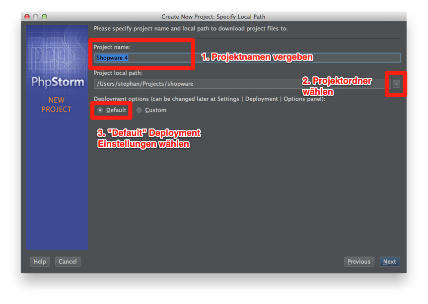
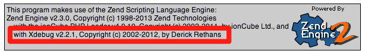
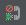

In this guide we show you how to install and configure your development environment (short "IDE") for the use of Shopware. For that, we use PhpStorm which is optimized for developing PHP applications. The configuration of WebStorm, mainly for frontend developers, should be the same.

# Prerequisites
To complete this guide, you will need:
- Installation of Shopware
- (optional) Remote-Server with Shopware installation
- (optional) SSH access to remote server

## Installation of Shopware
You can find different versions of Shopware on the [download page](http://community.shopware.com/Downloads_cat_448.html) and additionally, instructions for installing Shopware [here](http://community.shopware.com/Shopware-5-Installer_detail_874_710.html).

# PhpStorm - Development Environment
<center>


<em>PhpStorm - Overview</em>
</center>

PhpStorm is used by all of our developers. But why did we choose it?

## Why PhpStorm?
- Intelligent PHP editor
  - PHP code completion
  - Integrated refactoring
  - Smarty and PHPDoc support

- Easy installation
  - Cross platform
  - Individual project settings

- Visual PHPUnit test runner
- VCS support
  - SVN
  - Git
  - Mercurial
  - Local history

- FTP and remote synchronization
- Visual debugging inside the IDE
- HTML5 and CSS editor including zen coding

## Installation of PhpStorm
The installation of PhpStorm is like every other installation and therefore quite simple. You can download a 30 days trial from the manufactures [download page](http://www.jetbrains.com/phpstorm/download/index.html). In the next sections, we'll cover the different sections:

### Windows
- Open the `PhpStorm-*.exe` to start the installation wizard.
- Follow the wizard and configure it for your needs.

### Mac OS X
- Download the `PhpStorm-*.dmg` Mac OS X Disk Image
- Mount the Disk Image
- Copy PhpStorm into your applications folder

### Linux
- Extract the `PhpStorm-*.tar.gz` file with the following arguments: `tar xfz PhpStorm-*.tar.gz`
- Open `bin/PhpStorm.sh` to start PhpStorm

## First run
<center>


<em>Splash-Screen</em>
</center>

Because of the complete customization per project, the first run is way more complicated. Therefore we'll cover everything step by step. Up next are the following steps:
- Create a Project with Existing Files
- Selecting a Deployment Method
- Defining the Project Directory
- Creation or Selection of the Server

## Create a project
<center>


<em>Create a Project with Exisiting Files</em>
</center>

After you've started PhpStorm, you'll see a window like shown above. Choose **Create New Project from Existing Files** to migrate your Shopware installation to a PhpStorm project.

## Selecting the Deployment Method
<center>


<em>Choosing a Deployment Method</em>
</center>

Next, we'll be asked for a development server. If you are using a local installation of Shopware, you may choose the first option _Web server is installed locally, source files are located under its document root*_.

If you are using a remote installation on a FTP server, please choose the second option **Web server is on remote host, files are accessible via FTP/SFTP/FTPS**.

## Local Installation
### Defining the Project Directory
<center>


<em>Selecting the Project Root</em>
</center>

Select your local directory with the copy of Shopware on your hard drive. Now click on the Button **Project Root**.

### Creating a Deployment Server
<center>


<em>Selection of the local development server</em>
</center>

Now choose the option **Add new local server**, if you haven't already created one.
<center>


<em>Creation of the Local Deployment Server</em>
</center>

After you've created the local server, you have to provide a name for the local deployment server. This name is only used for the association by the IDE. You may have to correct the settings for **Web server root URL**.
<div class="alert alert-info">
Please provide only the <strong>root</strong> directory of your local deployment server. If your Shopware installation is in a subdirectory, you have to chance to change that in the next step.
</div>

<center>


<em>Local Project URL Configuration</em>
</center>

Like already mentioned, you can correct the project url, if your Shopware installation is not in your local `www` or `htdocs` respectively.

After you've corrected your project url, you can complete the wizard by clicking on **Finish**. The configuration for a local server environment is now completed.

## Remote FTP/SFTP/FTPS Installation
### Defining the Project Directory
<center>


<em>Select the project directory</em>
</center>

The selection of the project directory for a remote server is slightly different than configuring a local one. First, provide a **Project name**. The name is only used to display in PhpStorm.

After that, select your Shopware source directory on your local hard disk. This will be your project directory.

At last, choose **Default** as **Deployment options**.

### Creating a Remote Deployment Server
<center>


<em>Selection - Create new Remote Server</em>
</center>

Next, select **Add new remote server** like seen above and confirm with a click on **Next**.
<center>


<em>FTP Server Configuration</em>
</center>

Enter your FTP credentials and test your configuration by clicking on **Test FTP connection...**.
<div class="alert alert-info">
Please provide only the <strong>root</strong> directory of your local deployment server. If your Shopware installation is in a subdirectory, you have to chance to change that in the next step.
</div>

<center>


<em>Selection of the Project Directory</em>
</center>

Like already mentioned, you can now select the **Root path** on the remote server. Select your `www` or `htdocs` directory and click on **Project Root**.
<center>


<em>Select Project Web Path</em>
</center>

After you've corrected the Project URL, confirm your configuration by click on **Finish**. At this point, the configuration is complete and you can proceed to the individual Project Settings.

## Individual Project Settings
<center>


<em>Open Settings</em>
</center>

In the next steps we'll cover the individual project configuration. This section covers the following topics:
- Exclude directories from indexing
- Change Color Schema
- Change Coding Style

To open the Settings, please click on the wrench icon like seen above.

### Exclude Directories from Indexing
<center>


<em>Exclude Directories from Indexing</em>
</center>

PhpStorm provides you with a variant of automatic code completions. To make this happen, PhpStorm needs to index all files inside your Project. This might take a while, depending on the number and size of files in your project.

To exclude directories from indexing, open the Settings and select **Directories** in the left sidebar. You can now select directories on the right side and mark them as excluded by clicking on **Excluded** above.

The following directories (if existing) should be excluded:
- cache
- check
- files
- install
- internal
- media
- snippets
- var
- web

These directories will be marked red in your project and might not be visible anymore. They will still remain on your hard drive.

### Change Color Schema
<center>


<em>Select Color Schema</em>
</center>

Open the Settings panel again and select **Code Style** inside of **Editor**. Click on the dropdown menu and select your favored color schema.

### Change Coding Style
<center>


<em>Select Coding Style</em>
</center>

Open the Settings panel again and select click the caret to the left of **Editor**. Then, navigate to **PHP** inside of **Code Style**.

To apply common code styling rules, click on **Set from...** on the right and choose **Predefined styles > PSR1/PSR2**. With this predefined style, you'll use f.e. spaces instead of tabs. Please refer to the definition of [PSR-1](https://github.com/php-fig/fig-standards/blob/master/accepted/PSR-1-basic-coding-standard.md) or [PSR-2](https://github.com/php-fig/fig-standards/blob/master/accepted/PSR-2-coding-style-guide.md) to learn more.

## Debug with Xdebug (Remote Debugging)
> Xdebug is a debug and profiler tool for PHP applications. Together with PhpStorm, Xdebug allows you to debug your application right inside the IDE. The included profiler also shows you bottlenecks of your application.

### Example: Install on Debian
XDebug will be installed via `apt-get`, the package manager in Debian.
<div class="alert alert-info">
    <strong>Heads Up!</strong> You may need <strong>root</strong> permissions to execute these commands.
</div>

```bash
$ sudo apt-get update
$ sudo apt-get install php5-xdebug
```

After the installation, change to the `/etc/php5/conf.d` directory.

```bash
$ cd /etc/php5/conf.d/
```

Now open the `xdebug.ini` file and replace its contents with:

```php
; configuration for php xdebug module
zend_extension=/usr/lib/php5/20090626/xdebug.so

[xdebug]
; Enable remote debugging
xdebug.remote_enable=1

; Debugging port (default: 9000)
xdebug.remote_port=9000

; IDE key which should be match with your IDE settings
xdebug.idekey=shopware

; Tries to connect to the client which has made the HTTP request
; to start the debugging session
xdebug.remote_connect_back=1
```

<center><em>xdebug.ini - Configuration File</em></center>

<center>

</center>

After restarting the Apache2 the installation of Xdebug is complete. You can verify the installation by visiting a `phpinfo()` page or by running the cli command:

```bash
$ php -i | grep Xdebug
```

Next, complete the configuration in PhpStorm.

### PhpStorm Configuration
<center>


<em>Xdebug Configuration in PhpStorm</em>
</center>

To configure Xdebug, click on the  icon and click on **Edit configuration** like seen above.
<center>


<em>Creating a PHP Web Application</em>
</center>

In the next step, you first have to create a new **PHP Web Application**. To do this, select **PHP Web Application** on the left sidebar and click on the  icon to configure a new debugging server.
<div class="alert alert-info">
    <p>
        <strong>Heads Up!</strong><br/>
        If your Shopware installation is not in your root directory, e.g. <code>www</code> or <code>htdocs</code>, you need to adjust the <strong>Start URL</strong> parameter to your working directory.
    </p>
    <p>
        <strong>Example:</strong> Given your web servers DocumentRoot is <code>/var/www</code> and you've installed Shopware in <code>/var/www/shopware</code>, then you need to set the <strong>Start URL</strong> to <code>/shopware</code>.
    </p>
</div>

<center>


<em>Configure a debugging server for the PHP Web Application</em>
</center>

First, create a new entry by clicking on the `+` symbol at the top left and give it a name. This name will only be used by PhpStorm for display purposes. We recommend to provide the server url like seen above.

Next, you have to provide the **Host** and **Port** of your web server. The default port for web applications is 80, but in case you configured a different port, you can change it here.

Because this is a remote server, you have to activate the use of path mappings and provide your absolute path to the Shopware installation.

Confirm your configuration by click on **OK**.
<center>


<em>Configure Remote Debugging</em>
</center>

After you've configured the debugging server, select **PHP Remote Debug** in the sidebar. You can now select your new created server in the **Servers** dropdown. Second, you have to provide an **Ide key** to identifiy your session. You should set this to `shopware`.

### Using Xdebug
<center>


<em>Using Xdebug</em>
</center>

Once you have completed the complex Xdebug installation and configuration, the use of it is much easier. To start debugging, set a breakpoint to any line you want to debug and start the debug session by clicking on the  icon. PhpStorm is now listening for incoming debug connections.
<center>


<em>Open the shop to notify Xdebug</em>
</center>

Now open the your remote installation of Shopware in your favorite web browser. We recommend using Firefox or Safari. You will see, that your page is loading forever. You now have to switch back to PhpStorm and you'll see a new panel at the bottom which shows you variables of the current debug session.
<center>


<em>Debugging-Panel in PhpStorm</em>
</center>

### Troubleshooting
If you encounter problems with debugging in PhpStorm, e.g. the application does not stop at your breakpoint, you can find out which client sends HTTP requests. The manufacture of Xdebug provides you with a generator for browser bookmarks. With this bookmarks you can start a session right from your browser.
<center>


<em>Bookmark Generator</em>
</center>

Go to the [Bookmark Generator](http://www.jetbrains.com/phpstorm/marklets/index.html) and provide your **IDE key** you've entered earlier in this guide. Then click on generate and drag the **Debug this page** link into your bookmark bar.

After that, go back to your shop and click on your newly created bookmark **Debug this page**.

## Run Unit Tests with PHPUnit (Remote)
<div class="alert alert-info">
    <p>
        <strong>Heads Up!</strong><br/>
        To run the unit tests, you need the developer version of Shopware. You can grab a copy from [GitHub](https://github.com/shopware/shopware).
    </p>

```bash
$ git clone https://github.com/shopware/shopware.git
```

</div>

## What is PHPUnit?
> PHPUnit is a unit testing framework for the PHP programming language. It is an instance of the xUnit architecture for unit testing frameworks that originated with SUnit and became popular with JUnit. PHPUnit was created by Sebastian Bergmann and its development is hosted on GitHub.
<figure>Source: <a href="https://en.wikipedia.org/wiki/PHPUnit" target="_blank" rel="nofollow">Wikipedia.org</a></figure>

### Installation on a Remote Server
In this part we'll show you how to install PHPUnit on a Debian server. For this, we need **PEAR** - a collection of extensions and modules for PHP.

In case you don't have **PEAR** installed, you can do that by running the following commands:

```bash
$ sudo apt-get update
$ sudo apt-get install php-pear
```

<center><em>PEAR Installation</em></center>

After you have installed **PEAR**, you can install PHPUnit and DbUnit. To do this, follow the instructions below:

```bash
$ pear upgrade pear
$ pear upgrade-all
$ pear config-set auto_discover 1
$ pear install pear.phpunit.de/PHPUnit
$ pear install phpunit/DbUnit
```

<center><em>Installation of PHPUnit and DbUnit</em></center>

### Running Unit Tests
Now that you have installed **PEAR**, **PHPUnit** and **DbUnit**, you can run Shopware unit tests. Change your directory to your Shopware installation and go to `tests/Shopware`.

You can now just run `phpunit` and see if all tests are passing.

```bash
$ phpunit
```

<center>


<em>Running PHPUnit via CLI</em>
</center>
