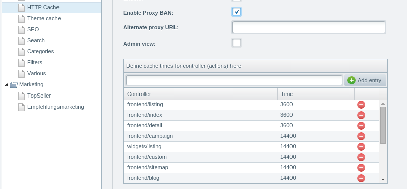

Whenever you want to create your own custom pages, AJAX or API endpoints, you will probably need a controller.
Generally speaking, a controller links the model of your application (e.g. the database logic and business logic)
with the representation / view of your application (e.g. template). The controller also handles user input - in web application this usually boils down to handle requests and GET or POST params.

<div class="toc-list"></div>

## Controller and URLs
In Shopware, all requests will be dispatched to the corresponding controller. Internally, any request is mapped to an URL
like this: `http://my-shop.com/frontend/listing/index`. Speaking of controllers, the following parts can be distinguished:

* `http://my-shop.com` - the protocol and domain part
* `frontend` - the **module**
* `listing` - the **controller**
* `index` - the **action**

There are default values for **module**, **controller** and **action**, however. If no **module** is specified, Shopware will
assume the `frontend` module by default. If no **controller** is specified, Shopware will check for an `index` controller.
And if no **action** is specified, Shopware will check for the `indexAction`.
For that reason, the calls "http://my-shop.com/" and "http://my-shop.com/frontend/index/index" will be routed to the same
controller action.

### Module
A module is actually a namespace for a controller. Controllers are automatically registered under `PluginDirectory/Controllers/{Frontend|Backend|Api|Widgets}` like below:

* `Frontend`: Namespace for controllers related to the store front - e.g. cart, account, listing...
* `Widgets`: Namespace for widgets, i.e. reusable, cache compatible `{action}` blocks that will render ESI tags
* `Backend`: Namespace for backend controllers, usually protected by the Shopware backend authentication system
* `Api`: Namespace for REST API related controllers. Usually protected by the API authentication

Each namespace can be found in `engine/Shopware/Controllers/{Frontend|Backend|Api|Widgets}`.

### Controller
A controller is a specific class within one of the controller namespaces (see above). It will usually take care of one specific
range of tasks, so Shopware has a controller for the account section, one controller for the listings, one controller for
the checkout and so forth.
Regarding the MVC principle, a controller will usually not have a lot of logic in it - in web applications, it is usually
mapped to a URL one can call in the browser and has access to the input (e.g. GET and POST variables, cookies, session) and
output (headers, cookies, session, template).

Depending on the namespace of the controller, it will usually have another class name and another base class:

* `Frontend`: `class Shopware_Controllers_Frontend_NAME extends Enlight_Controller_Action`
* `Backend`: `class Shopware_Controllers_Backend_NAME extends Shopware_Controllers_Backend_Application`
* `Widgets`: `class Shopware_Controllers_Widgets_NAME extends Enlight_Controller_Action`
* `Api`: `class Shopware_Controllers_Api_NAME extends Shopware_Controllers_Api_Rest`

This is not as cumbersome as it might look: `Enlight_Controller_Action` is the generic base controller, while
`Shopware_Backend_Application` and `Shopware_Controllers_Api_Rest` add authentication, JSON and input parameter handling.

### Action
An action is a **method** in a controller. In the example above an `index` action was mentioned. By convention, every controller
action must have the suffix `Action` and must be declared public. For that reason, the method definition for the `index` action
will look like this:

```php
public function indexAction()
{
    // your code goes here
}
```

This makes it easy for you to tell apart public available endpoints from methods that should not be callable by URL.

## Plugin controllers
Creating controllers from a plugin is quite easy: 
Create the controller in the correct directory `PluginDirectory/Controllers/{Frontend|Backend|Api|Widgets}` and the controller will automatically registered.

For this to work, you must put a file called `Test.php` in the path `Controllers/Frontend` of your plugin directory. Shopware
will do the rest for you automatically.

The `Test.php` should look like this:

```php
<?php
class Shopware_Controllers_Frontend_Test extends Enlight_Controller_Action
{
    public function indexAction()
    {
        die('Hello world');
    }
}
```

After (re)installing the plugin, you can call `http://my-shop.com/frontend/test/index` and it should print out the message
"Hello World".

### Template
If you remove the `die('Hello World');` call, Shopware will raise an exception. By default Shopware
will automatically try to find a template for your controller. In this case, this template should be called `frontend/test/index.tpl`.
As this template does not exists, yet, an exception is raised. This is easy to fix:

Create the file `Resources/views/frontend/test/index.tpl` in your plugin and add the following code:

```
{extends file="parent:frontend/index/index.tpl"}

{block name="frontend_index_content"}
    <h1>Hello World</h1>
{/block}
```

Now reload the page again - and the exception should be removed. Instead of that, you should see the default template of
Shopware with a "Hello World" message in the main context section.

### Relevant controller methods
#### $this->get()
You can access the Shopware DI container from every controller:

```php
$this->get('dbal_connection');
$this->get('templatemail');
```

These two lines will return an instance of the DBAL\Connection object (1) and the Shopware template mailer service (2).

#### $this->Request()
The request object will give you access to all kind of request related variables as:

* get parameters
* post data
* path information
* cookies

#### $this->Response()
The response object will allow you to manipulate the response that will be generated by Shopware for these requests:

* set cookies
* set HTTP status code
* set headers

#### $this->forward()
Will allow you to redirect the request to another controller (action), without actually redirecting the user. Controller
forwards will always be handled in the very same request.

#### $this->redirect()
Will perform a full HTTP redirect with the corresponding status code.

#### $this->View()->assign('name', 'value')
Will allow you to assign `value` to the template variable with the name `name`. Within the template you are now able to
access the variable using `{$name}`.

### Extending Shopware's default controllers
Whenever a Shopware controller is called, it will automatically emit various events, that plugin developers can make use of.
The order of the events is the following:

* Enlight_Controller_Action_PreDispatch
* Enlight_Controller_Action_PreDispatch_Frontend
* Enlight_Controller_Action_PreDispatch_Frontend_Index
* actual call to Shopware_Controllers_Frontend::Index::indexAction
* Enlight_Controller_Action_PostDispatchSecure_Frontend_Index
* Enlight_Controller_Action_PostDispatchSecure_Frontend
* Enlight_Controller_Action_PostDispatchSecure

As you can see, some events are more specific regarding the called module / controller than others. Basically this will
allow you to e.g. register to a PreDispatch event, no matter if it is emitted in the frontend, backend, api or widget module.
In the same way, you can register to all PreDispatch events in the frontend module using the `Enlight_Controller_Action_PreDispatch_Frontend`
event. The same applies to the `PostDispatchSecure` events.

In the callback method of your event, you have complete access to the original controller, so that you can e.g. modify
the view or some input parameters:

Add the subscriber to the services.xml

```xml
    <service id="swag_extend_listing.subscriber.templates" class="SwagExtendListing\Subscriber\ExtendListing">
        <tag name="shopware.event_subscriber"/>
    </service>
```

Create the subscriber *.php file
```php
<?php

namespace SwagExtendListing\Subscriber;

use Enlight\Event\SubscriberInterface;

class ExtendListing implements SubscriberInterface 
{
    /**
     *  The install method of your plugin base file
     */
    public function getSubscribedEvents()
    {
        return [
            'Enlight_Controller_Action_PostDispatchSecure_Listing_Index' => 'onListingIndex'
        ];
    }
    
    /**
     * Event callback for the event registered above
     */
    public function onListingIndex(\Enlight_Event_EventArgs $args)
    {
        /** @var $controller \Enlight_Controller_Action */
        $controller = $args->getSubject();
        $request = $controller->Request();
        $view = $controller->View();
        $response = $controller->Response();
        
        // DO SOMETHING
    }
}
```

Since Shopware 5.6 it is also possible to extend or exchange Shopware controllers over the DI Container. You can find a example for decorating a service [here](https://developers.shopware.com/developers-guide/plugin-quick-start/#decorate-a-service).


In addition to that, you can also extend `public` and `protected` methods in any controller using the Shopware hook system.

## Controllers and caching
Shopware's HTTP cache works with a controller whitelist. Only the controllers whitelisted in the performance backend module
will be cached, so that will usually be the place where you configure your controller cache times. In case
of plugin controllers, the controllers won't be cached unless you add them to that whitelist.



Also keep in mind that the cache uses the URL of a page to figure out if the page is already cached or not. So the both URLs
`http://my-shop.com/frontend/test/index?p=1` and `http://my-shop.com/frontend/test/index?p=2` will (of course) be handled
as two separate pages for the HTTP cache.
Additional in detail information about the HTTP cache can be found [here](https://developers.shopware.com/blog/2015/02/11/understanding-the-shopware-http-cache/).

## SEO
Technical controller URLs like `http://my-shop.com/frontend/test/index` are, in most cases, not what you want to have.
For that reason, Shopware supports the definition of [custom SEO URLs](https://developers.shopware.com/blog/2017/07/24/seo-urls-in-plugins/).

## Example
You can find a simple controller plugin example <a href="{{ site.url }}/exampleplugins/SwagController.zip">here</a>.
