The shopping worlds are one highlight feature of Shopware. Here you can edit various impressions of your shop within one design view in the backed, where you can freely position products, images, banners, HTML text, videos and much more. As a developer you are able to extend the module with new interesting elements which the user can place on his page.

<div class="toc-list"></div>

## Registering a new element ##
For creating custom shopping world elements Shopware provides some helper functions which can be used where the DependencyInjectionContainer is available. So all you have to do is to get the `shopware.emotion_component_installer` service in a simple plugin where you can register one ore more elements via the `createOrUpdate()` method. As an example for this tutorial we will create a Vimeo element for adding videos to the shopping world.

```php
$this->emotionComponentInstaller = $this->container->get('shopware.emotion_component_installer');

$vimeoElement = $this->emotionComponentInstaller->createOrUpdate(
    $this->pluginName,
    'SwagVimeoElement',
    [
        'name' => 'Vimeo Video',
        'template' => 'emotion_vimeo',
        'cls' => 'emotion-vimeo-element',
        'description' => 'A simple vimeo video element for the shopping worlds.'
    ]
);
```
In the `install()` you use a helper class in the install method which creates the new element. The `createOrUpdate()` method expects the plugin name, a element name and a configuration array with the following properties:

<table cellpadding="0" cellspacing="0" width="100%">
    <tr>
        <th>Property</th>
        <th>Type</th>
        <th>Required</th>
        <th>Description</th>
    </tr>
    <tr>
        <td><code>name</code></td>
        <td><code>string</code></td>
        <td>required</td>
        <td>The name for the element</td>
    </tr>
    <tr>
        <td><code>template</code></td>
        <td><code>string</code></td>
        <td>required</td>
        <td>The name of the template file which should be used for the frontend theme.</td>
    </tr>
    <tr>
        <td><code>xtype</code></td>
        <td><code>string</code></td>
        <td>optional</td>
        <td>The xtype of a custom ExtJS component which will be used for the element settings in the backend. When you set the xtype you have to provide the corresponding ExtJS component, otherwise the element will throw an error.</td>
    </tr>
    <tr>
        <td><code>cls</code></td>
        <td><code>string</code></td>
        <td>optional</td>
        <td>Define a CSS class which will be used for the element template in the frontend theme.</td>
    </tr>
    <tr>
        <td><code>description</code></td>
        <td><code>string</code></td>
        <td>optional</td>
        <td>A short description which will be shown for your element in the shopping world module.</td>
    </tr>
</table>

## Adding configuration fields to the element ##
After registering the new element we can add different form fields to the element which can be filled by the user to configure the element. For each type of field there is a helper function which can be called on the newly registered component. We will add some configuration fields to our example element for the different embed options the Vimeo platform offers. 

```php
$vimeoElement->createTextField([
    'name' => 'vimeo_video_id',
    'fieldLabel' => 'Video ID',
    'supportText' => 'Enter the ID of the video you want to embed.',
    'allowBlank' => false
]);

$vimeoElement->createHiddenField([
    'name' => 'vimeo_video_thumbnail'
]);

$vimeoElement->createTextField([
    'name' => 'vimeo_interface_color',
    'fieldLabel' => 'Interface Color',
    'supportText' => 'Enter the #hex color code for the video player interface.',
    'defaultValue' => '#0096FF'
]);

$vimeoElement->createCheckboxField([
    'name' => 'vimeo_autoplay',
    'fieldLabel' => 'Autoplay',
    'defaultValue' => false
]);

$vimeoElement->createCheckboxField([
    'name' => 'vimeo_loop',
    'fieldLabel' => 'Loop',
    'defaultValue' => false
]);

$vimeoElement->createCheckboxField([
    'name' => 'vimeo_show_title',
    'fieldLabel' => 'Show title',
    'defaultValue' => false
]);

$vimeoElement->createCheckboxField([
    'name' => 'vimeo_show_portrait',
    'fieldLabel' => 'Show portrait',
    'defaultValue' => false
]);

$vimeoElement->createCheckboxField([
    'name' => 'vimeo_show_author',
    'fieldLabel' => 'Show author',
    'defaultValue' => false
]);
```

There are several methods for nearly any kind of form field. Here is a list of all available methods and their possible options:

<table cellpadding="0" cellspacing="0" width="100%">
    <tr>
        <th>Field / Method</th>
        <th width="220">Options</th>
        <th>Example / Info</th>
    </tr>
    <tr>
        <td><h5>Text field</h5><code>createTextField()</code></td>
        <td>
            <ul>
                <li><code>name</code></li>
                <li><code>defaultValue</code></li>
                <li><code>fieldLabel</code></li>
                <li><code>supportText</code></li>
                <li><code>helpTitle</code></li>
                <li><code>helpText</code></li>
                <li><code>allowBlank</code></li>
            </ul>
        </td>
        <td></td>
    </tr>
    <tr>
        <td><h5>Checkbox</h5><code>createCheckboxField()</code></td>
        <td>
            <ul>
                <li><code>name</code></li>
                <li><code>fieldLabel</code></li>
                <li><code>supportText</code></li>
                <li><code>helpTitle</code></li>
                <li><code>helpText</code></li>
                <li><code>allowBlank</code></li>
            </ul>
        </td>
        <td></td>
    </tr>
    <tr>
        <td><h5>Radio field</h5><code>createRadioField()</code></td>
        <td>
            <ul>
                <li><code>name</code></li>
                <li><code>defaultValue</code></li>
                <li><code>fieldLabel</code></li>
                <li><code>supportText</code></li>
                <li><code>helpTitle</code></li>
                <li><code>helpText</code></li>
                <li><code>allowBlank</code></li>
            </ul>
        </td>
        <td>
            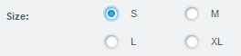
            <br /><br />
            <p>You can create several radio fields with the same name to create a radio group.<br />
            The <code>defaultValue</code> can be used to define the input value of each field.<br />
            The <code>supportText</code> can be used as the box label of each single field.</p>
        </td>
    </tr>
    <tr>
        <td><h5>Combobox</h5><code>createComboBoxField()</code></td>
        <td>
            <ul>
                <li><code>name</code></li>
                <li><code>fieldLabel</code></li>
                <li><code>defaultValue</code></li>
                <li><code>store</code></li>
                <li><code>displayField</code></li>
                <li><code>valueField</code></li>
                <li><code>supportText</code></li>
                <li><code>helpTitle</code></li>
                <li><code>helpText</code></li>
                <li><code>allowBlank</code></li>
            </ul>
        </td>
        <td>
            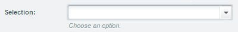
            <br /><br />
            <p>Define the class name of a <code>store</code> you want to use for the combobox. It can either be one of the Shopware base stores in the <code>Shopware.apps.Base.store</code> namespace, or a custom store you will provide in your own ExtJS component for the element.</p>
        </td>
    </tr>
    <tr>
        <td><h5>Numberfield</h5><code>createNumberField()</code></td>
        <td>
            <ul>
                <li><code>name</code></li>
                <li><code>defaultValue</code></li>
                <li><code>fieldLabel</code></li>
                <li><code>supportText</code></li>
                <li><code>helpTitle</code></li>
                <li><code>helpText</code></li>
                <li><code>allowBlank</code></li>
            </ul>
        </td>
        <td>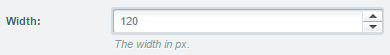</td>
    </tr>
    <tr>
        <td><h5>Time field</h5><code>createTimeField()</code></td>
        <td>
            <ul>
                <li><code>name</code></li>
                <li><code>defaultValue</code></li>
                <li><code>fieldLabel</code></li>
                <li><code>supportText</code></li>
                <li><code>helpTitle</code></li>
                <li><code>helpText</code></li>
                <li><code>allowBlank</code></li>
            </ul>
        </td>
        <td>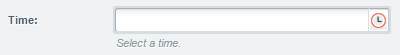</td>
    </tr>
    <tr>
        <td><h5>Date field</h5><code>createDateField()</code></td>
        <td>
            <ul>
                <li><code>name</code></li>
                <li><code>defaultValue</code></li>
                <li><code>fieldLabel</code></li>
                <li><code>supportText</code></li>
                <li><code>helpTitle</code></li>
                <li><code>helpText</code></li>
                <li><code>allowBlank</code></li>
            </ul>
        </td>
        <td>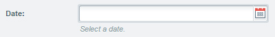</td>
    </tr>
    <tr>
        <td><h5>Text area</h5><code>createTextAreaField()</code></td>
        <td>
            <ul>
                <li><code>name</code></li>
                <li><code>defaultValue</code></li>
                <li><code>fieldLabel</code></li>
                <li><code>supportText</code></li>
                <li><code>helpTitle</code></li>
                <li><code>helpText</code></li>
                <li><code>allowBlank</code></li>
            </ul>
        </td>
        <td>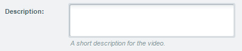</td>
    </tr>
    <tr>
        <td><h5>Text editor</h5><code>createTinyMceField()</code></td>
        <td>
            <ul>
                <li><code>name</code></li>
                <li><code>defaultValue</code></li>
                <li><code>fieldLabel</code></li>
                <li><code>supportText</code></li>
                <li><code>helpTitle</code></li>
                <li><code>helpText</code></li>
                <li><code>allowBlank</code></li>
            </ul>
        </td>
        <td>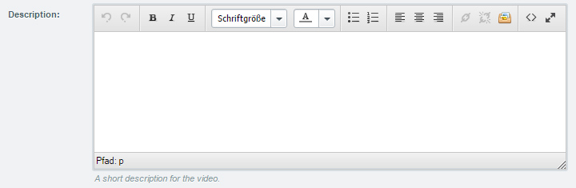</td>
    </tr>
    <tr>
        <td><h5>HTML editor</h5><code>createHtmlEditorField()</code></td>
        <td>
            <ul>
                <li><code>name</code></li>
                <li><code>defaultValue</code></li>
                <li><code>fieldLabel</code></li>
                <li><code>supportText</code></li>
                <li><code>helpTitle</code></li>
                <li><code>helpText</code></li>
                <li><code>allowBlank</code></li>
            </ul>
        </td>
        <td></td>
    </tr>
    <tr>
        <td><h5>Media field</h5><code>createMediaField()</code></td>
        <td>
            <ul>
                <li><code>name</code></li>
                <li><code>defaultValue</code></li>
                <li><code>fieldLabel</code></li>
                <li><code>supportText</code></li>
                <li><code>helpTitle</code></li>
                <li><code>helpText</code></li>
                <li><code>allowBlank</code></li>
                <li><code>valueField (since Shopware 5.2.14)</code></li>
            </ul>
        </td>
        <td>
            
            <br /><br />
            <p>The <code>valueField</code> allows you to control which property of the MediaModel is returned as value</p>
            <p><strong>Example:</strong></p>
            <pre>
$emotionElement->createMediaField([
    'name' => 'preview_image',
    'fieldLabel' => 'The preview image',
    'valueField' => 'virtualPath'
]);
            </pre>
            <p>You can find possible properties in this file: <code>../themes/Backend/ExtJs/backend/media_manager/model/media.js</code></p>
        </td>
    </tr>
    <tr>
        <td><h5>Display field</h5><code>createDisplayField()</code></td>
        <td>
            <ul>
                <li><code>name</code></li>
                <li><code>defaultValue</code></li>
                <li><code>fieldLabel</code></li>
                <li><code>supportText</code></li>
                <li><code>helpTitle</code></li>
                <li><code>helpText</code></li>
            </ul>
        </td>
        <td>
            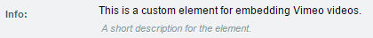
            <br /><br />
            <p>The <code>defaultValue</code> will be used for the displayed value.</p>
        </td>
    </tr>
    <tr>
        <td><h5>Hidden field</h5><code>createHiddenField()</code></td>
        <td>
            <ul>
                <li><code>name</code></li>
                <li><code>defaultValue</code></li>
                <li><code>valueType</code></li>
                <li><code>allowBlank</code></li>
            </ul>
        </td>
        <td>
            <p>You can create hidden fields to save additional data, for example from other custom fields of your ExtJS component. Set the <code>valueType</code> to <code>json</code> to save some JSON encoded data in the field.</p>
        </td>
    </tr>
</table>

## Creating a frontend template for the element ##
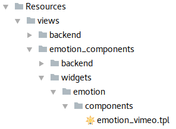
After registering the element and creating all the configuration fields we already see a full functional shopping world element in the backend module which can be placed on the design canvas. All we have to do now is to provide a frontend template to define the layout in the store. In the `Resources/views` directory of our plugin we create the necessary directory structure to the file. Template files for shopping world elements can automatically be added by creating the hierarchy structure in the special directory called `emotion_components`. The full path to the template file would be `Resources/views/emotion_components/widgets/emotion/components/{name}.tpl`.
 
The name of the file has to match the definition in the `createOrUpdate()` method. You can access your configuration fields inside the template file as properties of the `$Data` smarty variable. Let's create the embed code for displaying the Vimeo video.

```
{block name="widgets_emotion_components_vimeo_element"}

    {$videoURL = "https://player.vimeo.com/video/{$Data.vimeo_video_id}?color={$Data.vimeo_interface_color|substr:1}"}

    {if !$Data.vimeo_show_title}
        {$videoURL = "{$videoURL}&title=0"}
    {/if}

    {if !$Data.vimeo_show_portrait}
        {$videoURL = "{$videoURL}&portrait=0"}
    {/if}

    {if !$Data.vimeo_show_author}
        {$videoURL = "{$videoURL}&byline=0"}
    {/if}

    {if $Data.vimeo_loop}
        {$videoURL = "{$videoURL}&loop=1"}
    {/if}

    {if $Data.vimeo_autoplay}
        {$videoURL = "{$videoURL}&autoplay=1"}
    {/if}

    <iframe src="{$videoURL}"
            width="100%"
            height="100%"
            frameborder="0"
            webkitallowfullscreen
            mozallowfullscreen
            allowfullscreen>
    </iframe>
{/block}
```

To load your template you have to register the emotion component view subscriber in your dependency injection container. This subscriber registers all necessary view paths for your frontend template and custom components.

```xml
<service id="swag_vimeo_element.subscriber.templates" class="Shopware\Components\Emotion\EmotionComponentViewSubscriber">
    <argument>%swag_vimeo_element.plugin_dir%</argument>
    <tag name="shopware.event_subscriber"/>
</service>
```

## Process the element data before output ##

When you have to process the saved element data before it is passed to the frontend, you have the possibility to register to the `Shopware_Controllers_Widgets_Emotion_AddElement` controller event. Here you get the original data to manipulate the output.

### Shopware 5.3 and above

Create a new component handler class for your element and implement the `\Shopware\Bundle\EmotionBundle\ComponentHandler\ComponentHandlerInterface`.

```php
use Shopware\Bundle\EmotionBundle\ComponentHandler\ComponentHandlerInterface;
use Shopware\Bundle\EmotionBundle\Struct\Collection\PrepareDataCollection;
use Shopware\Bundle\EmotionBundle\Struct\Collection\ResolvedDataCollection;
use Shopware\Bundle\EmotionBundle\Struct\Element;
use Shopware\Bundle\StoreFrontBundle\Struct\ShopContextInterface;

class VimeoComponentHandler implements ComponentHandlerInterface
{
    public function supports(Element $element)
    {
        return $element->getComponent()->getTemplate() === 'emotion_vimeo';
    }

    public function prepare(PrepareDataCollection $collection, Element $element, ShopContextInterface $context)
    {
        // do some prepare logic, e.g. requesting articles for rendering
    }

    public function handle(ResolvedDataCollection $collection, Element $element, ShopContextInterface $context)
    {
        // do some handle logic and fill the element data, which will be available in your template under $Data.key
        $element->getData()->set('key', 'value');
    }
}
```

Because the handler is called for every element we have to do a check if the handler supports the executed element before processing the data.

Now register the handler in the dependency injection container to make it available when rendering the component.

```xml
<service id="swag_vimeo_element.vimeo_component_handler" class="SwagVimeoElement\ComponentHandler\VimeoComponentHandler">
    <tag name="shopware_emotion.component_handler"/>
</service>
```

<div class="alert alert-info"><b>Hint</b>: Existing plugins using the old method below will still work in Shopware 5.3.</div>

#### Requesting items in ComponentHandler

To make use of the performance improvement, you have to split your logic into a prepare step and handle step. The prepare step collects product numbers or criteria objects which will be resolved across all elements at once. The handle step provides a collection with resolved products and can be filled into your element.

```php
public function prepare(PrepareDataCollection $collection, Element $element, ShopContextInterface $context)
{
    $productNumber = $element->getConfig()->get('selected_product_number');
    $collection->getBatchRequest()->setProductNumbers('my-unique-request', [$productNumber]);
}

public function handle(ResolvedDataCollection $collection, Element $element, ShopContextInterface $context)
{
    $product = current($collection->getBatchResult()->get('my-unique-request'));
    $element->getData()->set('product', $product);
}
```

Keep in mind to use a unique key for requesting and getting products. For best practise, use the element's id in your key (`$element->getId()`).

## Adding a custom component handler for export
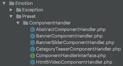
Since Shopware 5.3 it is possible to export and import shopping worlds including all settings and
assets. Shopware delivers component handlers for all standard shopping world elements which use assets. 

Due to the fact every element is storing its assets slightly different, it is required
to have component handlers which "know" their component and know where to extract assets from and where to put back data on import.

The component handlers are using a special service tag to be registered by the `PresetDataSynchronizer` Service which is used to prepare the export and
process the import for single elements.

```xml
<service id="shopware.emotion.preset_banner_component_handler" class="Shopware\Components\Emotion\Preset\ComponentHandler\BannerComponentHandler">
    <argument type="service" id="shopware_media.media_service" />
    <argument type="service" id="shopware.api.media" />
    <argument type="service" id="service_container" />

    <tag name="shopware.emotion.preset_component_handler" />
</service>
```

If you want to register your own component handler you have to add the tag `shopware.emotion.preset_component_handler` to it, to assure that your handler
will be recognized by the import and export process.

Your handler should implement the `ComponentHandlerInterface`. Please take care of the
namespace because there is another ComponentHandlerInterface available via the `EmotionBundle` which differs.

The interface requires three methods to be implemented. The `supports` method needs to return a boolean
to give a signal if the handler can handle the current component. The `import` and `export` methods are responsible for the business logic of the import and
export process. The `import` and `export` methods have to return the processed element at the end.

During export and import processing, the `PresetDataSynchronizer` loops through
all elements of a shopping world and checks if there is a handler which can handle
the component.

Please have look at the Shopware component handlers like the `BannerComponentHandler`. The purpose of a handler is to identify assets used in the component
and to store information about them in the `$syncData ParameterBag`. 

The handler creates an `md5hash` of the media
id which is used to identify double assets inside one shopping world. During the
import process and after importing one asset the information of the imported asset is
also stored in the `ParameterBag` and stored in the preset data, because element import is
handled as a single process for each element, but the elements need information about
already imported assets if they are using the same. 

So if an element is using an already imported
asset, it can gather the information from the `ParameterBag` or otherwise has to store new information after import.

```php
namespace Shopware\Components\Emotion\Preset\ComponentHandler;

use Symfony\Component\HttpFoundation\ParameterBag;

class BannerComponentHandler extends AbstractComponentHandler
{
    
    const COMPONENT_TYPE = 'emotion-components-banner'; // Components unique name

    const ELEMENT_DATA_KEY = 'file'; // Data field with the asset information

    /**
     * {@inheritdoc}
     */
    public function supports($componentType)
    {
        return $componentType === self::COMPONENT_TYPE; // Is the passed componentType the one this handler can handle?
    }

    /**
     * {@inheritdoc}
     */
    public function import(array $element, ParameterBag $syncData)
    {
        if (!isset($element['data'])) {
            return $element;
        }

        return $this->processElementData($element, $syncData);
    }

    /**
     * {@inheritdoc}
     */
    public function export(array $element, ParameterBag $syncData)
    {
        if (!isset($element['data'])) {
            return $element;
        }

        return $this->prepareElementExport($element, $syncData);
    }

    /**
     * @param array        $element
     * @param ParameterBag $syncData
     *
     * @return array
     */
    private function processElementData(array $element, ParameterBag $syncData)
    {
        $data = $element['data'];
        $assets = $syncData->get('assets', []); // Contains info about the assets like actual path
        $importedAssets = $syncData->get('importedAssets', []); // Contains info about already imported assets

        foreach ($data as &$elementData) {
            if ($elementData['key'] === self::ELEMENT_DATA_KEY) {
                if (!array_key_exists($elementData['value'], $assets)) {
                    break;
                }
                if (!array_key_exists($elementData['value'], $importedAssets)) { // Already imported?
                    $assetPath = $assets[$elementData['value']];

                    $media = $this->doAssetImport($assetPath); // Import new/unknown asset
                    $importedAssets[$elementData['value']] = $media->getId();
                } else {
                    $media = $this->getMediaById($importedAssets[$elementData['value']]); // Gather info about already imported asset
                }

                $elementData['value'] = $media->getPath(); // Set the asset path as value on element data

                break;
            }
        }
        unset($elementData);

        $syncData->set('importedAssets', $importedAssets); // Store info about handled asset imports
        $element['data'] = $data;

        return $element; // Return processed element
    }

    /**
     * @param array        $element
     * @param ParameterBag $syncData
     *
     * @return array
     */
    private function prepareElementExport(array $element, ParameterBag $syncData)
    {
        $assets = $syncData->get('assets', []);
        $data = $element['data'];

        foreach ($data as &$elementData) {
            if ($elementData['key'] === self::ELEMENT_DATA_KEY) {
                $assetPath = $elementData['value'];
                $media = $this->getMediaByPath($assetPath);

                if ($media) {
                    $assetHash = md5($media->getId()); // Create hash as unique identifier
                    $assets[$assetHash] = $this->mediaService->getUrl($assetPath);
                    $elementData['value'] = $assetHash; // Save hash as value

                    break;
                }
            }
        }
        unset($elementData);

        $syncData->set('assets', $assets); // Store asset info globally
        $element['data'] = $data;

        return $element;
    }
}
```

## Advanced: Adding a custom emotion component in ExtJS ##

If you want to go a little further by creating custom configuration fields for your element you have the possibility to create your own ExtJS component for the element. Here you have full access to the configuration form in ExtJS. You can manipulate existing fields or add new fields which are more complex than the standard form elements.

The file for the component is also located in the `emotion_components` directory. The complete path to the file is `Resources/views/emotion_components/backend/{name}.js`.

For the Vimeo example we use the custom ExtJS component to make a call to the Vimeo api for receiving information about the preview image of the video and save it in the hidden input we already created via the helper functions.

First of all you have to define a xtype in the createEmotionComponent() method for your element.

```php
$vimeoElement = $this->emotionComponentInstaller->createOrUpdate(
    $this->pluginName,
    'SwagVimeoElement',
    [
        'xtype' => 'emotion-components-vimeo',
        // the config of your component
    ]
);
```

Now we can implement the custom javascript.

```js
//{block name="emotion_components/backend/vimeo_video"}
Ext.define('Shopware.apps.Emotion.view.components.VimeoVideo', {

    extend: 'Shopware.apps.Emotion.view.components.Base',

    alias: 'widget.emotion-components-vimeo',

    snippets: {
        'vimeo_interface_color': {
            'fieldLabel': '{s name=interfaceColorFieldLabel}{/s}',
            'supportText': '{s name=interfaceColorSupportText}{/s}'
        }
    },

    initComponent: function () {
        var me = this;

        me.callParent(arguments);

        me.videoThumbnailField = me.getForm().findField('vimeo_video_thumbnail');
        me.videoIdField = me.getForm().findField('vimeo_video_id');

        me.videoIdField.on('change', Ext.bind(me.onIdChange, me));
    },

    onIdChange: function (field, value) {
        var me = this;

        me.setVimeoPreviewImage(value);
    },

    setVimeoPreviewImage: function (vimeoId) {
        var me = this;

        if (!vimeoId) {
            return false;
        }

        var url = Ext.String.format('https://vimeo.com/api/v2/video/[0].json', vimeoId),
            xhr = new XMLHttpRequest(),
            response;

        xhr.onreadystatechange =  function () {
            if (xhr.readyState === 4 && xhr.status === 200) {
                response = Ext.JSON.decode(xhr.responseText);

                if (response[0]) {
                    me.videoThumbnailField.setValue(response[0]['thumbnail_large']);
                }
            }
        };

        xhr.open('GET', url, true);
        xhr.send();
    }
});
//{/block}
```

The component always has to extend the base class `Shopware.apps.Emotion.view.components.Base`. In the `alias` property it is important to set the `xtype` we already defined during the creation of the element.

In the component you can get access to the fields which you already created by using the `findField()` method on the `form` object which can be received by `this.getForm()`.

If you want to translate the field label, support and help texts, just add the property `snippets`. Using the name which which was set in the emotion component installer, define every input field which you want to translate. 

## Advanced: Adding a custom designer component in ExtJS ##
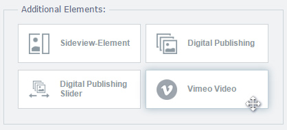
Since Shopware 5.2 you are able to create a custom ExtJS component for the designer elements. Here you have the possibility to add an icon and a preview template for the element, which gets shown in the grid of the designer.

For extending the designer components we have to do a classic template extension of the backend files. So we create a new file in the necessary template hierarchy `Views/backend/emotion/{pluginName}/view/detail/elements`. 

Otherwise than the custom emotion component we have to register the template manually by extending the template inheritance system with our new file. We can subscribe to the `PostDispatch` event of the emotion module.
```xml
<!-- Add TemplateRegistration subscriber to the service.xml -->
    <service id="swag_vimeo_element.subscriber.templates" class="SwagVimeoElement\Subscriber\TemplateRegistration">
        <argument>%swag_vimeo_element.plugin_dir%</argument>
        <tag name="shopware.event_subscriber"/>
    </service>
```
```php
<?php

namespace SwagVimeoElement\Subscriber;

use Enlight\Event\SubscriberInterface;
use Enlight_Controller_ActionEventArgs;

class TemplateRegistration implements SubscriberInterface
{
    /**
     * @var string
     */
    private $pluginDirectory;

    /**
     * @param $pluginDirectory
     */
    public function __construct($pluginDirectory)
    {
        $this->pluginDirectory = $pluginDirectory;
    }

    /**
     * {@inheritdoc}
     */
    public static function getSubscribedEvents()
    {
        return [
            'Enlight_Controller_Action_PostDispatchSecure_Backend_Emotion' => 'onPostDispatchBackendEmotion'
        ];
    }

    /**
     * @param \Enlight_Controller_ActionEventArgs $args
     */
    public function onPostDispatchBackendEmotion(\Enlight_Controller_ActionEventArgs $args)
    {
        $view = $args->getSubject()->View();
        $view->addTemplateDir($this->pluginDirectory . '/Resources/views');
        $view->extendsTemplate('backend/emotion/swag_vimeo_element/view/detail/elements/vimeo_video.js');
    }
}
```

Now that we added our template file we can add our custom component by extending the Smarty `{block}` of the base class.

```
//
//{block name="backend/emotion/view/detail/elements/base"}
//{$smarty.block.parent}
Ext.define('Shopware.apps.Emotion.view.detail.elements.VimeoVideo', {

    extend: 'Shopware.apps.Emotion.view.detail.elements.Base',

    alias: 'widget.detail-element-emotion-components-vimeo',

    componentCls: 'emotion--vimeo-video',

    icon: 'data:image/png;base64,...',

    createPreview: function () {
        var me = this,
            preview = '',
            image = me.getConfigValue('vimeo_video_thumbnail'),
            style;

        if (Ext.isDefined(image)) {
            style = Ext.String.format('background-image: url([0]);', image);

            preview = Ext.String.format('<div class="x-emotion-banner-element-preview" style="[0]"></div>', style);
        }

        return preview;
    }
});
//{/block}
```

<div class="alert alert-info">
When you want to use a custom component for the designer, it is necessary to define a xtype in the createEmotionComponent() method for your element.
</div>

In the component we can extend the base class of the designer elements `Shopware.apps.Emotion.view.detail.elements.Base`. It is important to set the `alias` property to the correct xtype of the element with the prefix `widget.detail-element-`. In the component you have the possibility to override the following options:

<table cellpadding="0" cellspacing="0" width="100%">
    <tr>
        <th width="160">Property</th>
        <th width="100">Type</th>
        <th>Description</th>
    </tr>
    <tr>
        <td><code>icon</code></td>
        <td><code>string</code></td>
        <td>The path to an image which will be used for the <code>src</code> attribute of the icon.<br />For example it could also be a base64 string of the image data.</td>
    </tr>
    <tr>
        <td><code>compCls</code></td>
        <td><code>string</code></td>
        <td>A CSS class which will be added to the element in the designer grid.</td>
    </tr>
    <tr>
        <td><code>createPreview</code></td>
        <td><code>function</code></td>
        <td>A method for creating the preview of the element.<br />It will be shown in the grid of the designer.<br />Returns a HTML string.</td>
    </tr>
    <tr>
        <td><code>minRows</code></td>
        <td><code>number</code></td>
        <td>The minimum number of rows the element can be aligned to in the grid.</td>
    </tr>
    <tr>
        <td><code>maxRows</code></td>
        <td><code>number</code></td>
        <td>The maximum number of rows the element can be aligned to in the grid.</td>
    </tr>
    <tr>
        <td><code>minCols</code></td>
        <td><code>number</code></td>
        <td>The minimum number of columns the element can be aligned to in the grid.</td>
    </tr>
    <tr>
        <td><code>maxCols</code></td>
        <td><code>number</code></td>
        <td>The maximum number of columns the element can be aligned to in the grid.</td>
    </tr>
</table>

## Removing a custom element ##
There's no need to delete your custom element in the plugin's uninstall method on your own. Shopware will remove your element and all the occurrences in emotion worlds on the uninstallation process for you. 

## Downloads ##
You can download the complete example plugin with documented code here:

**Example Plugin**: <a href="{{ site.url }}/exampleplugins/SwagVimeoElement.zip">Download</a>.
