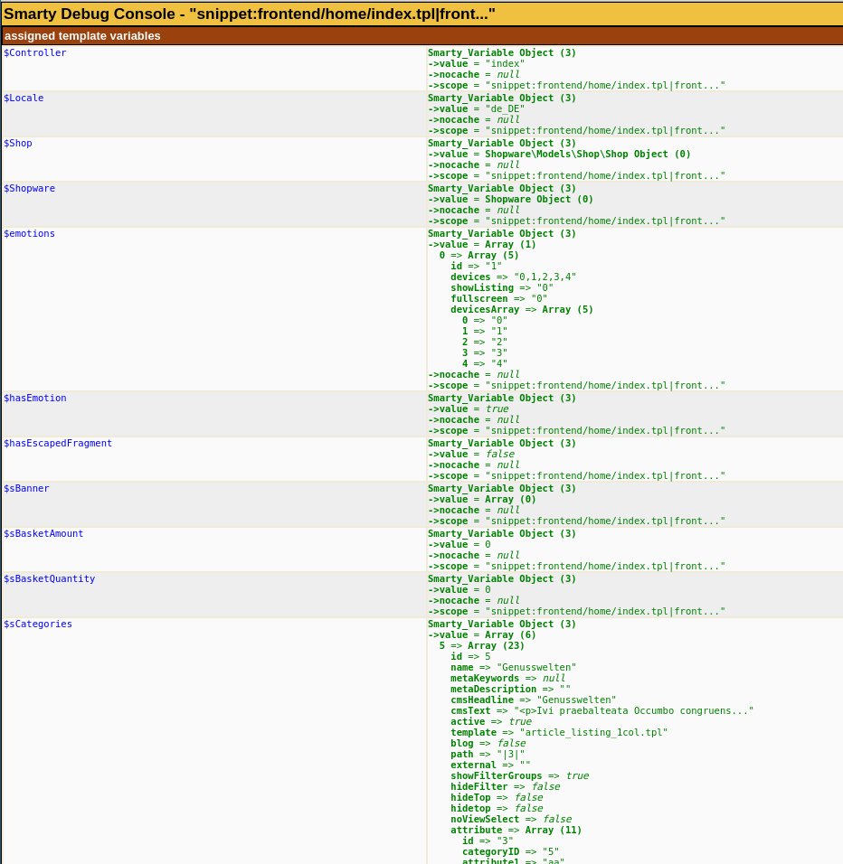
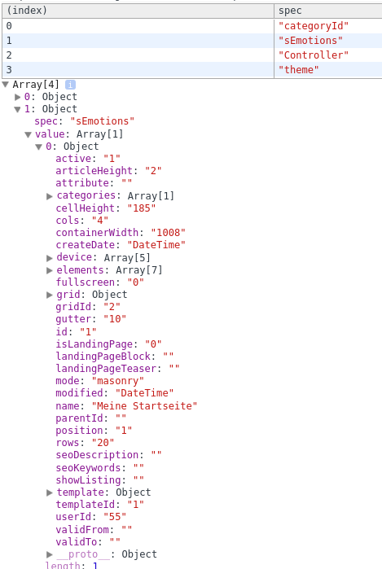

Writing and extending software is only a part of a developer's daily work. Debugging and bug fixing is another relevant part one needs to take care of.
So what should you do if something does not work as it is supposed to?

<div class="alert alert-warning">
<strong>Note:</strong> All the suggested changes in this page are exclusively recommended for development environments. They might expose sensitive information about your system and shop, and should not be performed in public or production systems.
</div>

<div class="toc-list"></div>

## Default log output
First of all you should check if Shopware already logged the error message you are looking for. For that reason you should check the webserver's `error.log` file, as well as Shopware's `logs` directory. Shopware creates a log file per day (if there was something to log).

As Shopware frequently uses AJAX queries in the frontend and backend, you should also open an instance of your browser's developer tools. You might find error messages in the Javascript console or in the network tab. 

By default, Shopware hides exceptions from your customers, in order to not expose private and/or technical data. If you are experiencing problems with your shop installation, you might want to re-enable the error output while debugging, by pasting this snippet into your `config.php` file:

```php
array(
    'db' => [
        // your database configuration
    ],
    'front' => [
        'showException' => true
    ],
    'phpsettings' => [
        'display_errors' => 1,
    ],
)
```

## PHP

### Xdebug

Xdebug is a very common and convenient way to debug your PHP applications. It will allow you to debug a request step by step and inspect variables and object values at any point.

It can be found in all common linux distributions, e.g. in Ubuntu as `php5-xdebug`. After installing the extension, you will need to configure the xdebug php extension, e.g. in the file `/etc/php5/apache2/conf.d/20-xdebug.ini` (this might vary depending on your distribution and PHP setup). Using a local setup, your configuration might look like this:

```
zend_extension=xdebug.so

xdebug.remote_enable=on
xdebug.remote_host=127.0.0.1
xdebug.remote_port=9000
xdebug.idekey=PhpStorm
```

After restarting the web server, Xdebug should already be available. Now you should set up Xdebug in your IDE, (e.g. [PhpStorm](https://www.jetbrains.com/phpstorm/help/configuring-xdebug.html)).
In order to comfortably switch Xdebug on and off, you might use a browser extension like [Xdebug helper for chrome](https://chrome.google.com/webstore/detail/xdebug-helper/eadndfjplgieldjbigjakmdgkmoaaaoc?utm_source=chrome-app-launcher-info-dialog). Equivalent extensions exist for other browsers. Should your browser not have or support these extensions, you might still use Xdebug by appending a specific query argument to your URL. PhpStorm will do this automatically for you if you configure the debug environment, but this feature is not exclusive to this IDE. Refer to Xdebug and your IDE's documentation for more info on this feature.  

This might be very useful, as Xdebug might reduce the overall performance of your request.

If you are debugging a CLI command, you can also use Xdebug. Use `export XDEBUG_CONFIG="idekey=PHPSTORM"` prior to running your PHP CLI command and make sure that PhpStorm is listening for Xdebug connections. Again, this feature is not exclusive to PhpStorm, and might be supported in other IDEs.

### Xdebug and IonCube Loader

Please note, that Xdebug and IonCube Loader has some issues. With PHP 5.x, both extensions won't work at the same time, as long as encrypted plugins are activated. The debugger won't stop at your breakpoints and/or the whole request may crash. Disabling all encrypted plugins will solve the problem.

However, since PHP 7.0 the compatiblity has improved. You're able to use Xdebug, IonCube Loader and encrypted plugins all together. Xdebug will stop at your breakpoints and everything is fine. You're not able to debug encrypted source code, of course. All encrypted code will just be skipped.

It's imported that the IonCube Loader extension is loaded BEFORE the Xdebug extension in your `php.ini`. For more troubleshooting consider the [PHPStorm manual](https://confluence.jetbrains.com/display/PhpStorm/Troubleshooting+PhpStorm+debugging#TroubleshootingPhpStormdebugging-DebuggingwithionCubeinstalled).

### Monolog

Shopware makes use of the Monolog logger, which allows you to log into files, databases, emails or FirePHP. By default a `CoreLogger` and a `PluginLogger` are set up for usage:

```
Shopware()->Container()->get('pluginlogger')->info("my info");
Shopware()->Container()->get('pluginlogger')->warning("my warning");
Shopware()->Container()->get('pluginlogger')->error("my error");
```

These calls will render the messages "my info", "my warning" and "my error" to the file `logs/plugin_production-YYY-MM-DD.log`. Depending on the logger configuration, you could force monolog to only show info messages if a warning or error occurs later (two fingers crossed handler), which might also be a huge benefit in productive environments. If multiple plugins write to the "PluginLogger", creating own loggers with other persistence backends is also an option.

### error_log 

Setting up Xdebug might not always be possible (e.g. you don't have full admin access over a server) or appropriate for a quick output check. The `error_log` function is useful in those cases. It allows you to write output to the webserver's error log file:

```php
error_log('Hello world');
```

In addition to that, `error_log` also allows you to define a file to write to. If you don't have access to the server's log file, or you don't want to spam it with debug messages, this call might be useful to you: 

```php
error_log(print_r(array('hello', 'world'), true)."\n", 3, Shopware()->DocPath() . '/error.log');
```

This will write the content of the array `array('hello', 'world')` properly into the `error.log` file in your Shopware directory.
In addition to that, you can use the linux `tail` command to constantly print out new lines written to that file:

```bash
tail -f error.log
```

### Debugging complex objects / Doctrine

Dumping complex object trees (such as Doctrine models) might cause your browser or server to freeze. For this reason, things like this will not work in most cases:
 
```php
// bad example
echo "<pre>";
print_r(Shopware()->Shop());
exit();
```

Instead, you should use the Doctrine debug helper to print / log complex objects: 

```
$result = \Doctrine\Common\Util\Debug::dump(Shopware()->Shop(), 2, true, false);
// now safely log $result with your preferred logger
```

### shopware-profiler
The [FroshProfiler](https://github.com/FriendsOfShopware/FroshProfiler) is a plugin that adds a developer toolbar to your shop and provides some useful debugging features as:
* showing registered and called events
* viewing of database operations and their results
* providing various template information such as variables and which files were loaded

Special thanks go to [Soner Sayakci](https://github.com/shyim) ([@Shyim97 on Twitter](https://twitter.com/shyim97)) who wrote and maintains this plugin.

## Frontend templates

Writing frontend templates will confront you with questions like "what was that variable's name again?" or "which key holds the price?". 

### Smarty

For these kind of questions, Smarty offers the handy `{debug}` tag. You can just put it in any template block of your
plugin's template, or even the core template (it's just temporary). You should just make sure that the block you
are putting it into is actually rendered. 

In this example, the `{debug}` tag was put in the `themes/Frontend/Bare/frontend/index/index.tpl` file, inside the `frontend_index_html` block.

```
{block name='frontend_index_html'}
{debug}
// rest of the block
{/block}
```

After clearing the cache and refreshing the page, Smarty will generate a new window like this:



As you can see, you have a nice overview of all variables and assignments.

### Debug Plugin

Shopware also ships with a plugin called "debug" which will allow you to print out template assignments to the `console` tab of your developer tools window. Just install the plugin using Shopware's plugin manager, configure it to your needs and reload the page.

As you can restrict the plugin to your own IP address, this is also suitable for production environments.



## ExtJS

Debugging ExtJS errors during development can be very time consuming. Errors like `c is not a constructor` are often not helpful. To address this, you can include `ext-all-debug.js` instead of the default `ext-all.js` file:
Edit the themes/Backend/ExtJs/backend/base/header.tpl` file `and replace `ext-all.js` with `ext-all-debug.js` in the block `backend/base/header/javascript`. 
After clearing the cache and reloading the backend, the "debug" ExtJS file is included, which displays more helpful error messages.

In many cases, you will have no alternative but to debug using `console.log()` calls in your Javascript code. The following list should help you narrow down the error:

* Invalid class names: The name of your ExtJS class (in the `define` call) must match your directory path. E.g. `Resources/views/backend/my_plugin/view/window` should be `Shopware.apps.MyPlugin.view.Window`
* Referencing a wrong xtype: Whenever you use `xtype` to reference a ExtJS class, you should double check if the referenced xtype actually exists.
* Not registering the components: As ExtJS must actually know your components, you need to either register them in the `app.js` file or (when extending pre-existing modules) include them using Smarty and extending the original original applications `app.js` block.
* Missing call to `callParent(arguments);`: When implementing your own components in ExtJS, you will overwrite base-components a lot. When you are implementing a constructor like `initComponent` or `init` you should call `callParent(arguments);` so that ExtJS can handle the base component's logic.
* Smarty errors: Remember that Smarty parses the Javascript backend files. For that reason, Javascript objects always need to have whitespaces before and after the opening and closing curly brace. This also applies for your comments! So if your IDE generates a DocBlock like this:
    
    ```
    // bad example
    /**
    * 
    * @returns {Array}
    */
    function: test() {
        return [];
    }
    ```
    Smarty will try to parse the snippet `{Array}` and raise an exception, as this is not a valid Smarty tag. The same applies for objects like this:
    
    ```
    // bad example
    fields = [
        {name:"test"},
        {name:"another test"},
    ]
    ```
    
    A correct example might look like this:
    
    ```
    // good example
    fields = [
        { name:"test" },
        { name:"another test" },
    ]
    ```

### Tools

The Chrome extension [App Inspector for Sencha™](https://chrome.google.com/webstore/detail/app-inspector-for-sencha/pbeapidedgdpniokbedbfbaacglkceae) might also be very useful.
