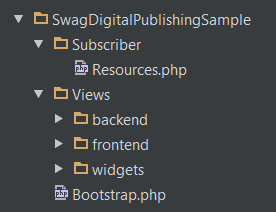
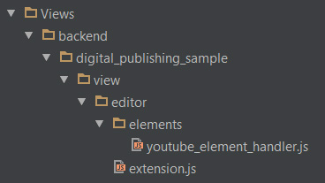
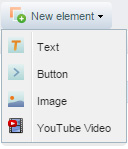

<div class="toc-list"></div>

## Introduction
Digital Publishing is introduced in Shopware 5.1.0 as a new advanced feature. The new backend module enables you to design custom HTML banners right inside of Shopware and use them, for example, in the shopping worlds. In a layout tree, you can create new design layers to add different elements like texts, images, or even button elements and place them over different background types. To unleash the full potential of this new feature, we created the possibility for third party developers to create custom elements for this module. In this article, we want to show you how to get started with your own Digital Publishing element. As an example, we will build a fully functional YouTube element. At the end of this article, you will find a download link to get the complete example plugin.

## The basic plugin structure



We will not describe the hole plugin development in this article, but only the important parts to get started with the custom element. To get more details about developing plugins for Shopware, see the <a href="{{ site.url }}/developers-guide/plugin-quick-start/" target="_blank">quick start guide</a>. In our example we create a plugin called `SwagDigitalPublishingSample`. This is just an example name for our plugin and will be used for some directory and file names. When you create your own plugin, just replace the corresponding parts with the name of your own plugin. 

<br />
<br />

To add a new element to the Digital Publishing module we will need the following components:

- **Subscriber**, to register for specific events
- **Backend handler**, which defines our new element 
- **Frontend template**

## Registering the subscriber
First we register a new **subscriber** and the plugin namespace in the `Bootstrap.php` of our plugin.

```php
public function install()
{
    $this->subscribeEvent('Enlight_Controller_Front_StartDispatch', 'registerSubscriber');
    $this->subscribeEvent('Shopware_Console_Add_Command', 'registerSubscriber');

    return true;
}

public function registerPluginNamespace()
{
    $this->Application()->Loader()->registerNamespace(
        'Shopware\SwagDigitalPublishingSample',
        $this->Path()
    );
}

public function registerSubscriber()
{
    $this->registerPluginNamespace();

    $subscribers = array(
        new Resources($this)
    );

    foreach ($subscribers as $subscriber) {
        $this->Application()->Events()->addSubscriber($subscriber);
    }
}
```

To complete this step we have to create the corresponding file in the `Subscriber` directory of our plugin. In our example, we will use a single subscriber called  `Resources`. In most cases, you would create several subscribers, to split the tasks between backend and frontend, for example. But, for this little example, we will just use a single subscriber for all events. So let's take a look at our `Resources.php` file.

```php
<?php

namespace Shopware\SwagDigitalPublishingSample\Subscriber;

use Enlight\Event\SubscriberInterface;
use Shopware\Components\Theme\LessDefinition;
use Doctrine\Common\Collections\ArrayCollection;

class Resources implements SubscriberInterface
{
    protected $bootstrap;

    public function __construct(\Shopware_Plugins_Backend_SwagDigitalPublishingSample_Bootstrap $bootstrap)
    {
        $this->bootstrap = $bootstrap;
    }

    public static function getSubscribedEvents()
    {
        return array(
            'Enlight_Controller_Action_PostDispatchSecure_Backend_SwagDigitalPublishing' => 'onPostDispatchBackend',
            'Enlight_Controller_Action_PostDispatchSecure_Widgets_SwagDigitalPublishing' => 'onPostDispatchFrontend',
            'Enlight_Controller_Action_PostDispatchSecure_Widgets_Emotion' => 'onPostDispatchFrontend',
            'Theme_Compiler_Collect_Plugin_Less' => 'onAddLessFiles',
        );
    }

    public function onPostDispatchBackend(\Enlight_Event_EventArgs $args)
    {
        $subject = $args->getSubject();
        $view = $subject->View();

        $view->addTemplateDir($this->bootstrap->Path() . 'Views/');
        $view->extendsTemplate('backend/swag_digital_publishing_sample/view/editor/extension.js');
        $view->extendsTemplate('backend/swag_digital_publishing_sample/view/editor/elements/youtube_element_handler.js');
    }

    public function onPostDispatchFrontend(\Enlight_Event_EventArgs $args)
    {
        $subject = $args->getSubject();
        $view = $subject->View();

        $view->addTemplateDir($this->bootstrap->Path() . 'Views/');
    }

    public function onAddLessFiles()
    {
        $less = new LessDefinition(array(), array( __DIR__ . '/../Views/frontend/_public/src/less/all.less'), __DIR__);

        return new ArrayCollection(array($less));
    }
}
```

In the `getSubscribedEvents()` method we return all necessary events we want to subscribe to and the corresponding callback method. We have at least three callback methods which are called by our subscriber:

- `onPostDispatchBackend`: extends the backend with our ExtJS template files.
- `onPostDispatchFrontend`: Adds the *Views* directory, so we can automatically extend the templates of the storefront.
- `onAddLessFiles`: enables us to add new LESS files to the theme compiler for a little bit of styling.



In the next step, we will look at the first event, which subscribes to the post dispatch of the backend. With it, we can extend the backend with our ExtJS template files in the `onPostDispatchBackend` callback. To add a new element to the Digital Publishing module, we have to extend the original `container.js` of the editor with our own `extension.js` file. All files should go in the `Views` directory of our plugin, in `backend/swag_digital_publishing_sample/view/editor`. We also create the custom handler for our element in the `elements` subdirectory called `youtube_element_handler.js`. These files are added to the backend template by the `extendsTemplate()` method.

## Creating the backend handler

Now that we extended the backend template and created the necessary ExtJS files, we can write some code. Let's start with the custom handler for our element: `Views/backend/swag_digital_publishing_sample/view/editor/elements/youtube_element_handler.js`

```
//{block name="backend/swag_digital_publishing/view/editor/abstract_element_handler"}
// {$smarty.block.parent}
Ext.define('Shopware.apps.SwagDigitalPublishing.view.editor.elements.YouTubeElementHandler', {

    extend: 'Shopware.apps.SwagDigitalPublishing.view.editor.elements.AbstractElementHandler',

    name: 'youtube',

    label: 'YouTube Video',

    iconCls: 'sprite-film-youtube',

    createFormItems: function(elementRecord, data) {}
});
//{/block}
```

To extend the backend template, we're editing the Smarty `{block}` of the abstract handler by using the `{$smarty.block.parent}` function, so we can append our custom handler to the parent `{block}`. Every element handler has to extend the abstract handler to implement the basic functionality for the Digital Publishing elements. This has also some advantages for you, because you don't have to take care of data handling and other trivial operations. All element handlers have to define the following properties:

- `name`: a machine name for internal use
- `label`: the readable name of the element
- `iconCls`: the CSS class for the element icon
- `createFormItems()`: the method which returns the configuration fields for this element

Now that we have created the handler, we have to add it to the list of available element handlers. Therefore, we created the `extension.js` to extend the original editor: `Views/backend/swag_digital_publishing_sample/view/editor/extension.js`

```
//{block name="backend/swag_digital_publishing/view/editor/container"}
// {$smarty.block.parent}
Ext.define('Shopware.apps.SwagDigitalPublishing.view.editor.YouTubeExtension', {

    override: 'Shopware.apps.SwagDigitalPublishing.view.editor.Container',

    initComponent: function() {
        var me = this;

        /**
         * Create an instance of your custom element handler.
         */
        var youTubeHandler = Ext.create('Shopware.apps.SwagDigitalPublishing.view.editor.elements.YouTubeElementHandler');

        /**
         * Check if there is already a registered handler with the same name.
         */
        if (me.getElementHandlerByName(youTubeHandler.getName()) === null) {

            /**
             * Add the custom handler to the list of available handlers.
             */
            me.elementHandlers.push(youTubeHandler);
        }

        /**
         * Call the parent init method.
         */
        me.callParent(arguments);
    }
});
//{/block}
```



We're using an override of the `Shopware.apps.SwagDigitalPublishing.view.editor.Container` to add a new instance of our custom handler to the `elementHandlers` property, which holds a list of all available handlers. Don't forget to call `me.callParent(arguments)` to make sure the original component works as intended. After installing the plugin, you should already see the new element as a selectable item in the element menu of the Digital Publishing editor. 

## Adding configuration fields

Now that have a new selectable element, we want to add some configuration fields to it, which the user can use to edit the element. We will use the `createFormItems()` method to create a custom field set.

```
createFormItems: function(elementRecord, data) {
    var me = this;

    me.generalFieldset = Ext.create('Ext.form.FieldSet', {
        title: 'YouTube Settings',
        layout: 'anchor',
        defaults: {
            anchor : '100%',
            labelWidth: 100
        },
        items: [{
            xtype: 'textfield',
            name: 'youTubeId',
            translatable: true,
            fieldLabel: 'YouTube ID',
            value: data['youTubeId'] || '',
            listeners: {
                change: Ext.bind(me.updateElementRecord, me, [ me.formPanel, elementRecord ])
            }
        }, {
            xtype: 'numberfield',
            name: 'maxWidth',
            fieldLabel: 'Max width',
            value: data['maxWidth'] || 280,
            allowDecimals: false,
            minValue: 0,
            listeners: {
                change: Ext.bind(me.updateElementRecord, me, [ me.formPanel, elementRecord ])
            }
        }, {
            xtype: 'numberfield',
            name: 'maxHeight',
            fieldLabel: 'Max height',
            value: data['maxHeight'] || 158,
            allowDecimals: false,
            minValue: 0,
            listeners: {
                change: Ext.bind(me.updateElementRecord, me, [ me.formPanel, elementRecord ])
            }
        }, {
            xtype: 'checkbox',
            name: 'controls',
            fieldLabel: 'Show Controls',
            checked: !!data['controls'],
            listeners: {
                change: Ext.bind(me.updateElementRecord, me, [ me.formPanel, elementRecord ])
            }
        }, {
            xtype: 'checkbox',
            name: 'showinfo',
            fieldLabel: 'Show Info',
            checked: !!data['showinfo'],
            listeners: {
                change: Ext.bind(me.updateElementRecord, me, [ me.formPanel, elementRecord ])
            }
        }]
    });

    return me.generalFieldset;
}
```

It is recommended to implement at least one field set, as shown in the example, to keep a consistent look and feel of the settings across all elements. In the items of the field set, you can use any kind of ExtJS fields, so you have many possibilities when creating your custom element. All fields of your element are just defined by this form. But there also some things you have to take care of.

### Loading existing data to the fields ###

The configuration form will not automatically load data from a model, because all elements are saved in a JSON encoded payload string. The decoded data of the fields is already passed in the `data` argument of the `createFormItems()` method. All you have to do is set the value of each field manually. You can also define a default value for the field. Example: `value: data['maxWidth'] || 280,`.

### Adding change listeners ### 

To always update the corresponding data model with recent data from your element configuration, you have to implement event listeners to your form fields. The listener has to be bound to the `me.updateElementRecord` method, which needs the form panel (`me.formPanel`) and the element model (`elementRecord`) as its arguments. In most cases, you will register to the `change` event of the field. This is necessary for the live preview, to show the changes directly to the user, among other reasons.

### Making fields translatable ###

We already implemented the functionality to translate the fields of an element into different languages. If you want to make some fields of your element translatable, you just have to add the corresponding property to the field: `translatable: true`. When you do so, a small globe will appear in your field, where the user can add the translations.

## Creating the frontend template ##

Now that we have a fully functional element, we want to add the frontend template. In the subscriber we already added the `Views/` directory of our plugin via the `onPostDispatchFrontend` callback, so we can directly add a new template file. All element templates are located in the `widgets/swag_digital_publishing/components/` directory. We create the same structure for our custom element and create the corresponding template file `youtube.tpl`. It is important that the file has exactly the same name as we defined it in the ExtJS handler. The template will then be loaded automatically for our element.

```
<div class="dig-pub--youtube">

    {$controls = 0}
    {$showinfo = 0}

    {if $element.controls}
        {$controls = 1}
    {/if}

    {if $element.showinfo}
        {$showinfo = 1}
    {/if}

    <iframe class="youtube--frame"
            style="width: {$element.maxWidth / 16}rem; height: {$element.maxHeight / 16}rem;"
            src="https://www.youtube-nocookie.com/embed/{$element.youTubeId}?rel=0&amp;controls={$controls}&amp;showinfo={$showinfo}"
            frameborder="0"
            allowfullscreen>
    </iframe>
</div>
```

The rest is just little bit of frontend details and Smarty code. All element fields are available in the `{$element}` variable.


## Styling the element ##
To style the element we already added a new LESS file called `all.less` in the subscriber, via the `onAddLessFiles()` callback. The file is located in the frontend directory under `Views/frontend/_public/src/less/`. Here we can put some LESS / CSS code to add a little bit of styling to our element.

```
.dig-pub--youtube {
    display: block;
    width: 100%;

    .youtube--frame {
        max-width: 100%;
        max-height: 100%;
    }
}
```

The YouTube element doesn't need much styling. We're using a combination of `width` and `max-width: 100%;` to let the YouTube frame not become bigger than the design layer. So, in a responsive layout, the frame would shrink accordingly when there is not enough space.


## Data handling ##

Not every element has a simple structure like the YouTube sample. Sometimes you want to manipulate the data of the element before it gets passed to the frontend. Therefore, we added a special event you can subscribe to. You could use another subscriber to do so.

```php
public static function getSubscribedEvents()
{
    return array(
        'SwagDigitalPublishing_ContentBanner_FilterResult' => 'onContentBannerFilter'
    );
}

public function onContentBannerFilter(\Enlight_Event_EventArgs $args) 
{
    $banner = $args->getReturn();

    // Do some magic data manipulation

    return $banner;
}
```

Via the event `$args` you can get the return value with `$args->getReturn()`. The return value contains the hole banner data with all layers and elements. You can do some data manipulation and return the data afterwards. For example, you could load some media data, if the user can select media files in your element.

## Conclusion ##
In this article we learned how to create custom elements for the Digital Publishing module. All that we need is to add a new ExtJS handler and a frontend template. I hope you enjoyed the tutorial and that you will create amazing elements for this new kind of module. Feel free to give us some feedback in the forum.


## Download ##

**Sample Plugin**: <a href="{{ site.url }}/exampleplugins/SwagDigitalPublishingSample.zip">Download</a>.
