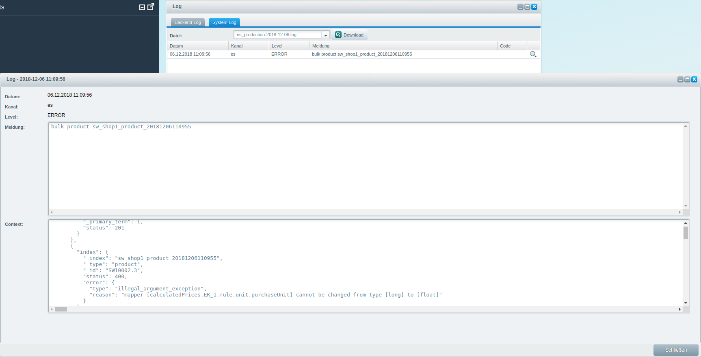

<div class="toc-list"></div>

## Introduction
In this guide we introduce the Elasticsearch (ES) integration for Shopware.

Shopware uses three bundles for the ES implementation:

1. ESIndexingBundle - Contains all components that index data from Shopware to ES
2. SearchBundleES   - Implementation of the SearchBundle using ES
3. EsBackendBundle  - Implementation ES in the Backend (Shopware 5.5)

## Libraries

Shopware uses the official PHP low-level client for Elasticsearch [elasticsearch-php](https://www.elastic.co/guide/en/elasticsearch/client/php-api/current/index.html) as well as the [ONGR](http://www.ongr.io/) Elasticsearch DSL library [ElasticsearchDSL](https://github.com/ongr-io/ElasticsearchDSL) that provides an objective query builder.

## Public API
The following list contains all relevant events, interfaces and public API calls for Elasticsearch:

| Console Command                    | Description
|------------------------------------|-----------------------------
| sw:es:analyze                      | Helper tool to test the integrated analyzers.
| sw:es:backlog:clear                | Remove backlog entries that are already synchronized.
| sw:es:backlog:sync                 | Synchronize events from the backlog to the live index.
| sw:es:index:cleanup                | Remove unused Elasticsearch indices.
| sw:es:index:populate               | Reindex all shops into new indexes and switch the live system alias after the index process.
| sw:es:backend:index:populate       | Reindex all documents for the backend.
| sw:es:backend:sync                 | Synchronize events from the backend backlog to the live index.
| sw:es:switch:alias                 | Switch live system aliases.

| Interface                                         | Description
|---------------------------------------------------|-----------------------------
| DataIndexerInterface                              | Required to add new data indexer
| MappingInterface                                  | Required to add new data mappings
| SettingsInterface                                 | Required to add new ES settings
| SynchronizerInterface                             | Required to add new data synchronizer
| ShopAnalyzerInterface                             | Defines which ES analyzer(s) is used in which shop
| SearchTermQueryBuilderInterface                   | Builds the search query for product search
| HandlerInterface                                  | Allows handling criteria parts in ES number searches
| ResultHydratorInterface                           | Allows hydrating ES number search results

| DI Container service                              | Description
|---------------------------------------------------|-----------------------------
| shopware_elastic_search.client                    | ES client for communication
| shopware_elastic_search.client.logger             | Logs specific ES requests and their responses
| shopware_elastic_search.shop_indexer              | Starts indexing process for all shops
| shopware_elastic_search.shop_analyzer             | Defines which ES analyzer(s) is used in which shop
| shopware_elastic_search.backlog_processor         | Process the backlog queue
| shopware_search_es.product_number_search          | ProductNumberSearch using ES
| shopware_search_es.search_term_query_builder      | Builds the search query for product searches
| shopware_es_backend.indexer                       | Starts backend indexing process for all shops

| DI Container tag                                  | Description
|---------------------------------------------------|-----------------------------
| shopware_elastic_search.data_indexer              | Registers a new data indexer
| shopware_elastic_search.mapping                   | Registers a new data mapping
| shopware_elastic_search.synchronizer              | Registers a new data synchronizer
| shopware_elastic_search.settings                  | Registers a new ES settings class
| shopware_search_es.search_handler                 | Registers a new search handler

| Event                                             | Description
|---------------------------------------------------|-----------------------------
| Shopware_ESIndexingBundle_Collect_Indexer         | Registers a new data indexer
| Shopware_ESIndexingBundle_Collect_Mapping         | Registers a new data mapping
| Shopware_ESIndexingBundle_Collect_Synchronizer    | Registers a new data synchronizer
| Shopware_ESIndexingBundle_Collect_Settings        | Registers a new ES settings class
| Shopware_SearchBundleES_Collect_Handlers          | Registers a new search handler

## Indexing additional data
One common use case is to index additional data into ES and make it searchable. The following example shows which components are required to add new data sources to ES and keep it up to date. After data is indexed, the product number search will be extended to select additional data. The example indexes Shopware blog entries. To index additional data, the following class implementations are required:
1. DataIndexerInterface
2. MappingInterface
3. SynchronizerInterface
4. A class to record Doctrine events and write them into the backlog

You can find a installable ZIP package of this plugin <a href="{{ site.url }}/exampleplugins/SwagESBlog.zip">here</a>.

### Register the services and subscriber
The plugin service.xml looks as follows:

```xml
<container xmlns="http://symfony.com/schema/dic/services"
           xmlns:xsi="http://www.w3.org/2001/XMLSchema-instance"
           xsi:schemaLocation="http://symfony.com/schema/dic/services http://symfony.com/schema/dic/services/services-1.0.xsd">

    <services>

        <service id="swag_es_blog.bundle_blog_provider" class="SwagESBlog\Bundle\ESIndexingBundle\BlogProvider">
            <argument type="service" id="dbal_connection"/>
        </service>

        <!-- Add DataIndexer 'BlogDataIndexer' -->
        <service id="swag_es_blog.bundle.indexer" class="SwagESBlog\Bundle\ESIndexingBundle\BlogDataIndexer">
            <argument type="service" id="dbal_connection"/>
            <argument type="service" id="shopware_elastic_search.client"/>
            <argument type="service" id="swag_es_blog.bundle_blog_provider"/>
            <!-- /.../engine/Shopware/Bundle/ESIndexingBundle/DependencyInjection/CompilerPass/DataIndexerCompilerPass.php -->
            <tag name="shopware_elastic_search.data_indexer"/>
        </service>

        <!-- Add search mapping 'BlogMapping' -->
        <service id="swag_es_blog.bundle.mapping" class="SwagESBlog\Bundle\ESIndexingBundle\BlogMapping">
            <argument type="service" id="shopware_elastic_search.field_mapping"/>
            <!-- /.../engine/Shopware/Bundle/ESIndexingBundle/DependencyInjection/CompilerPass/MappingCompilerPass.php -->
            <tag name="shopware_elastic_search.mapping"/>
        </service>

        <!-- Add settings 'BlogSettings' -->
        <service id="swag_es_blog.bundle.settings" class="SwagESBlog\Bundle\ESIndexingBundle\BlogSettings">
            <!-- /.../engine/Shopware/Bundle/ESIndexingBundle/DependencyInjection/CompilerPass/SettingsCompilerPass.php -->
            <tag name="shopware_elastic_search.settings"/>
        </service>

        <!-- Add synchronizer 'BlogSynchronizer' -->
        <service id="swag_es_blog.bundle.synchronizer" class="SwagESBlog\Bundle\ESIndexingBundle\BlogSynchronizer">
            <argument type="service" id="swag_es_blog.bundle.indexer"/>
            <argument type="service" id="dbal_connection"/>
            <!-- /.../engine/Shopware/Bundle/ESIndexingBundle/DependencyInjection/CompilerPass/SynchronizerCompilerPass.php -->
            <tag name="shopware_elastic_search.synchronizer"/>
        </service>

        <!-- Add search 'BlogSearch' -->
        <service id="swag_es_blog.search_bundle.search" class="SwagESBlog\Bundle\SearchBundleES\BlogSearch">
            <argument type="service" id="shopware_elastic_search.client"/>
            <argument type="service" id="shopware_search.product_search"/>
            <argument type="service" id="shopware_elastic_search.index_factory"/>
            <!-- /.../engine/Shopware/Bundle/SearchBundleES/DependencyInjection/CompilerPass/SearchHandlerCompilerPass.php -->
            <tag name="shopware_search_es.search_handler"/>
        </service>

        <!-- Add doctrine event subscriber 'ORMBacklogSubscriber.php' -->
        <service id="user_listener" class="SwagESBlog\Subscriber\ORMBacklogSubscriber">
            <argument type="service" id="service_container"/>
            <!-- /.../engine/Shopware/Components/DependencyInjection/Compiler/DoctrineEventSubscriberCompilerPass.php -->
            <tag name="doctrine.event_subscriber"/>
        </service>

    </services>

</container>
```

The service file contains only the events needed to register the new services and subscriber. The following classes are initialized and registered:

| Class                     | Description
|---------------------------|--------------------------
| BlogMapping               | Defines how a blog data structure looks like
| BlogDataIndexer           | Populates the blog data into the ES indices
| BlogProvider              | Helper class which provides data for blog entries
| ORMBacklogSubscriber      | Traces Doctrine events for the blog entity and insert changes into the backlog queue
| BlogSynchronizer          | Handles backlog queue to synchronize blog entities which are added by the `ORMBacklogSubscriber`

To index data into ES, the `BlogMapping`, `BlogDataIndexer` and `BlogProvider` are required.

### Additional mapping
Before data can be indexed, a data mapping has to be created. This is defined in the `BlogMapping` class, which looks as follows:

```php
<?php

namespace SwagESBlog\Bundle\ESIndexingBundle;

use Shopware\Bundle\ESIndexingBundle\FieldMappingInterface;
use Shopware\Bundle\ESIndexingBundle\MappingInterface;
use Shopware\Bundle\StoreFrontBundle\Struct\Shop;

class BlogMapping implements MappingInterface
{
    /**
     * @var FieldMappingInterface
     */
    private $fieldMapping;

    /**
     * @param FieldMappingInterface $fieldMapping
     */
    public function __construct(FieldMappingInterface $fieldMapping)
    {
        $this->fieldMapping = $fieldMapping;
    }

    /**
     * @return string
     */
    public function getType()
    {
        return 'blog';
    }

    /**
     * @param Shop $shop
     * @return array
     */
    public function get(Shop $shop)
    {
        return [
            'properties' => [
                'id' => ['type' => 'long'],
                'title' => $this->fieldMapping->getLanguageField($shop),
                'shortDescription' => $this->fieldMapping->getLanguageField($shop),
                'longDescription' => $this->fieldMapping->getLanguageField($shop),
                'metaTitle' => $this->fieldMapping->getLanguageField($shop),
                'metaKeywords' => $this->fieldMapping->getLanguageField($shop),
                'metaDescription' => $this->fieldMapping->getLanguageField($shop)
            ]
        ];
    }
}
```

`BlogMapping` uses the `FieldMappingInterface` to get definitions for language fields. It returns a string field definition with sub fields for configured shop analyzers. A language field is only required if a search term for this field has to be analyzed for different shop languages. For fields which shouldn't be searchable, it is more useful to define a simple string field. Example for shop with english locale:

```php
[
    [type] => string
    [fields] => [
        [english_analyzer] => [
            [type] => string
            [analyzer] => english
        ]
    ]
]
```

The `english_analyzer` field uses, at indexing and search time, a pre configured english analyzer of ES. The `getType` function defines the unique name for the data type, in this example `blog`.

### Additional indexer
After the data mapping is defined, the data can be indexed using the `BlogDataIndexer`, which looks as follows:

```php
<?php

namespace SwagESBlog\Bundle\ESIndexingBundle;

use Doctrine\DBAL\Connection;
use Elasticsearch\Client;
use Shopware\Bundle\ESIndexingBundle\Console\ProgressHelperInterface;
use Shopware\Bundle\ESIndexingBundle\DataIndexerInterface;
use Shopware\Bundle\ESIndexingBundle\Struct\ShopIndex;
use Shopware\Bundle\StoreFrontBundle\Struct\Shop;

class BlogDataIndexer implements DataIndexerInterface
{
    /**
     * @var Connection
     */
    private $connection;

    /**
     * @var Client
     */
    private $client;

    /**
     * @var BlogProvider
     */
    private $provider;

    /**
     * @param Connection $connection
     * @param Client $client
     * @param BlogProvider $provider
     */
    public function __construct(
        Connection $connection,
        Client $client,
        BlogProvider $provider
    ) {
        $this->connection = $connection;
        $this->client = $client;
        $this->provider = $provider;
    }

    /**
     * @param ShopIndex $index
     * @param ProgressHelperInterface $progress
     */
    public function populate(ShopIndex $index, ProgressHelperInterface $progress)
    {
        $ids = $this->getBlogIds($index->getShop());
        $progress->start(count($ids), 'Indexing blog');

        $chunks = array_chunk($ids, 100);
        foreach ($chunks as $chunk) {
            $this->index($index, $chunk);
            $progress->advance(100);
        }

        $progress->finish();
    }

    /**
     * @param ShopIndex $index
     * @param int[] $ids
     */
    public function index(ShopIndex $index, $ids)
    {
        if (empty($ids)) {
            return;
        }

        $blog = $this->provider->get($ids);
        $remove = array_diff($ids, array_keys($blog));

        $documents = [];
        foreach ($blog as $row) {
            $documents[] = ['index' => ['_id' => $row->getId()]];
            $documents[] = $row;
        }

        foreach ($remove as $id) {
            $documents[] = ['delete' => ['_id' => $id]];
        }

        if (empty($documents)) {
            return;
        }

        $this->client->bulk([
            'index' => $index->getName(),
            'type'  => 'blog',
            'body'  => $documents
        ]);
    }

    private function getBlogIds(Shop $shop)
    {
        $query = $this->connection->createQueryBuilder();
        $query->select('blog.id')
            ->from('s_blog', 'blog')
            ->innerJoin('blog', 's_categories', 'category', 'category.id = blog.category_id AND category.path LIKE :path')
            ->setParameter(':path', '%|'.(int)$shop->getCategory()->getId().'|%');

        return $query->execute()->fetchAll(\PDO::FETCH_COLUMN);
    }
}
```

The `populate` function is responsible for loading all blog entries into ES for the provided shop.
Since the shop indexer doesn't know how to iterate the `DataIndexer` rows, the iteration has to be inside the `populate` function. A progress can be displayed using the provided `ProgressHelperInterface`. First, the function selects all blog ids for the provided shop and passes them into the `index` function. To separate data indexing and data loading, the `BlogIndexer` loads blog data using his own `BlogProvider`.

```php
$blog = $this->provider->get($ids);
```

ES allows executing multiple task types, such as delete, update and insert, inside a single request, using the [Bulk API](https://www.elastic.co/guide/en/elasticsearch/reference/current/docs-bulk.html), which expects the following parameters:
- index (name of the ES index)
- type  (mapping type, `blog` in this case)
- body  (documents to index)

To index a document using the bulk API, two array elements must be sent:

```php
$this->client->bulk([
    'index' => $index->getName(),
    'type'  => 'blog',
    'body'  => [
        ['index' => ['_id' => 1]],
        ['name' => 'First blog row', 'title' => '...', ...]
    ]
]);
```

Documents provided using the bulk API must be json serializable. In this case, the provider returns a `BlogStruct`, which implements the `JsonSerializable` interface.
The indexing process can be started using the `sw:es:index:populate` console command:
```bash
$ php bin/console sw:es:index:populate

## Indexing shop Deutsch ##
Indexing blog
 3/3 [============================] 100%  1 sec/1 sec
Indexing properties
 5/5 [============================] 100%  1 sec/1 sec
Indexing products
 197/197 [============================] 100%  1 sec/1 sec

## Indexing shop English ##
Indexing blog
 3/3 [============================] 100%  1 sec/1 sec
Indexing properties
 5/5 [============================] 100%  1 sec/1 sec
Indexing products
 107/107 [============================] 100%  1 sec/1 sec
```

<div class="alert alert-info" role="alert">
    <strong>Note:</strong> Shopware creates a index for each shop, to separate language specify data. This prevents a language mixing inside an ES index. Otherwise, the search term might be mixed, and a search couldn't be limited to the shop the user is currently browsing. This means that each indexer has to index the data directly in the provided shop language. The shop can be accessed using the provided `ShopIndex` class. Additionally, all restrictions to customer groups, shops or others have to be indexed too.
</div>

### Additional synchronisation
To keep the blog entries up to date, it is required to synchronize the blog data when changes are made.
By default, Shopware traces changes using [doctrine events](http://docs.doctrine-project.org/projects/doctrine-orm/en/latest/reference/events.html).
The first step to synchronize blog entries is registering the `ORMBacklogSubscriber` service. It subscribes to Doctrine's `onFlush` and `postFlush` events, in order to trace data changes.

```php
<?php

namespace SwagESBlog\Subscriber;

use Doctrine\Common\EventSubscriber;
use Doctrine\ORM\Event\OnFlushEventArgs;
use Doctrine\ORM\Event\PostFlushEventArgs;
use Doctrine\ORM\Events;
use Shopware\Bundle\ESIndexingBundle\Struct\Backlog;
use Shopware\Components\DependencyInjection\Container;
use Shopware\Components\Model\ModelEntity;
use Shopware\Components\Model\ModelManager;
use Shopware\Models\Blog\Blog as BlogModel;

class ORMBacklogSubscriber implements EventSubscriber
{
    const EVENT_BLOG_DELETED = 'blog_deleted';
    const EVENT_BLOG_INSERTED = 'blog_inserted';
    const EVENT_BLOG_UPDATED = 'blog_updated';

    /**
     * @var Backlog[]
     */
    private $queue = [];

    /**
     * @var array
     */
    private $inserts;

    /**
     * @var bool
     */
    private $eventRegistered = false;

    /**
     * @var Container
     */
    private $container;

    /**
     * @param Container $container
     */
    public function __construct(Container $container)
    {
        $this->container = $container;
    }

    /**
     * {@inheritdoc}
     */
    public function getSubscribedEvents()
    {
        return [
            Events::onFlush,
            Events::postFlush
        ];
    }

    /**
     * @param OnFlushEventArgs $eventArgs
     */
    public function onFlush(OnFlushEventArgs $eventArgs)
    {
        /** @var $em ModelManager */
        $em = $eventArgs->getEntityManager();
        $uow = $em->getUnitOfWork();

        // Entity deletions
        foreach ($uow->getScheduledEntityDeletions() as $entity) {
            $backlog = $this->getDeleteBacklog($entity);
            if (!$backlog) {
                continue;
            }
            $this->queue[] = $backlog;
        }

        // Entity Insertions
        foreach ($uow->getScheduledEntityInsertions() as $entity) {
            $this->inserts[] = $entity;
        }

        // Entity updates
        foreach ($uow->getScheduledEntityUpdates() as $entity) {
            $backlog = $this->getUpdateBacklog($entity);
            if (!$backlog) {
                continue;
            }
            $this->queue[] = $backlog;
        }
    }

    /**
     * @param PostFlushEventArgs $eventArgs
     */
    public function postFlush(PostFlushEventArgs $eventArgs)
    {
        foreach ($this->inserts as $entity) {
            $backlog = $this->getInsertBacklog($entity);
            if (!$backlog) {
                continue;
            }
            $this->queue[] = $backlog;
        }
        $this->inserts = [];

        $this->registerShutdownListener();
    }

    private function registerShutdownListener()
    {
        if ($this->eventRegistered) {
            return;
        }

        $this->eventRegistered = true;
        $this->container->get('events')->addListener(
            'Enlight_Controller_Front_DispatchLoopShutdown',
            function () {
                $this->processQueue();
            }
        );
    }

    private function processQueue()
    {
        if (empty($this->queue)) {
            return;
        }
        $this->container->get('shopware_elastic_search.backlog_processor')->add($this->queue);
        $this->queue = [];
    }

    /**
     * @param ModelEntity $entity
     * @return Backlog
     */
    private function getDeleteBacklog($entity)
    {
        switch (true) {
            case ($entity instanceof BlogModel):
                return new Backlog(self::EVENT_BLOG_DELETED, ['id' => $entity->getId()]);
        }
    }

    /**
     * @param ModelEntity $entity
     * @return Backlog
     */
    private function getInsertBacklog($entity)
    {
        switch (true) {
            case ($entity instanceof BlogModel):
                return new Backlog(self::EVENT_BLOG_INSERTED, ['id' => $entity->getId()]);

        }
    }

    /**
     * @param ModelEntity $entity
     * @return Backlog
     */
    private function getUpdateBacklog($entity)
    {
        switch (true) {
            case ($entity instanceof BlogModel):
                return new Backlog(self::EVENT_BLOG_UPDATED, ['id' => $entity->getId()]);
        }
    }
}
```

It separates between update, delete and insert actions of the Shopware blog model. This class can be used as reference for other implementations.
To prevent database operation inside a Doctrine flush event, the `postFlush` function registers a dynamic event listener for the `Enlight_Controller_Front_DispatchLoopShutdown` event, which inserts new backlogs entries at the end of the request.
New backlogs can be easily added using the `shopware_elastic_search.backlog_processor` service. A `Backlog` struct contains the following data structure:
- `event` >  which can be defined manually
- `payload` > data which will be saved as json string

Changes to blog entries are traced and stored in the `s_es_backlog` table. The synchronisation process will take place when the `sw:es:backlog:sync` command is called.
To handle the backlog queue, it is required to register an additional `SynchronizerInterface`, which looks as follows:

```php
<?php

namespace SwagESBlog\Bundle\ESIndexingBundle;

use Doctrine\DBAL\Connection;
use Shopware\Bundle\ESIndexingBundle\Struct\ShopIndex;
use Shopware\Bundle\ESIndexingBundle\SynchronizerInterface;
use Shopware\Bundle\StoreFrontBundle\Struct\Shop;
use SwagESBlog\Subscriber\ORMBacklogSubscriber;

class BlogSynchronizer implements SynchronizerInterface
{
    /**
     * @var BlogDataIndexer
     */
    private $indexer;

    /**
     * @var Connection
     */
    private $connection;

    /**
     * @param BlogDataIndexer $indexer
     * @param Connection $connection
     */
    public function __construct(BlogDataIndexer $indexer, Connection $connection)
    {
        $this->indexer = $indexer;
        $this->connection = $connection;
    }

    public function synchronize(ShopIndex $shopIndex, $backlogs)
    {
        $ids = [];
        foreach ($backlogs as $backlog) {
            switch ($backlog->getEvent()) {
                case ORMBacklogSubscriber::EVENT_BLOG_UPDATED:
                case ORMBacklogSubscriber::EVENT_BLOG_DELETED:
                case ORMBacklogSubscriber::EVENT_BLOG_INSERTED:
                    $payload = $backlog->getPayload();
                    $ids[] = $payload['id'];
                    break;
                default:
                    continue;
            }
        }

        $blogIds = $this->filterShopBlog($shopIndex->getShop(), $ids);
        if (empty($blogIds)) {
            return;
        }
        $this->indexer->index($shopIndex, $blogIds);
    }

    private function filterShopBlog(Shop $shop, $ids)
    {
        $query = $this->connection->createQueryBuilder();
        $query->select('blog.id')
            ->from('s_blog', 'blog')
            ->innerJoin('blog', 's_categories', 'category', 'category.id = blog.category_id AND category.path LIKE :path')
            ->andWhere('blog.id IN (:ids)')
            ->setParameter(':path', '%|' . (int)$shop->getCategory()->getId() . '|%')
            ->setParameter(':ids', $ids, Connection::PARAM_INT_ARRAY);

        return $query->execute()->fetchAll(\PDO::FETCH_COLUMN);
    }
}
```

The `BlogSynchronizer` implements the `SynchronizerInterface`, requiring a `synchronize` method implementation, which has a `ShopIndex` parameter to define which ES index has to be synchronized, and an array of `Backlog` structs which has to be processed. A Backlog struct contains the saved payload, which contains, in this case, the blog id. After all blog ids are collected, the implementation provides them, with the `ShopIndex`, to his own `BlogIndexer` to index these ids again. By filtering the selected blog ids using the `filterShopBlog`, the BlogIndexer gets only ids for the provided shop. This logic can be placed in the BlogIndexer too, which is a detail of each implementation.

### Decorate product search
Now the plugin has to [decorate](/developers-guide/shopware-5-core-service-extensions/) the ```ProductSearch``` to search for blog entries. This is possible using following xml code:

```xml
<!-- Decorates product search with 'BlogSearch' -->
<service id="swag_es_blog.search_bundle.search" class="SwagESBlog\Bundle\SearchBundleES\BlogSearch"
    decorates="shopware_search.product_search"
    public="false">
    <argument type="service" id="shopware_elastic_search.client"/>
    <argument type="service" id="swag_es_blog.search_bundle.search.inner"/>
    <argument type="service" id="shopware_elastic_search.index_factory"/>
</service>
```

The `BlogSearch` looks as follows:

```php
<?php

namespace SwagESBlog\Bundle\SearchBundleES;

use Elasticsearch\Client;
use ONGR\ElasticsearchDSL\Query\MultiMatchQuery;
use ONGR\ElasticsearchDSL\Search;
use Shopware\Bundle\ESIndexingBundle\IndexFactoryInterface;
use Shopware\Bundle\SearchBundle\Condition\SearchTermCondition;
use Shopware\Bundle\SearchBundle\Criteria;
use Shopware\Bundle\SearchBundle\ProductSearchInterface;
use Shopware\Bundle\StoreFrontBundle\Struct;
use SwagESBlog\Bundle\ESIndexingBundle\Struct\Blog;

class BlogSearch implements ProductSearchInterface
{
    /**
     * @var ProductSearchInterface
     */
    private $coreService;

    /**
     * @var Client
     */
    private $client;

    /**
     * @var IndexFactoryInterface
     */
    private $indexFactory;

    /**
     * @param Client $client
     * @param ProductSearchInterface $coreService
     * @param IndexFactoryInterface $indexFactory
     */
    public function __construct(
        Client $client,
        ProductSearchInterface $coreService,
        IndexFactoryInterface $indexFactory
    ) {
        $this->coreService = $coreService;
        $this->client = $client;
        $this->indexFactory = $indexFactory;
    }

    public function search(Criteria $criteria, Struct\ProductContextInterface $context)
    {
        $result = $this->coreService->search($criteria, $context);

        if ($criteria->hasCondition('search')) {
            $blog = $this->searchBlog($criteria, $context);

            $result->addAttribute(
                'swag_elastic_search',
                new Struct\Attribute(['blog' => $blog])
            );
        }

        return $result;
    }

    private function searchBlog(Criteria $criteria, Struct\ProductContextInterface $context)
    {
        /**@var $condition SearchTermCondition*/
        $condition = $criteria->getCondition('search');
        $query = $this->createMultiMatchQuery($condition);

        $search = new Search();
        $search->addQuery($query);
        $search->setFrom(0)->setSize(5);

        $index = $this->indexFactory->createShopIndex($context->getShop());
        $params = [
            'index' => $index->getName(),
            'type'  => 'blog',
            'body'  => $search->toArray()
        ];

        $raw = $this->client->search($params);

        return $this->createBlogStructs($raw);
    }

    /**
     * @param SearchTermCondition $condition
     * @return MultiMatchQuery
     */
    private function createMultiMatchQuery(SearchTermCondition $condition)
    {
        return new MultiMatchQuery(
            ['title', 'shortDescription', 'longDescription'],
            $condition->getTerm(),
            ['operator' => 'AND']
        );
    }

    /**
     * @param $raw
     * @return array
     */
    private function createBlogStructs($raw)
    {
        $result = [];
        foreach ($raw['hits']['hits'] as $hit) {
            $source = $hit['_source'];

            $blog = new Blog($source['id'], $source['title']);
            $blog->setShortDescription($source['shortDescription']);
            $blog->setLongDescription($source['longDescription']);
            $blog->setMetaTitle($source['metaTitle']);
            $blog->setMetaKeywords($source['metaKeywords']);
            $blog->setMetaDescription($source['metaDescription']);

            $result[] = $blog;
        }
        return $result;
    }
}
```

By implementing the `ProductSearchInterface`, it is required to implement a `search` function with a `Criteria` and `ShopContextInterface` parameters.

```php
public function search(Criteria $criteria, Struct\ProductContextInterface $context)
```

This function is the only public API of this class and has to return a `ProductSearchResult`.
The product search should be executed using the original `ProductSearchService`, therefore the function calls the `search` function on the decorated service to get access on the original search result.

```php
$result = $this->coreService->search($criteria, $context);
```

After the product search has been executed, it is required to check if the provided `Criteria` class contains a `search` condition.
If the criteria contains no `search` condition, the criteria class contains only filter parameters like `categoryId: 10; filterValues: [1,2]; ..` which are used to define products list, like category listings or sliders, and the function has to return, at this point, the original product search result.

```php
if (!$criteria->hasCondition('search')) {
    return $result;
}
```

In case the criteria contains a `search` condition, the `searchBlog` function can be called to search for blog entries which matches the provided search term.
The `searchBlog` function first builds a [`MultiMatchQuery`](https://www.elastic.co/guide/en/elasticsearch/reference/current/query-dsl-multi-match-query.html) for all relevant search fields:

```php
/**@var $condition SearchTermCondition*/
$condition = $criteria->getCondition('search');
$query = new MultiMatchQuery(
     ['title', 'shortDescription', 'longDescription'],
     $condition->getTerm(),
     ['operator' => 'AND']
 );
```

To build the required search body structure, Shopware uses the [`ONGR\ElasticsearchDSL\Search`](http://ongr.readthedocs.org/en/latest/components/ElasticsearchBundle/dsl/index.html) class, which allows building ES search queries:

```php
$search = new Search();
$search->addQuery($query);
$search->setFrom(0)->setSize(5);
```

ES searches are executed using official client [`Elasticsearch\Client`](https://www.elastic.co/guide/en/elasticsearch/client/php-api/current/index.html).

```php
$index = $this->indexFactory->createShopIndex($context->getShop());
$raw = $this->client->search([
    'index' => $index->getName(),
    'type'  => 'blog',
    'body'  => $search->toArray()
]);
```

The `indexFactory` is used to get the index name based on the current shop of the provided context.
As result, the client returns an array with all ES information of the search request:

```php
[
    [took] => 1
    [timed_out] =>
    [_shards] => [
        [total] => 5
        [successful] => 5
        [failed] => 0
    ]
    [hits] => [
        [total] => 1
        [max_score] => 1.0521741
        [hits] =>[
            [0] => [
                [_index] => sw_shop2_20150707155554
                [_type] => blog
                [_id] => 6
                [_score] => 1.0521741
                [_source] => [
                    [id] => 6
                    [title] => The summer will be colorful
                    [shortDescription] => This summer is going to be colorful. Brightly colored clothes are the must-have for every style-conscious woman.
                    [longDescription] => This summer is going to be colorful. Brightly colored clothes are the must-have for every style-conscious woman. Whether lemon-yellow top, grass-green chinos or pink clutch – with these colors you will definitely be an eye catcher. And this year we even go one step further.
                    [metaTitle] =>
                    [metaKeywords] =>
                    [metaDescription] =>
                ]
            ]
        ]
    ]
]
```

This data will be hydrated and converted to Blog structs using the `createBlogStructs` function:

```php
private function createBlogStructs($raw)
{
    $result = [];
    foreach ($raw['hits']['hits'] as $hit) {
        $source = $hit['_source'];
        $blog = new Blog($source['id'], $source['title']);
        //...
        $result[] = $blog;
    }
    return $result;
}
```

The found blog structs will be assigned as an `Attribute` struct to the original product search result:

```php
$blog = $this->searchBlog($criteria, $context);
$result->addAttribute(
    'swag_blog_es_search',
    new Struct\Attribute(['blog' => $blog])
);
```

### Additional ES analyzer
The basic blog data should be indexed and searchable with the custom ES analyzer. To add an additional analyzer, the `SettingsInterface` of the `ESIndexingBundle` can be used.
The plugin service.xml registers an additional service to add the new `BlogSettings`:

```xml
<!-- Add settings 'BlogSettings' -->
<service id="swag_es_blog.bundle.settings" class="SwagESBlog\Bundle\ESIndexingBundle\BlogSettings">
    <!-- /.../engine/Shopware/Bundle/ESIndexingBundle/DependencyInjection/CompilerPass/SettingsCompilerPass.php -->
    <tag name="shopware_elastic_search.settings"/>
</service>
```

The BlogSettings class contains the following source code:

```php
<?php

namespace SwagESBlog\Bundle\ESIndexingBundle;

use Shopware\Bundle\ESIndexingBundle\SettingsInterface;
use Shopware\Bundle\StoreFrontBundle\Struct\Shop;

class BlogSettings implements SettingsInterface
{
    /**
     * @param Shop $shop
     * @return array|null
     */
    public function get(Shop $shop)
    {
        return [
            'settings' => [
                'analysis' => [
                    'analyzer' => [
                        'blog_analyzer' => [
                            'type' => 'custom',
                            'tokenizer' => 'standard',
                            'filter' => [
                                'lowercase',
                            ]
                        ]
                    ]
                ]
            ]
        ];
    }
}
```

The `get` function has to return a nested array which will be provided to the [`Elasticsearch\Client::putSettings`](https://www.elastic.co/guide/en/elasticsearch/reference/current/indices-update-settings.html) API.
This `blog_analyzer` contains definitions for a new custom ES analyzer, which contains only a [`lowercase`](https://www.elastic.co/guide/en/elasticsearch/reference/current/analysis-lowercase-tokenfilter.html) token filter, which means that all input data will be lowercase.
In case they were configured prior to indexing, Shopware provides a small tool to test analyzers.

```
sw:es:analyze [<shopId>] [<analyzer>] [<query>]
```

```
$ php bin/console sw:es:analyze 1 'blog_analyzer' 'Shopware AG'
+----------+-------+-----+------------+----------+
| Token    | Start | End | Type       | position |
+----------+-------+-----+------------+----------+
| shopware | 0     | 8   | <ALPHANUM> | 1        |
| ag       | 9     | 11  | <ALPHANUM> | 2        |
+----------+-------+-----+------------+----------+
```

For more information about analyzers refer to [Analysis API](https://www.elastic.co/guide/en/elasticsearch/reference/current/analysis.html).

This analyzer can be used in the blog mapping as follows:

```php
<?php

namespace SwagESBlog\Bundle\ESIndexingBundle;

use Shopware\Bundle\ESIndexingBundle\FieldMappingInterface;
use Shopware\Bundle\ESIndexingBundle\MappingInterface;
use Shopware\Bundle\StoreFrontBundle\Struct\Shop;

class BlogMapping implements MappingInterface
{
    //...
    public function get(Shop $shop)
    {
        return [
            'properties' => [
                'id' => ['type' => 'long'],
                'title' => ['type' => 'string', 'analyzer' => 'blog_analyzer'],
                //...
            ]
        ];
    }
}
```

## Extend indexed product data
Another common use case is to extend the indexed product data with additional plugin data, to extend listing filtering or query optimization.
The following example shows how to extend product data with additional fields.

You can find a installable ZIP package of this plugin <a href="{{ site.url }}/exampleplugins/SwagESProduct.zip">here</a>.

### Plugin Bootstrap
To extend the indexed product data for ES, the plugin has to decorate two services:
1. `ProductMapping`, which defines how the product data looks like
2. `ProductProvider`, which selects the data for ES

The plugin service.xml looks as follows:

```xml
<!-- Decorates productMapping -->
<service id="swag_es_product.decorator.es_product_mapping"
         class="SwagESProduct\Bundle\ESIndexingBundle\ProductMapping"
         decorates="shopware_elastic_search.product_mapping"
         public="false">
    <argument type="service" id="swag_es_product.decorator.es_product_mapping.inner"/>
</service>

<!-- Decorates productProvider -->
<service id="swag_es_product.decorator.es_product_provider"
         class="SwagESProduct\Bundle\ESIndexingBundle\ProductProvider"
         decorates="shopware_elastic_search.product_provider"
         public="false">
    <argument type="service" id="swag_es_product.decorator.es_product_provider.inner"/>
</service>
```

The new services has a dependency on the original service, otherwise the new service would override the original implementation.
The `ProductMapping` class looks as follows:

```php
<?php

namespace SwagESProduct\ESIndexingBundle;

use Shopware\Bundle\ESIndexingBundle\MappingInterface;
use Shopware\Bundle\StoreFrontBundle\Struct\Shop;

class ProductMapping implements MappingInterface
{
    /**
     * @var MappingInterface
     */
    private $coreMapping;

    /**
     * @param MappingInterface $coreMapping
     */
    public function __construct(MappingInterface $coreMapping)
    {
        $this->coreMapping = $coreMapping;
    }

    /**
     * @return string
     */
    public function getType()
    {
        return $this->coreMapping->getType();
    }

    /**
     * @param Shop $shop
     * @return array
     */
    public function get(Shop $shop)
    {
        $mapping = $this->coreMapping->get($shop);
        $mapping['properties']['attributes']['properties']['swag_es_product'] = [
            'properties' => [
                'my_name' => ['type' => 'string']
            ]
        ];
        return $mapping;
    }
}
```

Product data can only be extended with `Attribute` structs, therefore the function adds a new product attribute `swag_es_product` with a field `my_name`.
This field is filled over the decorated `ProductProvider` class and contains the product name and the product keywords:

```php
<?php

namespace SwagESProduct\ESIndexingBundle;

use Shopware\Bundle\ESIndexingBundle\Product\ProductProviderInterface;
use Shopware\Bundle\ESIndexingBundle\Struct\Product;
use Shopware\Bundle\StoreFrontBundle\Struct\Attribute;
use Shopware\Bundle\StoreFrontBundle\Struct\Shop;

class ProductProvider implements ProductProviderInterface
{
    /**
     * @var ProductProviderInterface
     */
    private $coreService;

    /**
     * @param ProductProviderInterface $coreService
     */
    public function __construct(ProductProviderInterface $coreService)
    {
        $this->coreService = $coreService;
    }

    /**
     * @param Shop $shop
     * @param string[] $numbers
     * @return Product[]
     */
    public function get(Shop $shop, $numbers)
    {
        $products = $this->coreService->get($shop, $numbers);

        foreach ($products as $product) {
            $attribute = new Attribute(['my_name' => $product->getName() . ' / ' . $product->getKeywords()]);
            $product->addAttribute('swag_es_product', $attribute);
        }

        return $products;
    }
}
```

### Extend product search query
Now it is time to extend the product search query, so it handles the new `my_name` field. The product search query for ES is build using the `SearchTermQueryBuilderInterface` of the `SearchBundleES`, which can be decorated like all other services of the DI container:

```xml
<!-- Decorates searchTermQueryBuilder -->
<service id="swag_es_product.decorator.es_search_query_builder"
         class="SwagESProduct\Bundle\SearchBundleES\SearchTermQueryBuilder"
         decorates="shopware_search_es.search_term_query_builder"
         public="false">
    <argument type="service" id="swag_es_product.decorator.es_search_query_builder.inner"/>
</service>
```

The `SearchTermQueryBuilder` contains only one `buildQuery` function that returns a `ONGR\ElasticsearchDSL\Query\BoolQuery`, which can contain different sub queries.
The new `SearchTermQueryBuilder` contains the following source code:

```php
<?php

namespace SwagESProduct\Bundle\SearchBundleES;

use ONGR\ElasticsearchDSL\Query\BoolQuery;
use ONGR\ElasticsearchDSL\Query\MultiMatchQuery;
use Shopware\Bundle\SearchBundleES\SearchTermQueryBuilderInterface;
use Shopware\Bundle\StoreFrontBundle\Struct\ShopContextInterface;

class SearchTermQueryBuilder implements SearchTermQueryBuilderInterface
{
    /**
     * @var SearchTermQueryBuilderInterface
     */
    private $decoratedQueryBuilder;

    /**
     * @param SearchTermQueryBuilderInterface $decoratedQueryBuilder
     */
    public function __construct(SearchTermQueryBuilderInterface $decoratedQueryBuilder)
    {
        $this->decoratedQueryBuilder = $decoratedQueryBuilder;
    }

    /**
     * @param ShopContextInterface $context
     * @param $term
     * @return BoolQuery
     */
    public function buildQuery(ShopContextInterface $context, $term)
    {
        $query = $this->decoratedQueryBuilder->buildQuery($context, $term);

        $matchQuery = new MultiMatchQuery(
            ['attributes.properties.swag_es_product.my_name'],
            $term
        );
        $query->add($matchQuery, BoolQuery::SHOULD);

        return $query;
    }
}
```

The following dump shows which queries are returned by the Shopware core's `SearchTermQueryBuilder`:

```php
ONGR\ElasticsearchDSL\Query\BoolQuery Object
(
    [container:ONGR\ElasticsearchDSL\Query\BoolQuery:private] => Array
        (
            [should] => Array
                (
                    [0] => Array
                        (
                            [multi_match] => Array
                                (
                                    [fields] => Array
                                        (
                                            [0] => name^7
                                            [1] => name.*_analyzer^7
                                            [2] => keywords^5
                                            [3] => keywords.*_analyzer^5
                                            [4] => manufacturer.name^3
                                            [5] => manufacturer.name.*_analyzer^3
                                            [6] => shortDescription
                                            [7] => shortDescription.*_analyzer
                                        )

                                    [query] => Spachtel
                                    [type] => best_fields
                                    [minimum_should_match] => 50%
                                    [tie_breaker] => 0.3
                                )

                        )

                    [1] => Array
                        (
                            [multi_match] => Array
                                (
                                    [fields] => Array
                                        (
                                            [0] => number
                                            [1] => name
                                        )
                                    [query] => Spachtel
                                    [type] => phrase_prefix
                                    [max_expansions] => 2
                                )
                        )
                )
        )
    [parameters:ONGR\ElasticsearchDSL\Query\BoolQuery:private] => Array
        (
            [minimum_should_match] => 1
        )
)
```

In this case, the query contains two `MultiMatchQuery` sub queries as a `SHOULD` query. In addition, the query contains a `minimum_should_match` parameter with a value of `1`, which means that one of the queries has to match.
The new `SearchTermQueryBuilder` now adds an additional `MultiMatchQuery` for the new field `my_name` which is stored in `attributes.properties.swag_es_product`:

```php
$matchQuery = new MultiMatchQuery(
    ['attributes.properties.swag_es_product.my_name'],
    $term
);
$query->add($matchQuery, BoolQuery::SHOULD);
```

After the query has been added, a dump of the original query looks as follows:

```php
ONGR\ElasticsearchDSL\Query\BoolQuery Object
(
    [container:ONGR\ElasticsearchDSL\Query\BoolQuery:private] => Array
        (
            [should] => Array
                (
                    [0] => Array
                        (
                            [multi_match] => Array
                                (
                                    [fields] => Array
                                        (
                                            [0] => name^7
                                            [1] => name.*_analyzer^7
                                            [2] => keywords^5
                                            [3] => keywords.*_analyzer^5
                                            [4] => manufacturer.name^3
                                            [5] => manufacturer.name.*_analyzer^3
                                            [6] => shortDescription
                                            [7] => shortDescription.*_analyzer
                                        )

                                    [query] => Spachtel
                                    [type] => best_fields
                                    [minimum_should_match] => 50%
                                    [tie_breaker] => 0.3
                                )
                        )
                    [1] => Array
                        (
                            [multi_match] => Array
                                (
                                    [fields] => Array
                                        (
                                            [0] => number
                                            [1] => name
                                        )

                                    [query] => Spachtel
                                    [type] => phrase_prefix
                                    [max_expansions] => 2
                                )
                        )
                    [2] => Array
                        (
                            [multi_match] => Array
                                (
                                    [fields] => Array
                                        (
                                            [0] => attributes.properties.swag_es_product.my_name
                                        )

                                    [query] => Spachtel
                                )
                        )
                )
        )
    [parameters:ONGR\ElasticsearchDSL\Query\BoolQuery:private] => Array
        (
            [minimum_should_match] => 1
        )
)
```

### Additional Criteria parts
In the following example, the plugin adds a new `Facet`, `Sorting` and `Condition` for the product listing, which accesses the product sales field.
This example can be used for each other field which is indexed for products.
First, the plugin has to register his own criteria parts (`Facet`, `Sorting` and `Condition`) with a `CriteriaRequestHandler`.
The criteria part classes have no dependencies on any search implementation like DBAL or ES. They are defined as abstract and only describe how the search should be executed.
The plugin bootstrap contains the additional source code:

```xml
<!-- Add criteria_request_handler -->
<service id="swag_es_product.search.criteria_request_handler"
         class="SwagESProduct\Bundle\SearchBundle\CriteriaRequestHandler">
    <tag name="criteria_request_handler"/>
</service>

<!-- Add shopware_search_es.search_handler -->
<service id="swag_es_product.es_search.sales_facet_handler"
         class="SwagESProduct\Bundle\SearchBundleES\SalesFacetHandler">
    <tag name="shopware_search_es.search_handler"/>
</service>
<service id="swag_es_product.es_search.sales_condition_handler"
         class="SwagESProduct\Bundle\SearchBundleES\SalesConditionHandler">
    <tag name="shopware_search_es.search_handler"/>
</service>
<service id="swag_es_prodcut.es_search.sales_sorting_handler"
         class="SwagESProduct\Bundle\SearchBundleES\SalesSortingHandler">
    <tag name="shopware_search_es.search_handler"/>
</service>
```

The `criteria_request_handler` tag allows you to register an additional `CriteriaRequestHandler`.
By using the `shopware_search_es.search_handler` tag it is possible to register additional handlers for the `SearchBundleES`.
Each criteria part should have its own handler class.
First, the plugin has to add the new criteria parts into the criteria for listings. This will be handled in the `CriteriaRequestHandler`, which is called if a Criteria class must be generated with the request parameters:

```php
<?php

namespace SwagESProduct\Bundle\SearchBundle;

use Enlight_Controller_Request_RequestHttp as Request;
use Shopware\Bundle\SearchBundle\Criteria;
use Shopware\Bundle\SearchBundle\CriteriaRequestHandlerInterface;
use Shopware\Bundle\StoreFrontBundle\Struct\ShopContextInterface;

class CriteriaRequestHandler implements CriteriaRequestHandlerInterface
{
    public function handleRequest(
        Request $request,
        Criteria $criteria,
        ShopContextInterface $context
    ) {
        $criteria->addFacet(new SalesFacet());

        $minSales = $request->getParam('minSales', null);
        $maxSales = $request->getParam('maxSales', null);

        if ($minSales || $maxSales) {
            $criteria->addCondition(
                new SalesCondition($minSales, $maxSales)
            );
        }

        if ($request->getParams('sSort') == 'sales') {
            $criteria->resetSorting();
            $criteria->addSorting(new SalesSorting());
        }
    }
}
```

This class adds the `SalesFacet` to the criteria and, if the request contains different parameters, the `SalesCondition` and the `SalesSorting`.
The `SalesFacet`, `SalesCondition` and `SalesSorting` class look as follows:

```php
<?php

namespace SwagESProduct\Bundle\SearchBundle;

use Shopware\Bundle\SearchBundle\ConditionInterface;

class SalesCondition implements ConditionInterface
{
    /**
     * @var int
     */
    private $min;

    /**
     * @var int
     */
    private $max;

    /**
     * @param int $min
     * @param int $max
     */
    public function __construct($min, $max)
    {
        $this->min = $min;
        $this->max = $max;
    }

    /**
     * @return int
     */
    public function getMin()
    {
        return $this->min;
    }

    /**
     * @return int
     */
    public function getMax()
    {
        return $this->max;
    }

    public function getName()
    {
        return 'swag_es_product_sales';
    }
}
```

```php
<?php

namespace SwagESProduct\Bundle\SearchBundle;

use Shopware\Bundle\SearchBundle\FacetInterface;

class SalesFacet implements FacetInterface
{
    public function getName()
    {
        return 'swag_es_product_sales';
    }
}
```

```php
<?php

namespace SwagESProduct\Bundle\SearchBundle;

use Shopware\Bundle\SearchBundle\SortingInterface;

class SalesSorting implements SortingInterface
{
    public function getName()
    {
        return 'swag_es_product_sales';
    }
}
```

After the facet has been added to the criteria, the `ShopwarePlugins\SwagESProduct\SearchBundleES\SalesFacetHandler` will be implemented and looks as follows:

```php
<?php

namespace SwagESProduct\Bundle\SearchBundleES;

use ONGR\ElasticsearchDSL\Aggregation\StatsAggregation;
use ONGR\ElasticsearchDSL\Search;
use Shopware\Bundle\SearchBundle\Criteria;
use Shopware\Bundle\SearchBundle\CriteriaPartInterface;
use Shopware\Bundle\SearchBundle\FacetResult\RangeFacetResult;
use Shopware\Bundle\SearchBundle\ProductNumberSearchResult;
use Shopware\Bundle\SearchBundleES\HandlerInterface;
use Shopware\Bundle\SearchBundleES\ResultHydratorInterface;
use Shopware\Bundle\StoreFrontBundle\Struct\ShopContextInterface;
use SwagESProduct\Bundle\SearchBundle\SalesCondition;
use SwagESProduct\Bundle\SearchBundle\SalesFacet;

class SalesFacetHandler implements HandlerInterface, ResultHydratorInterface
{
    public function supports(CriteriaPartInterface $criteriaPart)
    {
        return ($criteriaPart instanceof SalesFacet);
    }

    public function handle(
        CriteriaPartInterface $criteriaPart,
        Criteria $criteria,
        Search $search,
        ShopContextInterface $context
    ) {
        $statsAgg = new StatsAggregation('sales');
        $statsAgg->setField('sales');
        $search->addAggregation($statsAgg);
    }

    public function hydrate(
        array $elasticResult,
        ProductNumberSearchResult $result,
        Criteria $criteria,
        ShopContextInterface $context
    ) {
        if (!isset($elasticResult['aggregations']['agg_sales'])) {
            return;
        }

        $data = $elasticResult['aggregations']['agg_sales'];

        $actives = $this->getActiveValues($criteria, $data);

        $facetResult = new RangeFacetResult(
            'swag_product_es_sales',
            $criteria->hasCondition('swag_es_product_sales'),
            'Sales',
            $data['min'],
            $data['max'],
            $actives['min'],
            $actives['max'],
            'minSales',
            'maxSales'
        );

        $result->addFacet($facetResult);
    }

    /**
     * @param Criteria $criteria
     * @param $data
     * @return array
     */
    private function getActiveValues(Criteria $criteria, $data)
    {
        $actives = [
            'min' => $data['min'],
            'max' => $data['max']
        ];

        /** @var SalesCondition $condition */
        if (!($condition = $criteria->getCondition('swag_es_product_sales'))) {
            return $actives;
        }

        if ($condition->getMin()) {
            $actives['min'] = $condition->getMin();
        }

        if ($condition->getMax()) {
            $actives['max'] = $condition->getMax();
        }
        return $actives;
    }
}
```

The first step is to implement a facet handler for ES. The class has to implement the `Shopware\Bundle\SearchBundleES\HandlerInterface` interface, which requires the class to implement the `supports` and the `handle` functions.
In the support function, the new handler returns `true` if it can handle the provided `CriteriaPartInterface` class - in this case only if it is a ` SalesFacet`:

```php
public function supports(CriteriaPartInterface $criteriaPart)
{
    return ($criteriaPart instanceof SalesFacet);
}
```

If the `supports` function returns `true`, the `handle` function will be called. In this function it is possible to extend the provided `ONGR\ElasticsearchDSL\Search` class which is used for the search definition. In this case the class adds a [`StatsAggregation`](https://www.elastic.co/guide/en/elasticsearch/reference/current/search-aggregations-metrics-stats-aggregation.html?q=stats) to the field `sales`:

```php
public function handle(
    CriteriaPartInterface $criteriaPart,
    Criteria $criteria,
    Search $search,
    ShopContextInterface $context
) {
    $statsAgg = new StatsAggregation('sales');
    $statsAgg->setField('sales');
    $search->addAggregation($statsAgg);
}
```

Now the search generates an aggregation result for this field with the following data structure:

```php
Array
(
    [hits] => Array
        (
            [total] => 17
            [max_score] =>
            [hits] => Array
                (...)
        )
    [aggregations] => Array
        (
            [agg_sales] => Array
                (
                    [count] => 44
                    [min] => 2
                    [max] => 272
                    [avg] => 31.068181818182
                    [sum] => 1367
                )
            ...
)
```

To display this data in the storefront, it is necessary to add a [`FacetResultInterface`](https://developers.shopware.com/developers-guide/shopware-5-search-bundle/#facetresult) to the `ProductSearchResult`.
This can be done by implementing the `Shopware\Bundle\SearchBundleES\ResultHydratorInterface` interface, which requires the class to implement a `hydrate` function.

```php

public function hydrate(
    array $elasticResult,
    ProductNumberSearchResult $result,
    Criteria $criteria,
    ShopContextInterface $context
) {
    if (!isset($elasticResult['aggregations']['agg_sales'])) {
        return;
    }

    $data = $elasticResult['aggregations']['agg_sales'];
    $actives = $this->getActiveValues($criteria, $data);

    $facetResult = new RangeFacetResult(
        'swag_product_es_sales',
        $criteria->hasCondition('swag_es_product_sales'),
        'Sales',
        $data['min'],
        $data['max'],
        $actives['min'],
        $actives['max'],
        'minSales',
        'maxSales'
    );

    $result->addFacet($facetResult);
}
```

To prevent errors, the class first validates if the result is set before access:

```php
if (!isset($elasticResult['aggregations']['agg_sales'])) {
    return;
}
$data = $elasticResult['aggregations']['agg_sales'];
```

The next step is to generate a `RangeFacetResult` to display a range slider in the store front, which allows customers to filter by conditions:

```php
$facetResult = new RangeFacetResult(
    'swag_product_es_sales',
    $criteria->hasCondition('swag_es_product_sales'),
    'Sales',
    $data['min'],
    $data['max'],
    $actives['min'],
    $actives['max'],
    'minSales',
    'maxSales'
);
```

The `RangeFacetResult` class has the following parameters:
- facetName (`'swag_product_es_sales'`)
- active    (`$criteria->hasCondition('swag_es_product_sales')`)
- label     (`'Sales'`)
- minValue  (`$data['min']`)
- maxValue  (`$data['max']`)
- activeMin (`$actives['min']`)
- activeMax (`$actives['max']`)
- request parameter for min value (`'minSales'`)
- request parameter for max value (`'maxSales'`)

The `getActiveValues` function validates which value should be used for activeMin and activeMax parameters, by checking if the criteria class contains the `SalesCondition`.
If the customer uses the new range slider for sales, the request will contain the `minSales` and `maxSales` parameters, which are handled by the new `CriteriaRequestHandler` by adding a `SalesCondition` with the provided data:

```php
$minSales = $request->getParam('minSales', null);
$maxSales = $request->getParam('maxSales', null);

if ($minSales || $maxSales) {
    $criteria->addCondition(
        new SalesCondition($minSales, $maxSales)
    );
}
```

This `SalesCondition` has its own `SalesConditionHandler` which looks as follows:

```php
<?php

namespace SwagESProduct\Bundle\SearchBundleES;

use ONGR\ElasticsearchDSL\Filter\RangeFilter;
use ONGR\ElasticsearchDSL\Search;
use Shopware\Bundle\SearchBundle\Criteria;
use Shopware\Bundle\SearchBundle\CriteriaPartInterface;
use Shopware\Bundle\SearchBundleES\HandlerInterface;
use Shopware\Bundle\StoreFrontBundle\Struct\ShopContextInterface;
use SwagESProduct\Bundle\SearchBundle\SalesCondition;

class SalesConditionHandler implements HandlerInterface
{
    public function supports(CriteriaPartInterface $criteriaPart)
    {
        return ($criteriaPart instanceof SalesCondition);
    }

    public function handle(
        CriteriaPartInterface $criteriaPart,
        Criteria $criteria,
        Search $search,
        ShopContextInterface $context
    ) {
        $range = [];

        /** @var SalesCondition $criteriaPart */
        if ($criteriaPart->getMin() > 0) {
            $range['gte'] = (int) $criteriaPart->getMin();
        }
        if ($criteriaPart->getMax() > 0) {
            $range['lte'] = (int) $criteriaPart->getMax();
        }
        $filter = new RangeFilter('sales', $range);

        if ($criteria->hasBaseCondition($criteriaPart->getName())) {
            $search->addFilter($filter);
        } else {
            $search->addPostFilter($filter);
        }
    }
}
```

Like the `SalesFacetHandler`, the `SalesConditionHandler` implements the `Shopware\Bundle\SearchBundleES\HandlerInterface` to handle parts of the criteria.
The `supports` function returns `true` if the provided `CriteriaPart` is a `SalesCondition`.

```php
public function supports(CriteriaPartInterface $criteriaPart)
{
    return ($criteriaPart instanceof SalesCondition);
}
```

To filter the result with a `from` and `to` values, it is required to add a [`ONGR\ElasticsearchDSL\Filter\RangeFilter`](https://www.elastic.co/guide/en/elasticsearch/reference/current/query-dsl-range-filter.html?q=range) in the handle function:

```php
public function handle(
    CriteriaPartInterface $criteriaPart,
    Criteria $criteria,
    Search $search,
    ShopContextInterface $context
) {
    $range = [];

    /** @var SalesCondition $criteriaPart */
    if ($criteriaPart->getMin() > 0) {
        $range['gte'] = (int) $criteriaPart->getMin();
    }
    if ($criteriaPart->getMax() > 0) {
        $range['lte'] = (int) $criteriaPart->getMax();
    }
    $filter = new RangeFilter('sales', $range);
}
```

After the filter is created, it is required to check if the filter should be added as normal filter or as a post filter.
1. post filter > Filters the result after the aggregations calculated
2. normal filter > Filters the result before the aggregations calculated

This can be checked using the criteria object, by using the `hasBaseCondition` function. If the `criteriaPart` is a `BaseCondition`, the filter has to be added as normal filter, otherwise as post filter.

```php
if ($criteria->hasBaseCondition($criteriaPart->getName())) {
    $search->addFilter($filter);
} else {
    $search->addPostFilter($filter);
}
```

The `CriteriaRequestHandler` adds the SalesSorting class if the request parameter sSort is set to `sales`:

```php
if ($request->getParams('sSort') == 'sales') {
    $criteria->resetSorting();
    $criteria->addSorting(new SalesSorting());
}
```

This is handled by the `SalesSortingHandler`:

```php
<?php

namespace SwagESProduct\Bundle\SearchBundleES;

use ONGR\ElasticsearchDSL\Search;
use ONGR\ElasticsearchDSL\Sort\Sort;
use Shopware\Bundle\SearchBundle\Criteria;
use Shopware\Bundle\SearchBundle\CriteriaPartInterface;
use Shopware\Bundle\SearchBundleES\HandlerInterface;
use Shopware\Bundle\StoreFrontBundle\Struct\ShopContextInterface;
use SwagESProduct\Bundle\SearchBundle\SalesSorting;

class SalesSortingHandler implements HandlerInterface
{
    public function supports(CriteriaPartInterface $criteriaPart)
    {
        return ($criteriaPart instanceof SalesSorting);
    }

    public function handle(
        CriteriaPartInterface $criteriaPart,
        Criteria $criteria,
        Search $search,
        ShopContextInterface $context
    ) {
        $sort = new Sort('sales', 'desc');
        $search->addSort($sort);
    }
}
```

Like the other handlers, the `SalesSortingHandler` handles a `CriteriaPart`, so it implements the `Shopware\Bundle\SearchBundleES\HandlerInterface`.
To sort the search result, the `ONGR\ElasticsearchDSL\Sort\Sort` class can be added to the provided `ONGR\ElasticsearchDSL\Search`.

## Shopware 5.3 changes
A new filter behaviour was implemented with shopware 5.3, now filters are only displayed if they can be combined with the user conditions that are currently in effect.
In the elastic search implementation the filter behavior is controlled by the condition handlers. By adding a query as `post filter`, facets are not affected by other filters.
This behavior is checked via the `Criteria->hasBaseCondition` statement:

```php
public function handle(
    CriteriaPartInterface $criteriaPart,
    Criteria $criteria,
    Search $search,
    ShopContextInterface $context
) {
    if ($criteria->hasBaseCondition($criteriaPart->getName())) {
        $search->addFilter(new TermQuery('active', 1));
    } else {
        $search->addPostFilter(new TermQuery('active', 1));
    }
}
```

This behavior is now controlled in the `\Shopware\Bundle\SearchBundleES\ProductNumberSearch`. To support the new filter mode, each condition handler has to implement the `\Shopware\Bundle\SearchBundleES\PartialConditionHandlerInterface`.
It is possible to implement this interface alongside the original `\Shopware\Bundle\SearchBundleES\HandlerInterface`.

```php
namespace Shopware\Bundle\SearchBundleES;
if (!interface_exists('\Shopware\Bundle\SearchBundleES\PartialConditionHandlerInterface')) {
    interface PartialConditionHandlerInterface { }
}

namespace Shopware\SwagBonusSystem\Bundle\SearchBundleES;

class BonusConditionHandler implements HandlerInterface, PartialConditionHandlerInterface
{
    const ES_FIELD = 'attributes.bonus_system.has_bonus';

    public function supports(CriteriaPartInterface $criteriaPart)
    {
        return ($criteriaPart instanceof BonusCondition);
    }

    public function handleFilter(
        CriteriaPartInterface $criteriaPart,
        Criteria $criteria,
        Search $search,
        ShopContextInterface $context
    ) {
        $search->addFilter(
            new TermQuery(self::ES_FIELD, 1)
        );
    }

    public function handlePostFilter(
        CriteriaPartInterface $criteriaPart,
        Criteria $criteria,
        Search $search,
        ShopContextInterface $context
    ) {
        $search->addPostFilter(new TermQuery(self::ES_FIELD, 1));
    }

    public function handle(
        CriteriaPartInterface $criteriaPart,
        Criteria $criteria,
        Search $search,
        ShopContextInterface $context
    ) {
        if ($criteria->hasBaseCondition($criteriaPart->getName())) {
            $this->handleFilter($criteriaPart, $criteria, $search, $context);
        } else {
            $this->handlePostFilter($criteriaPart, $criteria, $search, $context);
        }
    }
}
```
## ElasticSearch Logging
In Shopware 5.5.5 we added an elasticsearch logger which logs several ES requests and their responses. In addition to that, you'll get an evaluation of the indexing process after each step by default.   
The following options have been added to the index populate command for both, frontend and backend indexing:

| Option                             | Description
|------------------------------------|-----------------------------
| --no-evaluation                    | Disable the evaluation
| --stop-on-error                    | Abort the indexing process if an error occurs

An example indexing process that uses the `--stop-on-error` option could look like this:
```bash
$ sudo bin/console sw:es:index:populate --stop-on-error


## Indexing shop Deutsch ##
Indexing properties
 5/5 [============================] 100% < 1 sec/< 1 sec

 Evaluation:
  Total: 5 items
  Error: 0 items
  Success: 5 items


Indexing products

In ConsoleEvaluationHelper.php line 183:
                                                                                                                  
  An error occured:                                                                                               
  SW10002.3: mapper [calculatedPrices.EK_1.rule.unit.purchaseUnit] cannot be changed from type [long] to [float]  
                                                                                                                  
```

As already mentionend do these options work with both, the `sw:es:index:populate` and the `sw:es:backend:index:populate` command. 

An occured error can be viewed in detail via the system log backend view (Configuration > Logfile > System log) by selecting the correct ES logging file (something like `es_production-2018-12-06.log`).



The log files contain response and request data (in this order) for several ES requests. In production environments only errors will be logged by default. For development environments each request will be logged by default. Please notice that if every ES request is logged, the log files will become accordingly large. It is not recommended to log debug info in production environments. 
You can customize the log level via your `config.php` from the default behaviour to fit your own needs (you can find the available log levels [here](https://github.com/Seldaek/monolog/blob/master/doc/01-usage.md#log-levels)):

```php
// ...
'es' => [
    // ...
    'logger' => [
        'level' => 100,
    ],
],
// ...
```  

