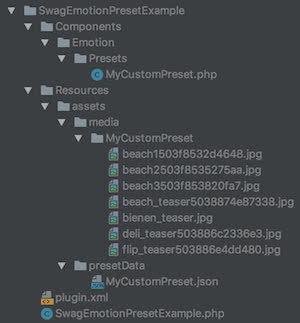

<div class="toc-list"></div>


## Introduction
With __Shopware 5.3__ we introduced shopping world / emotion presets. This tutorial will point out how to create a custom emotion preset plugin to offer your created shopping worlds to other users. These kind of plugins
can be contributed to the Community Store like any other plugin. You just have to set a special flag in your Account settings for deployment, so that your plugin gets marked as emotion preset.

### Qualification
Before getting started with this tutorial, it is recommended to become familiar with creating Shopware plugins first, since this guide will only point out the extras for creating a __custom emotion preset plugin__. For further information on developing plugins see [our plugin guides](/plugin-guide).

## Plugin Structure
The structure of the example plugin is as follows:



The example plugin is based on the Shopware 5.2 plugin system.

## Creating Preset Data
Creating preset data is really simple, because you can easily use the backend export function for shopping worlds. This function will
prepare your shopping worlds data as needed for a plugin. It will extract all assets from the shopping worlds and save all settings and data in the preset `*.json` file.

### Create simple dataclasses for better maintainability
As you can see in the example plugin, which you can find at the end of this article, we created a simple class for our preset which implements the `Shopware\Components\Emotion\Preset\PresetMetaDataInterface`. This interface is
required for the preset import during plugin installation.

We have some simple getters here that are required to be implemented. With this getters all information
of your preset will be collected during installation.

The `getPresetData()` method uses a simple helper class that gets the json data from our export and replaces a path placeholder `__ASSETPATH__` we are using
with the actual path to the assets inside our plugin.

```php
/**
 * @return array
 */
public function getPresetData()
{
    $json = SwagEmotionPresetExample::getJsonData('MyCustomPreset.json');
    return json_decode($json, true);
}
```

The exported `json` data will have all information about the assets that are exported.

```json
"syncData": {
    "assets": {
      "8b16ebc056e613024c057be590b542eb": "file:\/\/___ASSETPATH___\/media\/MyCustomPreset\/beach_teaser5038874e87338.jpg",
      "1728efbda81692282ba642aafd57be3a": "file:\/\/___ASSETPATH___\/media\/MyCustomPreset\/deli_teaser503886c2336e3.jpg",
      "db85e2590b6109813dafa101ceb2faeb": "file:\/\/___ASSETPATH___\/media\/MyCustomPreset\/flip_teaser503886e4dd480.jpg",
      "99c5e07b4d5de9d18c350cdf64c5aa3d": "file:\/\/___ASSETPATH___\/media\/MyCustomPreset\/bienen_teaser.jpg",
      "e995f98d56967d946471af29d7bf99f1": "file:\/\/___ASSETPATH___\/media\/MyCustomPreset\/beach1503f8532d4648.jpg",
      "6cd67d9b6f0150c77bda2eda01ae484c": "file:\/\/___ASSETPATH___\/media\/MyCustomPreset\/beach2503f8535275aa.jpg",
      "6bc24fc1ab650b25b4114e93a98f1eba": "file:\/\/___ASSETPATH___\/media\/MyCustomPreset\/beach3503f853820fa7.jpg"
    }
  }
```
Here we changed the paths from `images\imagename.png` to `file://__ASSETPATH__/media/PRESETNAME/IMAGENAME.png`. Be aware that
the slashes have to be escaped because otherwise we would have illegal json data.

We advise you to use an external source for image data because of the size limitation for plugins in our Community Store.

## Installation
For the installation of your presets during plugin installation you can use the `PresetInstaller` service which is available via the service container. The following example shows how installation and
uninstallation are done by the example plugin.

```php
public function install(InstallContext $context)
{
    /** @var PresetInstaller $presetInstallerService */
    $presetInstallerService = $this->container->get('shopware.emotion.preset_installer');

    $presetInstallerService->installOrUpdate($this->getPresetInstances());
}

public function uninstall(UninstallContext $context)
{
    /** @var PresetInstaller $presetInstallerService */
    $presetInstallerService = $this->container->get('shopware.emotion.preset_installer');

    $presetInstallerService->uninstall([
        'my_custom_preset',
    ]);
}

/**
 * @return PresetMetaDataInterface[]
 */
private function getPresetInstances()
{
    return [
        new MyCustomPreset()
    ];
}
```

During installation we pass an array of `PresetMetaDataInterfaces` to the `PresetInstaller`.

For uninstallation we just use the __technical__ name of our emotion preset.

## Download
The example plugin can be found <a href="{{ site.url }}/exampleplugins/SwagEmotionPresetExample.zip">here</a>
