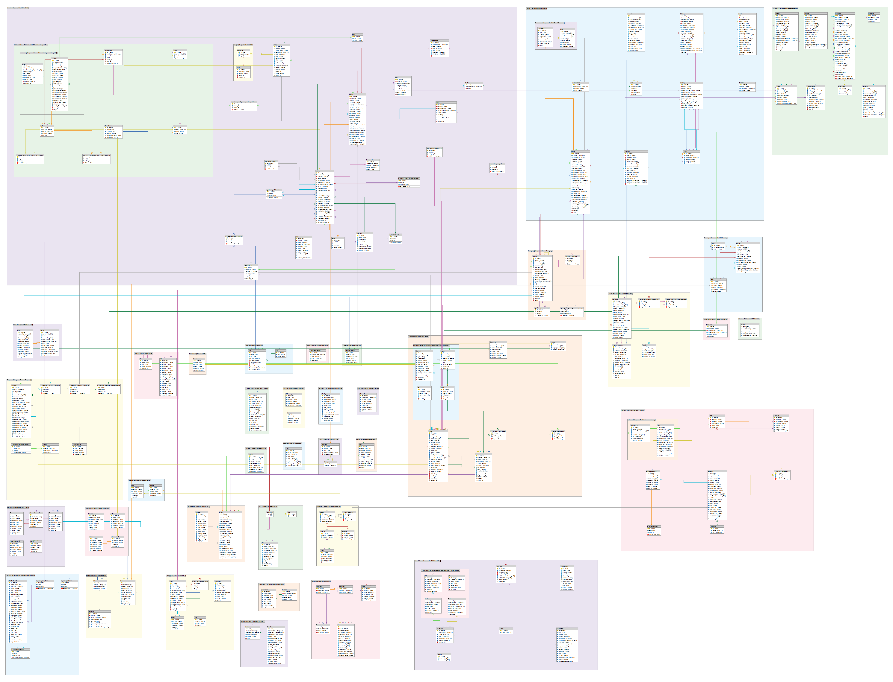

Below you can download the Shopware entity relationship model. 

The diagram was automatically generated and lists the most important tables.

The various areas of the diagram have been color coded for your convenience. 
In the diagram you can see precisely which tables in Shopware are linked together.

