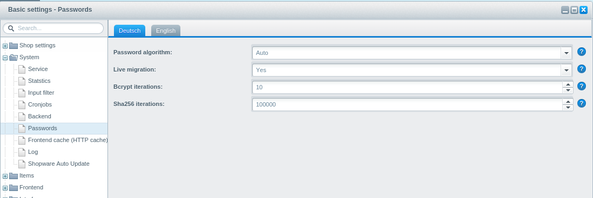

By default Shopware will use the best available password hashing algorithm on your system (e.g. bcrypt). For default usage there is **no need** to modify Shopware's hashing algorithm.

If you are importing customer data from other shops, however, you might want to support the old hashing algorithm, so that you customers can still log in without changing the password.

# General concept
Any customer account is stored with two information in the `s_user` table: The *hash* of the password and the responsible *encoder* which takes care of hashing / comparing the password.
In the backend settings of Shopware, the default password encoder is defined. In the *auto* configuration (default) shopware will automatically pick the best hash algorithm available. 
If the *live migration" setting is set to true, customers with "old" password hashes (e.g. md5 from a third party shop system import) will automatically be migrated to the new password hash,
when they log in the next time.



# Glossary
Shopware uses password hashing across the board. The responsible classes are called "encoder", however, as the actual hashing of the password is an implementation detail of the responsible class.
Don't misunderstand that concept - storing a hash should always be considered more secure and best practice and implementing reversible password storage methods is not encouraged. 

# Implementation
The Password system consists of two relevant pars:

 1. **engine/Shopware/Components/Password/Manager.php**
The password manager takes care of all known encoders, will return lists of encoders compatible with your system and has convenience methods, to find an encoder by name
or to quickly check / hash a password with a given encoder.

 2. **engine/Shopware/Components/Password/Encoder/{EncoderName}**
The password encoders are the actual implementation of all supported encoders / hashing algorithms. By default shopware ships with support for bcrypt (default), sha256 (fallback)
and md5 (for legacy reasons).

# Using it
## Hashing a password
In order to hash a password the with the algorithm defined in the shopware backend, you can simply call

```
$encoderName = Shopware()->PasswordEncoder()->getDefaultPasswordEncoderName();
$password = $this->passwordEncoder->encodePassword($password, $encoderName);
```

This will hash the password `$password` with the default encoder `$encoderName`. 

## Checking a password
Let's say a user wants to log in with his mail / password combination:

```
function isValidLogin($email, $plaintext) {
    $result = Shopware()->Db()->fetchRow(
        'SELECT hash, encoder FROM s_user WHERE email = ?',
        array($email)
    );
    if (!$result) {
        return false;
    }
    
    return $this->passwordEncoder->isPasswordValid($plaintext, $result['hash'], $result['encoder']);
}
```

First of all we will read the hashed password `hash` as well as the used hash algorithm `encoder` from database. 
Then the method `isPasswordValid` of the password manager is used, to check, if `$result['hash']` and `$plaintext` to match for the given encoder name.


## Implementing own password encoders

The following example will show, how to create an own password encoder. Imagine you are importing user data from a shop system *FancyShop*
where the passwords hashes are stored by reversing and md5-hashing the password strings (which is not a very good idea). The following example will show, how to
create a new password encoder "Md5Reversed", which will allow the customers to log in with their password and automatically store a new, more secure bcrypt hash.
 
## Register the encoder

In order to announce the new encoder to shopware, a plugin needs to subscribe to the `Shopware_Components_Password_Manager_AddEncoder` event and add an instance
of the new encoder to the password encoder collection: In the callback method `onAddEncoder` the plugin's namespace is registered by calling the 
`registerMyComponents` method. Furthermore the encoder collection is extracted using `$hashes = $args->getReturn();`. Finally a new element is added and the collection
of password encoders is returned.


```
class Shopware_Plugins_Frontend_SwagMd5Reversed_Bootstrap extends Shopware_Components_Plugin_Bootstrap
{
    public function getVersion() { … }

    public function getLabel() { … }

    public function install()
    {
        // this event collects all password encoders
        $this->subscribeEvent(
            'Shopware_Components_Password_Manager_AddEncoder',
            'onAddEncoder'
        );

        return true;
    }

    public function onAddEncoder(Enlight_Event_EventArgs $args)
    {
        $this->registerMyComponents();

        $hashes = $args->getReturn();

        $hashes[] = new \Shopware\SwagMd5Reversed\Md5ReversedEncoder();

        return $hashes;


    }

    public function registerMyComponents()
    {
        $this->Application()->Loader()->registerNamespace(
            'Shopware\SwagMd5Reversed',
            $this->Path()
        );
    }
}
```

# Implementing the encoder

A valid password encoder must implement the `PasswordEncoderInterface`. It defines the methods `getName`, `encodePassword`, `isPasswordValid` and `isReencodeNeeded`.

The `getName` method should just return the name of your encoder. The password manager will identify the new encoder by this name.
`encodePassword` is the actual hashing method which will hash your password. The bcrypt encoder will hash with bcrypt, the sha256 will hash with sha256 and so one.
As our demo-plugin is a "Md5ReversedEncoder", it reverses the input string and hashes the result.
`isPasswordValid` will validate a given password against a given hash. Depending on the type of hashing algorithm you are using, you can just re-encode the password and 
compare the resulting hash against the given hash or you need specific function like `password_verify` when using crypt passwords.
Finally `isReencodeNeeded`: If you hashing algorithm support additional options (like rounds, salt etc), which might change from time to time, this method will tell,
if a given hash still uses the current options (e.g. 10 rounds, salt "abc") or old options (e.g. 5 rounds, salt "xyz"). If your hasher does not support this, you can
 safely return false any time. If your hasher should support this, you could create hashes in this format:
 
```
 ACTUAL_HASH::ROUND::SALT
```

This way you can tell from the hash, if `ROUND` and `SALT` are still good values or if you want the password system to create a new password.


```
<?php

namespace Shopware\SwagMd5Reversed;

use Shopware\Components\Password\Encoder\PasswordEncoderInterface;

class Md5ReversedEncoder implements PasswordEncoderInterface
{
    public function getName()
    {
        return 'Md5Reversed';
    }

    public function encodePassword($password)
    {
        return md5(strrev($password));
    }

    public function isPasswordValid($password, $hash)
    {
        return $this->encodePassword($password) === $hash;
    }

    public function isReencodeNeeded($hash)
    {
        return false;
    }

}
```

# Putting it all together
If you install the final plugin into your shopware installation (download link below), shopware will automatically support your new password hash. In order to test it, you
can add a new user to your system and set the `s_user.encoder` column to "Md5Reversed" and the hash to e.g. "a7e86e2302d08ea6d3ff635f856468f4". If you try to log in as
this user with the password "secret", shopware will validate the login using the "Md5Reversed" encoder and automatically re-hash the password with the default encoder (bcrypt). 
So the (not appropriate) md5 hash was automatically replaced by a bcrypt hash during the login.

# Download
You can find a installable ZIP package of this plugin <a href="{{ site.url }}/exampleplugins/SwagMd5Reversed.zip">here</a>.
