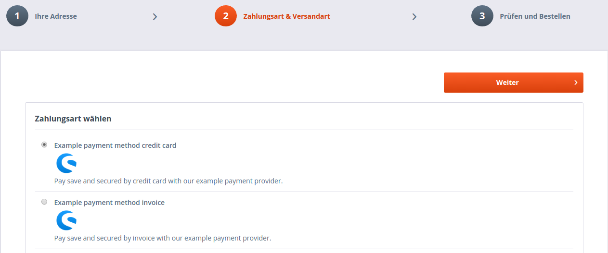
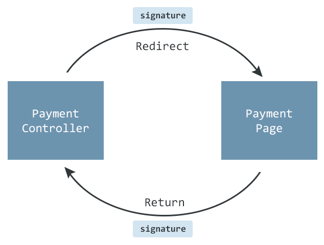

<div class="toc-list"></div>

## Introduction
This tutorial will point out some important information for adding a new payment method to shopware. This is done by creating a payment plugin. Payment handling is essential for every shop and therefore a payment plugin needs some extra features to guarantee secure and comfortable payments. 

### Qualification
Before getting started with this tutorial, it is recommended to become familiar with creating Shopware plugins first, since this guide will only point out the extras for creating a __payment plugin__. For further information on developing plugins see [our plugin guides](plugin-guide/).

## Order process


Once proceeding to the checkout process, the first check is whether the customer is logged in. If not, he is offered the option of either logging in or registering.

If the customer is known by the shop system, the confirm action is passed. After selecting the payment method and shipping the shopping cart is entered and a temporary order is created with the status "-1" (cancel). An order number is not generated at this point.

In the next step the customer is directed to the payment interface controller. The way in which the customer enters the payment interface can be controlled here. Generally, this is done by implementing an iFrame or by a direct link to the payment provider. At this point the return address to the shop is generally communicated, too. Once the customer has gone through the payment process of the payment interface, they must be redirected back to the shop. Depending on whether the payment was successful or not, the customer is either directed to the return action or a cancel action. Here, the interface author can decide whether they wish to complete the order. When the order is completed, the order status is set to a value of "0" and the payment status is set to "17" (open). This means that the order will be visible in the backend and the order confirmation email is deleted.
## Plugin structure
The structure of our example plugin is as follows:


The parts of the demo provider, here in red boxes are not necessary for a payment plugin. This is just for testing purposes and to get our example plugin to work.

## Plugin base class
The plugin base class needs some additional logic for the payment plugin.

### Add payment to database
Some payment providers offer more than just one method of payment. Shopware offers the possibility of combining multiple payments within one plugin. To do that the payment method hast to be added to the database in the plugin base class. In this example two payment methods are added, one for invoices and one for credit cards. The `Shopware\Components\Payment\Installer` service ([since shopware 5.2.13](/developers-guide/plugin-system/#add-a-new-payment-method)) is used for this. In older versions of shopware create a payment model and save it to the database on your own. In the legacy plugin system use the `$this->createPayment()` helper method of the plugin bootstrap. 

`SwagPaymentExample/SwagPaymentExample.php`:

```php
public function install(InstallContext $context)
{
    /** @var \Shopware\Components\Plugin\PaymentInstaller $installer */
    $installer = $this->container->get('shopware.plugin_payment_installer');

    $options = [
        'name' => 'example_payment_invoice',
        'description' => 'Example payment method invoice',
        'action' => 'PaymentExample',
        'active' => 0,
        'position' => 0,
        'additionalDescription' =>
            ''
            . '<div id="payment_desc">'
            . '  Pay save and secured by invoice with our example payment provider.'
            . '</div>'
    ];
    $installer->createOrUpdate($context->getPlugin(), $options);

    $options = [
        'name' => 'example_payment_cc',
        'description' => 'Example payment method credit card',
        'action' => 'PaymentExample',
        'active' => 0,
        'position' => 0,
        'additionalDescription' =>
            ''
            . '<div id="payment_desc">'
            . '  Pay save and secured by credit card with our example payment provider.'
            . '</div>'
    ];

    $installer->createOrUpdate($context->getPlugin(), $options);
}
```
* name : The name of the payment method. It is required as unique identifier for the payment method. It is not displayed in the store front.
* description : Should be kept as short as possible, because it will be displayed in the store front as payment title. Ideally, it should also provide a clear explanation of the payment method for the customer.
* action : Is used to determine which controller is responsible for this payment method.
* active : Flag to determine whether the payment method is activated or deactivated upon its creation.
* position : Determines where the payment method appears in the list of methods.
* additionalDescription : Add more information about the payment method, for example an image that will be shown in the checkout process.

If several payment methods are used, their names should be unique and clearly distinguishable. In the checkout process the example could look like this:



### uninstall, activate, deactivate the plugin
Be careful when removing the payment methods from the database. If they have been used in previous orders it can cause unforeseen problems. It is recommended to set them to inactive on uninstall or deactivation of the plugin.

`SwagPaymentExample/SwagPaymentExample.php`:
```php
/**
 * @param UninstallContext $context
 */
public function uninstall(UninstallContext $context)
{
    $this->setActiveFlag($context->getPlugin()->getPayments(), false);
}

/**
 * @param DeactivateContext $context
 */
public function deactivate(DeactivateContext $context)
{
    $this->setActiveFlag($context->getPlugin()->getPayments(), false);
}

/**
 * @param ActivateContext $context
 */
public function activate(ActivateContext $context)
{
    $this->setActiveFlag($context->getPlugin()->getPayments(), true);
}

/**
 * @param Payment[] $payments
 * @param $active bool
 */
private function setActiveFlag($payments, $active)
{
    $em = $this->container->get('models');

    foreach ($payments as $payment) {
        $payment->setActive($active);
    }
    $em->flush();
}
```

## Payment service
For a better overview and a clearer separation between the controller and the business logic create a small payment service which handles the responses of the provider and takes care of token generation and validation.

`SwagPaymentExample/Components/ExamplePayment/ExamplePaymentService.php`:
```php
<?php

namespace SwagPaymentExample\Components\ExamplePayment;

class ExamplePaymentService
{
    /**
     * @param $request \Enlight_Controller_Request_Request
     * @return PaymentResponse
     */
    public function createPaymentResponse(\Enlight_Controller_Request_Request $request)
    {
        $response = new PaymentResponse();
        $response->transactionId = $request->getParam('transactionId', null);
        $response->status = $request->getParam('status', null);
        $response->token = $request->getParam('token', null);

        return $response;
    }

    /**
     * @param PaymentResponse $response
     * @param string $token
     * @return bool
     */
    public function isValidToken(PaymentResponse $response, $token)
    {
        return hash_equals($token, $response->token);
    }

    /**
     * @param float $amount
     * @param int $customerId
     * @return string
     */
    public function createPaymentToken($amount, $customerId)
    {
        return md5(implode('|', [$amount, $customerId]));
    }
}
```

### Payment response
Create an object for the response. Even though only three variables are needed in the response, a real payment provider could hand over a lot more.

`SwagPaymentExample/Components/ExamplePayment/PaymentResponse.php`: 
```php
<?php

namespace SwagPaymentExample\Components\ExamplePayment;

class PaymentResponse
{
    /**
     * @var int
     */
    public $transactionId;

    /**
     * @var string
     */
    public $token;

    /**
     * @var string
     */
    public $status;
}
```

### Register the service
To register the service create the `services.xml` file.

`SwagPaymentExample/Resources/services.xml`:
```xml
<?xml version="1.0" ?>
<container xmlns="http://symfony.com/schema/dic/services"
           xmlns:xsi="http://www.w3.org/2001/XMLSchema-instance"
           xsi:schemaLocation="http://symfony.com/schema/dic/services http://symfony.com/schema/dic/services/services-1.0.xsd">
    <services>
        <service id="swag_payment_example.example_payment_service"
                 class="SwagPaymentExample\Components\ExamplePayment\ExamplePaymentService">
        </service>
    </services>
</container>
```

## Frontend controller
To implement the frontend logic a frontend controller is needed. In this example plugin the [controller auto-registration](/developers-guide/plugin-system/#controller-auto-registration) is used which is available since shopware 5.2.7. It is important that the controller has the same name as specified in the action field of the payment method and it has to __extend from the shopware payment controller__ to provide the necessary payment methods.  
The frontend controller is activated once the customer clicks on the "Confirm order" button. The system then forwards the request to the controller which has been defined in the action field of the payment method.

### indexAction
The index action is called by default. To redirect to the correct action, proceed as follows:

`SwagPaymentExample/Controllers/Frontend/PaymentExample.php`:
```php
public function indexAction()
{
    /**
     * Check if one of the payment methods is selected. Else return to default controller.
     */
    switch ($this->getPaymentShortName()) {
        case 'example_payment_invoice':
            return $this->redirect(['action' => 'gateway', 'forceSecure' => true]);
        case 'example_payment_cc':
            return $this->redirect(['action' => 'direct', 'forceSecure' => true]);
        default:
            return $this->redirect(['controller' => 'checkout']);
    }
}
```
There are two ways to display the payment methods to the customers, via __iFrame__ or __direct forwarding__. Other methods are strongly not recommended, as there are maybe unforeseen problems with the system.

### iFrame gateway
This method has the advantage that the customer does not leave the shop store front, so their shopping experience is not interrupted. To display the payment interface surface in an iFrame, we need to create a template with a corresponding iFrame.

`SwagPaymentExample/Controllers/Frontend/PaymentExample.php`:
```php
public function gatewayAction()
{
    $providerUrl = $this->getProviderUrl();
    $this->View()->assign('gatewayUrl', $providerUrl . $this->getUrlParameters());
}
```
Example for the gateway template with iFrame:

`SwagPaymentExample/Resources/views/frontend/payment_example/gateway.tpl`:
```html
{extends file="frontend/index/index.tpl"}

{block name="frontend_index_content"}
    <div id="payment">
        <iframe src="{$gatewayUrl}"
                scrolling="yes"
                style="x-overflow: none;"
                frameborder="0">
        </iframe>
    </div>
{/block}
```

### Direct forwarding
Several payment provider do not prefer the iFrame method. In this case, forward customers directly.

`SwagPaymentExample/Controllers/Frontend/PaymentExample.php`:
```php
public function directAction()
{
    $providerUrl = $this->getProviderUrl();
    $this->redirect($providerUrl . $this->getUrlParameters());
}
```
### Generating url parameters
The customer should be sent back to the shop after the payment process is completed. To protect the query from being manipulated, it will be built with a token. Most interfaces offer the option of passing parameters, which will be returned unchanged.
`SwagPaymentExample/Controllers/Frontend/PaymentExample.php`:
```php
private function getUrlParameters()
{
    /** @var ExamplePaymentService $service */
    $service = $this->container->get('swag_payment_example.example_payment_service');
    $router = $this->Front()->Router();
    $user = $this->getUser();
    $billing = $user['billingaddress'];

    $parameter = [
        'amount' => $this->getAmount(),
        'currency' => $this->getCurrencyShortName(),
        'firstName' => $billing['firstname'],
        'lastName' => $billing['lastname'],
        'returnUrl' => $router->assemble(['action' => 'return', 'forceSecure' => true]),
        'cancelUrl' => $router->assemble(['action' => 'cancel', 'forceSecure' => true]),
        'token' => $service->createPaymentToken($this->getAmount(), $billing['customernumber'])
    ];

    return '?' . http_build_query($parameter);
}
```
For security reasons generate an unique token that is handed over to the payment provider. When the customer returns make sure the token is still the same.

### Completing Orders
When the customer is redirected from the interface to the shop, the developer of the payment method must decide if they wish to complete the order. Generally, the customer is forwarded to a return address. In this example the `returnAction` is called.

Here, the response of the interface is evaluated, and if the payment has been performed successfully, the order can be completed with the `saveOrder()` command. This method accepts four parameters. The first two mandatory parameters are transactionID and an unique payment id. If these parameters are not filled, the method returns `false`. The __transactionID__ generally comes from the interface and is used for assigning orders in the system of the payment method provider. If the provider does not return a transactionID, any arbitrary value can be assigned. Note that in later processes, the __combination of the transactionID and the unique payment id__ are used to access the order.
`SwagPaymentExample/Controllers/Frontend/PaymentExample.php`:
```php
public function returnAction()
{
    /** @var ExamplePaymentService $service */
    $service = $this->container->get('swag_payment_example.example_payment_service');
    $user = $this->getUser();
    $billing = $user['billingaddress'];
    /** @var PaymentResponse $response */
    $response = $service->createPaymentResponse($this->Request());
    $token = $service->createPaymentToken($this->getAmount(), $billing['customernumber']);

    if (!$service->isValidToken($response, $token)) {
        $this->forward('cancel');

        return;
    }

    switch ($response->status) {
        case 'accepted':
            $this->saveOrder(
                $response->transactionId,
                $response->token,
                self::PAYMENTSTATUSPAID
            );
            $this->redirect(['controller' => 'checkout', 'action' => 'finish']);
            break;
        default:
            $this->forward('cancel');
            break;
    }
}
```
The `returnAction` checks if the returned token is still valid. If this fails an exception could be thrown or a redirect to an error page could be initiated. In this example plugin it is sufficient to redirect to the `cancelAction`. If the token is valid check for the response status of the payment provider and save the order if everything went fine.

### notifyAction
If the payment provider wants to change the order afterwards, for example if the customer decides to pay later, an extra action must be provided. For example a new payment status could be set here.

`SwagPaymentExample/Controllers/Frontend/PaymentExample.php`:
```php
private function getUrlParameters()
{
    ...

    $parameter = [
        ...
        'notifyUrl' => $router->assemble(['action' => 'notify', 'forceSecure' => true]),
        ...
    ];

    return '?' . http_build_query($parameter);
}
```
The notify action needs to be whitelisted from CSRF protection to prevent CSRF errors.
Use the `CSRFWhitelistAware` interface in the payment controller and implement the `getWhitelistedCSRFActions()` method:

`SwagPaymentExample/Controllers/Frontend/PaymentExample.php`:
```php
<?php

use Shopware\Components\CSRFWhitelistAware;

class Shopware_Controllers_Frontend_PaymentExample extends Shopware_Controllers_Frontend_Payment implements CSRFWhitelistAware 
{
    ...
    
    /**
     * Whitelist notifyAction
     */
    public function getWhitelistedCSRFActions()
    {
        return ['notify'];
    }
    
    ...
}
```

### Adjusting payment status

To change the payment status of an order, use the `savePaymentStatus()` command. This method accepts three parameters:
* transactionID
* uniquepaymentID
* payment status

Optionally, a fourth parameter can be used, which informs the customer about status changes via email. if the saveOrder() command has already been called, an additional confirmation is not sent.

## New signature in shopware 5.3 and later


In shopware 5.3 and higher there are some improvements on query manipulation and security. Before redirecting to the payment provider an unique signature for the basket is generated to verify that it has not changed when the customer has finished the payment process.

### Generate signature
Generate an unique signature for the basket and add it to the array which is handed over to the payment provider. The payment provider must provide a parameter field which value is returned unchanged:
  
`SwagPaymentExample/Controllers/Frontend/PaymentExample.php`:

```php
private function getUrlParameters()
{
    ...
    
    $parameter = [
        ...
        'signature' => $this->persistBasket(),
        ...
    ];

    return '?' . http_build_query($parameter);
}

```
`$this-persistBasket` returns a signature based on the basket and customer id and saves it together with a copy of the basket to the database.

### Checking for signature on return
When the customer has finished the external payment process he will be redirected to the payment controller. Load the signature and verify the basket in the `returnAction`.

`SwagPaymentExample/Controllers/Frontend/PaymentExample.php`:

```php
public function returnAction()
{
    ...
    $response = $service->createPaymentResponse($this->Request());
    $signature = $response->signature;
    ...
    try {
        $basket = $this->loadBasketFromSignature($signature);
        $this->verifyBasketSignature($signature, $basket);
        $success = true;
    } catch (Exception $e) {
        $success = false;
    }
    
    if (!$success) {
        //do errror handling like redirecting to error page
    }
    // continue with saving order
    ...
}
```
`basket = $this->loadBasketFromSignature($signature);` loads the basket identified by its signature from the database and deletes the record, so it can only be loaded once. Verify that the saved basket is still the same and has not been changed, for example by plugins.

Save the signature in the response object:

`SwagPaymentExample/Components/ExamplePayment/PaymentResponse.php`: 
```php
<?php

namespace SwagPaymentExample\Components\ExamplePayment;

class PaymentResponse
{
    ...
        
    /**
     * @var string
     */
    public $signature;
}

```

`SwagPaymentExample/Components/ExamplePayment/ExamplePaymentService.php`:
```php
<?php

namespace SwagPaymentExample\Components\ExamplePayment;

class ExamplePaymentService
{
    /**
     * @param $request \Enlight_Controller_Request_Request
     * @return PaymentResponse
     */
    public function createPaymentResponse(\Enlight_Controller_Request_Request $request)
    {
        $response = new PaymentResponse();
        ...
        $response->signature = $request->getParam('signature', null);
        return $response;
    }
}
```

## Amount mismatch
On creating orders (e.g. using the saveOrder method) make sure, that the amount authorized by the payment provider matches the current amount of the cart. This can be done by adding the cart amount to the hash explained above, or by comparing the authorized amount and the current cart amount (`$this->getAmount()`). When the amounts mismatch, the order could be rejected entirely or marked with payment status 21 indicating "review necessary".
<div class="alert alert-info">
In shopware 5.3 and later this should be done via the <a href="{{ site.url }}/developers-guide/payment-plugin/#new-signature-in-shopware-5.3-and-later">signature feature</a>. 
</div>

## Anti pattern
* __Adjusting the order process__: The order process is one of the central pieces of any shop system. Every external adjustment of this process can have unwanted side effects and can prevent the system for being upgraded.
* __Overwriting payment methods__: Overwriting or deleting payment methods is absolutely prohibited.
* __Copying Shopware code__: Please do not copy Shopware code. The plugin will lose its update capabilities.
* __Creating order numbers__: Do not create order numbers yourself. Always use the `saveOrder()` method.
* __Saving credit cards and account data__: You should never save credit card data in the shop system and also avoid storing account data in the system as well.
* __Creating status options__: Avoid creating status options. This can be very difficult to translate, for example, and in the worst case can cause information to be ambiguous.
* __Trusting data__: Never trust data that you receive from other systems. Always assume that the data contain malicious code and program the interface accordingly.

## Download
An example plugin can be found <a href="{{ site.url }}/exampleplugins/SwagPaymentExample.zip">here</a>