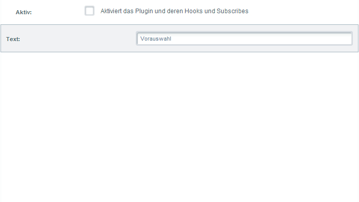
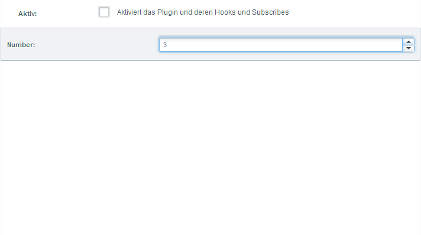

This document will give you a brief introduction about how to set configuration options for plugins, which tags and attributes are available and how to use them.
All configurations is done with help of the `config.xml` file resulting in the examples shown here.

<div class="toc-list"></div>

## Introduction
After getting a short introduction by reading the Plugin Quick Introduction, we will now be introduced to
the configuration options for plugins. Shopware delivers a big amount of helper functions for generating standard
configuration fields in backend.

<div class="alert alert-warning">
<strong>Be careful with sensitive data!</strong>

Please be aware to not save any files that contain sensitive data to your plugin directory (e.g. config or log files) as these might be accessible by public.
</div>

## Creating forms
A plugin configuration can be created with a Resources/config.xml file.

```xml
<?xml version="1.0" encoding="utf-8"?>
<config xmlns:xsi="http://www.w3.org/2001/XMLSchema-instance"
        xsi:noNamespaceSchemaLocation="https://raw.githubusercontent.com/shopware/shopware/5.3/engine/Shopware/Components/Plugin/schema/config.xsd">
    <elements>

    </elements>
</config>
```

Now add elements in the elements tag.

A textfield would be defined as followed:

```xml
<?xml version="1.0" encoding="utf-8"?>
<config xmlns:xsi="http://www.w3.org/2001/XMLSchema-instance"
        xsi:noNamespaceSchemaLocation="https://raw.githubusercontent.com/shopware/shopware/5.3/engine/Shopware/Components/Plugin/schema/config.xsd">
    <elements>
        <element required="true" type="text" scope="locale">
            <name>simpleTextField</name>
            <label lang="de">Text</label>
            <label lang="en">Text</label>
            <value>preselection</value>
            <description lang="de">Lorem ipsum dolor sit amet, consetetur sadipscing elitr, sed diam nonumy eirmod tempor invidunt ut.</description>
            <description lang="en">Lorem ipsum dolor sit amet, consetetur sadipscing elitr, sed diam nonumy eirmod tempor invidunt ut.</description>
        </element>
    </elements>
</config>
```

Which would lead to a simple textfield.


### Label
The label tag allows to create a simple descriptional label for the form element.
```xml
<label lang="de">Dein Label</label>
<label lang="en">Your label</label>
```


### Description
The description tag allows to provide a more detailed description of the configuration element.

```xml
<description lang="de">Lorem ipsum dolor sit amet, consetetur sadipscing elitr, sed diam nonumy eirmod tempor invidunt ut.</description>
<description lang="en">Lorem ipsum dolor sit amet, consetetur sadipscing elitr, sed diam nonumy eirmod tempor invidunt ut.</description>
```


### Value
The value tag stands for the default value of the field if this hasn´t been edited yet. It will directly be shown in the configuration element.
```xml
<value>preselection</value>
```



### Options
The options tag allows you to set configs of the ExtJs representation of a specific configuration element. See [ExtJs Docs](https://docs.sencha.com/extjs/4.1.1/#!/api/Ext.form.field.Number-cfg-minValue)
```xml
<element type="number">
    <name>testNumber</name>
    <label lang="en">Test Number field</label>
    <options>
        <minValue>0</minValue>
    </options>
</element>
```

### Required
The required attribute specifies whether the configuration item is mandatory or not.
```
<element required="true" ... >
```


### Scope
With help of the scope attribute it is possible to generate subshop specific configurations. Leaving this option out results in a configuration option
that applies for all subshops.
```xml
 <element ... scope="locale">
```


You can read more on subshop specific configuration at the end of this article reading the [Subshop specific configuration](#subshop-specific-plugin-configuration) part.

## Element Types
Below all supported configuration elements including their design and source code are described again.

### Boolean
```xml
<element type="boolean">
    ...
</element>
```


### Colorpicker
```xml
<element type="color">
    ...
</element>
```


### Datefield
```xml
<element type="date">
    ...
</element>
```


### Datetime field
```xml
<element type="datetime">
    ...
</element>
```


### HTML editor
```xml
<element type="html">
    ...
</element>
```


### Time interval
```xml
<element type="interval">
    ...
</element>
```


### Mediaselection
```xml
<element type="mediaselection">
    ...
</element>
```


### Numberfield
```xml
<element type="number">
    ...
</element>
```



### Selectionfield / combobox
```xml
<element type="select" >
    <store>
        <option>
            <value>1</value>
            <label lang="de">DE 1</label>
            <label lang="en">EN 1</label>
        </option>
        <option>
            <value>TWO</value>
            <label lang="de">DE 2</label>
            <label lang="en">EN 2</label>
        </option>
        <option>
            <value>3</value>
            <label>Test</label>
        </option>
        <option>
            <value>4</value>
            <label>Test default</label>
            <label lang="de">Test</label>
        </option>
    </store>
</element>
```


### Selectionfield / remote combobox
```xml
<element type="combo">
    ...
    <store>Shopware.apps.Base.store.CustomerGroup</store>
</element>
```


### Multi selectionfield / multi combobox / multi remote combobox

To make your selectfield / combobox multiple selectable, you need to create the options node:

```xml
<element type="combo">
    ...
    <store>Shopware.apps.Base.store.CustomerGroup</store>
    <options>
        <multiSelect>true</multiSelect>
    </options>
</element>
```

### Remote combobox with own store
Define and create your own ExtJs data store for the backend Plugin configuration

```xml
<element scope="shop" type="select">
           ...
            <store><![CDATA[Ext.define('YourPrefix.YourName.Form', {
    extend: 'Ext.data.Store',
    fields: [
        { name:'id', type: 'int' },
        { name:'name', type: 'string' }
    ],
    autoLoad: true,
    pageSize: 25,
    proxy: {
        type: 'ajax',
        url: window.location.href.substr(0, window.location.href.indexOf('backend')) + 'backend/yourController/yourAction',
        reader: {
            type: 'json',
            root: 'data',
            totalProperty: 'total'
        }
    }
    }).create();//new ]]>
            </store>
            <options>
                <valueField>id</valueField>
                <displayField>name</displayField>
                <isCustomStore>true</isCustomStore>
            </options>
</element>
```
Note that the `//new ` is an important hack to load the store

```php
    public function yourAction()
    {
        $data = [
            ['id' => 1, 'name' => 'foo'],
            ['id' => 2, 'name' => 'bar'],
        ];
    
        $this->view->assign([
            'data' => $data,
            'total' => count($data),
        ]);
    }
```
The controller action should assign a associated array.

### Textfield
```xml
<element type="text">
    ...
</element>
```


### Textarea
```xml
<element type="textarea">
    ...
</element>
```


### Timefield
```xml
<element type="time">
    ...
</element>
```


### Button
```xml
<element type="button">
    ...
</element>
```


## Configure basic settings
The plugin configurations of the various plugins are automatically 
reachable via the basic settings under the "Additional settings" entry:
```xml
<?xml version="1.0" encoding="utf-8"?>
<config xmlns:xsi="http://www.w3.org/2001/XMLSchema-instance"
        xsi:noNamespaceSchemaLocation="https://raw.githubusercontent.com/shopware/shopware/5.3/engine/Shopware/Components/Plugin/schema/config.xsd">
    <elements>
        <element required="true" type="text" scope="locale">
            <name>simpleTextField</name>
            <label lang="de">Text</label>
            <label lang="en">Text</label>
            <value>preselection</value>
            <description lang="de">Lorem ipsum dolor sit amet, consetetur sadipscing elitr, sed diam nonumy eirmod tempor invidunt ut.</description>
            <description lang="en">Lorem ipsum dolor sit amet, consetetur sadipscing elitr, sed diam nonumy eirmod tempor invidunt ut.</description>
        </element>
    </elements>
</config>
```


## Subshop specific plugin configuration
In this chapter we want to show how to make your configurations subshop specific. To demonstrate this
we write a little plugin which replaces the Shopware logo with random text.

```xml
<?xml version="1.0" encoding="utf-8"?>
<config xmlns:xsi="http://www.w3.org/2001/XMLSchema-instance"
        xsi:noNamespaceSchemaLocation="https://raw.githubusercontent.com/shopware/shopware/5.3/engine/Shopware/Components/Plugin/schema/config.xsd">
    <elements>
        <element required="false" type="boolean" scope="shop">
            <name>show</name>
            <label lang="de">Anzeigen</label>
            <label lang="en">Show</label>
            <description lang="de">Lorem ipsum dolor sit amet, consetetur sadipscing elitr, sed diam nonumy eirmod tempor invidunt ut.</description>
            <description lang="en">Lorem ipsum dolor sit amet, consetetur sadipscing elitr, sed diam nonumy eirmod tempor invidunt ut.</description>
        </element>
    </elements>
</config>
```

With the help of the scope attribute we can assign configurations per subshop. Without the scope attribute the configuration is used in all subshops. We´ve mentioned this earlier this article.

```php
public function onPostDispatch(Enlight_Event_EventArgs $arguments)
{
    $shop = false;
    if ($this->container->initialized('shop')) {
        $shop = $this->container->get('shop');
    }

    if (!$shop) {
        $shop = $this->container->get('models')->getRepository(\Shopware\Models\Shop\Shop::class)->getActiveDefault();
    }

    $config = $this->container->get('shopware.plugin.cached_config_reader')->getByPluginName('PluginName', $shop);
    if (!(bool) $config['show']) {
        return;
    }
 
    $controller = $arguments->getSubject();
    $view = $controller->View();
 
    $view->assign('swagSubshopVisibility', 'Test text.');
 
    $view->addTemplateDir($this->pluginBasePath . '/Resources/views/');
}

```

Within the onPostDispatch() method in a subscriber read the configuration with help of the service. Afterwards we test for the just created `show` attribute. If this attribute is empty the method ends and the plugin will not be executed or shown any further. If `show` is set the template is loaded and assigned via smarty.

```smarty
{extends file="parent:frontend/index/logo-container.tpl"}
{block name="frontend_index_logo"}
    <div style="padding-top: 10px">
        <h1>{$swagSubshopVisibility}</h1>
    </div>
{/block}
```

Our new template extends the parent `logo-container.tpl` and overwrites the `frontend_index_logo` block and sets the text. Now we can open the plugin configuration via Plugin Manager and configure it differently for every subshop.

What's next? Continue reading about the new [Shopware 5.2 Plugin System](/developers-guide/plugin-system).
