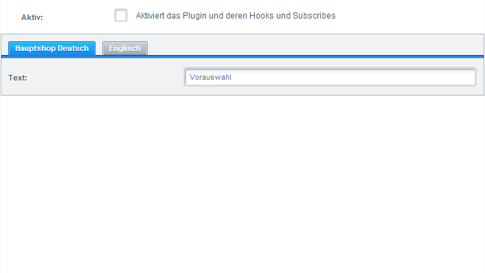
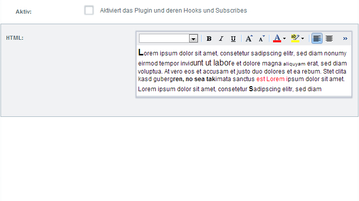

This document will give you a brief introduction about how to set configuration options for legacy plugins, which parameters are available and
how to use them. By using the [new plugin system](/developers-guide/plugin-system) (since 5.2) the following code examples
are __deprecated__. With the new plugin system all configurations can be done with help of `config.xml` file resulting in the examples shown here.

<div class="toc-list"></div>

## Introduction
After getting a short introduction by reading the Plugin Quick Introduction, we will now be introduced to
the configuration options for plugins. Shopware delivers a big amount of helper functions for generating standard
configuration fields in backend.

## Creating forms
To create a simple plugin configuration we can use the function `Form()`

```
$form = $this->Form();
```

Now we can use this instance of `Shopware\Models\Config\Form` in `$form` to add elements to it via `setElement().
```
$form->setElement(type : String, name : String, [options : array | null= null]);
```
A textfield would be defined as followed:

```
public function createConfiguration()
{
    $form = $this->Form();
 
    $form->setElement('text', 'simpleTextField');
}
```

Which would lead to a simple textfield.


## Options Parameter
The options parameter of the `setElement` function allows to set several configurations on the form element.

### Label
The label parameter allows to create a simple descriptional label for the form element.
```
public function createConfiguration()
{
    $form = $this->Form();
 
    $form->setElement('text', 'simpleTextField', 
        array('label' => 'Text')
    );
}
```


### Value
The value parameter stands for the default value of the field if this hasn´t been edited yet. It will directly be shown in the configuration element.
```
public function createConfiguration()
{
    $form = $this->Form();
 
    $form->setElement('text', 'simpleTextField', 
        array(
            'label' => 'Text',
            'value' => 'Vorauswahl'
        )
    );
}
```


### Scope
With help of the scope parameter it is possible to generate subshop specific configurations. Leaving this option out results in a configuration option
that applies for all subshops.
```
public function createConfiguration()
{
    $form = $this->Form();
 
    $form->setElement('text', 'simpleTextField', 
        array(
            'label' => 'Text',
            'value' => 'Vorauswahl',
            'scope' => Shopware\Models\Config\Element::SCOPE_SHOP
        )
    );
}
```



You can read more on subshop specific configuration at the end of this article reading the [Subshop specific configuration](#subshop-specific-plugin-configur) part.

### Description
The description parameter allows to provide a more detailed description of the configuration element.
```
public function createConfiguration()
{
    $form = $this->Form();
 
    $form->setElement('text', 'simpleTextField', 
        array(
            'label' => 'Text',
            'value' => 'Vorauswahl',
            'scope' => Shopware\Models\Config\Element::SCOPE_SHOP,
            'description' => 'Lorem ipsum dolor sit amet, consetetur sadipscing elitr, sed diam nonumy eirmod tempor invidunt ut'
        )
    );
}
```


### Required
The required parameter specifies whether the configuration item is mandatory or not.
```
public function createConfiguration()
{
    $form = $this->Form();
 
    $form->setElement('text', 'simpleTextField',
        array(
            'label' => 'Text',
            'value' => 'Vorauswahl',
            'scope' => Shopware\Models\Config\Element::SCOPE_SHOP,
            'description' => 'Lorem ipsum dolor sit amet, consetetur sadipscing elitr, sed diam nonumy eirmod tempor invidunt ut',
            'required' => true
        )
    ); 
}
```


## Element Types
Below all supported configuration elements including their design and source code are described again.

### Colorpicker
```
public function createConfiguration()
{
    $form = $this->Form();
 
    $form->setElement('color', 'myColorfield', 
        array(
            'label' => 'Color', 
            'value' => NULL
        )
    );
}
```


### Datefield
```
public function createConfiguration()
{
    $form = $this->Form();
 
    $form->setElement('date', 'myDatefield', 
        array(
            'label' => 'Date', 
            'value' => NULL
        )
    );
}
```


### Datetime field
```
public function createConfiguration()
{
    $form = $this->Form();
 
    $form->setElement('datetime', 'myDatetimefield', 
        array(
            'label' => 'Date-Time', 
            'value' => NULL
        )
    );
}
```


### HTML editor
```
public function createConfiguration()
{
    $form = $this->Form();
 
    $form->setElement('html', 'myHtmlfield', 
        array(
            'label' => 'HTML', 
            'value' => NULL
        )
    );
}
```




### Time interval
```
public function createConfiguration()
{
    $form = $this->Form();
 
    $form->setElement('interval', 'myIntervalfield',
        array(
            'label' => 'Interval', 
            'value' => NULL
        )
    );
}
```


### Mediaselection
```
public function createConfiguration()
{
    $form = $this->Form();
 
    $form->setElement('mediaselection','myMediaselectionfield',
        array(
            'label' => 'Media',
            'value' => NULL
        )
    );
}
```


### Numberfield
```
public function createConfiguration()
{
    $form = $this->Form();
 
    $form->setElement('number', 'myNumberfield', 
        array(
            'label' => 'Number', 
            'minValue' => 0
        )
    );
}
```


### Selectionfield / combobox
```
public function createConfiguration()
{
    $form = $this->Form();
 
    $form->setElement('select', 'mySelectionfield', 
        array('label' => 'Select', 
            'store' => array(
                array(1, 'Testvariable 1'), 
                array(2, 'Testvariable 2'), 
                array(3, 'Testvariable 3')
            )
        )
    );
}
```


### Selectionfield / remote combobox
```
public function createConfiguration()
{
        $form->setElement('combo', 'myCombo', 
            array(
                'label'=>'Backend-User','value'=>'Please select',
                'store' => 'base.CustomerGroup',
                'scope' => \Shopware\Models\Config\Element::SCOPE_SHOP
            )
        );
}
```


### Textfield
```
public function createConfiguration()
{
    $form = $this->Form();
 
    $form->setElement('text', 'simpleTextField', 
        array(
            'label' => 'Text', 
            'value' => NULL
        )
    );
}
```


### Textarea
```
public function createConfiguration()
{
    $form = $this->Form();
 
    $form->setElement('textarea', 'myTextareafield',
        array(
            'label' => 'Text-Area', 
            'value' => NULL
        )
    );
}
```


### Timefield
```
public function createConfiguration()
{
    $form = $this->Form();
 
    $form->setElement('time', 'myTimefield', 
        array(
            'label' => 'Time', 
            'value' => NULL
        )
    );
}
```


## Configure basic settings
The plugin configurations of the various plugins are automatically 
reachable via the basic settings under the "Additional settings" entry:
```
public function createConfiguration()
{
    $form = $this->Form();
 
    $form->setElement('text', 'simpleTextField',
        array(
            'label' => 'Text',
            'value' => 'Vorauswahl',
            'scope' => Shopware\Models\Config\Element::SCOPE_SHOP,
            'description' => 'Lorem ipsum dolor sit amet, consetetur sadipscing elitr, sed diam nonumy eirmod tempor invidunt ut',
            'required' => true
        )
    );
}
```


If you think they are better off under another entry, you can move your configuration entry to another submenu in the settings:
```
public function createConfiguration()
{
    $form = $this->Form();
 
    $form->setElement('text', 'simpleTextField',
        array(
            'label' => 'Text',
            'value' => 'Vorauswahl',
            'scope' => Shopware\Models\Config\Element::SCOPE_SHOP,
            'description' => 'Lorem ipsum dolor sit amet, consetetur sadipscing elitr.',
            'required' => true
        )
    );
 
    $repository = Shopware()->Models()->getRepository('Shopware\Models\Config\Form');
    $form->setParent(
        $repository->findOneBy(array('name' => 'Interface'))
    );
}
```


## Translation of configurations
The Shopware backend is fully translatable. To translate the custom plugin configurations you can use following code:
```
public function createConfiguration()
{
    $form = $this->Form();
 
    $form->setElement('text', 'simpleTextField',
        array(
            'label' => 'Text',
            'value' => 'Vorauswahl',
            'scope' => Shopware\Models\Config\Element::SCOPE_SHOP,
            'description' => 'Lorem ipsum dolor sit amet, consetetur sadipscing elitr.',
            'required' => true
        )
    );
 
    //contains all translations
    $translations = array(
        'en_GB' => array(
            'myTextField' => 'Text input',
        ),
        'es_ES' => array(
            'myTextField' => 'introducción de texto',
        ),
        'fr_FR' => array(
            'myTextField' => 'La saisie de texte',
        ),
        //...
    );
 
    $this->addFormTranslations($translations);
}
```
It is also possible to create translated options for the selection element like this:
```
    /**
     * Creates the plugin configuration
     */
    private function createPluginConfig()
    {
        $store = [
            ['normal', ['de_DE' => 'Nicht anders darstellen', 'en_GB' => "Don't change displaying"]],
            ['pseudo', ['de_DE' => 'Alten Preis als neuen Pseudopreis setzen', 'en_GB' => 'Set old price as new pseudo price']],
            ['price', ['de_DE' => 'Nur neuen Preis hervorheben', 'en_GB' => 'Only highlight new price']]
        ];

        $form = $this->Form();
        $form->setElement(
            'select',
            'promotionPriceDisplaying',
            [
                'label' => 'Preisdarstellung',
                'description' => 'Durch bestimmte Promotions kann sich der Preise eines Aritkels ändern. Hier können Sie definieren, wie der Preis auf der Detailseite dargestellt werden soll.',
                'store' => $store,
                'value' => 'normal',
                'scope' => Element::SCOPE_SHOP,
            ]
        );

        $translation = [
            'en_GB' => [
                'promotionPriceDisplaying' => [
                    'label' => 'Price displaying',
                    'description' => 'The price of a product could be changed by particular promotions. Define here, how the price should be displayed on the detail page.'
                ]
            ]
        ];

        $this->addFormTranslations($translation);
    }
```


Let´s have a look what we did here:
```
$form = $this->Form();
$form->setElement('text', 'simpleTextField',
    array(
        'label' => 'Text',
        'value' => 'Vorauswahl',
        'scope' => Shopware\Models\Config\Element::SCOPE_SHOP,
        'description' => 'Lorem ipsum dolor sit amet, consetetur sadipscing elitr',
        'required' => true
    )
);
```

We created a new configuration textfield. Now we define our translations. We create an array with all the translations as key values inside:
```
//contains all translations
$translations = array(
    'en_GB' => array(
        'myTextField' => 'Text input',
    ),
    'es_ES' => array(
        'myTextField' => 'introducción de texto',
    ),
    'fr_FR' => array(
        'myTextField' => 'La saisie de texte',
    ),
    //...
);
```
The first-level keys define the language of the translation. The second-level keys define the translatable element. The value of the second-level key is
the translation itself.

After defining the translations it is now possible to add them to the related element using the helper function `addFormTranslations($translations)`.

In the __Basic Settings__ our field in English backend now looks like this:


## Subshop specific plugin configuration
In this chapter we want to show how to make your configurations subshop specific. To demonstrate this
we write a little plugin which replaces the Shopware logo with random text.

### Bootstrap
```
<?php
     ...
 
class Shopware_Plugins_Frontend_SwagSubshopVisibility_Bootstrap extends  Shopware_Components_Plugin_Bootstrap
{
    public function getLabel()
    {
        return 'Plugin Sichtbarkeit';
    }
 
    public function getInfo()
    {
        return array(
            'label' => $this->getLabel(),
            'version' => $this->getVersion(),
            'link' => 'http://www.shopware.de'
        );
    }
 
    public function getVersion()
    {
        return '1.0.0';
    }
 
    public function install()
    {
        $this->subscribeEvent(
                'Enlight_Controller_Action_PostDispatch',
                'onPostDispatch'
        );
 
        $form = $this->Form();
        $parent = $this->Forms()->findOneBy(array('name' => 'Frontend'));
        $form->setParent($parent);
        $form->setElement(
            'checkbox', 
            'show', 
            array(
                'label' => 'Plugin Anzeigen',
                'value' => true,
                'scope' => Shopware\Models\Config\Element::SCOPE_SHOP
            )
        );
 
        return true;
    }
 
    public function onPostDispatch(Enlight_Event_EventArgs $arguments)
    {
        $config = $this->Config();
        if (empty($config->show)) {
            return;
        }
 
        $controller = $arguments->getSubject();
        $view = $controller->View();
 
        $view->assign('swagSubshopVisibility', 'Test text.');
 
        $view->addTemplateDir($this->Path() . 'Views/');
    }
}
```
First we register to the `PostDispatch` event by using the `install()` method. The `postDispatch` event
gets triggered after the __PostDispatch__ and will trigger the actual process. Next we add the plugin
configuration via the `Form()` method like described earlier in this article. Later we will change the
visibility of these configuration options related to subshops.
```
$form = $this->Form();
```
Now we have an instance of `Shopware\Models\Config\Form` in the variable `$form`. We can then assign elements with
help of the `setElement()` method.
```
$form->setElement('checkbox', 'show', array(
    'label' => 'Plugin Anzeigen',
    'value' => true,
    'scope' => Shopware\Models\Config\Element::SCOPE_SHOP
));
```
With the help of the __scope__ parameter we can assign configurations per subshop. Without the scope parameter the configuration
is used in all subshops. We´ve mentioned this earlier this article.
```
public function onPostDispatch(Enlight_Event_EventArgs $arguments)
{
    $config = $this->Config();
    if (empty($config->show)) {
        return;
    }
 
    $controller = $arguments->getSubject();
    $view = $controller->View();
 
    $view->assign('swagSubshopVisibility', 'Test text.');
 
    $view->addTemplateDir($this->Path() . 'Views/');
}
```

Within the `postDispatch()` method we create an instance of the configuration. Afterwards we test for the just created __show__ attribute. If
this attribute is empty the method ends and the plugin will not be executed or shown any further. If __show__ is set the template is loaded and 
assigned via __smarty__.
```
{extends file="parent:frontend/index/logo-container.tpl"}
{block name="frontend_index_logo"}
    <div style="padding-top: 10px">
        <h1>{$swagSubshopVisibility}</h1>
    </div>
{/block}
```

Our new template extends the parent __logo-container.tpl__ and overwrites the __frontend_index_logo__ block and sets the text we used in the `bootstrap.php`. Now we can open the plugin configuration via
Plugin Manager and configure it differently for every subshop.

What's next? Continue reading about the new [Shopware 5.2 Plugin System](/developers-guide/plugin-system).
