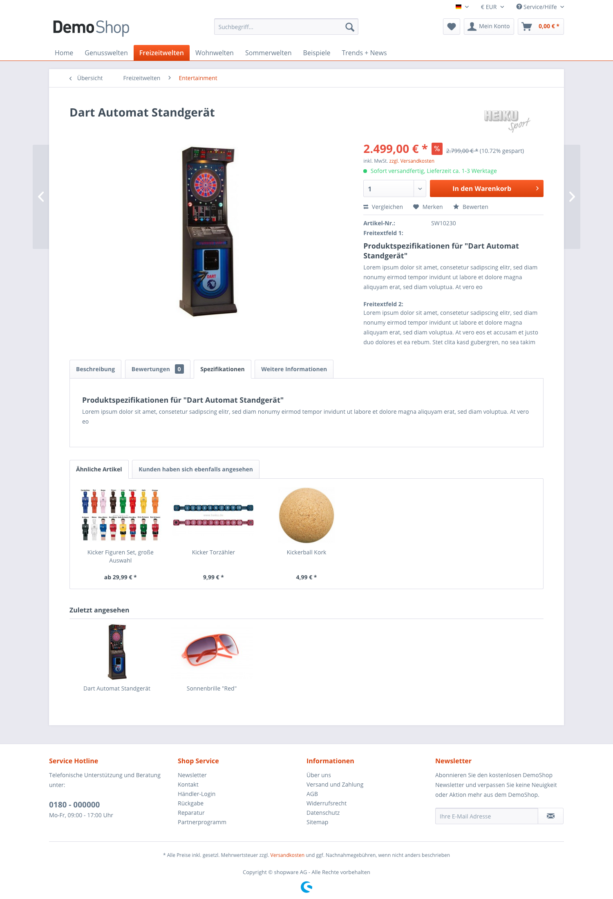

## Introduction

The purpose of this example plugin is to provide shop operators with the opportunity of configuring their own custom tabs on item detail pages.
For this, we’ll use the item attributes. As this is a frontend example, we’ll avoid using any of the otherwise convenient configuration options in a backend module.
Before we get into programming the plugin, we’ll first create a Definition of Done, so that we don’t lose sight of our target.


## Definition of Done

* Ability to configure multiple tabs
* Tabs should have headings and content
* Only tabs with content should be displayed
* Tab content can be maintained via existing item attributes
* A mapping must be made showing which items are displayed by which tabs.

## The Bootstrap.php

```php
<?php

class Shopware_Plugins_Frontend_SwagArticleTabs_Bootstrap extends Shopware_Components_Plugin_Bootstrap
{
    public function getLabel()
    {
        return 'Article detail tabs';
    }

    public function getInfo()
    {
        return array(
            'label' => $this->getLabel(),
            'version' => $this->getVersion(),
            'link' => 'http://www.shopware.de'
        );
    }

    public function getVersion()
    {
        return '1.0.0';
    }

    public function install()
    {
        $this->createConfiguration();

        $this->subscribeEvent(
            'Enlight_Controller_Action_PostDispatch_Frontend_Detail',
            'onPostDispatchDetail'
        );
        return true;
    }

    private function createConfiguration()
    {
        $attributes = $this->getArticleAttributes();
        foreach ($attributes as &$attribute) {
            $attribute = array($attribute, 'Freitextfeld - ' . $attribute);
        }

        $store = array(array('0', 'Keins'));
        $store = array_merge($store, $attributes);

        $form = $this->Form();

        for ($i = 1; $i < 11; $i++) {
            $form->setElement('text', 'tab' . $i . '-headline', array(
                'label' => 'Tab ' . $i . ' Headline'
            ));

            $form->setElement('select', 'tab' . $i,
                array('label' => 'Tab ' . $i . ' Mapping', 'store' => $store, 'style' => 'margin-bottom: 20px')
            );
        }
    }

    private function getArticleAttributes()
    {
        $sql = "SELECT * FROM s_articles_attributes LIMIT 0, 1";
        $cols = Shopware()->Db()->fetchRow($sql);
        $fields = array();

        foreach ($cols as $col => $value) {
            if (strpos('col_' . $col, 'attr') !== false) {
                $fields[] = $col;
            }
        }

        return $fields;
    }

    public function onPostDispatchDetail(Enlight_Event_EventArgs $arguments)
    {
        /**@var $controller Shopware_Controllers_Frontend_Detail */
        $controller = $arguments->getSubject();

        $view = $controller->View();

        //Add plugin template directory
        $view->addTemplateDir($this->Path() . 'Views/');

        $config = $this->Config()->toArray();
        $data = array();

        $sArticle = $view->getAssign('sArticle');

        for ($i = 1; $i < 10; $i++) {
            $key = 'tab' . $i;
            $data[$key] = array('headline' => $config[$key . '-headline'], 'content' => $sArticle[$config[$key]]);
        }

        $view->assign('swagArticleTabConfiguration', $data);
    }
}
```

## Source analysis

Let’s take a closer look here. In the install() function of the plugin, the PostDispatch event of the frontend detail controller has been registered.
This even will be used later to add additional tabs to the detail page. Furthermore, the internal function createConfiguration() is called, which is
responsible for generating the plugin configuration.

```php
public function install() 
{
    $this->createConfiguration();
    
    $this->subscribeEvent(
      'Enlight_Controller_Action_PostDispatch_Frontend_Detail',
      'onPostDispatchDetail'
    );
    return true;
}
```

In the createConfiguration() function all available item attributes are read. Again, this is via the function *getArticleAttributes()*.

```php
private function createConfiguration() 
{
    $attributes = $this->getArticleAttributes();
    ...
}

private function getArticleAttributes() 
{
    $sql= "SELECT * FROM s_articles_attributes LIMIT 0, 1";
    $cols = Shopware()->Db()->fetchRow($sql);
    $fields = array();
    
    foreach($cols as $col => $value) {
      if (strpos('col_' . $col, 'attr') !== false) {
         $fields[] = $col;
      }
    }
    
    return $fields;
}
```

This minor function is responsible for reading the first record from s_articles_attributes, iterating the fields and checking whether the field contains the name “attr”.

We now have the names of all item attributes that exist in the database. A blank entry is also added to allow the user to delete a mapping in hindsight.

```php
private function createConfiguration() 
{
    $attributes = $this->getArticleAttributes();
    foreach($attributes as &$attribute) {
      $attribute = array($attribute, 'Freitextfeld - ' . $attribute);
    }
    
    $store = array(array('0', 'Keins'));
    $store = array_merge($store, $attributes);
    ...
}
```

Next, a counter-driven loop starts to create the configuration fields. Each iteration of this loop generates a tab for the configuration.
As stated in our “Definition of Done”, a tab has both a heading and a mapping, which displays item attributes. Therefore, we must generate
two fields per iteration. One for the header and one to allow the user the option of selecting item attributes.

```php
private function createConfiguration() 
{
    ...
    $store = array_merge($store, $attributes);
    
    $form = $this->Form();
    for($i = 1; $i < 11; $i++) {
        $form->setElement('text', 'tab'.$i.'-headline', array(
         'label' =>  'Tab '.$i.' Headline'
        ));
        
        $form->setElement('select', 'tab' . $i,
         array('label' => 'Tab '.$i.' Mapping', 'store' => $store, 'style' => 'margin-bottom: 20px')
        );
    }
}
```

We’ve now completed our plugin configuration. The next step is to implement this configuration in the frontend.
<br>
For this purpose, we’ve already registered an event in the install() function, the PostDispatch event of the frontend detail controller.
This is triggered in Shopware whenever a customer visits an item detail page. All that is missing is the event listener function for this event.

```php
public function onPostDispatchDetail(Enlight_Event_EventArgs $arguments)
{
    ...
}
```

In this event listener function, the original object is returned, from which the event was triggered:

```php
public function onPostDispatchDetail(Enlight_Event_EventArgs $arguments)
{
    /**@var $controller Shopware_Controllers_Frontend_Detail*/
    $controller = $arguments->getSubject();
    ...
}
```

In this case, this is an instance of the Shopware_Controllers_Frontend_Detail class. This class is an extension of the Enlight_Controller_Action class,
with which we access the template engine through $controller->View(). We need this in order to load our template expansion.

```php
public function onPostDispatchDetail(Enlight_Event_EventArgs $arguments)
{
    /**@var $controller Shopware_Controllers_Frontend_Detail*/
    $controller = $arguments->getSubject();
    
    $view = $controller->View();
}
```

Now that the template engine is available, we only need to add our View/ directory and our templat engine crawl our directory to search for template extensions.
Make sure you don't use the old ```$view->extendsTemplate()``` function, to prevent breaking the template inheritance.

```php
public function onPostDispatchDetail(Enlight_Event_EventArgs $arguments)
{
    ...
    
    //Add our plugin template directory.
    $view->addTemplateDir($this->Path() . 'Views/');
    
    // Don't use the extendsTemplate method!
    
    ...
}
```

Now our template extension is loaded, but we still don't have the data for the tab. We need to access the plugin configuration to identify the stored values.

```php
public function onPostDispatchDetail(Enlight_Event_EventArgs $arguments)
{
    ...
    $config = $this->Config()->toArray();
    $data = array();
    ...
}
```

As we are configuring the tab content through the item attributes of each individual item, we also need to make the item data available that is already in the View/ directory.

```php
public function onPostDispatchDetail(Enlight_Event_EventArgs $arguments)
{
  ...
  $sArticle = $view->getAssign('sArticle');
   ...
}
```

With a counter-driven loop, we scroll through the fields and create an array with the keys headline and content for every tab.
To get to the value of the item attributes, we first need to dump item data we've just collected. This can be done as follows:

```php
public function onPostDispatchDetail(Enlight_Event_EventArgs $arguments)
{
   ...
   $sArticle = $view->getAssign('sArticle');

   echo "<pre>";
   print_r(\Doctrine\Common\Util\Debug::export($sArticle, 3));
   echo "</pre>";
   exit();
}
```

After dumping the data, we can see that the item attribute values can now be found directly on the first level
of the array and can be accessed via attr#. With this data, we can assemble the data array.

```php
public function onPostDispatchDetail(Enlight_Event_EventArgs $arguments)
{
   ...
   for($i = 1; $i < 10; $i++) {
      $key = 'tab' . $i;
      $data[$key] = array('headline' => $config[$key . '-headline'], 'content' => $sArticle[$config[$key]]);
   }
   ...
}
```

We only need to assign these to the View to be able to display them later.

```php
public function onPostDispatchDetail(Enlight_Event_EventArgs $arguments)
{
  ...
    $view->assign('swagArticleTabConfiguration', $data);
}
```

We have now implemented our plugin logic and now only need to make a few minor adjustments to the template in order to access the data.


## The template

For this small extension, we only need a small template file, which is located in the plugin folder under
<br>
```SwagArticleTabs/Views/frontend/detail/tabs.tpl```

```smarty
{extends file='parent:frontend/detail/tabs.tpl'}

{block name="frontend_detail_tabs_rating" append}
    {if $swagArticleTabConfiguration}
        {foreach $swagArticleTabConfiguration as $tab}
            {if $tab.content}
                <a href="#" class="tab--link">
                    {$tab.headline}
                </a>
            {/if}
        {/foreach}
    {/if}
{/block}

{block name="frontend_detail_tabs_content_rating" append}
    {if $swagArticleTabConfiguration}
        {foreach $swagArticleTabConfiguration as $tab}
            {if $tab.content}
                <div class="tab--container">
                    <div class="tab--content">
                        {$tab.content}
                    </div>
                </div>
            {/if}
        {/foreach}
    {/if}
{/block}
```

## Template analysis

Here we'll take a look at what exactly has been done in order to get these results.
First, the ```frontend_detail_tabs_rating``` block is expanded. In this block, we define the new tab header.
Via the append parameter, we specify that additional content will be added at the end.
First, the availability of our plugin is checked.

```smarty
{if $swagArticleTabConfiguration}
```

Then the tab data is iterated with a *foreach loop*.

```smarty
{foreach $swagArticleTabConfiguration as $tab}
```

Now we have the tab available in the variable ```{$tab}``` (remember our 'Definition of Done').

* ...
* Only tabs with content should be displayed.
* ...

Therefore tabs are checked for available content.

```smarty
{if $tab.content}
```

If the query returns a positive value, we add a new tab:

```smarty
<a href="#" class="tab--link">
    {$tab.headline}
</a>
```

We still need to add the content. For this, we'll expand the next block, ``frontend_detail_tabs_content_rating``.
In this block, we proceed just as before with the only difference that when there is content, we show this in a
DIV box:

```smarty
<div class="tab--content">
    {$tab.content}
</div>
```

Shopware handles the controlling of the tabs automatically, so no further adjustments are necessary.

## Result


