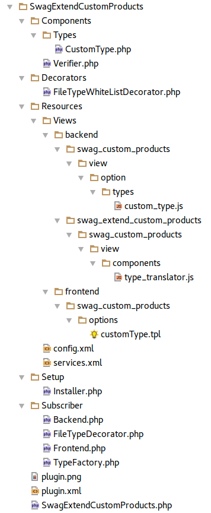

<div class="toc-list"></div>

## Introduction
This document will describe how existing plugins can be extended.

Why change a plugin with a plugin? To keep the changes compatible if the plugins gets an update.

The objective is to implement an own option type in SwagCustomProducts, which can be used in a template. This new option makes it possible for a customer to upload files with special mime types.

To achieve the objective we decorate a service to extend the function, extend ExtJs by Smarty blocks and implement new ExtJs and Smarty templates.


On base of the new 5.2 plugin system, we extend the plugin SwagCustomProducts with the following functions.

 - Decoration of the FileTypeWhiteList.php to add other file extensions to the whitelist. 
 - Adding a custom option type. 
  
## The file and directory structure


## Create the plugin basics
At first create the base structure of the plugin, including plugin.xml, config.xml, services.xml and the SwagExtendCustomProducts.php.
These files are the base of each plugin. 

For more information about <a href="{{ site.url }}/developers-guide/plugin-system/">the 5.2 Plugin system click here</a>

### SwagExtendCustomProducts/plugin.xml 
contains the base information about the plugin, the label in English and German, the plugin version, the required Shopware version and the changelog. 
This file is equal to the old plugin.json.

```xml
<?xml version="1.0" encoding="utf-8"?>
<plugin xmlns:xsi="http://www.w3.org/2001/XMLSchema-instance"
        xsi:noNamespaceSchemaLocation="https://raw.githubusercontent.com/shopware/shopware/5.2/engine/Shopware/Components/Plugin/schema/plugin.xsd">
    <label lang="de">Erweiterung für CustomProducts (v2)</label>
    <label lang="en">Extension for CustomProducts (v2)</label>
    <version>1.0.0</version>
    <copyright>(c) by shopware AG</copyright>
    <license>proprietary</license>
    <link>http://store.shopware.com</link>
    <author>shopware AG</author>
    <compatibility minVersion="5.2.0"/>
    <changelog version="1.0.0">
        <changes lang="de">Erstveröffentlichung;</changes>
        <changes lang="en">First release;</changes>
    </changelog>
</plugin>
```

### SwagExtendCustomProducts/Resources/config.xml
describes possible global plugin settings.

In this file you can easily implement a bunch of plugin settings which the customer can use to control the plugin.
Each element node represents a single plugin setting. 
You can also translate the label and the description in your language.

Possible types for elements are:

- text 
- password 
- textarea 
- boolean 
- color 
- date 
- datetime 
- time 
- interval 
- html 
- mediaselection 
- number 
- select 
- combo
    
```xml
<?xml version="1.0" encoding="utf-8"?>
<config xmlns:xsi="http://www.w3.org/2001/XMLSchema-instance"
 xsi:noNamespaceSchemaLocation="https://raw.githubusercontent.com/shopware/shopware/5.2/engine/Shopware/Components/Plugin/schema/config.xsd">

    <elements>

        <element required="false" type="boolean">
            <name>extend</name>
            <label lang="de">Custom Products erweitern?</label>
            <label lang="en">Extend Custom Products?</label>
            <description lang="de">Wenn Sie Custom Products erweitern wollen müssen Sie diese Option aktivieren.
            </description>
            <description lang="en">If you want to extend Custom Products, you must enable this option.</description>
        </element>

        <element required="false" type="color">
            <name>senselessly</name>
            <label lang="de">Sinnlose Einstellung</label>
            <label lang="en">Senseless setting</label>
            <description lang="de">Das ist ein sinnloser Text.</description>
            <description lang="en">This is a senseless text.</description>
        </element>

    </elements>
</config>
```

### SwagExtendCustomProducts/Resources/service.xml

defines in this case Subscribers which react to certain events. 
Make sure that Subscriber-Services implement the tag. 

```xml
<tag name="shopware.event_subscriber" />
```

Also you can define each type of service here. 

```xml
<!-- Custom services -->
<service id="swag_custom_plugin.custom_repository" class="SwagCustomPlugin\Components\CustomRepository">
    <argument type="service" id="models" />
</service>
```

With the tag 
```xml
<argument type="service" id="customID" />
``` 
you can specify other services as parameter to inject them into the service.


```xml
<?xml version="1.0" ?>

<container xmlns="http://symfony.com/schema/dic/services"
           xmlns:xsi="http://www.w3.org/2001/XMLSchema-instance"
           xsi:schemaLocation="http://symfony.com/schema/dic/services http://symfony.com/schema/dic/services/services-1.0.xsd">

    <services>
        <!-- SUBSCRIBER -->
        <service id="swag_extend_custom_products.subscriber.backend" class="SwagExtendCustomProducts\Subscriber\Backend">
            <argument type="service" id="service_container" />
            <tag name="shopware.event_subscriber" />
        </service>

        <service id="swag_extend_custom_products.subscriber.frontend" class="SwagExtendCustomProducts\Subscriber\Frontend">
            <argument type="service" id="service_container" />
            <tag name="shopware.event_subscriber" />
        </service>

        <service id="swag_extend_custom_products.subscriber.type_factory" class="SwagExtendCustomProducts\Subscriber\TypeFactory">
            <tag name="shopware.event_subscriber" />
        </service>

        <service id="swag_extend_custom_products.subscriber.file_type_decorator" class="SwagExtendCustomProducts\Subscriber\FileTypeDecorator">
            <argument type="service" id="service_container" />
            <tag name="shopware.event_subscriber" />
        </service>

    </services>

</container>
```

### SwagExtendCustomProducts/SwagExtendCustomProducts.php
is like the Bootstrap.php in the old plugin-system. 
Overwrite functions to execute your code here.
 
For more information about the functions you can use and overwrite take a look into the wiki <a href="{{ site.url }}/developers-guide/plugin-system/">The 5.2 Plugin system</a> or in the class _\Shopware\Components\Plugin_ which you can find in the folder _ /engine/Shopware/Components_.

In our example we overwrite the build and the install methods. 
 - The build method, to add a new parameter into the dependency container.
wherever you have the container available you can call the parameter by:

```php
$this->container->getParameter('swag_extend_custom_products.plugin_dir');
```
 - The install method, to initialize our installation procedure.

```php
<?php

namespace SwagExtendCustomProducts;

use Shopware\Components\Plugin;
use Shopware\Components\Plugin\Context\InstallContext;
use SwagExtendCustomProducts\Setup\Installer;
use Symfony\Component\DependencyInjection\ContainerBuilder;

class SwagExtendCustomProducts extends Plugin
{
    /**
     * Add a new parameter to the container, to retrieve the plugin path at any time.
     *
     * @param ContainerBuilder $container
     */
    public function build(ContainerBuilder $container)
    {
        $container->setParameter('swag_extend_custom_products.plugin_dir', $this->getPath());

        parent::build($container);
    }

    /**
     * Overwrites the install method to execute specific installation code.
     *  
     * @param InstallContext $context
     */
    public function install(InstallContext $context)
    {
        $installer = new Installer($this->container);
        $installer->install();
    }
}
```

### SwagExtendCustomProducts/Installer.php
To keep track of the code, swap out the installation code in this extra file. 
In this example it checks if the plugin "Custom Products (v2)" is installed, but you can add other code here if necessary for your installation.

```php
<?php

namespace SwagExtendCustomProducts\Setup;

use RuntimeException;
use SwagExtendCustomProducts\Components\Verifier;
use Symfony\Component\DependencyInjection\ContainerInterface;

class Installer
{
    /** @var ContainerInterface */
    private $container;

    public function __construct(ContainerInterface $container)
    {
        $this->container = $container;
    }

    /**
     * @return bool
     */
    public function install()
    {
        // Checks if the plugin Custom Products (v2) is installed.
        $verifier = new Verifier($this->container->get('dbal_connection'));
        if(!$verifier->isDependingPluginInstalled()) {
            throw new RuntimeException('The Plugin "Custom Products (v2)" is required.');
        }

        return true;
    }
}
```

### SwagExtendCustomProducts/Components/Verifier.php
Simple class to check if a plugin is installed.

```php
<?php

namespace SwagExtendCustomProducts\Components;

use Doctrine\DBAL\Connection;

class Verifier
{
    /** @var Connection */
    private $connection;

    /**
     * Verifier constructor.
     * @param Connection $connection
     */
    public function __construct(Connection $connection)
    {
        $this->connection = $connection;
    }

    /**
     * @return bool
     */
    public function isDependingPluginInstalled()
    {
        $queryBuilder = $this->connection->createQueryBuilder();

        return (bool)$queryBuilder->select('id')
            ->from('s_core_plugins')
            ->where('name LIKE "SwagCustomProducts"')
            ->andWhere('active = 1')
            ->execute()
            ->fetchColumn();
    }
}

```

## Decorate the WhiteListService
We decide to decorate the service by the event method because the plugin we want to expand is still based on the old plugin system. Thus, the service wasn't injected into the container yet.


To add new items into the white list we must decorate the service. 
That means, call the original service and create our own service. This contains the original service, implements the same interface and extends the functions. 
At the end set the service to the container instead of the original. 

 - To decorate the WhiteListService of the Custom Product (v2) plugin we need the event name that invokes the Service. _custom_products.file_upload.file_type_whitelist_
 - In combination with the prefix _Enlight_Bootstrap_AfterInitResource_ we create the full event name: **_Enlight_Bootstrap_AfterInitResource_custom_products.file_upload.file_type_whitelist_**
 
 For more information about Shopware events read the <a href="{{ site.url }}/developers-guide/event-guide/">Event guide</a>
 
The Subscriber **_SwagExtendCustomProducts/Subscriber/FileTypeDecorator.php_** 

```php
<?php

namespace SwagExtendCustomProducts\Subscriber;

use Enlight\Event\SubscriberInterface;
use ShopwarePlugins\SwagCustomProducts\Components\FileUpload\FileTypeWhitelist;
use SwagExtendCustomProducts\Decorators\FileTypeWhiteListDecorator;
use Symfony\Component\DependencyInjection\ContainerInterface;

class FileTypeDecorator implements SubscriberInterface
{
    /** @var ContainerInterface */
    private $container;

    public function __construct(ContainerInterface $container)
    {
        $this->container = $container;
    }

    public static function getSubscribedEvents()
    {
        return [
            'Enlight_Bootstrap_AfterInitResource_custom_products.file_upload.file_type_whitelist' => 'decorateFileTypeWhiteList'
        ];
    }

    public function decorateFileTypeWhiteList()
    {
        /** @var FileTypeWhitelist $fileTypeWhiteList */
        $fileTypeWhiteList = $this->container->get('custom_products.file_upload.file_type_whitelist');

        $this->container->set(
            'custom_products.file_upload.file_type_whitelist',
            new FileTypeWhiteListDecorator($fileTypeWhiteList)
        );
    }
}
```
If Custom Products (v2) calls the event, set the decorator into the container to replace the original service.

**_SwagExtendCustomProducts/Decorators/FileTypeWhiteListDecorator.php_** adds an array of new mime types to the white list.

Now the customer in the frontend can upload the files with the new mime types.
```php
<?php

namespace SwagExtendCustomProducts\Decorators;

use ShopwarePlugins\SwagCustomProducts\Components\FileUpload\FileTypeWhitelist;
use ShopwarePlugins\SwagCustomProducts\Components\FileUpload\FileTypeWhitelistInterface;
use ShopwarePlugins\SwagCustomProducts\Components\Types\Types\FileUploadType;
use ShopwarePlugins\SwagCustomProducts\Components\Types\Types\ImageUploadType;

class FileTypeWhiteListDecorator implements FileTypeWhitelistInterface
{
    /** @var FileTypeWhitelist */
    private $fileTypeWhitelist;

    /**
     * inject the original FileTypeWhiteListDecorator
     *
     * @param FileTypeWhitelist $fileTypeWhitelist
     */
    public function __construct(FileTypeWhitelist $fileTypeWhitelist)
    {
        $this->fileTypeWhitelist = $fileTypeWhitelist;
    }
    
    /**
     * @param string $type
     * @return string|void
     */
    public function getMimeTypeWhitelist($type)
    {
        switch ($type) {
            case FileUploadType::TYPE:
                return $this->getMimeTypeWhitelistForFiles();
            case ImageUploadType::TYPE:
                return FileTypeWhitelist::$mimeTypeWhitelist['image'];
            default:
                return;
        }
    }

    /**
     * @param string $type
     * @return string|void
     */
    public function getExtensionWhitelist($type)
    {
        return $this->fileTypeWhitelist->getExtensionWhitelist($type);
    }

    /**
     * Add new mimeTypes to whiteList
     *
     * @return array
     */
    private function getMimeTypeWhitelistForFiles()
    {
        $newMimeTypes = [
            'video/x-ms-asf',           // .asf
            'video/x-ms-asf',           // .asx
            'video/x-ms-wvx',           // .wvx
            'video/x-ms-wm',            // .wm
            'video/x-ms-wmx',           // .wmx
            'audio/x-ms-wma',           // .wma
            'audio/x-ms-wax',           // .wax
            'audio/x-ms-wmv',           // .wmv
            'application/x-ms-wmz',     // .wmz
            'application/x-ms-wmd',     // .wmd
        ];

        return array_merge(
            FileTypeWhitelist::$mimeTypeWhitelist['file'],
            $newMimeTypes
        );
    }
}
```

## Create the new option type
For adding a new option type to Custom Products (v2) subscribe to _SwagCustomProduct_Collect_Types_ event, which is fired in _SwagCustomProducts/Components/Types/TypeFactory.php_

More information about <a href="{{ site.url }}/developers-guide/backend-extension/">extending the backend</a>.

```php 
$this->eventManager->collect('SwagCustomProduct_Collect_Types', $collection);
```

Create a new Subscriber.
 
 **_SwagExtendCustomProducts/Subscriber/TypeFactory.php_**

```php
<?php

namespace SwagExtendCustomProducts\Subscriber;

use Doctrine\Common\Collections\ArrayCollection;
use Enlight\Event\SubscriberInterface;
use Enlight_Event_EventArgs;
use SwagExtendCustomProducts\Components\Types\CustomType;

class TypeFactory implements SubscriberInterface
{
    public static function getSubscribedEvents()
    {
        return [
            'SwagCustomProduct_Collect_Types' => 'onCollectTypes'
        ];
    }

    /**
     * Returns our new type(s) as ArrayCollection
     * @param Enlight_Event_EventArgs $arguments
     *
     * @return ArrayCollection
     */
    public function onCollectTypes(Enlight_Event_EventArgs $arguments)
    {
        return new ArrayCollection([
            CustomType::TYPE => new CustomType()
        ]);
    }
}
```

The new custom type must implement the interface _ShopwarePlugins\SwagCustomProducts\Components\Types\TypeInterface_.

Define the type of the "customType" with a string and control whether the class has values like the image selection or has no values like a text area with a **true** or **false**.

**_SwagExtendCustomProducts/Components/Types/CustomType.php_**

```php
<?php

namespace SwagExtendCustomProducts\Components\Types;

use ShopwarePlugins\SwagCustomProducts\Components\Types\TypeInterface;

class CustomType implements TypeInterface
{
    const TYPE = 'customType';
    const COULD_CONTAIN_VALUES = false;

    /**
     * @return string
     */
    public function getType()
    {
        return self::TYPE;
    }

    /**
     * @return boolean
     */
    public function couldContainValues()
    {
        return self::COULD_CONTAIN_VALUES;
    }
}
```

After that, add the translation to the _SwagCustomProducts/Views/backend/swag_custom_products/view/components/type_translator.js_. Use the block "backend/swag_custom_products/components/typeTranslator/snippets" to add new Snippets. 

```js
snippets: {
    types: {
        //{block name="backend/swag_custom_products/components/typeTranslator/snippets"}{/block}
        checkbox: '{s name="combo/value/name/checkbox"}Checkbox{/s}',
        multiselect: '{s name="combo/value/name/multiselect"}Multiselect{/s}',
        numberfield: '{s name="combo/value/name/numberfield"}Numberfield{/s}',
        ...
        ...
        ...
        ...
    }
},
```

Create a new directory structure and the file _SwagExtendCustomProducts/Resources/Views/backend/swag_extend_custom_products/swag_custom_products/view/components/type_translator.js_

It's necessary to call **//{$smarty.block.parent}** because other plugins can extend the same Smarty block. 

```js
//{block name="backend/swag_custom_products/components/typeTranslator/snippets"}
//{$smarty.block.parent}
    customType: 'My CustomType Name',
//{/block}
```

After that, use a subscriber to add the js file to the template view.

**_SwagExtendCustomProducts/Subscriber/Backend.php_**

To extend ExtJs with our files we need two cases:

 - Extend ExtJs with new functions an classes: use the index action.
 - Overwrite classes or smarty blocks: use the load action.

```php
<?php

namespace SwagExtendCustomProducts\Subscriber;

use Enlight\Event\SubscriberInterface;
use Enlight_Event_EventArgs;
use Enlight_View_Default;
use Shopware_Proxies_ShopwareControllersBackendSwagCustomProductsProxy as Subject;
use Symfony\Component\DependencyInjection\ContainerInterface;

class Backend implements SubscriberInterface
{
    /** @var ContainerInterface */
    private $container;

    /** @var string */
    private $path;

    public function __construct(ContainerInterface $container)
    {
        $this->container = $container;
        $this->path = $this->container->getParameter('swag_extend_custom_products.plugin_dir');
    }

    public static function getSubscribedEvents()
    {
        return [
            'Enlight_Controller_Action_PostDispatch_Backend_SwagCustomProducts' => 'extendBackendModule'
        ];
    }

    public function extendBackendModule(Enlight_Event_EventArgs $arguments)
    {
        /** @var Subject $subject */
        $subject = $arguments->get('subject');

        /** @var Enlight_View_Default $view */
        $view = $subject->View();

        // add the template dir to the view.
        $view->addTemplateDir(
            $this->path . '/Resources/Views/'
        );

        $files = [];

        if ($arguments->get('request')->getActionName() === 'index') {
            $files[] = 'backend/swag_custom_products/view/option/types/custom_type.js';
        }

        if ($arguments->get('request')->getActionName() === 'load') {
            $files[] = 'backend/swag_extend_custom_products/swag_custom_products/view/components/type_translator.js';
        }

        foreach ($files as $file) {
            $view->extendsTemplate($file);
        }
    }
}
```

Add the option type in ExtJs. Create **_SwagExtendCustomProducts/Resources/Views/backend/swag_custom_products/view/option/types/custom_type.js_** which extends "Shopware.apps.SwagCustomProducts.view.option.types.AbstractTypeContainer"

The AbstractTypeContainer is an abstract ExtJs class which defines functions and "template functions" you can use or overwrite. 

```js
//

//{block name="backend/swag_custom_products/view/option/types/customType"}

// Take the original Custom Product Type and only use "Custom Type" as suffix.
// Custom Products is building this path in "Shopware.apps.SwagCustomProducts.view.option.Detail"
Ext.define('Shopware.apps.SwagCustomProducts.view.option.types.CustomType', {
    extend: 'Shopware.apps.SwagCustomProducts.view.option.types.AbstractTypeContainer'
});
//{/block}
```

At last create a template for the frontend to display the new option type. 
**_SwagExtendCustomProducts/Resources/Views/frontend/swag_custom_products/options/customType.tpl_**

```html
{block name="frontend_detail_swag_custom_products_options_customtype"}
    <input class="wizard--input" type="text" name="custom-option-id--{$option['id']}"
            id="custom-products-option-{$key}"
            data-field="true"
            {if $option['required']} data-validate="true" data-validate-message="{s name='detail/validate/textfield'}{/s}"{/if}
    />
{/block}
```

Also create a subscriber to add the option template to the view. 

**_SwagExtendCustomProducts/Subscriber/Frontend.php_**

```php
<?php

namespace SwagExtendCustomProducts\Subscriber;

use Enlight\Event\SubscriberInterface;
use Enlight_Event_EventArgs;
use Enlight_View_Default;
use Symfony\Component\DependencyInjection\ContainerInterface;
use Shopware_Proxies_ShopwareControllersBackendSwagCustomProductsProxy as Subject;

class Frontend implements SubscriberInterface
{
    /** @var ContainerInterface */
    private $container;

    /** @var string */
    private $path;

    public function __construct(ContainerInterface $container)
    {
        $this->container = $container;
        $this->path = $this->container->getParameter('swag_extend_custom_products.plugin_dir');
    }

    public static function getSubscribedEvents()
    {
        return [
            'Enlight_Controller_Action_PreDispatch_Frontend_Detail' => 'extendFrontend'
        ];
    }

    public function extendFrontend(Enlight_Event_EventArgs $arguments)
    {
        /** @var Subject $subject */
        $subject = $arguments->get('subject');

        /** @var Enlight_View_Default $view */
        $view = $subject->View();

        $view->addTemplateDir(
            $this->path . '/Resources/Views/'
        );
    }
}
```

Now we can use the plugin that extends the plugin **Custom Products (v2)** 
 - We can upload files with a new mime type 
 - We can use our own custom type to configure a product

The full Plugin is available to download it here: <a href="{{ site.url }}SwagExtendCustomProducts.zip">Example plugin here</a>. 
 
## General

### Call the PluginBootstrap of other plugins

**New method** if the plugin is based on the 5.2 plugin system
```php
$customProducts = $this->container()->get('kernel')->getPlugins()['SwagCustomProducts'];
```

**Old method**
```php
/** @var Shopware_Plugins_Frontend_SwagCustomProducts_Bootstrap $customProducts */
$customProducts = Shopware()->Plugins()->Frontend()->SwagCustomProducts();
```

### Decorate services by using the new plugin system.
To decorade a service you only add a new service to the .../.../Resources/services.xml and inject the old service as parameter

```xml
<services>
    <service id="swag_custom_services.service" class="SwagCustomService\Services\Service">
    </service>
    
    <!-- to decorate the service above register a new service -->
    <!-- decorates: tells the container that the new_services.service service replaces the swag_custom_services.service -->
    <service id="new_services.service" 
             decorates="swag_custom_services.service"
             class="SwagCustomService\Decorators\NewService">
             <!-- The old service is renamed to new_services.service.inner. So you can inject it -->
        <argument type="service" id="new_services.service.inner"/>
    </service>
</services>
```
