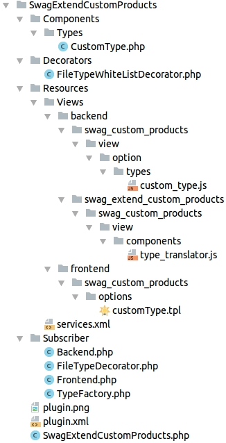

<div class="toc-list"></div>

## Introduction
This document will describe how existing plugins can be extended.

Why change a plugin with a plugin? To keep the changes compatible if the plugins gets an update.

The target is to implement an own option type in SwagCustomProducts, which can be used in a template. This new option makes it possible for a customer to upload files with special mime types.

To achieve this, we decorate a service, extend ExtJs with Smarty blocks and implement new ExtJs files and Smarty templates.

On base of the new 5.2 plugin system, we extend the plugin SwagCustomProducts with the following functions.
 - Decoration of the FileTypeWhiteList.php to add other file extensions to the whitelist. 
 - Adding a custom option type. 
  
## The file and directory structure


## Create the plugin basics
Create the base structure of the plugin, including plugin.xml, services.xml and the SwagExtendCustomProducts.php.

For more information about the Shopware 5.2 plugin system <a href="{{ site.url }}/developers-guide/plugin-system/">click here</a>

### SwagExtendCustomProducts/plugin.xml 
contains the base information about the plugin, the label in English and German, the plugin version, the required Shopware version and the changelog. It also makes sense to set the plugin `SwagCustomProducts` as requirement, as we want to extend it.

```xml
<?xml version="1.0" encoding="utf-8"?>
<plugin xmlns:xsi="http://www.w3.org/2001/XMLSchema-instance"
        xsi:noNamespaceSchemaLocation="https://raw.githubusercontent.com/shopware/shopware/5.2/engine/Shopware/Components/Plugin/schema/plugin.xsd">

    <label lang="de">Erweiterung für CustomProducts (v2)</label>
    <label lang="en">Extension for CustomProducts (v2)</label>

    <version>1.0.0</version>
    <copyright>(c) by shopware AG</copyright>
    <license>proprietary</license>
    <link>http://store.shopware.com</link>
    <author>shopware AG</author>
    <compatibility minVersion="5.2.0"/>

    <changelog version="1.0.0">
        <changes lang="de">Erstveröffentlichung;</changes>
        <changes lang="en">First release;</changes>
    </changelog>

    <requiredPlugins>
        <requiredPlugin pluginName="SwagCustomProducts" minVersion="4.0.0"/>
    </requiredPlugins>
</plugin>
```

The `minVersion="4.0.0"` attribute makes sure, that we use the correct version of CustomProduct.

### SwagExtendCustomProducts/Resources/services.xml

defines in this case Subscribers which react to certain events. 
Make sure that Subscriber-Services implement the tag. 

```xml
<tag name="shopware.event_subscriber" />
```

```xml
<?xml version="1.0" ?>

<container xmlns="http://symfony.com/schema/dic/services"
           xmlns:xsi="http://www.w3.org/2001/XMLSchema-instance"
           xsi:schemaLocation="http://symfony.com/schema/dic/services http://symfony.com/schema/dic/services/services-1.0.xsd">

    <services>
        <service id="swag_extend_custom_products.subscriber.backend"
                 class="SwagExtendCustomProducts\Subscriber\Backend">
            <argument>%swag_extend_custom_products.plugin_dir%</argument>
            <tag name="shopware.event_subscriber"/>
        </service>

        <service id="swag_extend_custom_products.subscriber.frontend"
                 class="SwagExtendCustomProducts\Subscriber\Frontend">
            <argument>%swag_extend_custom_products.plugin_dir%</argument>
            <tag name="shopware.event_subscriber"/>
        </service>

        <service id="swag_extend_custom_products.subscriber.type_factory"
                 class="SwagExtendCustomProducts\Subscriber\TypeFactory">
            <tag name="shopware.event_subscriber"/>
        </service>

        <service id="swag_extend_custom_products.file_upload.file_type_whitelist_decorator"
                 class="SwagExtendCustomProducts\Decorators\FileTypeWhiteListDecorator"
                 decorates="custom_products.file_upload.file_type_whitelist"
                 public="false">
            <argument type="service" id="swag_extend_custom_products.file_upload.file_type_whitelist_decorator.inner"/>
        </service>
    </services>
</container>
```

## Decorate the WhiteListService
To add new items into the white list we must decorate the service by using the `services.xml`.

 ```xml
<service id="swag_extend_custom_products.file_upload.file_type_whitelist_decorator"
         class="SwagExtendCustomProducts\Decorators\FileTypeWhiteListDecorator"
         decorates="custom_products.file_upload.file_type_whitelist"
         public="false">
    <argument type="service" id="swag_extend_custom_products.file_upload.file_type_whitelist_decorator.inner"/>
</service>
```

The container replaces the original service with our own. If the service is called the  'FileTypeWhiteListDecorator' is returned.

**_SwagExtendCustomProducts/Decorators/FileTypeWhiteListDecorator.php_** adds an array of new mime types to the white list.

Now the customer in the frontend can upload the files with the new mime types.
```php
<?php

namespace SwagExtendCustomProducts\Decorators;

use SwagCustomProducts\Components\FileUpload\FileTypeWhitelist;
use SwagCustomProducts\Components\FileUpload\FileTypeWhitelistInterface;
use SwagCustomProducts\Components\Types\Types\FileUploadType;

class FileTypeWhiteListDecorator implements FileTypeWhitelistInterface
{
    /**
     * @var FileTypeWhitelistInterface
     */
    private $fileTypeWhitelist;

    /**
     * Inject the original FileTypeWhiteListDecorator
     *
     * @param FileTypeWhitelistInterface $fileTypeWhitelist
     */
    public function __construct(FileTypeWhitelistInterface $fileTypeWhitelist)
    {
        $this->fileTypeWhitelist = $fileTypeWhitelist;
    }

    /**
     * {@inheritdoc}
     */
    public function getMimeTypeWhitelist($type)
    {
        if ($type === FileUploadType::TYPE) {
            return $this->getMimeTypeWhitelistForFiles();
        }

        return $this->fileTypeWhitelist->getMimeTypeWhitelist($type);
    }

    /**
     * {@inheritdoc}
     */
    public function getExtensionWhitelist($type)
    {
        return $this->fileTypeWhitelist->getExtensionWhitelist($type);
    }

    /**
     * {@inheritdoc}
     */
    public function getMediaOverrideType($extension)
    {
        return $this->fileTypeWhitelist->getMediaOverrideType($extension);
    }

    /**
     * Add new mimeTypes to whiteList
     *
     * @return array
     */
    private function getMimeTypeWhitelistForFiles()
    {
        $newMimeTypes = [
            'video/x-ms-asf',           // .asf
            'video/x-ms-asf',           // .asx
            'video/x-ms-wvx',           // .wvx
            'video/x-ms-wm',            // .wm
            'video/x-ms-wmx',           // .wmx
            'audio/x-ms-wma',           // .wma
            'audio/x-ms-wax',           // .wax
            'audio/x-ms-wmv',           // .wmv
            'application/x-ms-wmz',     // .wmz
            'application/x-ms-wmd',     // .wmd
        ];

        return array_merge(
            FileTypeWhitelist::$mimeTypeWhitelist['file'],
            $newMimeTypes
        );
    }
}
```

## Create the new option type
For adding a new option type to Custom Products (v2) subscribe to _SwagCustomProduct_Collect_Types_ event, which is fired in _SwagCustomProducts/Components/Types/TypeFactory.php_

```php 
$this->eventManager->collect('SwagCustomProduct_Collect_Types', $collection);
```

Create a new Subscriber.
 
 **_SwagExtendCustomProducts/Subscriber/TypeFactory.php_**

```php
<?php

namespace SwagExtendCustomProducts\Subscriber;

use Doctrine\Common\Collections\ArrayCollection;
use Enlight\Event\SubscriberInterface;
use SwagExtendCustomProducts\Components\Types\CustomType;

class TypeFactory implements SubscriberInterface
{
    /**
     * {@inheritdoc}
     */
    public static function getSubscribedEvents()
    {
        return [
            'SwagCustomProduct_Collect_Types' => 'onCollectTypes',
        ];
    }

    /**
     * Returns our new type(s) as ArrayCollection
     *
     * @return ArrayCollection
     */
    public function onCollectTypes()
    {
        return new ArrayCollection(
            [
                CustomType::TYPE => new CustomType(),
            ]
        );
    }
}
```

The new custom type must implement the interface _ShopwarePlugins\SwagCustomProducts\Components\Types\TypeInterface_.

Define the type of the "customType" with a string and control whether the class has values like the image selection or has no values like a text area with a **true** or **false**.

**_SwagExtendCustomProducts/Components/Types/CustomType.php_**

```php
<?php

namespace SwagExtendCustomProducts\Components\Types;

use SwagCustomProducts\Components\Types\TypeInterface;

class CustomType implements TypeInterface
{
    const TYPE = 'customType';
    const COULD_CONTAIN_VALUES = false;

    /**
     * {@inheritdoc}
     */
    public function getType()
    {
        return self::TYPE;
    }

    /**
     * {@inheritdoc}
     */
    public function couldContainValues()
    {
        return self::COULD_CONTAIN_VALUES;
    }
}
```

After that, add the translation to the _SwagCustomProducts/Views/backend/swag_custom_products/view/components/type_translator.js_. Use the block "backend/swag_custom_products/components/typeTranslator/snippets" to add new Snippets. 

More information about <a href="{{ site.url }}/developers-guide/backend-extension/">extending the backend</a>.

```js
snippets: {
    types: {
        //{block name="backend/swag_custom_products/components/typeTranslator/snippets"}{/block}
        checkbox: '{s name="combo/value/name/checkbox"}Checkbox{/s}',
        multiselect: '{s name="combo/value/name/multiselect"}Multiselect{/s}',
        numberfield: '{s name="combo/value/name/numberfield"}Numberfield{/s}',
        ...
        ...
        ...
        ...
    }
},
```

Create a new directory structure and the file _SwagExtendCustomProducts/Resources/Views/backend/swag_extend_custom_products/swag_custom_products/view/components/type_translator.js_

It's necessary to call **//{$smarty.block.parent}** because other plugins can extend the same Smarty block. 

```js
//{block name="backend/swag_custom_products/components/typeTranslator/snippets"}
//{$smarty.block.parent}
    customType: 'My CustomType Name',
//{/block}
```

After that, use a subscriber to add the js file to the template view.

**_SwagExtendCustomProducts/Subscriber/Backend.php_**

To extend ExtJs with our files we need two cases:

 - Extend ExtJs with new functions an classes: use the index action.
 - Overwrite classes or smarty blocks: use the load action.

```php
<?php

namespace SwagExtendCustomProducts\Subscriber;

use Enlight\Event\SubscriberInterface;

class Backend implements SubscriberInterface
{
    /**
     * @var string
     */
    private $path;

    /**
     * @param string $pluginPath
     */
    public function __construct($pluginPath)
    {
        $this->path = $pluginPath;
    }

    /**
     * {@inheritdoc}
     */
    public static function getSubscribedEvents()
    {
        return [
            'Enlight_Controller_Action_PostDispatch_Backend_SwagCustomProducts' => 'extendBackendModule',
        ];
    }

    /**
     * @param \Enlight_Event_EventArgs $arguments
     */
    public function extendBackendModule(\Enlight_Event_EventArgs $arguments)
    {
        /** @var \Shopware_Controllers_Backend_SwagCustomProducts $subject */
        $subject = $arguments->get('subject');

        $view = $subject->View();

        $view->addTemplateDir($this->path . '/Resources/Views/');

        if ($arguments->get('request')->getActionName() === 'index') {
            $view->extendsTemplate('backend/swag_custom_products/view/option/types/custom_type.js');
        }

        if ($arguments->get('request')->getActionName() === 'load') {
            $view->extendsTemplate('backend/swag_extend_custom_products/swag_custom_products/view/components/type_translator.js');
        }
    }
}
```

Add the option type in ExtJs. Create **_SwagExtendCustomProducts/Resources/Views/backend/swag_custom_products/view/option/types/custom_type.js_** which extends "Shopware.apps.SwagCustomProducts.view.option.types.AbstractTypeContainer"

The AbstractTypeContainer is an abstract ExtJs class which defines functions and "template functions" you can use or overwrite. 

```js
//{block name="backend/swag_custom_products/view/option/types/customType"}
// Take the original Custom Product Type and only use "Custom Type" as suffix.
// Custom Products is building this path in "Shopware.apps.SwagCustomProducts.view.option.Detail"
Ext.define('Shopware.apps.SwagCustomProducts.view.option.types.CustomType', {
    extend: 'Shopware.apps.SwagCustomProducts.view.option.types.AbstractTypeContainer'
});
//{/block}
```

At last create a template for the frontend to display the new option type. 
**_SwagExtendCustomProducts/Resources/Views/frontend/swag_custom_products/options/customType.tpl_**

```html
{block name="frontend_detail_swag_custom_products_options_customtype"}
    <input class="wizard--input" type="text" name="custom-option-id--{$option['id']}"
           id="custom-products-option-{$key}"
           data-field="true"
        {if $option['required']}
           data-validate="true"
           data-validate-message="{s name='detail/validate/textfield'}{/s}"
        {/if}/>
{/block}
```

Also create a subscriber to add the option template to the view. 

**_SwagExtendCustomProducts/Subscriber/Frontend.php_**

```php
<?php

namespace SwagExtendCustomProducts\Subscriber;

use Enlight\Event\SubscriberInterface;

class Frontend implements SubscriberInterface
{
    /**
     * @var string
     */
    private $path;

    /**
     * @param string $pluginPath
     */
    public function __construct($pluginPath)
    {
        $this->path = $pluginPath;
    }

    /**
     * {@inheritdoc}
     */
    public static function getSubscribedEvents()
    {
        return [
            'Enlight_Controller_Action_PostDispatchSecure_Frontend_Detail' => 'extendFrontendDetail',
        ];
    }

    /**
     * @param \Enlight_Event_EventArgs $arguments
     */
    public function extendFrontendDetail(\Enlight_Event_EventArgs $arguments)
    {
        /** @var \Shopware_Controllers_Frontend_Detail $subject */
        $subject = $arguments->get('subject');

        $view = $subject->View();

        $view->addTemplateDir($this->path . '/Resources/Views/');
    }
}
```

Now we can use the plugin that extends the plugin **Custom Products (v2)** 
 - We can upload files with a new mime type 
 - We can use our own custom type to configure a product

The full Plugin is available for download here: <a href="{{ site.url }}/exampleplugins/SwagExtendCustomProducts.zip">Example plugin here</a>.
