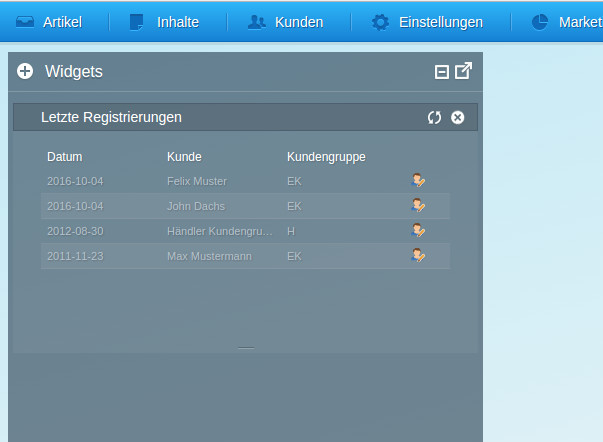

<div class="toc-list"></div>

## Introduction ##
In this guide we will create our own backend widget plugin for the new shopware 5.2 plugin system. 
This plugin will show some information about the last registered users in a handy widget.

## Plugin metadata ##
### plugin.xml
As always in the new plugin system we set our metadata in the `plugin.xml`
```
<?xml version="1.0" encoding="utf-8"?>
<plugin xmlns:xsi="http://www.w3.org/2001/XMLSchema-instance"
        xsi:noNamespaceSchemaLocation="https://raw.githubusercontent.com/shopware/shopware/5.3/engine/Shopware/Components/Plugin/schema/plugin.xsd">

    <label lang="de">SwagLastRegistrationsWidget</label>
    <label lang="en">SwagLastRegistrationsWidget</label>

    <version>1.0.0</version>
    <copyright>(c) shopware AG</copyright>
    <author>shopware AG</author>
    <compatibility minVersion="5.2.0" />
</plugin>

```
Since we use the new system for our plugin we set the `compability minVersion` to `5.2.0`.

## Plugin bootstrap file ##
### SwagLastRegistrationsWidget.php
```
    public static function getSubscribedEvents()
    {
        return [
            'Enlight_Controller_Dispatcher_ControllerPath_Backend_SwagLastRegistrationsWidget' => 'onGetBackendControllerPath',
            'Enlight_Controller_Action_PostDispatch_Backend_Index' => 'onPostDispatchBackendIndex'
        ];
    }
```
In our Bootstrap file we subscribe to two events:
```
    public function onGetBackendControllerPath()
    {
        return __DIR__ . '/Controllers/Backend/SwagLastRegistrationsWidget.php';
    }
```
The __onGetBackendControllerPath()__ method registers our own backend controller to shopware.

```
    /**
     * @param \Enlight_Controller_ActionEventArgs $args
     */
    public function onPostDispatchBackendIndex(\Enlight_Controller_ActionEventArgs $args)
    {
        $request = $args->getRequest();
        $view = $args->getSubject()->View();

        $view->addTemplateDir($this->getPath() . '/Resources/views');

        // if the controller action name equals "index" we have to extend the backend article application
        if ($request->getActionName() === 'index') {
            $view->extendsTemplate('backend/index/swag_last_registrations/app.js');
        }
    }
```
In the __onPostDispatchBackendIndex()__ method we add our template path to the view so that we can extend the shopware
javascript files later. Furthermore we extend the original app.js with our own if the __indexAction__ of the indexModule
is called. In the app.js we add our own stores, models etc.

`install()`
 ```
    public function install(InstallContext $context)
    {
        $plugin = $context->getPlugin();
        $widget = new Widget();

        $widget->setName('swag-last-registrations');
        $widget->setPlugin($plugin);
        $plugin->getWidgets()->add($widget);

        parent::install($context);
    }
 ```
 The __install()__ method creates a new widget Entity and adds it to our plugin. It is important to set the same
 __name__ as in our view alias(`Resources/views/backend/index/swag_last_registrations/view/main.js`) as well as adding a snippet for this __name__ under `Resources/snippets/backend/widget/labels.ini`.

`uninstall()`
```
    public function uninstall(UninstallContext $context)
    {
        $plugin = $context->getPlugin();
        $em = $this->container->get('models');
        $widget = $plugin->getWidgets()->first();
        
        $em->remove($widget);
        $em->flush();

        parent::uninstall($context);
    }
```
To __uninstall()__ the plugin we need to remove the widget entity from the database with the help of our entity manager.

## Controller ##
### Controller/Backend/SwagLastRegistrationsWidget.php
```
class Shopware_Controllers_Backend_SwagLastRegistrationsWidget extends Shopware_Controllers_Backend_ExtJs
{
    /**
     * Return the last registered users with an offset if it is defined
     */
    public function listAction()
    {
        $start = (int) $this->Request()->getParam('start');
        $limit = (int) $this->Request()->getParam('limit');
        $queryBuilder = Shopware()->Container()->get('dbal_connection')->createQueryBuilder();

        $queryBuilder->select([
            'user.id',
            'CONCAT(billing.firstname, \' \', billing.lastname) AS customer',
            'user.customergroup',
            'user.firstlogin as date',
            '(SELECT COUNT(*) FROM s_user) AS total'
        ])
            ->from('s_user', 'user')
            ->innerJoin('user', 's_user_billingaddress', 'billing', 'user.id = billing.userID')
            ->orderBy('date', 'DESC');

        if (!empty($start)) {
            $queryBuilder->setFirstResult($start);
        }
        if (!empty($limit)) {
            $queryBuilder->setMaxResults($limit);
        }

        $data = $queryBuilder->execute()->fetchAll();

        $this->View()->assign([
            'success' => true,
            'data'    => $data,
            'total'   => $data['total']
        ]);
    }
}
```
The controller has only an __listAction__ function which creates an sql query to fetch the last registered users and adds them to the view.

## ExtJS Part ##
### Resources/views/backend/index/swag_last_registrations/app.js
```
//{block name="backend/index/application"}
//{$smarty.block.parent}

//{include file="backend/index/swag_last_registrations/model/account.js"}
//{include file="backend/index/swag_last_registrations/store/account.js"}
//{include file="backend/index/swag_last_registrations/view/main.js"}

//{/block}
```
In our backend application we use the `app.js` to extend the shopware main app.js and add our own model,
store and view via the smarty include function.

### Resources/views/backend/index/swag_last_registrations/view/main.js
```
//{namespace name=backend/index/view/widgets}

Ext.define('Shopware.apps.Index.swagLastRegistrationsWidget.view.Main', {
    /**
     * Extend the base widget view
     */
    extend: 'Shopware.apps.Index.view.widgets.Base',

    /**
     * Set alias so the widget can be identified per widget name
     */
    alias: 'widget.swag-last-registrations',

    /**
     * Set the south handle so the widget height can be resized.
     */
    resizable: {
        handles: 's'
    },

    /**
     * Minimum / Default height of the widget
     */
    minHeight: 250,

    /**
     * Maximum height that the widget can have
     */
    maxHeight: 600,

    /**
     * Initializes the widget.
     * Creates the account store and the Grid for showing the newest registrations.
     * Adds a refresh button to the header to manually refresh the grid.
     *
     * @public
     * @return void
     */
    initComponent: function() {
        var me = this;

        me.accountStore = Ext.create('Shopware.apps.Index.swagLastRegistrationsWidget.store.Account');

        me.items = [
            me.createAccountGrid()
        ];

        me.tools = [{
            type: 'refresh',
            scope: me,
            handler: me.refreshView
        }];

        me.callParent(arguments);
    },

    /**
     * Creates the main Widget grid and its columns
     *
     * @returns { Ext.grid.Panel }
     */
    createAccountGrid: function() {
        var me = this;

        return Ext.create('Ext.grid.Panel', {
            border: 0,
            store: me.accountStore,
            columns: me.createColumns()
        });
    },

    /**
     * Helper method which creates the columns for the
     * grid panel in this widget.
     *
     * @return { Array } - generated columns
     */
    createColumns: function() {
        return [{
            dataIndex: 'date',
            header: '{s name=swag-last-registrations/date}{/s}',
            flex: 1
        }, {
            dataIndex: 'customer',
            header: '{s name=swag-last-registrations/customer}{/s}',
            flex: 1
        }, {
            dataIndex: 'customergroup',
            header: '{s name=swag-last-registrations/customer-group}{/s}',
            flex: 1
        }, {
            xtype: 'actioncolumn',
            width: 50,
            items: [{
                iconCls:'sprite-user--arrow',
                tooltip: '{s name=swag-last-registrations/customer-open}{/s}',
                handler: function(view, rowIndex, colIndex, item, event, record) {
                    openNewModule('Shopware.apps.Customer', {
                        action: 'detail',
                        params: {
                            customerId: ~~(record.get('id'))
                        }
                    });
                }
            }]
        }]
    },

    /**
     * Refresh the account store if its available
     */
    refreshView: function() {
        var me = this;

        if(!me.accountStore) {
            return;
        }

        me.accountStore.reload();
    }
});
```
The `view/main.js` is the window that is shown in the backend widget system. 
It is important to extend from the `Shopware.apps.Index.view.widgets.Base` component.
You also need to use the same alias as in our `$widget->setName()` method in the bootstrap file.
The rest should be self explanatory. For more help take a look at the __ExtJS documentation.__

### Resources/views/backend/index/swag_last_registrations/store/account.js
```
//
Ext.define('Shopware.apps.Index.swagLastRegistrationsWidget.store.Account', {
    /**
     * Extends the default Ext Store
     * @string
     */
    extend: 'Shopware.store.Listing',

    model: 'Shopware.apps.Index.swagLastRegistrationsWidget.model.Account',

    remoteSort: true,

    autoLoad: true,
            
    /**
    * This function is used to override the { @link #displayConfig } object of the statics() object.
    *
    * @returns { Object }
    */
    configure: function() {
        return {
            controller: 'SwagLastRegistrationsWidget'
        }
    }
});
```

### Resources/views/backend/index/swag_last_registrations/model/account.js
```
//
Ext.define('Shopware.apps.Index.swagLastRegistrationsWidget.model.Account', {

    extend: 'Ext.data.Model',

    fields: [
        'id',
        'customer',
        'customergroup',
        'date'
    ]
});
```

## Download plugin ##
The whole plugin can be downloaded <a href="{{ site.url }}/exampleplugins/SwagLastRegistrationsWidget.zip">here</a>.

