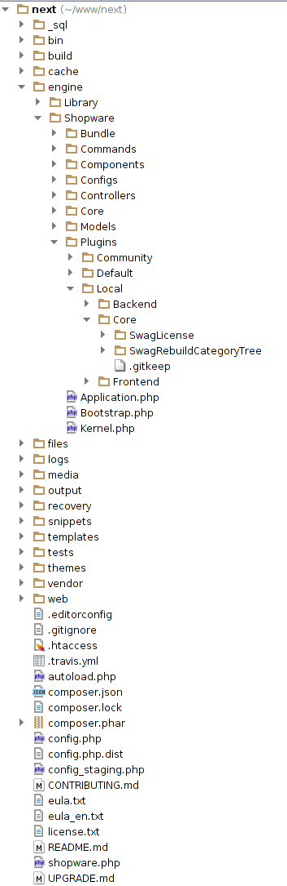
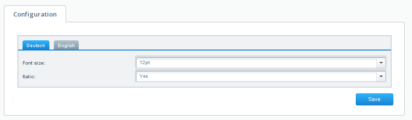
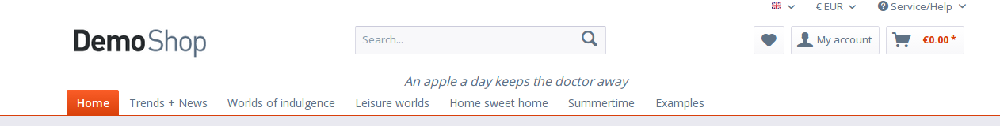

This document will give you a brief overview of Shopware and everything you need to start developing your first plugin.

<div class="toc-list"></div>

## Directory structure

On the left you can see Shopware's default directory structure, as you will find in GitHub checkouts or release packages. Let's start with a quick overview:



**_sql**: (Not in release packages) Contains various deltas and migrations to set up Shopware or migrate the database of an old Shopware version to the database of a new version.

**bin**: Contains the `console` command which can be executed to run the Shopware command line tools

**build**: (Not in release packages) Contains our ant-based build engine with various scripts to e.g. install dependencies, reset the database etc. When installing Shopware from GitHub you want to run `ant build-unit` first. If you use the install package, you can just use our web-based installer

**custom/plugins** This directory contains all plugins based on the plugin system introduced with Shopware 5.2.

**cache**: Contains various caches and generated files like smarty compile cache, proxy caches, HTML cache etc.

**engine/Library**: Some libraries / dependencies which are not available in composer.

**engine/Shopware**: The actual Shopware application with subdirectories for our bundles, services and models.

**files**: Files for ESD products or generated documents are stored here

**logs**: Our logging directory. Whenever an exception occurs in the Shopware stack, you'll find the stack trace and some context in these log files.

**media**: Files uploaded via the Shopware MediaManager are stored in here (images, thumbnails and other uploads)

**recovery**: Our web-based update and install tool can be found here.

**snippets**: Contains Shopware snippets for frontend and backend in a simple INI format. Snippets will automatically be deployed to the database during installation. (Not in release packages)

**tests**: PHPUnit and Mink tests

**themes**: The Shopware 5 template base (bare, responsive)

**vendor**: Dependencies from composer. Shipped with the release package, git users will need to run `composer install` or `ant build-unit`

**web**: The concatenated and minified javascript and CSS templates

<div style="clear:both"></div>

## MVC
Shopware makes use of the [MVC design pattern](http://en.wikipedia.org/wiki/Model%E2%80%93view%E2%80%93controller). For this reason, the representational aspect of the application (view), the controlling and user input (controller) as well as the data layer and business logic (model) are decoupled throughout the application.

### View
Shopware uses [Smarty](http://en.wikipedia.org/wiki/Smarty) as template engine. You will find all templates in `themes`.

### Model
[Doctrine](http://en.wikipedia.org/wiki/Doctrine_(PHP)) is used as ORM and database abstraction layer. You will find the various Doctrine models in `engine/Shopware/Models`. The models are grouped by domain, so you will find article related models in the `Article` directory, customer related models in the `Customer` directory and so on. The business logic of Shopware can be found in `Core`, `Components` or `Bundle` - depending how tight the service in question is coupled to Shopware itself.

### Controller auto-registration

The auto-registration is available in Shopware 5.2.7 or above.
To make use of it, create a file like `SwagControllerExample/Controllers/(Backend|Frontend|Widgets|Api)/MyController.php` 
and follow our controller naming conventions. After that, you'll be able to call `MyController`.
The registration of the template would be done, i.e. in the `preDispatch()`-Method of your controller.

```php
class Shopware_Controllers_Frontend_MyController extends \Enlight_Controller_Action
{
    public function preDispatch()
    {
        $pluginPath = $this->container->getParameter('swag_controller_example.plugin_dir');
        
        $this->get('template')->addTemplateDir($pluginPath . '/Resources/views/');
        $this->get('snippets')->addConfigDir($pluginPath . '/Resources/snippets/');
    }
}
```

### Controller
Controllers take care of user input of any kind, process the input in the model and respond with an answer which is usually generated by the template.

Shopware's controllers can be found in `engine/Shopware/Controllers` and are separated by `module`, which can be one of the following:

 * frontend (default)
 * widgets (for our ESI system)
 * backend (for the Shopware administrative panel)
 * api (for our REST API)

In Shopware, any request will hit a controller, depending on the type of the request. Therefore, three decisions are made:

 * which module is requested (default: frontend)
 * which controller is requested (default: Index)
 * which controller action should be called (default: index)

If module, controller or action are not explicitly defined, Shopware will fall back to the defaults mentioned above. For this reason, a call the the shop's root directory will be dispatched to the frontend module, index controller and index action. This is equivalent to the call to `http://my-shop.com/frontend/index/index`. In practice, however, these "technical" URLs are usually hidden by the SEO engine.

Inside a controller you have easy access to the `Request` and `Response` object, as well as to the DI container, so you can call other components and services.

## Technologies
Shopware as an open source shopping system uses many well known libraries. We use Symfony components like the dependency injection container, the console tools and some other and are HTTP compliant with the Symfony HTTP kernel.
Other well known libraries are also used and included in Shopware, like Guzzle HTTP client, Doctrine, Smarty, Monolog and Phpunit, so that most developers should feel quite comfortable regarding the used technologies.
The actual HTTP stack of Shopware is currently powered by Zend Framework which Shopware uses with a thin layer called `Enlight` on top. As we plan to move towards Symfony step by step, Enlight might come in handy as a transitional framework.

## Hooking into the system with events
Shopware uses plugins to extend the base systems. Changes in the core are never required and never recommended.
Extensions of the core system can basically be separated into logical extensions, data extensions and template extensions.

Some global events are very powerful when it comes to extending Shopware's behaviour:

* Enlight_Controller_Action_PreDispatch_*
* Enlight_Controller_Action_PostDispatchSecure_*

These events will be emitted whenever a controller action is about to be called ("PreDispatch") or **after** the controller action was called ("PostDispatch"). This way it is very easy to get notified any time a certain controller is executed to perform some extensions:

```xml
<container xsi:schemaLocation="http://symfony.com/schema/dic/services http://symfony.com/schema/dic/services/services-1.0.xsd">
    <services>
        <service id="swag_slogan_of_the_day.subscriber.frontend" 
            class="SwagSloganOfTheDay\Subscriber\FrontendSubscriber">
            <tag name="shopware.event_subscriber"/>
        </service>
    </services>
</container>
```

```php
<?php
class FrontendSubscriber implements SubscriberInterface
{
    public static function getSubscribedEvents()
    {
        return [
            'Enlight_Controller_Action_PostDispatchSecure_Frontend_Detail' => 'myDetailCallback'
        ];
    }

    public function myDetailCallback(\Enlight_Controller_ActionEventArgs $args)
    {
        // Do some action
    }
}
```

This snippet will call the callback function `myDetailCallback` any time the detail controller (and therefore: the detail page) was requested. In your callback you could now load template extensions or modify view assignments.

If you want to read more about the events in Shopware you can take a look at the [events article](https://developers.shopware.com/developers-guide/event-guide/#further-events).

## Extending the database
Your plugin is free to create its own table in the Shopware database in order to store additional data. But there is even a more convenient way: The Shopware attribute system.
Shopware attributes are basically tables in a OneToOne relation to important Shopware entities. So, for every entry in `s_user` (the customer table), there is also an entry in `s_user_attributes`. In Shopware, it is very easy to add a new column to this table and to automatically add it to the customer doctrine attribute model. Whenever Shopware reads a customer, article or another entity from database, it will also read the attributes, so that you can make use of attributes in many places and modules.
If you want to read more about extending the database in Shopware you can take a look at the [attribute system article](https://developers.shopware.com/developers-guide/attribute-system/#schema-operations-and-configuration)

## Extending the template
In many cases you might want to modify the template. Shopware makes use of the Smarty block system for that. Blocks are basically named areas inside the template that you can prepend, append or even replace. Shopware's default frontend theme has more than 1.500 blocks - so more than 1.500 extension points for you as a plugin developer.

A smarty block will usually look like this:

```smarty
{block name="Shopware_frontend_checkout_cart"}
    <div>
        Some HTML content
    </div>
{/block}
```

# Writing our first little plugin
The following example will show how to write a very simple plugin, which extends the frontend and adds a little "slogan" to the page.

## Plugin Name

The plugin name must be fashioned according to the [PHP variable name rules](http://php.net/manual/language.variables.basics.php) and should always be prefixed with your developer prefix so it's unique in the Shopware universe.
To submit plugins to the [shopware store](https://store.shopware.com/en) you have to obtain your developer prefix in the [Shopware Account](https://account.shopware.com).

In the following examples the developer prefix "Swag" will be used (short for shopware AG).

## Plugin Info

Provide meta information about your plugin with the `plugin.xml` file. Read the chapter [plugin metadata](#plugin-metadata) for more information.

## Plugin Icon

To make it easier to identify you plugin in the plugin manager module in the backend, you should provide a `plugin.png` file in your plugin root directory.
This small icon must have a size of 16x16px.

## Plugin helper class SloganPrinter

To have a clean structure and readability in our plugin, we sort out functionality in a separate class at: `custom/plugins/SwagSloganOfTheDay/Components/SloganPrinter.php` where the slogan-texts get returned.

```php
 <?php

 namespace SwagSloganOfTheDay\Components;

 class SloganPrinter
 {
    public function getSlogan()
    {
        $slogans = [
            'An apple a day keeps the doctor away',
            'Let’s get ready to rumble',
            'A rolling stone gathers no moss',
        ];

        return array_rand(array_flip($slogans));
    }
 }
```

## The plugin base file
The main entry point of every plugin is the plugin base file in your plugin directory `SwagSloganOfTheDay.php`. This is placed
in either `custom/plugins/SwagSloganOfTheDay` or `custom/project/SwagSloganOfTheDay` if it is a project-specific
plugin by intention.

 In the `SwagSloganOfTheDay.php` file, we create a simple class:

```php
 <?php

 namespace SwagSloganOfTheDay;

 use Shopware\Components\Plugin;

 class SwagSloganOfTheDay extends Plugin
 {

 }
```

Both the PHP namespace and the class name must match the [plugin name](#plugin-name) equally and no additional
path parts must be added.

It's important to extend the `Shopware\Components\Plugin` class.

Now we add the first event subscriber to the SwagSloganOfTheDay plugin.
For this we add a folder Subscriber in which we create a new PHP class `RouteSubscriber.php`, and add this subscriber to the services.xml.

## Subscriber classes

```php
<?php
namespace SwagSloganOfTheDay\Subscriber;

use Enlight\Event\SubscriberInterface;
use Shopware\Components\Plugin\ConfigReader;
use SwagSloganOfTheDay\Components\SloganPrinter;

class RouteSubscriber implements SubscriberInterface
{
   private $pluginDirectory;
   private $sloganPrinter;
   private $config;

   public static function getSubscribedEvents()
   {
       return [
           'Enlight_Controller_Action_PostDispatchSecure_Frontend' => 'onPostDispatch'
       ];
   }

   public function __construct($pluginName, $pluginDirectory, SloganPrinter $sloganPrinter, ConfigReader $configReader)
   {
       $this->pluginDirectory = $pluginDirectory;
       $this->sloganPrinter = $sloganPrinter;

       $this->config = $configReader->getByPluginName($pluginName);
   }

   public function onPostDispatch(\Enlight_Controller_ActionEventArgs $args)
   {
       /** @var \Enlight_Controller_Action $controller */
       $controller = $args->get('subject');
       $view = $controller->View();

       $view->addTemplateDir($this->pluginDirectory . '/Resources/views');

       $view->assign('swagSloganFontSize', $this->config['swagSloganFontSize']);
       $view->assign('swagSloganItalic', $this->config['swagSloganItalic']);
       $view->assign('swagSloganContent', $this->config['swagSloganContent']);

       if (!$this->config['swagSloganContent']) {
           $view->assign('swagSloganContent', $this->sloganPrinter->getSlogan());
       }
   }
}
```

As defined in `getSubscribedEvents` the callback is called `onFrontendPostDispatch`. It takes an `Enlight_Controller_ActionEventArgs` object as parameter, which holds context about the event - in this case the context of the controller that has been executed.

First of all we can extract the reference of the executed frontend controller using `$controller = $args->get('subject');`. Using this controller we can get a reference of the view instance: `$view = $controller->View()`.

Now we want to inject our own template directory to Shopware using the `addTemplateDir` method. It takes a path of a template directory as parameter. Whenever rendering a template, Shopware will now automatically check your `View` directory for extensions and load them dynamically.

Finally we want to assign some configuration to the template - in this case a slogan, a flag that indicates if the slogan should be italic or not and the font size of the slogan. For assignments `$view->assign('name', 'value')` is used - this way we will be able to access it in the Smarty template using `{$name}`.

The slogan itself is randomly selected in the `getSlogan` method. This could easily be moved to a plugin configuration text field, so that the shop owner can enter his slogans line by line. But as seen above, we already picked the best ones.

Subscriber classes implements the SubscriberInterface

A Subscriber class is registered as a service in the services.xml and are identified for Shopware via the Subscriber tag. 
```xml
<tag name="shopware.event_subscriber" />
```

```xml
<service id="swag_slogan_of_the_day.subscriber.route" class="SwagSloganOfTheDay\Subscriber\RouteSubscriber">
    <argument>%swag_slogan_of_the_day.plugin_name%</argument>
    <argument>%swag_slogan_of_the_day.plugin_dir%</argument>

    <argument type="service" id="swag_slogan_of_the_day.slogan_printer" />
    <argument type="service" id="shopware.plugin.cached_config_reader" />

    <tag name="shopware.event_subscriber" />
</service>

```

### The configuration

In order to create the plugin configuration, we will need to implement the `Resources/config.xml`.

```xml
<?xml version="1.0" encoding="utf-8"?>
<config xmlns:xsi="http://www.w3.org/2001/XMLSchema-instance"
        xsi:noNamespaceSchemaLocation="https://raw.githubusercontent.com/shopware/shopware/5.3/engine/Shopware/Components/Plugin/schema/config.xsd">
    <elements>
        <element type="text" scope="locale">
            <name>swagSloganContent</name>
            <label lang="de">Dein Slogan</label>
            <label lang="en">Your slogan</label>
            <description lang="de">Dieser Slogan wird in in der Storefront angezeigt</description>
            <description lang="en">This slogan will be shown on the storefront</description>
        </element>
        <element type="select" scope="locale">
            <name>swagSloganFontSize</name>
            <label lang="de">Schriftgröße</label>
            <label lang="en">Font size</label>
            <value>12</value>
            <store>
                <option>
                    <value>12</value>
                    <label>12px</label>
                </option>
                <option>
                    <value>18</value>
                    <label>18px</label>
                </option>
                <option>
                    <value>24</value>
                    <label>24px</label>
                </option>
            </store>
        </element>
        <element type="boolean" scope="locale">
            <name>swagSloganItalic</name>
            <label lang="de">Kursiv</label>
            <label lang="en">Italic</label>
            <value>false</value>
        </element>
    </elements>
</config>
```

In this case two config elements are added - a `select` element with the name "swagSloganFontSize" which will draw a combobox in the plugin configuration. The content of the combobox is defined in the "store" element. 
Additionally we ar able to define a label for the configuration using the "label" property and a default value using the "value" property.

As a second config element we add a `boolean` element. It is called "swagSloganItalic", enabled by default and has the label "Italic".

This will result in a configuration form like this:



If you want to read more about plugin configuration start reading [Plugin configuration](/developers-guide/plugin-configuration/) article.

<div class="alert alert-warning">
<strong>Be careful with sensitive data!</strong>

Please be aware to not save any files that contain sensitive data to your plugin directory (e.g. config or log files) as these might be accessible by public.
</div>


### Frontend resources auto-registration

Additions to CSS, LESS and JavaScript resources had to be registered via `Theme_Compiler_Collect_Plugin_*` events. Since Shopware 5.2.13 the registration will be done automatically. Just place the resources into the following directories:

* `custom/plugins/SwagResource/Resources/frontend/css/**.css`
* `custom/plugins/SwagResource/Resources/frontend/js/**.js`
* `custom/plugins/SwagResource/Resources/frontend/less/all.less`

The `css` and `js` directories may contain arbitrary sub directories. `@import`s in `all.less` will be resolved.

```
SwagResource
├── Resources
│   └── frontend
│       ├── css
│       │   ├── *
│       │   │   └── *.css
│       │   └── *.css
│       ├── js
│       │   ├── *
│       │   │   └── *.js
│       │   └── *.js
│       └── less
│           └── all.less 
└── SwagResource.php
```

### Template extension

So far we have set up the plugin - but where does the actual template extension come from?

We already registered the `Resources/views` directory in the RouteSubscriber and can now create the template in the `Resources/views/frontend/index/index.tpl` file. 
This template is actually an extension of Shopware's default `frontend/index/index.tpl` which can be found in `themes/Frontend/Bare/frontend/index/index.tpl`. This template defines the whole default structure of the Shopware responsive template - and is a perfect place for global extensions. As we created a file with the same name, the template manager of Shopware will automatically load this template file, when the default index.tpl is loaded.

Now our plugin's `index.tpl` might look like this:

```smarty
{extends file="parent:frontend/index/index.tpl"}

{block name="frontend_index_navigation_categories_top_include"}

    <style>
        .slogan-box {
            width:100%;
            text-align:center;
        }
        .slogan {
            {if $italic}font-style:italic;{/if}
            font-size:{$swagSloganFontSize}px;
        }
    </style>


    <div class="slogan-box">
        <span class="slogan">{$swagSloganContent}</span>
    </div>
    
    {$smarty.block.parent}
{/block}
```

The directive `{extends file="parent:frontend/index/index.tpl"}` will tell Shopware to not completely replace the default index.tpl file - but to extend from it. Now we can overwrite single or multiple blocks in the default index.tpl using the `block` directive:

```smarty
{block name="frontend_index_navigation_categories_top_include"}
    ...
    
    {$smarty.block.parent}
{/block}
```

This tells Smarty to prepend the content of our block to the default content of the block `frontend_index_navigation_categories_top_include`. That block is the block, which defines the top category navigation in the default template - a nice place to show a profound slogan to the customer!

Within the block we can use default Smarty / HTML. In the example above, we define some style sheets first:

```html
<style>
   .slogan-box {
       width:100%;
       text-align:center;
   }
   .slogan {
       {if $italic}font-style:italic;{/if}
       font-size:{$sloganSize}px;
   }
</style>
```

As you can see, we use Smarty syntax here to change the style dynamically corresponding to the configuration we assigned to the template in the `onFrontendPostDispatch` callback method. So the `italic` style will only be set if the `italic` option is set. The same way the font size is set depending on the config.

Now the only thing left to do is show the slogan:

```html
<div class="slogan-box">
    <span class="slogan">{$slogan}</span>
</div>
```

### Install and activate

Now the plugin can be installed using the Shopware [CLI Commands](/developers-guide/shopware-5-cli-commands/) or the Plugin Manager in the backend.

```bash
$ php ./bin/console sw:plugin:refresh
Successfully refreshed
```

```bash
$ php ./bin/console sw:plugin:install --activate SwagSloganOfTheDay
Plugin SwagSloganOfTheDay has been installed successfully.
Plugin SwagSloganOfTheDay has been activated successfully.
```

After installation, the plugin configuration can be opened by clicking the "pencil" symbol.

After clearing the cache, your frontend might look like this:



You can find a installable ZIP package of this plugin <a href="{{ site.url }}/exampleplugins/SwagSloganOfTheDay.zip">here</a>.

### The plugin base file methods
In the next case we create a simple plugin that extends the s_articles_attributes table using the attribute crud service. 

```php
<?php

namespace SwagQuickStart;

use Shopware\Components\Plugin;
use Shopware\Components\Plugin\Context\ActivateContext;
use Shopware\Components\Plugin\Context\DeactivateContext;
use Shopware\Components\Plugin\Context\InstallContext;
use Shopware\Components\Plugin\Context\UninstallContext;
use Shopware\Components\Plugin\Context\UpdateContext;
use Shopware\Bundle\AttributeBundle\Service\TypeMapping;

class SwagQuickStart extends Plugin
{
    public function install(InstallContext $installContext)
    {
        // create a new attribute using the attribute crud service
        $attributeCrudService = $this->container->get('shopware_attribute.crud_service');
        $attributeCrudService->update(
            's_articles_attributes',
            'quick_start',
            // possible types you can find in: /.../engine/Shopware/Bundle/AttributeBundle/Service/TypeMapping.php
            TypeMapping::TYPE_STRING
        );

        // this attribute is implemented in a later version of the plugin
        // so we have to implement the update method. See below.
        $attributeCrudService->update(
            's_articles_attributes',
            'quick_start_guid',
            TypeMapping::TYPE_STRING
        );
    }

    public function uninstall(UninstallContext $uninstallContext)
    {
        // If the user wants to keep his data we will not delete it while uninstalling the plugin
        if ($uninstallContext->keepUserData()) {
            return;
        }

        $attributeCrudService = $this->container->get('shopware_attribute.crud_service');
    
        $attributeCrudService->delete('s_articles_attributes', 'quick_start_guid');
        $attributeCrudService->delete('s_articles_attributes', 'quick_start');

        // clear cache
        $uninstallContext->scheduleClearCache(UninstallContext::CACHE_LIST_ALL);
    }

    public function update(UpdateContext $updateContext)
    {
        $currentVersion = $updateContext->getCurrentVersion();
        $updateVersion = $updateContext->getUpdateVersion();

        if (version_compare($currentVersion, '1.0.2', '<=')) {
            $attributeCrudService = $this->container->get('shopware_attribute.crud_service');
            $attributeCrudService->update(
                's_articles_attributes',
                'quick_start_guid',
                'string'
            );
        }
    
        if (version_compare($currentVersion, '1.0.5', '<=')) {
            // do update for version
        }
    }

    public function activate(ActivateContext $activateContext)
    {
        // on plugin activation clear the cache
        $activateContext->scheduleClearCache(ActivateContext::CACHE_LIST_ALL);         
    }

    public function deactivate(DeactivateContext $deactivateContext)
    {
        // on plugin deactivation clear the cache
        $deactivateContext->scheduleClearCache(DeactivateContext::CACHE_LIST_ALL);
    }
}
```

Each method, such as install, update etc. has its own context, which is passed into the method. The context provides various information and methods for the plugin. 
Like:`->scheduleClearCache()`, `->getCurrentVersion()`, `->getUpdateVersion()`, or `->keepUserData()`.

### The clear cache method
```php
$context->scheduleClearCache(InstallContext::CACHE_LIST_ALL);
```
Possible settings for the parameter `caches` contains each context as constant.
`InstallContext::CACHE_LIST_DEFAULT`
`InstallContext::CACHE_LIST_ALL`
`InstallContext::CACHE_LIST_FRONTEND`
`InstallContext::CACHE_TAG_CONFIG`
`InstallContext::CACHE_TAG_HTTP`
`InstallContext::CACHE_TAG_PROXY`
`InstallContext::CACHE_TAG_ROUTER`
`InstallContext::CACHE_TAG_TEMPLATE`
`InstallContext::CACHE_TAG_THEME`

## Container Configuration

The [Symfony DependencyInjection Component](https://symfony.com/doc/3.4/components/dependency_injection.html)

The container configuration is the main extension point for Shopware plugins.
In this configuration new services can be defined, core services can be decorated or replaced or functionality can be added to the system.

```
SwagSloganOfTheDay
├── Resources
│   └── services.xml
├──SloganPrinter.php
└──SwagSloganOfTheDay.php
```

```php
<?php
namespace SwagSloganOfTheDay;

class SwagSloganOfTheDay extends \Shopware\Components\Plugin
{
    public static function getSubscribedEvents()
    {
        return [
            'Enlight_Controller_Front_RouteStartup' => 'onRouteStartup'
        ];
    }

    public function onRouteStartup(\Enlight_Controller_EventArgs $args)
    {
        $sloganPrinter = $this->container->get('swag_slogan_of_the_day.slogan_printer');
        $sloganPrinter->print();
    }
}
```

`SwagSloganOfTheDay/Resources/services.xml`

```xml
<?xml version="1.0" ?>

<container xmlns="http://symfony.com/schema/dic/services"
           xmlns:xsi="http://www.w3.org/2001/XMLSchema-instance"
           xsi:schemaLocation="http://symfony.com/schema/dic/services http://symfony.com/schema/dic/services/services-1.0.xsd">

    <services>
        <service id="swag_slogan_of_the_day.slogan_printer" class="SwagSloganOfTheDay\SloganPrinter">
            <argument type="service" id="dbal_connection" />
        </service>
    </services>
</container>
```

### Decorate a service
The following example shows you how to decorate a service which implements an interface and gets defined in the Shopware dependency injection container.
```php
<?php

namespace SwagExample\Bundle\StoreFrontBundle;

use Shopware\Bundle\StoreFrontBundle\Service\ListProductServiceInterface;
use Shopware\Bundle\StoreFrontBundle\Struct\ProductContextInterface;

class ListProductService implements ListProductServiceInterface
{
    private $service;

    public function __construct(ListProductServiceInterface $service)
    {
        $this->service = $service;
    }

    public function getList(array $numbers, ProductContextInterface $context)
    {
        $products = $this->service->getList($numbers, $context);
        //...
        return $products;
    }

    public function get($number, ProductContextInterface $context)
    {
        return array_shift($this->getList([$number], $context));
    }
}
```
The original `\Shopware\Bundle\StoreFrontBundle\Service\Core\ListProductService` defined with the service id `shopware_storefront.list_product_service`. The following service definition decorates this service using the service above:

```xml
<?xml version="1.0" ?>

<container xmlns="http://symfony.com/schema/dic/services"
           xmlns:xsi="http://www.w3.org/2001/XMLSchema-instance"
           xsi:schemaLocation="http://symfony.com/schema/dic/services http://symfony.com/schema/dic/services/services-1.0.xsd">

    <services>
        <service id="swag_example.list_product_service"
                 class="SwagExample\Bundle\StoreFrontBundle\ListProductService"
                 decorates="shopware_storefront.list_product_service"
                 public="false">

            <argument type="service" id="swag_example.list_product_service.inner"/>
        </service>
    </services>
</container>

```

For more information see [How to Decorate Services](https://symfony.com/doc/3.4/service_container/service_decoration.html)

### Extended Container Configuration

By overwriting the `build()`-method the `ContainerBuilder` can be extended:

```php
<?php
namespace SwagSloganOfTheDay;

use Symfony\Component\DependencyInjection\ContainerBuilder;

class SwagSloganOfTheDay extends \Shopware\Components\Plugin
{
    public function build(ContainerBuilder $container)
    {
        $fancyVariable = 'some-fancy-variable';
        
        $container->setParameter('swag_slogan_of_the_day.fancy_variable', $fancyVariable);
        $container->addCompilerPass(new SloganCompilerPass());

        parent::build($container);
    }
}
```
### Commands as Services

As of Shopware 5.2.2 you can also register commands as a service and tag it with `console.command` in the `Resources/services.xml`:

```xml
<?xml version="1.0" encoding="UTF-8" ?>

<container xmlns="http://symfony.com/schema/dic/services"
    xmlns:xsi="http://www.w3.org/2001/XMLSchema-instance"
    xsi:schemaLocation="http://symfony.com/schema/dic/services http://symfony.com/schema/dic/services/services-1.0.xsd">

    <services>
        <service
            id="swag_command_example.commands.first_command"
            class="SwagCommandExample\Commands\FirstCommand">
            <tag name="console.command"/>
        </service>
    </services>
</container>
```

You can read more in the Symfony Documentation: [How to Define Commands as Services](https://symfony.com/doc/3.4/console/commands_as_services.html).


## Add backend emotion components
Since shopware 5.2.10 the `Shopware\Components\Emotion\ComponentInstaller` service can be used to generate backend emotion components inside plugin installations:
```php
public function install(InstallContext $context)
{
    $installer = $this->container->get('shopware.emotion_component_installer');

    $vimeoElement = $installer->createOrUpdate(
        $this->getName(),
        'Vimeo Video',
        [
            'name' => 'Vimeo Video',
            'xtype' => 'emotion-components-vimeo',
            'template' => 'emotion_vimeo',
            'cls' => 'emotion-vimeo-element',
            'description' => 'A simple vimeo video element for the shopping worlds.'
        ]
    );

    $vimeoElement->createTextField(
        [
            'name' => 'vimeo_video_id',
            'fieldLabel' => 'Video ID',
            'supportText' => 'Enter the ID of the video you want to embed.',
            'allowBlank' => false
        ]
    );
}
```

Registering the `Shopware\Components\Emotion\EmotionComponentViewSubscriber` as event subscriber allows to add the required template directory automatically:
Make sure that the service id is unique. Prefix it e.g with the plugin name.
```xml
<?xml version="1.0" ?>

<container xmlns="http://symfony.com/schema/dic/services"
           xmlns:xsi="http://www.w3.org/2001/XMLSchema-instance"
           xsi:schemaLocation="http://symfony.com/schema/dic/services http://symfony.com/schema/dic/services/services-1.0.xsd">

    <services>
        <!-- Change swag_emotion in id to your plugin name -->
        <service id="swag_your_plugin_name.emotion_view_subscriber" class="Shopware\Components\Emotion\EmotionComponentViewSubscriber">
            <!-- Change argument swag_emotion to your plugin name -->
            <argument>%swag_emotion.plugin_dir%</argument>
            <tag name="shopware.event_subscriber" />
        </service>
    </services>
</container>
```

By convention, the following template structure is required:
```
SwagEmotion
├── Resources
│   ├── views
│   │   └── emotion_components
│   │       ├── backend
│   │       │  └── vimeo_video.js
│   │       └── widgets
│   │           └── emotion
│   │               └── components
│   │                   └── emotion_vimeo.tpl   
│   └── services.xml
└──SwagEmotion.php
```
## Add a new payment method
Since Shopware 5.2.13 the `Shopware\Components\Plugin\PaymentInstaller` service can be used to add payment methods to the database inside plugin installations.

```php
public function install(InstallContext $context)
{
    /** @var \Shopware\Components\Plugin\PaymentInstaller $installer */
    $installer = $this->container->get('shopware.plugin_payment_installer');

    $options = [
        'name' => 'example_payment_invoice',
        'description' => 'Example payment method invoice',
        'action' => 'PaymentExample',
        'active' => 0,
        'position' => 0,
        'additionalDescription' =>
            ''
            . '<div id="payment_desc">'
            . '  Pay save and secured by invoice with our example payment provider.'
            . '</div>'
    ];
    $payment = $installer->createOrUpdate($this->getName(), $options);
}
```
## Plugin Resources

Plugin meta data and configurations will be configured by using xml files which will be placed like in the example below.
IDEs like PhpStorm support auto completion by default for these files if schema file location is valid.

```
SwagSloganOfTheDay
├──plugin.xml
├── Resources
│   ├── config.xml
│   ├── cronjob.xml
│   └── menu.xml
└──SwagSloganOfTheDay.php
```

You can find the schemas of the xml files in `engine/Shopware/Components/Plugin/schema`.
 - **config.xml:** Defines the plugin configuration form which you can access by the `Basic Settings` or in the detail window of a plugin.
 - **cronjob.xml:** Defines cronjobs installed with the plugin.
 - **menu.xml:** Defines new menu items in the backend menu structure of Shopware.
 - **plugin.xml:** Defines the meta data of your plugin, i.e. label, version, compatibility or the changelog. 
 
<div class="alert alert-warning">
At the moment it is necessary that the order of the xml elements is equal to the schema file, otherwise you will receive an exception. <br/>
You can use the CLI to install the plugin with extended error messages: <code>php ./bin/console sw:plugin:install SwagSloganOfTheDay -v</code>
</div>

## Plugin Metadata 

To provide meta information about your plugin you need a `plugin.xml` file.
If you want to sell your plugin via the [Community Store](https://store.shopware.com/en) the entries marked with `*` are required.

Example `plugin.xml`:

```xml
<?xml version="1.0" encoding="utf-8"?>
   <plugin xmlns:xsi="http://www.w3.org/2001/XMLSchema-instance"
           xsi:noNamespaceSchemaLocation="https://raw.githubusercontent.com/shopware/shopware/5.3/engine/Shopware/Components/Plugin/schema/plugin.xsd">
       <label lang="de">Slogan des Tages</label>
       <label lang="en">Slogan of the day</label>

       <version>1.0.1</version>
       <copyright>(c) by shopware AG</copyright>
       <license>MIT</license>
       <link>https://store.shopware.com/en</link>
       <author>shopware AG</author>
       <compatibility minVersion="5.3.0"/>

       <changelog version="1.0.1">
           <changes lang="de">Farbe geändert; Schriftgröße geändert;</changes>
           <changes lang="en">changed color; changed font-size;</changes>
       </changelog>

       <changelog version="1.0.0">
           <changes lang="de">Erstveröffentlichung</changes>
           <changes lang="en">First release</changes>
       </changelog>
   </plugin>
```

### Label *

The label will be displayed in the plugin manager module in the Shopware backend as plugin name.
Describe in short what your plugin is about. Use the `lang` attribute to translate the label.
If you want to sell your plugin in the store, you should provide at least a german and an english translation.
If you want to distribute only in the german or in the international store only german/english is required.

### Version *

<div class="alert alert-info">
<strong>Use a valid version</strong>

The returned version has to be compatible with the [php version_compare](http://php.net/version_compare) function, otherwise, Shopware cannot detect any possible updates.
</div>

| valid | invalid |
|-------|---------|
| `<version>1.0.0</version>` | `<version>v1.0.0</version>`
| | `<version>v1.0</version>` |
| | `<version>1.0</version>` |
| | `<version>1</version>` |

### Copyright *

Set a copyright for your plugin here.

### License *

Set the license model you want to use for your plugin. Examples: `<license>MIT</license>`, `<license>proprietary</license>`

### Link

Set a link to your homepage, so that shop owners could reach your homepage from the plugin manager module.

### Author *

Set your name or the name of your company here.

### Compatibility *

With which Shopware versions is your plugin compatible?
You can set a minimum and maximum Shopware version with attributes.
Example: `<compatibility minVersion="5.3.0" maxVersion="5.4.7"/>`
For the Shopware version apply the same rules as for the plugin [version](#version-)
Note: As you use the new plugin system the minimum Shopware version is always at least `5.2.0`

### Changelog *

Maintain your changelog within the `plugin.xml`.
Create a new entry for each released version.
Each changelog entry has a version attribute, which must match the [version](#version-) of the plugin.
The changes have a `lang` attribute, so you could provide translations for your changelog.
Multiple changes can be separated with semicolons.
If you want to sell your plugin in the store, you should provide at least a german and an english translation.
If you want to distribute only in the german or in the international store only german/english is required.

## Require other plugins
If you need other plugins to be installed, then you are able to define them in your plugin.xml file like this
```xml
<?xml version="1.0" encoding="utf-8"?>
<plugin xmlns:xsi="http://www.w3.org/2001/XMLSchema-instance"
        xsi:noNamespaceSchemaLocation="https://raw.githubusercontent.com/shopware/shopware/5.3/engine/Shopware/Components/Plugin/schema/plugin.xsd">
    ...
    <changelog version="1.0.0">
        ...
    </changelog>
    <requiredPlugins>
        <requiredPlugin pluginName="SwagRequiredPlugin" minVersion="1.2.0" maxVersion="3.5.2"/>
    </requiredPlugins>
</plugin>
```

## Plugin Configuration / Forms

Backend plugin configuration can be extended by `Resources/config.xml` file.

```xml
<?xml version="1.0" encoding="utf-8"?>
<config xmlns:xsi="http://www.w3.org/2001/XMLSchema-instance"
        xsi:noNamespaceSchemaLocation="https://raw.githubusercontent.com/shopware/shopware/5.3/engine/Shopware/Components/Plugin/schema/config.xsd">
    <elements>
        <element required="true" type="text" scope="locale">
            <name>slogan</name>
            <label lang="de">Dein Slogan</label>
            <label lang="en">Your slogan</label>
            <value>XML is fun!</value>
            <description>This slogan will be shown on the storefront</description>
        </element>
    </elements>
</config>
```

To read out the configuration of your plugin use this code snippet in your base plugin class:

```php
$config = $this->container->get('shopware.plugin.cached_config_reader')->getByPluginName($this->getName());
```
Use it like this in other places:
```php
$config = $this->container->get('shopware.plugin.cached_config_reader')->getByPluginName('SwagSloganOfTheDay');
```
The config reader service will return an array with the config element names as keys. If you are using scoped configuration elements, don't forget to pass the shop service `$this->container->get('Shop')` or `Shopware()->Shop()` as a second parameter to `getByPluginName()` method. Without the shop context, the method will fall back to the main shop context.

### add store values
It is possible to define custom config stores directly inside your `config.xml`.

A custom config store is defined like this:
```xml
<?xml version="1.0" encoding="utf-8"?>
<config xmlns:xsi="http://www.w3.org/2001/XMLSchema-instance"
        xsi:noNamespaceSchemaLocation="https://raw.githubusercontent.com/shopware/shopware/5.3/engine/Shopware/Components/Plugin/schema/config.xsd">
    <elements>
        <element type="select">
            <name>selectArray</name>
            <label>XML Store</label>
            <store>
                <option>
                    <value>1</value>
                    <label lang="de">DE 1</label>
                    <label lang="en">EN 1</label>
                </option>
                <option>
                    <value>TWO</value>
                    <label lang="de">DE 2</label>
                    <label lang="en">EN 2</label>
                </option>
                <option>
                    <value>3</value>
                    <label>Test</label>
                </option>
                <option>
                    <value>4</value>
                    <label>Test default</label>
                    <label lang="de">Test</label>
                </option>
            </store>
        </element>
        <element type="select">
            <name>selectExtjsStore</name>
            <label>Extjs Store</label>
            <store>Shopware.apps.Base.store.Category</store>
        </element>
    </elements>
</config>
```
There are two unique constraints:
* Inside a store, a value tag's value must only occur once
* Inside an option tag, a label tag's lang attribute value must only occur once

Additionally, the order is fixed. The value tag must be defined before the label tag(s).

There must be at least one option tag and inside each option tag there must be at least one value and one label tag. 

### add additional options

With the `options` element you are able to customize your input field for your plugin configuration. 

Example:
```xml
<?xml version="1.0" encoding="utf-8"?>
<config xmlns:xsi="http://www.w3.org/2001/XMLSchema-instance"
        xsi:noNamespaceSchemaLocation="https://raw.githubusercontent.com/shopware/shopware/5.3/engine/Shopware/Components/Plugin/schema/config.xsd">
    <elements>
        <element type="text">
            <name>readOnlyText</name>
            <label lang="en">Read only text</label>
            <label lang="de">Text nur zum Lesen</label>
            <value>Dieser Text ist nur zum Lesen</value>
            <options>
                <readOnly>true</readOnly>
            </options>
        </element>
    </elements>
</config>
```

### add buttons
Since Shopware 5.2.17 it is possible to place buttons on your configuration form.

Example:
```xml
<?xml version="1.0" encoding="utf-8"?>
<config xmlns:xsi="http://www.w3.org/2001/XMLSchema-instance"
        xsi:noNamespaceSchemaLocation="https://raw.githubusercontent.com/shopware/shopware/5.3/engine/Shopware/Components/Plugin/schema/config.xsd">
    <elements>
        <element type="button">
            <name>buttonTest</name>
            <label lang="de">Test Button</label>
            <label lang="en">Test Button</label>
            <options>
                <handler>
                    <![CDATA[
                    function(button) {
                        alert('Button');
                    }
                    ]]>
                </handler>
            </options>
        </element>
    </elements>
</config>
```
The given `label` is the display name of the button.
You can define an option `handler` as callback for click events.

Visit [Plugin Configuration](/developers-guide/plugin-configuration/) for further information.

## Backend Menu Items

Example `Resources/menu.xml`:

```xml
<?xml version="1.0" encoding="utf-8"?>
<menu xmlns:xsi="http://www.w3.org/2001/XMLSchema-instance"
      xsi:noNamespaceSchemaLocation="https://raw.githubusercontent.com/shopware/shopware/5.3/engine/Shopware/Components/Plugin/schema/menu.xsd">
    <entries>
        <entry>
            <name>SloganOfTheDay</name>
            <label lang="en">Slogan of the Days</label>
            <label lang="de">Spruch des Tages</label>
            <controller>SwagSloganOfTheDay</controller>
            <action>index</action>
            <class>sprite-metronome</class>
            <parent identifiedBy="controller">Marketing</parent>
            <children>
                <entry>
                    <name>SloganOfTheDayChild</name>
                    <label lang="en">Child menu</label>
                    <label lang="de">Kindmenü</label>
                    <controller>SwagSloganOfTheDay</controller>
                    <action>detail</action>
                    <class>sprite-application-block</class>
                </entry>
            </children>
        </entry>
    </entries>
</menu>
```

For available parent controllers take a look into the table `s_core_menu` (column `controller`). For example you can use one of the following:
- Article
- Content
- Customer
- ConfigurationMenu
- Marketing

As you can see in the example above, you are also able to add child menu entries for your new menu item. Just add them under the `<children>` element

The menu item won't be displayed if controller and action are missing.

To know which class for which icon take a look at the <a href="{{ site.url }}/designers-guide/backend-icons/">Backend icon set overview</a>.

## Plugin Cronjob

Example `Resources/cronjob.xml`:

```xml
<?xml version="1.0" encoding="utf-8"?>
<cronjobs xmlns:xsi="http://www.w3.org/2001/XMLSchema-instance"
          xsi:noNamespaceSchemaLocation="https://raw.githubusercontent.com/shopware/shopware/5.3/engine/Shopware/Components/Plugin/schema/cronjob.xsd">

    <cronjob>
        <name>Send birthday email</name>
        <action>Shopware_CronJob_SendBirthdayMail</action>
        <active>true</active>
        <interval>86400</interval>
        <disableOnError>true</disableOnError>
    </cronjob>
</cronjobs>
```

This file will be analyzed and applied on every plugin installation and update. When this file is applied new cronjobs will be added, existing cronjobs updated and missing ones will be deleted. Whether a cronjob exists will be determined by the given action.

The cronjob manager will publish an event according to the name given with the `action` tag, whenever your cronjob is due to execute. Just subscribe to this event and register a handler. Example (in your plugin or subscriber class):

```php
public static function getSubscribedEvents()
{
   return [
       'Shopware_CronJob_SendBirthdayMail' => 'onSendBirthdayMailCronjob'
   ];
}

public function onSendBirthdayMailCronjob(\Shopware_Components_Cron_CronJob $job)
{
    // do some fancy things
}
```

## Access to other plugins

Other plugins can be accessed via the `getPlugins()` method of the kernel.

```php
$swagExample = $this->container->get('kernel')->getPlugins()['SwagExample'];
$path = $swagExample->getPath();
```

## Adding acl privilege dependencies

When creating a new ACL resource for your custom backend application you can define possible dependencies that the privileges of your new application has to existing/other resources and privileges. 
This relations helps the shop owner while selecting your resource privilege to select all other required privileges. To achieve this, create a new plugin migration for table `s_core_acl_privilege_requirements` and insert your resource privilege id into the column `privilege_id` and your resource id into column `required_privilege_id` your acl resource needs.

Example migration

```php
<?php

namespace SwagExamplePlugin\Migrations;

use Shopware\Components\Migrations\AbstractPluginMigration;

class Migration1 extends AbstractPluginMigration
{
    public function up($modus): void
    {
        // Acl resource privilege "my_new_module_acl_name" with name "create" needs "create" privilege from acl resource "article"
        $sql = <<<SQL
SET @myResourceId = (SELECT id FROM `s_core_acl_resources` WHERE name = "my_new_module_acl_name");
SET @myResourcePrivilegeId = (SELECT id FROM `s_core_acl_privileges` WHERE name = "create" AND resourceID = @myResourceId);

SET @neededResourceId = (SELECT id FROM `s_core_acl_resources` WHERE name = "article");
SET @neededPrivilegeId = (SELECT id FROM `s_core_acl_privileges` WHERE name = "read" AND resourceID = @neededResourceId);

INSERT INTO `s_core_acl_privilege_requirements` (privilege_id, required_privilege_id) VALUES(@myResourcePrivilegeId, @neededPrivilegeId);
SQL;

        $this->addSql($sql);
    }

    public function down(bool $keepUserData): void
    {
    }
}
```
