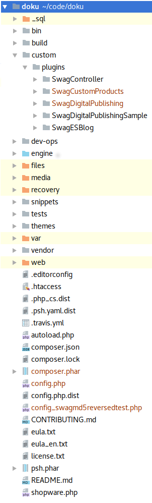

This document will give you a brief overview of Shopware and everything you need to start developing your first plugin.

<div class="toc-list"></div>

## Directory structure

On the left you can see Shopware's default directory structure, as you will find in GitHub checkouts or release packages. Let's start with a quick overview:



**_sql**: (Not in release packages) Contains various deltas and migrations to set up Shopware or migrate the database of an old Shopware version to the database of a new versions.

**bin**: Contains the `console` command which can be executed to run the Shopware command line tools

**build**: (Not in release packages) Contains our ant-based build engine with various scripts to e.g. install dependencies, reset the database etc. When installing Shopware from GitHub you want to run `ant build-unit` first. If you use the install package, you can just use our web-based installer

**custom/plugins** This directory contains all plugins based on the plugin system introduced with Shopware 5.2.

**cache**: Contains various caches and generated files like smarty compile cache, proxy caches, HTML cache etc.

**engine/Library**: Some libraries / dependencies which are not available in composer.

**engine/Shopware**: The actual Shopware application with subdirectories for our bundles, services and models.

**files**: Files for ESD products or generated documents are stored here

**logs**: Our logging directory. Whenever an exception occurs in the Shopware stack, you'll find the stack trace and some context in these log files.

**media**: Files uploaded via the Shopware MediaManager are stored in here (images, thumbnails and other uploads)

**recovery**: Our web-based update and install tool can be found here.

**snippets**: Contains Shopware snippets for frontend and backend in a simple INI format. Snippets will automatically be deployed to database during installation. (Not in release packages)

**templates**: The Shopware 4 template base (emotion)

**tests**: PHPUnit and Mink tests

**themes**: The Shopware 5 template base (bare, responsive)

**vendor**: Dependencies from composer. Shipped with the release package, git users will need to run `composer install` or `ant build-unit`

**web**: The concatenated and minified javascript and CSS templates

<div style="clear:both"></div>

## MVC
Shopware makes use of the [MVC design pattern](http://en.wikipedia.org/wiki/Model%E2%80%93view%E2%80%93controller). For this reason, the representational aspect of the application (view), the controlling and user input (controller) as well as the data layer and business logic (model) are decoupled throughout the application.

### View
Shopware uses [Smarty](http://en.wikipedia.org/wiki/Smarty) as template engine. When using the new responsive template base, you will find all templates in `themes`. The old Shopware 4 template can still be found in `templates`.

### Model
[Doctrine](http://en.wikipedia.org/wiki/Doctrine_(PHP)) is used as ORM and database abstraction layer. You will find the various Doctrine models in `engine/Shopware/Models`. The models are grouped by domain, so you will find article related models in the `Article` directory, customer related models in the `Customer` directory and so on. The business logic of Shopware can be found in `Core`, `Components` or `Bundle` - depending how tight the service in question is coupled to Shopware itself.

### Controller
Controllers take care of user input of any kind, process the input in the model and respond with an answer which is usually generated by the template.

Shopware's controllers can be found in `engine/Shopware/Controllers` and are separated by `module`, which can be one of the following:

 * frontend (default)
 * widgets (for our ESI system)
 * backend (for the Shopware administrative panel)
 * api (for our REST API)

In Shopware, any request will hit a controller, depending on the type of the request. Therefore, three decisions are made:

 * which module is requested (default: frontend)
 * which controller is requested (default: Index)
 * which controller action should be called (default: index)

If module, controller or action are not explicitly defined, Shopware will fall back to the defaults mentioned above. For this reason, a call the the shop's root directory will be dispatched to the frontend module, index controller and index action. This is equivalent to the call to `http://my-shop.com/frontend/index/index`. In practice, however, these "technical" URLs are usually hidden by the SEO engine.

Inside a controller you have easy access to the `Request` and `Response` object, as well as to the DI container, so you can call other components and services.

## Technologies
Shopware as an open source shopping system uses many well known libraries. We use Symfony components like the dependency injection container, the console tools and some other and are HTTP compliant with the Symfony HTTP kernel.
Other well known libraries are also used and included in Shopware, like Guzzle HTTP client, Doctrine, Smarty, Monolog and Phpunit, so that most developers should feel quite comfortable regarding the used technologies.
The actual HTTP stack of Shopware is currently powered by Zend Framework which Shopware uses with a thin layer called `Enlight` on top. As we plan to move towards Symfony step by step, Enlight might come in handy as a transitional framework.

## Hooking into the system
Shopware uses plugins to extend the base systems. Changes in the core are never required and never recommended.
Extensions of the core system can basically be separated into logical extensions, data extensions and template extensions.

Some global events are very powerful when it comes to extending Shopware's behaviour:

* Enlight_Controller_Action_PreDispatch_*
* Enlight_Controller_Action_PostDispatchSecure_*

These events will be emitted whenever a controller action is about to be called ("PreDispatch") or **after** the controller action was called ("PostDispatch"). This way it is very easy to get notified any time a certain controller is executed to perform some extensions:

```xml
<container xsi:schemaLocation="http://symfony.com/schema/dic/services http://symfony.com/schema/dic/services/services-1.0.xsd">
    <services>
        <service id="swag_slogan_of_the_day.subscriber.frontend" 
            class="SwagSloganOfTheDay\Subscriber\FrontendSubscriber">
            <tag name="shopware.event_subscriber"/>
        </service>
    </services>
</container>
```

```php
<?php
class FrontendSubscriber implements SubscriberInterface
{
    public static function getSubscribedEvents()
    {
        return [
            'Enlight_Controller_Action_PostDispatchSecure_Frontend_Detail' => 'myDetailCallback'
        ];
    }

    public function myDetailCallback(\Enlight_Controller_ActionEventArgs $args)
    {
        // Do some action
    }
}
```

This snippet will call the callback function `myDetailCallback` any time the detail controller (and therefore: the detail page) was requested. In your callback you could now load template extensions or modify view assignments.

If you want to read more about the events in Shopware you can take a look at the [events article](https://developers.shopware.com/developers-guide/event-guide/#further-events).

## Extending the database
Your plugin is free to create its own table in the Shopware database in order to store additional data. But there is even a more convenient way: The Shopware attribute system.
Shopware attributes are basically tables in a OneToOne relation to important Shopware entities. So, for every entry in `s_user` (the customer table), there is also an entry in `s_user_attributes`. In Shopware, it is very easy to add a new column to this table and to automatically add it to the customer doctrine attribute model. Whenever Shopware reads a customer, article or another entity from database, it will also read the attributes, so that you can make use of attributes in many places and modules.

## Extending the template
In many cases you might want to modify the template. Shopware makes use of the Smarty block system for that. Blocks are basically named areas inside the template that you can prepend, append or even replace. Shopware's default frontend theme has more than 1.500 blocks - so more than 1.500 extension points for you as a plugin developer.

A smarty block will usually look like this:

```smarty
{block name="Shopware_frontend_checkout_cart"}
    <div>
        Some HTML content
    </div>
{/block}
```

# Writing our first little plugin
The following example will show how to write a very simple plugin, which extends the frontend and adds a little "slogan" to the page.

```xml
<?xml version="1.0" encoding="utf-8"?>
   <plugin xmlns:xsi="http://www.w3.org/2001/XMLSchema-instance"
           xsi:noNamespaceSchemaLocation="https://raw.githubusercontent.com/shopware/shopware/5.3/engine/Shopware/Components/Plugin/schema/plugin.xsd">
       <label lang="de">Slogan des Tages</label>
       <label lang="en">Slogan of the day</label>
   
       <version>1.0.0</version>
       <copyright>(c) by shopware AG</copyright>
       <license>MIT</license>
       <link>http://store.shopware.com</link>
       <author>shopware AG</author>
       <compatibility minVersion="5.3.0"/>
   
       <changelog version="1.0.0">
           <changes lang="de">Erstveröffentlichung</changes>
           <changes lang="en">First release</changes>
       </changelog>
   </plugin>
```
These are only "metadata" and optional.

<div class="alert alert-info">
<strong>Use a valid version</strong>

The returned version has to be compatible with the [php version_compare](http://php.net/version_compare) function, otherwise, Shopware cannot detect any possible updates.
</div>

## The plugin base file
The main entry point of every plugin is the plugin base file in your plugin directory `SwagSloganOfTheDay.php`. This is placed in `custom/plugins/SwagSloganOfTheDay`.

 In the `SwagSloganOfTheDay.php` file, we create a simple class:

```php
 <?php
 
 namespace SwagSloganOfTheDay;
 
 use Shopware\Components\Plugin;
 
 class SwagSloganOfTheDay extends Plugin
 {
 
 }
```

It's important to extend the `Shopware\Components\Plugin` class.

Now we add the first event subscriber to the SwagSloganOfTheDay plugin.
For this we add a folder Subscriber in which we create a new PHP class `RouteSubscriber.php`, and add this subscriber to the services.xml.

## Subscriber classes

```php
<?php
namespace SwagSloganOfTheDay\Subscriber;

use Enlight\Event\SubscriberInterface;
use Shopware\Components\Plugin\ConfigReader;
use SwagSloganOfTheDay\Components\SloganPrinter;

class RouteSubscriber implements SubscriberInterface
{
   private $pluginDirectory;
   private $sloganPrinter;
   private $config;

   public static function getSubscribedEvents()
   {
       return [
           'Enlight_Controller_Action_PostDispatchSecure_Frontend' => 'onPostDispatch'
       ];
   }

   public function __construct($pluginName, $pluginDirectory, SloganPrinter $sloganPrinter, ConfigReader $configReader)
   {
       $this->pluginDirectory = $pluginDirectory;
       $this->sloganPrinter = $sloganPrinter;

       $this->config = $configReader->getByPluginName($pluginName);
   }

   public function onPostDispatch(\Enlight_Controller_ActionEventArgs $args)
   {
       /** @var \Enlight_Controller_Action $controller */
       $controller = $args->get('subject');
       $view = $controller->View();

       $view->addTemplateDir($this->pluginDirectory . '/Resources/views');

       $view->assign('swagSloganFontSize', $this->config['swagSloganFontSize']);
       $view->assign('swagSloganItalic', $this->config['swagSloganItalic']);
       $view->assign('swagSloganContent', $this->config['swagSloganContent']);

       if (!$this->config['swagSloganContent']) {
           $view->assign('swagSloganContent', $this->sloganPrinter->getSlogan());
       }
   }
}
```

As defined in `getSubscribedEvents` the callback is called `onFrontendPostDispatch`. It takes an `Enlight_Controller_ActionEventArgs` object as parameter, which holds context about the event - in this case the context of the controller that has been executed.

First of all we can extract the reference of the executed frontend controller using `$controller = $args->get('subject');`. Using this controller we can get a reference of the view instance: `$view = $controller->View()`.

Now we want to inject our own template directory to Shopware using the `addTemplateDir` method. It takes a path of a template directory as parameter. Whenever rendering a template, Shopware will now automatically check your `View` directory for extensions and load them dynamically.

Finally we want to assign some configuration to the template - in this case a slogan, a flag that indicates if the slogan should be italic or not and the font size of the slogan. For assignments `$view->assign('name', 'value')` is used - this way we will be able to access it in the Smarty template using `{$name}`.

The slogan itself is randomly selected in the `getSlogan` method. This could easily be moved to a plugin configuration text field, so that the shop owner can enter his slogans line by line. But as seen above, we already picked the best ones.

Subscriber classes implements the SubscriberInterface

A Subscriber class is registered as a service in the services.xml and are identified for Shopware via the Subscriber tag. 
```xml
<tag name="shopware.event_subscriber" />
```

```xml
<service id="swag_slogan_of_the_day.subscriber.route" class="SwagSloganOfTheDay\Subscriber\RouteSubscriber">
    <argument>%swag_slogan_of_the_day.plugin_name%</argument>
    <argument>%swag_slogan_of_the_day.plugin_dir%</argument>

    <argument type="service" id="swag_slogan_of_the_day.slogan_printer" />
    <argument type="service" id="shopware.plugin.cached_config_reader" />

    <tag name="shopware.event_subscriber" />
</service>

```

### The configuration

In order to create the plugin configuration, we will need to implement the `Resources/config.xml`.

```xml
<?xml version="1.0" encoding="utf-8"?>
<config xmlns:xsi="http://www.w3.org/2001/XMLSchema-instance"
        xsi:noNamespaceSchemaLocation="https://raw.githubusercontent.com/shopware/shopware/5.3/engine/Shopware/Components/Plugin/schema/config.xsd">
    <elements>
        <element type="text" scope="locale">
            <name>swagSloganContent</name>
            <label lang="de">Dein Slogan</label>
            <label lang="en">Your slogan</label>
            <description lang="de">Dieser Slogan wird in in der Storefront angezeigt</description>
            <description lang="en">This slogan will be shown on the storefront</description>
        </element>
        <element type="select" scope="locale">
            <name>swagSloganFontSize</name>
            <label lang="de">Schriftgröße</label>
            <label lang="en">Font size</label>
            <value>12</value>
            <store>
                <option>
                    <value>12</value>
                    <label>12px</label>
                </option>
                <option>
                    <value>18</value>
                    <label>18px</label>
                </option>
                <option>
                    <value>24</value>
                    <label>24px</label>
                </option>
            </store>
        </element>
        <element type="boolean" scope="locale">
            <name>swagSloganItalic</name>
            <label lang="de">Kursiv</label>
            <label lang="en">Italic</label>
            <value>false</value>
        </element>
    </elements>
</config>
```

In this case two config elements are added - a `select` element with the name "swagSloganFontSize" which will draw a combobox in the plugin configuration. The content of the combobox is defined in the "store" element. 
Additionally we ar able to define a label for the configuration using the "label" property and a default value using the "value" property.

As a second config element we add a `boolean` element. It is called "swagSloganItalic", enabled by default and has the label "Italic".

This will result in a configuration form like this:


If you want to read more about plugin configuration start reading [Plugin configuration](/developers-guide/plugin-configuration/) article.

### Template extension

So far we have set up the plugin - but where does the actual template extension come from?

We already registered the `Resources/views` directory in the RouteSubscriber and can now create the template in the `Views/frontend/index/index.tpl` template. 
This template is actually an extension of Shopware's default `frontend/index/index.tpl` which can be found in `themes/Frontend/Bare/frontend/index/index.tpl`. This template defines the whole default structure of the Shopware responsive template - and is a perfect place for global extensions. As we created a file with the same name, the template manager of Shopware will automatically load this template file, when the default index.tpl is loaded.

Now our plugin's `index.tpl` might look like this:

```smarty
{extends file="parent:frontend/index/index.tpl"}

{block name="frontend_index_navigation_categories_top_include"}

    <style>
        .slogan-box {
            width:100%;
            text-align:center;
        }
        .slogan {
            {if $italic}font-style:italic;{/if}
            font-size:{$sloganSize}px;
        }
    </style>


    <div class="slogan-box">
        <span class="slogan">{$slogan}</span>
    </div>
    
    {$smarty.block.parent}
{/block}
```

The directive `{extends file="parent:frontend/index/index.tpl"}` will tell Shopware to not completely replace the default index.tpl file - but to extend from it. Now we can overwrite single or multiple blocks in the default index.tpl using the `block` directive:

```smarty
{block name="frontend_index_navigation_categories_top_include"}
    ...
    
    {$smarty.block.parent}
{/block}
```

This tells Smarty to prepend the content of our block to the default content of the block `frontend_index_navigation_categories_top_include`. That block is the block, which defines the top category navigation in the default template - a nice place to show a profound slogan to the customer!

Within the block we can use default Smarty / HTML. In the example above, we define some style sheets first:

```html
<style>
   .slogan-box {
       width:100%;
       text-align:center;
   }
   .slogan {
       {if $italic}font-style:italic;{/if}
       font-size:{$sloganSize}px;
   }
</style>
```

As you can see, we use Smarty syntax here to change the style dynamically corresponding to the configuration we assigned to the template in the `onFrontendPostDispatch` callback method. So the `italic` style will only be set if the `italic` option is set. The same way the font size is set depending on the config.

Now the only thing left to do is show the slogan:

```html
<div class="slogan-box">
    <span class="slogan">{$slogan}</span>
</div>
```

### Installing and result
You can now install the plugin with Shopware's plugin manager. After installation, the plugin configuration can be opened by clicking the "pencil" symbol.

After clearing the cache, your frontend might look like this:


You can find a installable ZIP package of this plugin <a href="{{ site.url }}/exampleplugins/SwagSloganOfTheDay.zip">here</a>.


### The plugin base file methods
In the next case we create a simple plugin that extends the s_articles_attributes table using the attribute crud service. 

```php
 <?php
 
 namespace SwagQuickStart;
 
 use Shopware\Components\Plugin;
 use Shopware\Components\Plugin\Context\ActivateContext;
 use Shopware\Components\Plugin\Context\DeactivateContext;
 use Shopware\Components\Plugin\Context\InstallContext;
 use Shopware\Components\Plugin\Context\UninstallContext;
 use Shopware\Components\Plugin\Context\UpdateContext;
 use Shopware\Bundle\AttributeBundle\Service\TypeMapping;
 
 class SwagQuickStart extends Plugin
 {
     public function install(InstallContext $installContext)
     {
         // create a new attribute using the attribute crud service
         $attributeCrudService = $this->container->get('shopware_attribute.crud_service');
         $attributeCrudService->update(
            's_articles_attributes',
            'quick_start',
            // possible types you can find in: /.../engine/Shopware/Bundle/AttributeBundle/Service/TypeMapping.php
            TypeMapping::TYPE_STRING
         );
         
         // this attribute is implemented in a later version of the plugin
         // so we have to implement the update method. See below.
         $attributeCrudService->update(
            's_articles_attributes',
            'quick_start_guid',
            TypeMapping::TYPE_STRING
        );
     }
 
     public function uninstall(UninstallContext $uninstallContext)
     {
         // If the user wants to keep his data we will not delete it while uninstalling the plugin
         if ($uninstallContext->keepUserData()) {
             return;
         }
 
         $attributeCrudService = $this->container->get('shopware_attribute.crud_service');
 
         $attributeCrudService->delete('s_articles_attributes', 'quick_start_guid');
         $attributeCrudService->delete('s_articles_attributes', 'quick_start');
 
         // clear cache
         $uninstallContext->scheduleClearCache(UninstallContext::CACHE_LIST_ALL);
     }
 
     public function update(UpdateContext $updateContext)
     {
         $currentVersion = $updateContext->getCurrentVersion();
         $updateVersion = $updateContext->getUpdateVersion();
 
         if (version_compare($currentVersion, '1.0.2', '<=')) {
             $attributeCrudService = $this->container->get('shopware_attribute.crud_service');
             $attributeCrudService->update(
                 's_articles_attributes',
                 'quick_start_guid',
                 'string'
             );
         }
 
         if (version_compare($currentVersion, '1.0.5', '<=')) {
             // do update for version
         }
     }
 
     public function activate(ActivateContext $activateContext)
     {
         // on plugin activation clear the cache
         $activateContext->scheduleClearCache(ActivateContext::CACHE_LIST_ALL);         
     }
 
     public function deactivate(DeactivateContext $deactivateContext)
     {
         // on plugin deactivation clear the cache
         $deactivateContext->scheduleClearCache(DeactivateContext::CACHE_LIST_ALL);
     }
 }
```

Each method, such as install, update etc. has its own context, which is passed into the method. The context provides various information and methods for the plugin. 
Like:`->scheduleClearCache()`, `->getCurrentVersion()`, `->getUpdateVersion()`, or `->keepUserData()`.

### The clear cache method. 
```php
$context->scheduleClearCache(...Context::CACHE_LIST_ALL);
```
Possible settings for the parameter `caches` contains each context as constant.
`...Context::CACHE_LIST_DEFAULT`
`...Context::CACHE_LIST_ALL`
`...Context::CACHE_LIST_FRONTEND`
`...Context::CACHE_TAG_CONFIG`
`...Context::CACHE_TAG_HTTP`
`...Context::CACHE_TAG_PROXY`
`...Context::CACHE_TAG_ROUTER`
`...Context::CACHE_TAG_TEMPLATE`
`...Context::CACHE_TAG_THEME`
