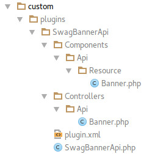

<div class="toc-list"></div>

## Introduction
This article describes how to extend the REST API and create an API endpoint. We create an example plugin which 
provides functions for managing banners.

Normally every basic API resource contains of two parts:
* a controller which handles the different request types(POST, GET, PUT, DELETE)
* the actual resource that takes care of the [CRUD](https://en.wikipedia.org/wiki/Create,_read,_update_and_delete)
operations

### The File and directory structure


## Plugin files
For our REST API example we only need a few files. For more information about necessary files and the 5.2 plugin system
see the [5.2 plugin guide](/developers-guide/plugin-system).

### SwagBannerApi.php

```php
<?php

namespace SwagBannerApi;

use Shopware\Components\Plugin;

class SwagBannerApi extends Plugin
{
    /**
     * @inheritdoc
     */
    public static function getSubscribedEvents()
    {
        return [
            'Enlight_Controller_Dispatcher_ControllerPath_Api_Banner' => 'onGetBannerApiController',
            'Enlight_Controller_Front_StartDispatch' => 'onEnlightControllerFrontStartDispatch'
        ];
    }

    /**
     * @return string
     */
    public function onGetBannerApiController()
    {
        return $this->getPath() . '/Controllers/Api/Banner.php';
    }

    /**
     *
     */
    public function onEnlightControllerFrontStartDispatch()
    {
        $this->container->get('loader')->registerNamespace('Shopware\Components', $this->getPath() . '/Components/');
    }
}
```
This is our plugin bootstrap which subscribes to two events. For the one thing it uses the
`Enlight_Controller_Dispatcher_ControllerPath_Api` event to register the API controller and for 
the other thing it uses the `Enlight_Controller_Front_StartDispatch` event to register an additional namespace for 
our plugin. We do that, because then the API manager class can load our resource with `\Shopware\Components\Api\Manager::getResource('Banner')`.
Since `Shopware 5.2.17`, both parts are not necessary anymore. You can simply use the services.xml file to register new resources to Shopware.
```xml
<!-- Register new resource as service -->
<service id="shopware.api.example" class="SwagBannerApi\Components\Api\Resource\Example"/>
```
The API controller will be found via auto-registration. Please refer to the [Controllers chapter](developers-guide/controller/#plugin-controllers) for further information about the controller naming convention.

You even have the possibility to decorate existing resources. For more information about that, have a look here: [Extend API resource](/developers-guide/rest-api/extend-api-resource/)

### Components/Api/Resource/Banner.php
The resource gets called by our controller. Every controller action relies on one method of our resource. 
* indexAction -> getList() -> returns a list of banners
* getAction -> getOne() -> returns one banner identified by its id
* putAction -> update() -> updates one banner identified by its id
* postAction -> create() -> creates a new banner
* deleteAction -> delete() -> deletes a banner

We recommend using doctrine models in the resource, because it allows you to use the `fromArray()` method in the 
`create()` and `update()` method to write the data directly. `fromArray()` searches for the setter methods of the 
attributes and saves the values to the variables which saves you time and code.

```php
<?php

namespace Shopware\Components\Api\Resource;

use Shopware\Components\Api\Exception as ApiException;
use Shopware\Models\Banner\Banner as BannerModel;

/**
 * Class Banner
 *
 * @package Shopware\Components\Api\Resource
 */
class Banner extends Resource
{
    /**
     * @return \Shopware\Models\Banner\Repository
     */
    public function getRepository()
    {
        return $this->getManager()->getRepository(BannerModel::class);
    }

    /**
     * Create new Banner
     *
     * @param array $params
     * @return BannerModel
     * @throws ApiException\ValidationException
     */
    public function create(array $params)
    {
        /** @var BannerModel $banner */
        $banner = new BannerModel();

        $banner->fromArray($params);

        $violations = $this->getManager()->validate($banner);

        /**
         * Handle Violation Errors
         */
        if ($violations->count() > 0) {
            throw new ApiException\ValidationException($violations);
        }

        $this->getManager()->persist($banner);
        $this->flush();

        return $banner;
    }

    /**
     * @param int $offset
     * @param int $limit
     * @param array $criteria
     * @param array $orderBy
     * @return array
     */
    public function getList($offset = 0, $limit = 25, array $criteria = [], array $orderBy = [])
    {
        $builder = $this->getRepository()->createQueryBuilder('banner');

        $builder->addFilter($criteria)
            ->addOrderBy($orderBy)
            ->setFirstResult($offset)
            ->setMaxResults($limit);
        $query = $builder->getQuery();
        $query->setHydrationMode($this->resultMode);

        $paginator = $this->getManager()->createPaginator($query);

        //returns the total count of the query
        $totalResult = $paginator->count();

        //returns the Banner data
        $banner = $paginator->getIterator()->getArrayCopy();

        return ['data' => $banner, 'total' => $totalResult];
    }

    /**
     * Delete Existing Banner
     *
     * @param $id
     * @return null|object
     * @throws ApiException\NotFoundException
     * @throws ApiException\ParameterMissingException
     */
    public function delete($id)
    {
        $this->checkPrivilege('delete');

        if (empty($id)) {
            throw new ApiException\ParameterMissingException();
        }

        $banner = $this->getRepository()->find($id);

        if (!$banner) {
            throw new ApiException\NotFoundException("Banner by id $id not found");
        }

        $this->getManager()->remove($banner);
        $this->flush();
    }

    /**
     * Get One Banner Information
     *
     * @param $id
     * @return mixed
     * @throws ApiException\NotFoundException
     * @throws ApiException\ParameterMissingException
     */
    public function getOne($id)
    {
        $this->checkPrivilege('read');

        if (empty($id)) {
            throw new ApiException\ParameterMissingException();
        }

        $builder = $this->getRepository()
            ->createQueryBuilder('Banner')
            ->select('Banner')
            ->where('Banner.id = ?1')
            ->setParameter(1, $id);

        /** @var BannerModel $banner */
        $banner = $builder->getQuery()->getOneOrNullResult($this->getResultMode());

        if (!$banner) {
            throw new ApiException\NotFoundException("Banner by id $id not found");
        }

        return $banner;
    }

    /**
     * @param $id
     * @param array $params
     * @return null|object
     * @throws ApiException\ValidationException
     * @throws ApiException\NotFoundException
     * @throws ApiException\ParameterMissingException
     */
    public function update($id, array $params)
    {
        $this->checkPrivilege('update');

        if (empty($id)) {
            throw new ApiException\ParameterMissingException();
        }

        /** @var $banner BannerModel */
        $builder = $this->getRepository()
            ->createQueryBuilder('Banner')
            ->select('Banner')
            ->where('Banner.id = ?1')
            ->setParameter(1, $id);

        /** @var BannerModel $banner */
        $banner = $builder->getQuery()->getOneOrNullResult(self::HYDRATE_OBJECT);

        if (!$banner) {
            throw new ApiException\NotFoundException("Banner by id $id not found");
        }

        $banner->fromArray($params);

        $violations = $this->getManager()->validate($banner);
        if ($violations->count() > 0) {
            throw new ApiException\ValidationException($violations);
        }

        $this->flush();

        return $banner;
    }
}
```

### Controllers/Api/Banner
The controller handles all requests to our REST API endpoint. Authorisation and routing is managed by the Shopware REST API.

You should name your actions after this schema:

| Action name        | Request type   | parameter    |
|--------------------|----------------|--------------|
| indexAction        | get request    | no           |
| getAction          | get request    | `id`         |
| batchAction        | put request    | no           |
| putAction          | put request    | `id`         |
| postAction         | post request   | data fields  |
| batchDeleteAction  | delete request | no           |
| deleteAction       | delete request | `id`         |


```php
<?php

/**
 * Class Shopware_Controllers_Api_Banner
 */
class Shopware_Controllers_Api_Banner extends Shopware_Controllers_Api_Rest
{
    /**
     * @var Shopware\Components\Api\Resource\Banner
     */
    protected $resource = null;

    public function init()
    {
        $this->resource = \Shopware\Components\Api\Manager::getResource('Banner');
    }

    /**
     * GET Request on /api/Banner
     */
    public function indexAction()
    {
        $limit = $this->Request()->getParam('limit', 1000);
        $offset = $this->Request()->getParam('start', 0);
        $sort = $this->Request()->getParam('sort', []);
        $filter = $this->Request()->getParam('filter', []);

        $result = $this->resource->getList($offset, $limit, $filter, $sort);

        $this->View()->assign(['success' => true, 'data' => $result]);
    }

    /**
     * Create new Banner
     *
     * POST /api/Banner
     */
    public function postAction()
    {
        $banner = $this->resource->create($this->Request()->getPost());

        $location = $this->apiBaseUrl . 'Banner/' . $banner->getId();

        $data = [
            'id' => $banner->getId(),
            'location' => $location,
        ];
        $this->View()->assign(['success' => true, 'data' => $data]);
        $this->Response()->setHeader('Location', $location);
    }

    /**
     * Get one Banner
     *
     * GET /api/Banner/{id}
     */
    public function getAction()
    {
        $id = $this->Request()->getParam('id');
        /** @var \Shopware\Models\Banner\Banner $banner */
        $banner = $this->resource->getOne($id);

        $this->View()->assign(['success' => true, 'data' => $banner]);
    }

    /**
     * Update One Banner
     *
     * PUT /api/Banner/{id}
     */
    public function putAction()
    {
        $bannerId = $this->Request()->getParam('id');
        $params = $this->Request()->getPost();

        /** @var \Shopware\Models\Banner\Banner $banner */
        $banner = $this->resource->update($bannerId, $params);

        $location = $this->apiBaseUrl . 'Banner/' . $bannerId;
        $data = [
            'id' => $banner->getId(),
            'location' => $location
        ];

        $this->View()->assign(['success' => true, 'data' => $data]);
    }

    /**
     * Delete One Banner
     *
     * DELETE /api/Banner/{id}
     */
    public function deleteAction()
    {
        $bannerId = $this->Request()->getParam('id');

        $this->resource->delete($bannerId);

        $this->View()->assign(['success' => true]);
    }
}
```

## Test the API
This resource supports the following operations:

|  Access URL                 | GET                   | GET (List)            | PUT                    | PUT (Batch)         | POST                 | DELETE                | DELETE (Batch)      |
|-----------------------------|-----------------------|-----------------------|------------------------|---------------------|----------------------|-----------------------|---------------------|
| /api/banner               |  |  |   |  |  |  |  |

If you want to access this resource, simply query the following URL:
* http://my-shop-url/api/banner

The following examples assume you are using the provided
**[demo API client](/developers-guide/rest-api/#using-the-rest-api-in-your-own-application)**. One of its advantages is that, 
instead of providing query arguments directly in the URL, you can do so by means of method argument.
The client application will, internally, handle the full URL generation. You can also place variables using
this technique.

### GET
Getting one banner by its id.
```php
$client->get('banner/1');
```

Result:
```json
{
  "success": true,
  "data": {
    "id": 1,
    "description": "Shopware-Example-Banner1",
    "validFrom": null,
    "validTo": null,
    "image": "media/image/41/f8/25/Blog-Koffer.jpg",
    "link": "www.shopware.com",
    "linkTarget": "_blank",
    "categoryId": 3,
    "extension": "jpg"
  }
}
```

### GET(List)
Get a list of banners. With the optional `limit` parameter, it is possible to specify how many banner you want the 
API to return.
```php
$client->get('banner');
```

Result
```json
{
  "success": true,
  "data": {
    "data": [
      {
        "id": 4,
        "description": "Shopware-Example-Banner1",
        "validFrom": null,
        "validTo": null,
        "image": "media/image/41/f8/25/Blog-Koffer.jpg",
        "link": "www.shopware.com",
        "linkTarget": "_blank",
        "categoryId": 3,
        "extension": "jpg"
      },
      {
        "id": 5,
        "description": "Shopware-Example-Banner2",
        "validFrom": null,
        "validTo": null,
        "image": "media/image/41/f8/25/Blog-Koffer.jpg",
        "link": "www.shopware.com",
        "linkTarget": "_blank",
        "categoryId": 3,
        "extension": "jpg"
      },
      {
        "id": 6,
        "description": "Shopware-Example-Banner3",
        "validFrom": null,
        "validTo": null,
        "image": "media/image/41/f8/25/Blog-Koffer.jpg",
        "link": "www.shopware.com",
        "linkTarget": "_blank",
        "categoryId": 3,
        "extension": "jpg"
      }
    ],
    "total": 3
  }
}
```

### PUT
To update a banner it is always required to provide the id of the banner. In this example, we will update the 
`description` of the banner with id 1.
```php
$client->put('banner/1', [
   'description' => 'New description'
]);
```

Result:
```json
{
  "success": true,
  "data": {
    "id": 5,
    "location": "http://my-shop-url/api/Banner/5"
  }
}
```

### POST
Create a new banner

```php
$client->post('banner', [
    'description' => 'Shopware-Example-Banner1',
    'image' => 'media/image/41/f8/25/Blog-Koffer.jpg',
    'link' => 'www.shopware.com',
    'linkTarget' => '_blank',
    'categoryId' => '3',
]);
```

Result:
```json
{
  "success": true,
  "data": {
    "id": 4,
    "location": "http://my-shop-url/api/Banner/4"
  }
}
```

### DELETE
Delete one banner identified by its id. In this case we delete the banner with id 1.

```php
$client->delete('banner/1');
```

Result:
```json
{
  "success": true
}
```

## Download plugin ##
The whole plugin can be downloaded <a href="{{ site.url }}/exampleplugins/SwagBannerApi.zip">here</a>.
