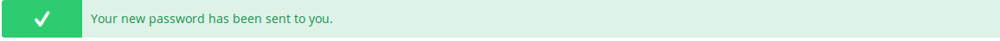
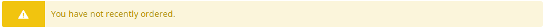
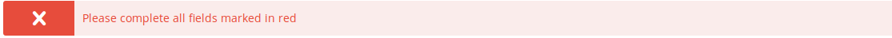
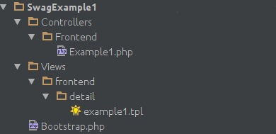
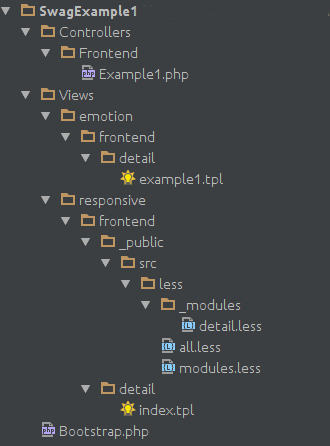

<div class="toc-list"></div>

## Introduction

In this guide we provide you with all essential information you need to keep your plugins Shopware 5.0 compatible.

Most changes are optional, as the old syntax will still work in most cases.

## Template extensions
To ensure your templates files are extensible, neither __extendsTemplate__ nor __extendsBlock__ methods should be used for responsive template. Instead, you should use Shopware's auto loading mechanism.
The following example shows how template extension plugins need to be updated to achieve the best possible result for Shopware 5 templates.
The following source code was taken from the SwagExample1 plugin for Shopware 4, which displays a top seller slider and a banner in the article detail page:

#### SwagExample1/Bootstrap.php
```php
<?php
class Shopware_Plugins_Frontend_SwagExample1_Bootstrap extends Shopware_Components_Plugin_Bootstrap
{
    public function install()
    {
        $this->subscribeEvent('Enlight_Controller_Action_PostDispatchSecure_Frontend_Detail', 'onSecureDetailPostDispatch');

        $form = $this->Form();
        $form->setElement(
            'mediaselection',
            'mediaselection',
            ['label' => 'Media', 'value' => NULL]
        );

        return true;
    }

    public function onSecureDetailPostDispatch(Enlight_Event_EventArgs $arguments)
    {
        /**@var $controller Shopware_Controllers_Frontend_Listing*/
        $controller = $arguments->getSubject();
        $controller->View()->addTemplateDir($this->Path() . 'Views/');
        $controller->View()->extendsTemplate('frontend/detail/example1.tpl');
        $controller->View()->mediaSelection = $this->Config()->mediaselection;
    }
}
```

#### SwagExample1/Views/frontend/detail/example1.tpl
```html
{block name="frontend_detail_index_detail"}
    {block name="frontend_detail_example"}
        <div class="example--own-topseller">
            {block name="frontend_detail_example_headline"}
                <h1 class="own-topseller--headline">My topseller</h1>
            {/block}

            {block name="frontend_detail_example_img"}
                
            {/block}

            {block name="frontend_detail_example_topseller"}
                <div class="own-topseller--container">
                    {action module=widgets controller=listing action=top_seller sCategory=3}
                </div>
            {/block}
        </div>
    {/block}
{/block}

```

The goal is to make this plugin compatible with both the new Shopware 5 and the old Shopware 4 templates. For this purpose, the following should be considered:

- Inside the __PostDispatch__ event, we have to distinguish between the different template version and load the corresponding template files.
- The __extendsTemplate__ function should not be used in the new template, otherwise the plugin template cannot be overwritten by other templates.
- In order for the plugin template to be easily extended by others, the template adjustments should be extracted into a separate file.

First, the template structure is revised. The example1.tpl file is now divided into three new files:

- SwagExample1/Views/emotion/detail/example1.tpl (Entry point to extends the emotion template)
- SwagExample1/Views/responsive/frontend/detail/index.tpl (Entry point to extends the responsive template)
- SwagExample1/Views/common/frontend/swag_example1/detail_extension.tpl (Contains the source code for the extension)

The new files contain the following source code:
#### SwagExample1/Views/common/frontend/swag_example1/detail_extension.tpl
```html
{block name="frontend_detail_example"}
    <div class="example--own-topseller">
        {block name="frontend_detail_example_headline"}
            <h1 class="own-topseller--headline">My topseller</h1>
        {/block}

        {block name="frontend_detail_example_img"}
            
        {/block}

        {block name="frontend_detail_example_topseller"}
            <div class="own-topseller--container">
                {action module=widgets controller=listing action=top_seller sCategory=3}
            </div>
        {/block}
    </div>
{/block}
```

#### SwagExample1/Views/emotion/frontend/detail/example1.tpl
```html
{block name="frontend_detail_index_detail"}
    {include file="frontend/swag_example1/detail_extension.tpl"}
{/block}
```

#### SwagExample1/Views/responsive/frontend/detail/index.tpl
```html
{extends file="parent:frontend/detail/index.tpl"}

{block name="frontend_detail_index_detail"}
    {include file="frontend/swag_example1/detail_extension.tpl"}
{/block}
```
<br>
__Notice: Template extensions for the responsive template are loaded via the inheritance hierarchy based on the file system. Therefore, this template should be extends via {extends file = ".."}.__

The SwagExample1/Views/responsive/frontend/detail/index.tpl and SwagExample1/Views/emotion/frontend/detail/example1.tpl files serve only as entry points into the original template.
The source code for displaying the top seller sliders and the banner element, which was previously located directly in the extended template file, has now been made available globally in a separate template file, and is now simply included by both templates.
This has the following advantages:

- Avoid duplicate source code
- Extensible plugin template for other developers

Now only the __Bootstrap.php__ logic has to be adapted, so that it loads the correct template directory, based on the version of the template currently used by the shop.
The new plugin __Bootstrap.php__ class now looks like this:
```php
<?php

class Shopware_Plugins_Frontend_SwagExample1_Bootstrap extends Shopware_Components_Plugin_Bootstrap
{
    public function install()
    {
        $this->subscribeEvent('Enlight_Controller_Action_PostDispatchSecure_Frontend_Detail', 'onSecureDetailPostDispatch');

        $form = $this->Form();
        $form->setElement(
            'mediaselection',
            'mediaselection',
            ['label' => 'Media', 'value' => NULL]
        );

        return true;
    }

    public function onSecureDetailPostDispatch(Enlight_Event_EventArgs $arguments)
    {
        /**@var $controller Shopware_Controllers_Frontend_Listing*/
        $controller = $arguments->getSubject();

        $controller->View()->addTemplateDir($this->Path() . 'Views/common/');

        if (Shopware()->Shop()->getTemplate()->getVersion() >= 3) {
            $controller->View()->addTemplateDir($this->Path() . 'Views/responsive/');
        } else {
            $controller->View()->addTemplateDir($this->Path() . 'Views/emotion/');
            $controller->View()->extendsTemplate('frontend/detail/example1.tpl');
        }

        $controller->View()->mediaSelection = $this->Config()->mediaselection;
    }
}
```

- The "Views/common/" directory is always registered as a template directory. Templates inside this directory are now loaded for both template versions.
- A template version check was added, so that only the corresponding view directory is loaded.
- Responsive - Template files for the responsive template loaded automatically over the inheritance by using the same names. Therefore, only the template directory must registered here
- Emotion - In the emotion template we can load the template extension like in Shopware 4. After the template directory is registered, the template file is loaded via the __extendsTemplate__ call.

__Notice: Do not use "_default/" or "_emotion/" at the beginning of the extend call. Use "parent:" instead.__

__Notice: To allow other templates to easily extend your templates, you should provide your code in a separate file. Include that file in other templates, inside Smarty blocks, thus allowing different entry point.__

## Uninstall

During the uninstall process, the user can now be prompted which data he wishes to remove.
Existing __uninstall()__ method should remove all data, and the new __secureUninstall()__ method should only remove non-user related data.

##### Bootstrap.php - How to use 'secureUninstall()'

```php
// Set the new secureUninstall capability
public function getCapabilities()
{
    return array(
        'install' => true,
        'enable' => true,
        'update' => true,
        'secureUninstall' => true
    );
}

// Remove all data
public function uninstall()
{
    $this->secureUninstall();
    $this->removeDatabase();
    return true;
}


// Remove only non-user related data.
public function secureUninstall()
{
    return true;
}
```

### Less
Besides traditional CSS, Shopware 5 includes Less support in new templates. Less is a CSS pre-processor, which can be used when styling your Shopware 5 templates. Less is a very powerful tool, and Shopware 5 extends its default feature set by adding some commonly used functions.

For more information on how to use Less, have a look [here](http://lesscss.org/).

#### Integration
Less files are loaded by creating a new event in the __install__ method of our plugin.

##### Bootstrap.php - Using .less files in responsive template

```php
/**
 * Registers all necessary events and hooks.
 */
private function subscribeEvents()
{
    // Subscribe the needed event for less merge and compression
    $this->subscribeEvent(
        'Theme_Compiler_Collect_Plugin_Less',
        'addLessFiles'
    );
}

/**
 * Provide the file collection for less
 *
 * @param Enlight_Event_EventArgs $args
 * @return \Doctrine\Common\Collections\ArrayCollection
 */
public function addLessFiles(Enlight_Event_EventArgs $args)
{
    $less = new \Shopware\Components\Theme\LessDefinition(
    //configuration
    array(),

        //less files to compile
        array(
            __DIR__ . '/Views/responsive/frontend/_public/src/less/all.less'
        ),

        //import directory
        __DIR__
    );

    return new Doctrine\Common\Collections\ArrayCollection(array($less));
}

```
#### Structure convention

Like in the example above, in most cases there is only one .less file to compile - the __all.less__. It includes additional files named by their content. Most likely the __all.less__ file includes the __modules.less__ and __variables.less__ files, which are often needed by default. These files include additional files from same named directories, e.g. modules.less includes files from the directory called __"_modules/"__.

As an example, if the file contains styles for Shopware's checkout page, it would be called __"checkout.less"__ and place in the ___modules__ directory.
The files inside ___variables/__ should only contain variable definitions made in Less.

Directory/File    | Utility
-------------- | ---------------------------------------------
_modules       | Contains less styles of modules
_variables     | Contains less variables
all.less       | Includes "modules.less" and "variables.less"
modules.less   | Includes all files in "_modules"
variables.less | Includes all files in "_variables"

##### Example all.less
```less
@import "modules";
```

##### Example modules.less
```less
@import "_modules/checkout";
```
##### Example _modules/checkout.less
```less
.yourOwnSelector {
    width: 100%;
}
```

#### Breakpoint sizes

Our responsive template uses media queries with specific breakpoint, so you can implement different styles for different browser window sizes.

##### structure.less - Less variables for the different device sizes
```less
@phoneLandscapeViewportWidth: 30em;     // 480px
@tabletViewportWidth: 48em;             // 768px
@tabletLandscapeViewportWidth: 64em;    // 1024px
@desktopViewportWidth: 78.75em;         // 1260px
```

##### Example usage
```less
.myOwnElement {
    width: 90%;
}

@media screen and (min-width: @tabletViewportWidth) {
    .myOwnElement {
        width: 70%;
    }
}
```

#### Mixins
Each child theme of the Shopware responsive template has access to some very useful mixins like '.unitize()' or '.clearfix()'
A mixin is a useful function being used in our .less files.
E.g. our new "unitize" mixin can be used to calculate __rem__ values, which we use in our new template, replacing __px__ values.

##### Example usage for unitize()
```less
.myOwnElement {
    //Would output font-size: 0.625rem;
    //First parameter is your desired px value, in this case 10px.
    //Second parameter is the base value which, in this case, means the default font-size of 16px.
    //You won't have to change the second parameter in most of the cases. The .unitize-method now calculates 10/16 = 0.625.
    //Third parameter is the actual style to be used
    .unitize(10, 16, font-size);

    //For more examples of "unitize" mixin usage, please refer to yourShopSystem/Themes/Frontend/Responsive/frontend/_public/src/less/_mixins/unitize.less
}
```

In __Themes/Frontend/Responsive/frontend/_public/src/less/_mixins__ you can find other useful mixins provided by Shopware 5.

#### Messages
If you want to display message to the shop customer, you can use the __messages__ template file.
Examples:

##### account/password.tpl - Display a success message.
```html
{include file="frontend/_includes/messages.tpl" type="success" content="{s name='PasswordInfoSuccess'}{/s}"}
```


##### account/orders.tpl - Display a warning message.
```html
{include file="frontend/_includes/messages.tpl" type="warning" content="{s name='OrdersInfoEmpty'}{/s}"}
```


##### blog/comment/form.tpl - Display an error message
```html
{include file="frontend/_includes/messages.tpl" type="error" content="{s name='BlogInfoFailureFields'}{/s}"}
```


Additional documentation can be found in __Themes/Frontend/Bare/frontend/_includes/messages.tpl__.

#### Other things
- Use the new CSS classes, e.g. "btn is--primary", "is--bold" or "has--border". For further information, have a look at the new style tile.
- Use the CSS class name convention ("<parent>--<child>" , e.g. "abo--detail-container > detail-container–image")
- If possible, build small images and icons with CSS

### Javascript
Javascript can now be merged and compressed automatically by Shopware 5.

#### Integration

##### Bootstrap.php - Using Javascript merge and compression
```php
/**
 * Registers all necessary events and hooks.
 */
private function subscribeEvents()
{
    // Subscribe the needed event for js merge and compression
    $this->subscribeEvent(
        'Theme_Compiler_Collect_Plugin_Javascript',
        'addJsFiles'
    );
}

/**
 * Provide the file collection for js files
 *
 * @param Enlight_Event_EventArgs $args
 * @return \Doctrine\Common\Collections\ArrayCollection
 */
public function addJsFiles(Enlight_Event_EventArgs $args)
{
    $jsFiles = array(__DIR__ . '/Views/responsive/frontend/_public/src/js/script.js');
    return new Doctrine\Common\Collections\ArrayCollection($jsFiles);
}
```
#### jQuery plugins
Shopware 5 already includes several jQuery plugins you can use to implement useful features, like sliders or search fields. All of these can be found in the 'Themes/Frontend/Responsive/frontend/_public/src/js/' directory.

#### Write own jQuery plugins
If you want to write your own jQuery plugin, you should use our new plugin base class. It provides all the basic operations every jQuery plugin needs to have.

##### _public/src/js/jquery.plugin-base.js - Example how to register and call a jquery-plugin
```javascript
// Register your plugin
$.plugin('yourName', {
   defaults: { exampleValue: 'value' },

   init: function() {
       // ...initialization code

       //The applyDataAttributes function merges data attributes into plugin options. Example element: <div class="test" data-exampleValue="value2"></div>
       //The default "exampleValue" variable will be overwritten with "value2".
       //This value is then available in this.opts.exampleValue variable

           this.applyDataAttributes();
   },

   destroy: function() {
     // ...your destruction code

     // Use the force! Use the internal destroy method.
     me._destroy();
   }
});

// Call the plugin
$('.test').yourName();
```
#### Data attributes
In Shopware 5, Javascript files are no longer parsed by Smarty. To assign a Smarty variable value to a Javascript variable, use the HTML5 Data attributes (accessible in Javascript with "me.applyDataAttributes()"). Refer to the previous code snippet for an usage example.

### Other
Implement as many (useful) Smarty blocks as possible, so your templates are extensible.

## Search Bundle
In listings, you should use the new listing logic (Conditions, ConditionHandler, Facet, FacetHandler, etc.).
Keep the required additional data in mind, e.g. the new view variable "pageSizes".

## Updating an example plugin
In the following steps we'll update our "SwagExample1" Plugin to run with Shopware 5 and fully responsive.

### Creating directory structure
In the first step of updating our plugin to be compatible with Shopware 5, we'll simply create the new directory structure. The current directory structure looks like this:


Now we simply create two new directories inside of "Views":
__emotion__ and __responsive__.
Additionally, we move the existing "frontend" directory into the "emotion" directory.

All we need to do for now is create some additional directories inside the __responsive__ directory.
Your directory structure should look like this:
```
Views/
|->responsive/
  |->frontend/
  |->_public/
     |->src/
       |->less/
```

### Implement new Less structure

As mentioned in the tutorial, our new CSS/Less, Javascript and images files will be placed inside the ___public__ directory, which contains the __src__ directory. The __src__ directory contains the __less__ directory.

At first we start by creating a file called __all.less__ inside the __less__ directory, which has to be included in PHP now. This can be done using the new __"Theme_Compiler_Collect_Plugin_Less"__ event, which should be registered in the plugin's __install__ method:

#### Registering the new event in the Bootstrap.php
```php
public function install()
{
    ...
    // Register your custom Less files, so that they are processed into CSS and included on your template
    $this->subscribeEvent(
        'Theme_Compiler_Collect_Plugin_Less',
        'addLessFiles'
    );
    ...
}
...

/**
 * Provide the file collection for Less
 */
public function addLessFiles(Enlight_Event_EventArgs $args)
{
    $less = new \Shopware\Components\Theme\LessDefinition(
    //configuration
        array(),
        //less files to compile
        array(
            __DIR__ . '/Views/responsive/frontend/_public/src/less/all.less'
        ),

        //import directory
        __DIR__
    );

    return new Doctrine\Common\Collections\ArrayCollection(array($less));
}
```

In the __addLessFiles__ method should return a Doctrine array collection containing the plugin's Less files. The Shopware 5 core will automatically process them into CSS files, and merge them together with the theme's standard CSS content (also processed from Less). This unified file will be minimized and served to the browser when a page is requested. After (re)installing the plugin and refreshing the theme cache, your plugin's __all.less__ file should be included in future requests.

As mentioned in the tutorial, the __all.less__ is needed to include other Less files. Therefore, we new create a file called __modules.less__ and a directory called ___modules__. The newly created __modules.less__ file needs to be imported in __all.less__

#### all.less
```less
@import "modules";
```

In turn, the __modules.less__ file should import all the .less files that will be created inside of the ___modules__ directory. There files will contain the actual Less code, and should be grouped by their usage in the frontend.
E.g. as we need styles for the detail page, we will create a new file called __detail.less__ inside of the ___modules__ directory.

#### modules.less
```less
@import "_modules/detail";
```

The __detail.less__ will contain the actual styling info.
In the old __example1.tpl__ were some inline styles for the img tag.
Let's replace them by using the new class of the img element:

#### detail.less
```less
.own-topseller--img {
    width: 50%;
    display: block;
}
```

### Additional changes
The plugin is now Shopware 5 compatible and our template changes responsive.
The current implementation can be improved by wrapping the HTML code in Smarty blocks, so that these template changes can be extensible by other plugins.
By installing the plugin and opening a detail page, you will see the changes introduced by the plugin.

Below is a list of all files that have been changed:

#### Bootstrap.php
```php
<?php

class Shopware_Plugins_Frontend_SwagExample1_Bootstrap extends Shopware_Components_Plugin_Bootstrap
{
    public function install()
    {
        $this->subscribeEvent('Enlight_Controller_Action_PostDispatchSecure_Frontend_Detail', 'onSecureDetailPostDispatch');

        // Subscribe the needed event for less merge and compression
        $this->subscribeEvent(
            'Theme_Compiler_Collect_Plugin_Less',
            'addLessFiles'
        );

        $form = $this->Form();
        $form->setElement(
            'mediaselection',
            'mediaselection',
            ['label' => 'Media', 'value' => NULL]
        );

        return true;
    }


    public function onSecureDetailPostDispatch(Enlight_Event_EventArgs $arguments)
    {
        /**@var $controller Shopware_Controllers_Frontend_Listing*/
        $controller = $arguments->getSubject();

        $controller->View()->addTemplateDir($this->Path() . 'Views/common/');

        $template = Shopware()->Shop()->getTemplate();
        if ($template->getVersion() >= 3) {
            $controller->View()->addTemplateDir($this->Path() . 'Views/responsive/');
        } else {
            $controller->View()->addTemplateDir($this->Path() . 'Views/emotion/');
            $controller->View()->extendsTemplate('frontend/detail/example1.tpl');
        }

        $controller->View()->mediaSelection = $this->Config()->mediaselection;
    }

    /**
     * Provide the file collection for less
     */
    public function addLessFiles(Enlight_Event_EventArgs $args)
    {
        $less = new \Shopware\Components\Theme\LessDefinition(
        //configuration
            array(),
            //less files to compile
            array(
                __DIR__ . '/Views/responsive/frontend/_public/src/less/all.less'
            ),

            //import directory
            __DIR__
        );

        return new Doctrine\Common\Collections\ArrayCollection(array($less));
    }
}
```

#### Views/responsive/frontend/_public/src/less/all.less
```less
@import "modules";
```

#### Views/responsive/frontend/_public/src/less/modules.less
```less
@import "_modules/detail";
```

#### Views/responsive/frontend/_public/src/less/_modules/detail.less
```less
.own-topseller--img {
    width: 50%;
    display: block;
}

@media screen and (min-width: @phoneLandscapeViewportWidth) {
    //Styles only being used when the size of the screen is at least 480px.
    //All the sizes are mentioned in yourShopSystem/Themes/Frontend/Responsive/frontend/_public/src/less/_variables/structure.less
}

@media screen and (min-width: @desktopViewportWidth) {
    //Styles only being used when the size of the screen is at least 1260px.
    //All the sizes are mentioned in yourShopSystem/Themes/Frontend/Responsive/frontend/_public/src/less/_variables/structure.less
}
```

#### SwagExample1/Views/common/frontend/swag_example1/detail_extension.tpl
```html
{block name="frontend_detail_example"}
    <div class="example--own-topseller">
        {block name="frontend_detail_example_headline"}
            <h1 class="own-topseller--headline">My topseller</h1>
        {/block}

        {block name="frontend_detail_example_img"}
            
        {/block}

        {block name="frontend_detail_example_topseller"}
            <div class="own-topseller--container">
                {action module=widgets controller=listing action=top_seller sCategory=3}
            </div>
        {/block}
    </div>
{/block}
```

#### SwagExample1/Views/emotion/frontend/detail/example1.tpl
```html
{block name="frontend_detail_index_detail"}
    {include file="frontend/swag_example1/detail_extension.tpl"}
{/block}
```

#### SwagExample1/Views/responsive/frontend/detail/index.tpl
```html
{extends file="parent:frontend/detail/index.tpl"}

{block name="frontend_detail_index_detail"}
    {include file="frontend/swag_example1/detail_extension.tpl"}
{/block}
```

#### New directory structure


## Questions?
For further questions you should read the complete Shopware 5 upgrade guide.
