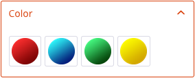
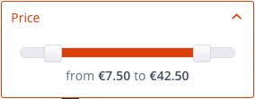
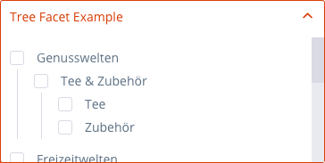
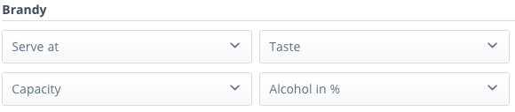

The `Shopware\Bundle\SearchBundle` defines how Shopware searches for different product lists. Classes defined inside this bundle are independent from the underlying search engine, and can be reused across different search engine implementations.

<div class="toc-list"></div>

## Concept - Small example

The following example selects a list of products assigned to the category with id 3 and sorts the result set
by the cheapest price.

```php
$criteria = new Criteria();
$criteria->limit(10);
$criteria->addCondition(new CategoryCondition([3]));
$criteria->addSorting(new PriceSorting());

$context = $this->get('shopware_storefront.context_service')->getShopContext();
$service = $this->get('shopware_search.product_number_search');

/**@var $result ProductNumberSearchResult*/
$result = $service->search($criteria, $context);

$numbers = [];
foreach($result->getProducts() as $product) {
   $numbers[] = $product->getNumber();
}
```
This small example shows how the product number search can be used.

## Reference to SearchBundleDBAL
As already described, the `Shopware\Bundle\SearchBundle` defines only how product lists are selected and which conditions and sorting criteria are used to restrict or modify the result set.
The `SearchBundle` contains no specify search engine implementation, like `Doctrine\ORM` or `PDO`, and can't be used as standalone search mechanism.
As default for the `ProductNumberSearch`, Shopware uses `Shopware\Bundle\SearchBundleDBAL`, which implements the interfaces required by `Shopware\Bundle\SearchBundle` to use it as product search implementation.
The `Shopware\Bundle\SearchBundleDBAL` is based on the `Doctrine\DBAL\Query\Builder`.

## ShopContextInterface
A `ShopContext` contains all shop related data for the current request. (shop id and details, customer group, ...) For more information, see `Shopware\Bundle\StoreFrontBundle\README.md`

This context is used in all Shopware bundle services, and can be accessed by getting the `context_service` from the DI container.

## Concept - StoreFrontCriteriaFactory
The `StoreFrontCriteriaFactory` class allows you to generate different criteria objects for a specific context.
The criteria classes are generated from the provided `Request` class and represent the different conditions and sorting criteria provided in the request parameters.

**Example**: The request parameter sSupplier contains a list of supplier ids which will be injected into a `ManufacturerCondition` and assigned to the criteria object as filtering condition.

Shopware generates criteria objects for the following contexts:

- Search
- Listing
- AjaxSearch
- AjaxListing
- AjaxCount
- ProductNavigation


## List of conditions and sortings
Conditions classes can be used to restrict the search result by different criteria. Each condition must implement the `Shopware\Bundle\SearchBundle\ConditionInterface`.

**Example**: If the `Shopware\Bundle\SearchBundle\Criteria` class contains the `Shopware\Bundle\SearchBundle\Condition\ManufacturerCondition` and
this condition contains the manufacturer ids `2` and `3`, the search result contains only products from those two  manufacturers.

Shopware contains the following core conditions:

- `CategoryCondition` - *Products which are assigned to one of the provided categories*
- `CustomerGroupCondition` - *Products which are not blocked for the provided customer group*
- `HasPriceCondition` - *Products which have a defined default customer group price*
- `ImmediateDeliveryCondition` - *Products which are available for immediate delivery*
- `ManufacturerCondition` - *Products from one of the provided manufactures *
- `PriceCondition` - *Products whose price is within the provided price range*
- `ProductAttributeCondition` - *Dynamic condition which can be used to restrict the result by specify product attribute*
- `PropertyCondition` - *Products which have one of the provided product property values*
- `SearchTermCondition` - *Products which match the provided search term*
- `ShippingFreeCondition` - *Products which have shipping free*
- `VoteAverageCondition` - *Products whose vote average is within the provided range*

Sortings classes can be used to sort the product search results. Each sorting class has to implement the `Shopware\Bundle\SearchBundle\SortingInterface`.
**Example**: If the `Shopware\Bundle\SearchBundle\Criteria` class contains the `Shopware\Bundle\SearchBundle\Sorting\PriceSorting`, with the parameter ascending, products with the cheapest price are displayed first. Each sorting class can be used for ascending or descending sorting. The direction is specified in the class constructor.

- `PopularitySorting` - *Sorts by the sales and impression*
- `PriceSorting` - *Sorts by the listing price*
- `ProductAttributeSorting` - *Sorts by a product attribute*
- `ProductNameSorting` - *Sorts by the product name and description*
- `ReleaseDateSorting` - *Sorts by the configured product release date*
- `SearchRankingSorting` - *Sorts by the ranking of the used search term*


## Concept - Facets
Facets can be used to generate partial search results. Each facet class has to implement the `Shopware\Bundle\SearchBundle\FacetInterface`.

**Example**: If the `Shopware\Bundle\SearchBundle\Criteria` class contains the `Shopware\Bundle\SearchBundle\Facet\ManufacturerFacet`, the product number search returns a `Shopware\Bundle\SearchBundle\FacetResultInterface` which contains a list of all found product manufacturers that match the current search criteria.

Shopware contains the following core facets:

- `CategoryFacet` - *List of categories to which the resulting products are assigned*
- `ImmediateDeliveryFacet` - *Number of products which are immediate deliverable*
- `ManufacturerFacet` - *List of manufacturers to which the resulting products are assigned*
- `PriceFacet` - *Includes the minimum and maximum prices of the resulting products*
- `ProductAttributeFacet` - *Dynamic facet which can be used to select partial results of product attributes*
- `PropertyFacet` - *List of all product properties of the found products*
- `ShippingFreeFacet` - *Number of products which marked as shipping free*
- `VoteAverageFacet` - *Contains the minimum and maximum of the resulting products vote average*


## FacetResult
A facet result class contains the result of a generated facet. Each result facet has to implement the `Shopware\Bundle\SearchBundle\FacetResultInterface`.


Shopware contains the following core facet results, which can be reused for each data source:

| Facet        | Description           | Store front  |
| ------------- |:-------------:| -----:|
| `BooleanFacetResult`        | Displays a checkbox filter in the store front       |  |
| `ValueListFacetResult`      | Displays a multiple selection list for the facet.   |  |
| `RadioFacetResult`          | Displays a single selection list for the facet      |  |
| `MediaListFacetResult`      | Displays a multi selection media list for the facet |  |
| `RangeFacetResult`          | Displays a range slider for the facet               |  |
| `TreeFacetResult`           | Displays a tree for the facet                       |  |
| `FacetResultGroup`          | Groups a list of `FacetResultInterface` classes     |  |

This abstract architecture allows third party developers to integrate new facets without implementing their own styling for the store front.
**Example**: The `ShippingFreeFacet` and the `ImmediateDeliveryFacet` both use the `ValueListFacetResult` without defining their own template for the store front, but with different data sources.

You can find a installable ZIP package of an attribute example plugin <a href="{{ site.url }}/exampleplugins/SwagAttributeFilter.zip">here</a>.

## Full implementation - with condition (with DBAL)
The following example shows how the default `SearchBundleDBAL` implementation handles conditions.
Each condition inside the `SearchBundleDBAL` is handled by their own `ConditionHandler`.
Each `ConditionHandler` must implement the `Shopware\Bundle\SearchBundleDBAL\ConditionHandlerInterface`
The `Shopware_SearchBundleDBAL_Collect_Condition_Handlers` event can be used to register a condition handler class:

```php
//register condition handlers for dbal search implementation
Shopware()->Events()->addListener(
   'Shopware_SearchBundleDBAL_Collect_Condition_Handlers',
   function() {
      return new CategoryConditionHandler();
   }
);
```

Each condition handler has to implement two methods:
1. `supportsCondition` - Checks if the condition can be handled by this class
2. `generateCondition` - Handles the condition and extends the provided query

```php
class CategoryConditionHandler implements ConditionHandlerInterface
{
    public function supportsCondition(ConditionInterface $condition)
    {
        return ($condition instanceof CategoryCondition);
    }

    public function generateCondition(
        ConditionInterface $condition,
        QueryBuilder $query,
        ShopContextInterface $context
    ) {
        $query->innerJoin(
            'product',
            's_articles_categories_ro',
            'productCategory',
            'productCategory.articleID = product.id
             AND productCategory.categoryID IN (:category)'
        );

        $query->setParameter(
            ':category',
            $condition->getCategoryIds(),
            Connection::PARAM_INT_ARRAY
        );
    }
}
```

The `generateCondition` method extends the provided query with an inner join with the `s_articles_categories_ro` table, to select only products associated with the provided category ids.
The `:category` parameter is replaced by the `setParameter` function with an integer array.


## Concept - Facet and Condition
Some facets and conditions belong together.

**Example**
The `ManufacturerFacet` returns a `ValueListFacetResult`, which is displayed in the store front as a filtering option for the user:


The user wants the product list to be filtered by the two selected manufacturers. The `ManufacturerFacet` should now
produce a `ManufacturerCondition` with the selected values, which will be used along with other filter criteria to produce the search result.

The `ManufacturerCondition` is also has to return an instance of `FacetResultInterface` to be rendered to the shop user. The `ManufacturerFacet` uses the `ValueListFacetResult` for this, like so:

```php
$result = new ValueListFacetResult(
    'manufacturer',
    true,
    'Store front label',
    $items,
    'sSupplier'
);
```

The `ValueListFacetResult` has the following constructor parameters:

- `$facetName` - Name of the original facet
- `$active` - Flag if the facet result is already filtered
- `$label` - Label of the select box
- `$values` - Items of the select box
- `$fieldName` - Name of the form field

The `$fieldName` parameter defines which request parameter should be filled with the selected values.
All selected values are now provided in the next request in the `sSupplier` request parameter, which is the default parameter for the `ManufacturerCondition`.

## Concept - Extendable
The linked plugin shows how the Shopware search bundle can be extended. It registers custom sorting, condition and facet for the store front and implements a default extension for the `Shopware\Bundle\SearchBundleDBAL`:

<a href="{{ site.url }}/exampleplugins/SwagSearchBundle.zip">Plugin download</a>

## ProductSearch decorator
In most cases, only a list of product numbers is not enough for the store front.
The `Shopware\Bundle\SearchBundle\ProductSearch` class is a decorator, which allows the execution of a product number search, whose result sets contains a list of `Shopware\Bundle\StoreFrontBundle\Struct\ListProduct` structs.
A `ListProduct` struct contains all required data for a product to be display in the store front listings.
Internally, this decorator first executes the `ProductNumberSearch` and then converts the result using the configured `Shopware\Bundle\StoreFrontBundle\Service\ListProductServiceInterface` from the DI container.
