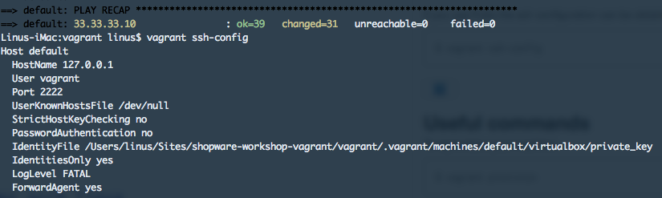
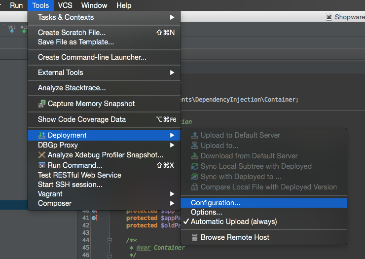
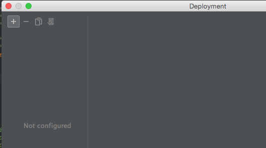
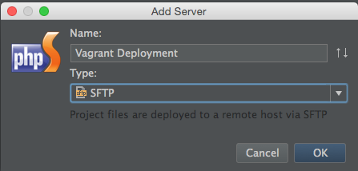
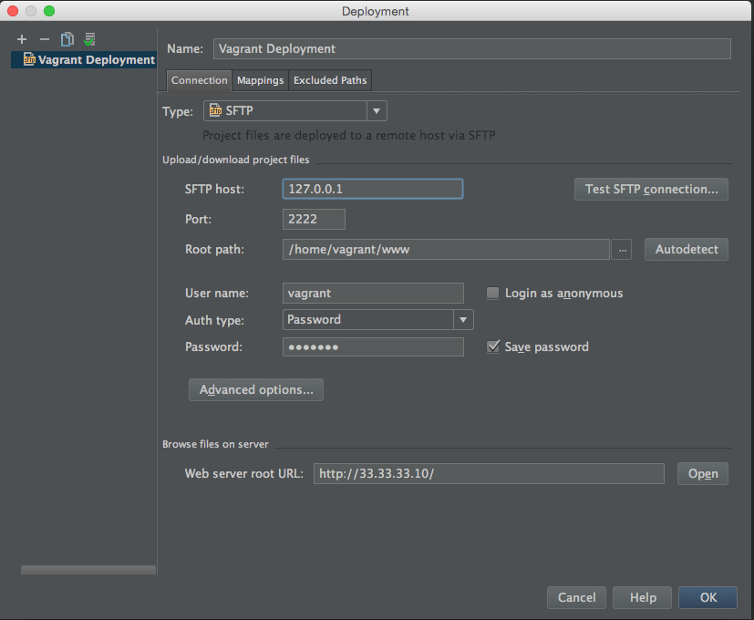
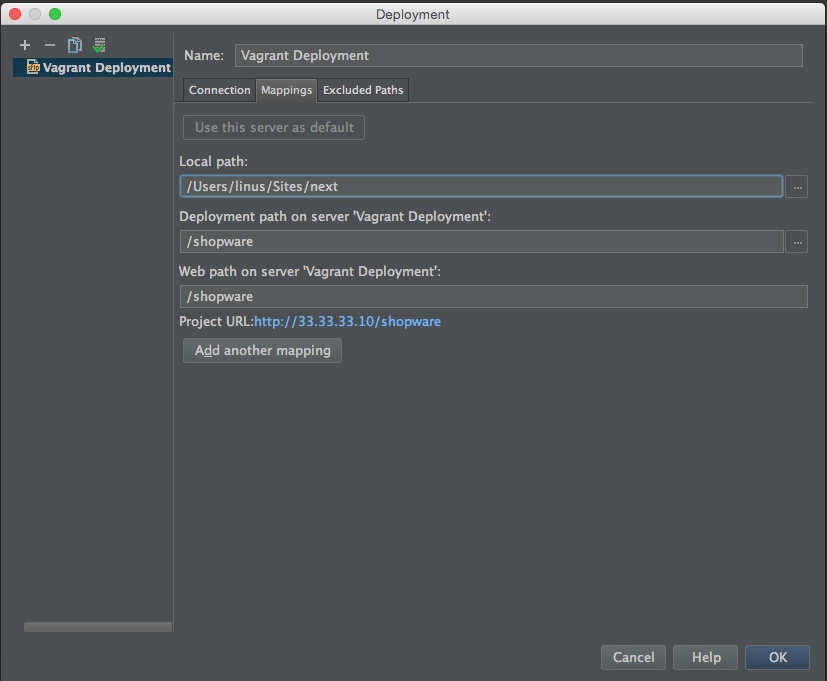
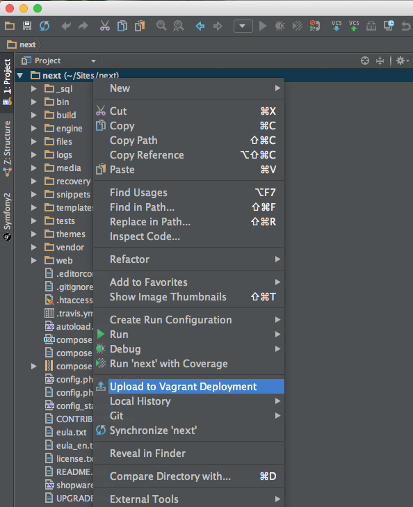

We published a [Vagrant Setup](https://github.com/shopwareLabs/shopware-vagrant) that provides you with a basic Ubuntu 14.04 that contains everything that you needed to develop with Shopware.
It contains the Apache2 Web Server, MySQL Server as well as all required tools, like `ant`, `curl` and `git`.

Please note that Vagrant setup does not contain a Shopware installation. The installation has to be done manually.

<div class="toc-list"></div>

## Provisioning

Download the required software:

 - [VirtualBox](https://www.virtualbox.org/wiki/Downloads)
 - [Vagrant](https://www.vagrantup.com/downloads)
  
 Additional Information for VirtualBox setup (Windows), or you get errors like "error downloading the file" without any further explanation:
- make sure VirtualBox supports 64bit Guest Systems, if only 32 bit is supported check if:
  - your host OS is a 64 bit system
  - Intel Virtualization Technology and VT-d are both(!) enabled
  - the Hyper-V platform is disabled in the Windows Features list

The provisioning is done directly on your new virtual machine by [Ansible](http://docs.ansible.com/).

### 1. Clone the repository to your local machine

```bash
$ git clone https://github.com/shopwareLabs/shopware-vagrant
$ cd shopware-vagrant
```

### 2. Boot up your Vagrant virtual machine

```bash
$ cd vagrant
$ vagrant up
```

The first boot may take a while. After that, your machine will be available at [http://192.168.33.10/](http://192.168.33.10/). All required tools like the LAMP stack are already installed.

- Adminer (DB-Administration): [http://192.168.33.10/adminer.php](http://192.168.33.10/adminer.php)
- MySQL user: `root`, password: `shopware`


### 3. SSH access

The SSH username is `vagrant`, the password: `vagrant`. To automatically SSH into the created VM run `vagrant ssh`. If you use Putty, the SSH configuration can be obtained via:

```bash
$ vagrant ssh-config
```

<div class="is-center">



</div>

## PhpStorm

### Benefits of using PhpStorm
- Intelligent PHP editor
  - PHP code completion
  - Integrated refactoring
  - Smarty and PHPDoc support
- Easy installation
  - Cross platform
  - Individual project settings
- Visual PHPUnit test runner
- VCS support
  - SVN
  - Git
  - Mercurial
  - Local history
- FTP and remote synchronization
- Visual debugging inside the IDE
- HTML5 and CSS editor including zen coding

### Install the Shopware Plugin

The official [Shopware plugin](https://plugins.jetbrains.com/plugin/7410) is available in the global jetbrains repository and can therefore be installed right inside your editor. It depends on the Symfony2 plugin which will automatically be installed during the installation of the Shopware plugin. You can read more about its features on the official [plugin page](https://plugins.jetbrains.com/plugin/7410). 

### Exclude Directories from Indexing

PhpStorm provides you with a variant of automatic code completions. First, PhpStorm needs to index all files inside your Project. This might take a while, depending on the number and size of files in your project.

To exclude directories from indexing, open the Settings and select **Directories** in the left sidebar. You can now select directories on the right side and mark them as excluded by clicking on **Excluded** above.

The following directories (if existing) should be excluded:
- files
- media
- recovery
- snippets
- var
- web

These directories will be marked red in your project and might not be visible anymore, but they will still remain on your hard drive.

### Coding Style

As mentioned in our [CONTRIBUTING.md](https://github.com/shopware/shopware/blob/5.1/CONTRIBUTING.md), you should follow the [PSR-1](https://github.com/php-fig/fig-standards/blob/master/accepted/PSR-1-basic-coding-standard.md) and [PSR-2](https://github.com/php-fig/fig-standards/blob/master/accepted/PSR-2-coding-style-guide.md) coding standards. PhpStorm provides you with predefined settings in `Editor` -> `PHP` -> `CodeStyling`. 


### Deploy with PhpStorm

To deploy a locally installed project to the Vagrant server, you need to configure auto deployment in PhpStorm. Make sure you are using the developer version of Shopware which can be downloaded from [GitHub](https://github.com/shopware/shopware).

`git clone https://github.com/shopware/shopware.git`

#### Step 1
Open your Shopware project in PhpStorm.
Choose in your toolbar `Tools` -> `Deployment` -> `Configuration`

<div class="is-center">



</div>

#### Step 2
Now we add our new Vagrant machine as deployment target.

<div class="is-center">



</div>

Choose a unique name and the "SFTP" type.

<div class="is-center">



</div>

Fill in all required fields.

* SFTP host: `127.0.0.1`
* Port: `2222`
* Root Path: `/home/vagrant/www`
* User name: `vagrant`
* Password: `vagrant`
* Save Password: `yes`
* Web server root URL: `http://192.168.33.10/`

<div class="is-center">



</div>

Now press OK to save your settings.
If you configured your deployment machine successfully, you will now be asked to add the RSA key to your known hosts. Press *Yes*. After that, you should get a success message.

#### Step 3

After adding your deploy machine, you have to create a mapping between the local and remote files. 

Switch to the Mappings directory and press the "..." near `Deployment path`. Choose `/home/vagrant/www/shopware`. If the shopware directory doesn't exists, create it here with a right click.

<div class="is-center">



</div>

Now press *OK* and close all deployment windows, so that you are back in your default IDE view.

Right click on your document root directory and click on `Upload to Vagrant Deployment`

<div class="is-center">



</div>

### Automatic Upload

You can enable the automatic upload function so you don't have manually upload your files every time you change them: `Tools > Deployment > Automatic Upload`.

## Build Shopware

Now that we uploaded Shopware onto the Vagrant box, we have to configure and install the development edition of Shopware.

### 1. Connect to your Vagrant Machine
Connect to your Vagrant machine via ssh using the `vagrant ssh` command

```bash
$ vagrant ssh
$ cd /home/vagrant/www/shopware/build
```
  
### 2. Configure your build properties

```bash
$ ant configure
```
  
Input fields:

- db-host: `localhost`
- db name: `shopware`
- db username: `root`
- db password: `shopware`
- app host: `192.168.33.10`
- app path: `/shopware`

After you get the `BUILD SUCCESSFUL` message you can run the full build command.

```bash
$ ant build-unit
```

### 3. Test images

Download the test images and extract them into your Shopware's root directory.

```bash
$ cd ..
$ wget -O test_images.zip http://releases.s3.shopware.com/test_images.zip
$ unzip test_images.zip
```

Your Shopware installation is now complete and can be accessed at [http://192.168.33.10/shopware](http://192.168.33.10/shopware).

To open the backend, add `/backend` to your URL so it becomes [http://192.168.33.10/shopware/backend](http://192.168.33.10/shopware/backend). You can then login using the default user credentials **demo**/**demo**.
