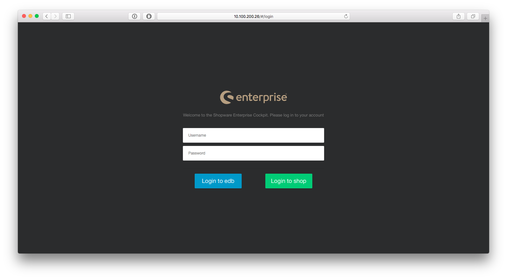
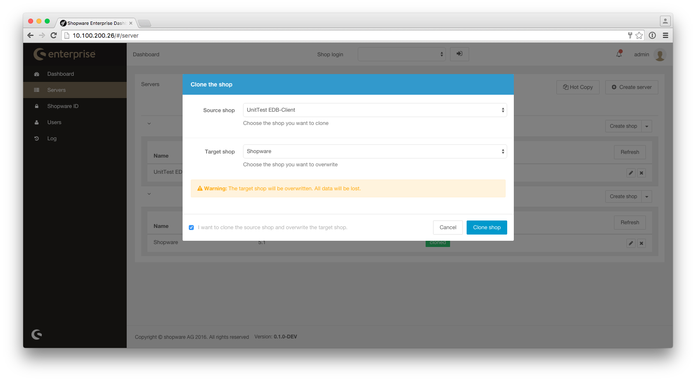

This guide will give you an overview of the basic usage of the Shopware Enterprise Dashboard (EDB).

## Logging in

Navigate your browser to your EDB instance. The following login screen will appear:

After entering the username and password you can navigate (1) to the EDB itself or (2) to the quick shop login.

## Dashboard

Once you logged in to the EDB, you will be taken to the Dashboard tab. This will allow you quick access to your
Shopware installations and aggregated data. On the top of the page, you can select one of the shops you currently have
access to, and instantly access its backend using [Single Sign-on](https://en.wikipedia.org/wiki/Single_sign-on).
Keep in mind that you (or any other user) may not have permissions to access all shops at a given time.

Under `Shop overview` you can select a shop and a given time interval. You will automatically be provided with the Order
Conversion Rate and Total Order Amount for that shop in the given time interval (if available).
 
## Servers

The servers tab is where you can manage Shopware servers and, in those, Shopware installations. Depending on your EDB installation,
this section might come pre-populated with sample data or, alternatively, be empty. In any case, we will take a detailed
look at all the actions you are able to perform here.
  
### Managing servers

As the EDB ist able to install / clone your shops from servers, it requires some privileges to access those machines.
As such, before you can register those servers on the EDB, you must first ensure that they meet a defined set of requirements
in order for them to be accessible by the EDB.

Make sure you have:

* A Host or IP Address
* The foreign SSH user
* MySQL Credentials
* Enabled passwordless SSH access through the EDBs background process, including adding the new system to the *known hosts* 

The detailed server configuration process can be found [here](/enterprise/tech-guide/shopware-server-configuration-guide). 
Once you have configured your server to meet all requirements, you can then register it in the EDB's server tab.

Besides creating servers, you can also remove them. Keep in mind that you can only remove servers that no longer have
registered shops in them. Both adding and removing servers in the EDB's server tab doesn't perform any actual changes
on those machines, so you can execute both operations safely without worrying about data loss.

### Creating shops

Once you have successfully registered a server, you can add a Shopware installation to it. By clicking on the
`Create shop` button, you can go to the shop configuration page, where you will be asked for several details about your
shop and its location in the server's file system. By default the EDB will assume, that you configured your server with
 a document root and that all shops on that server got to that document root. For that reason by default only "Shop name"
 and a Shopware version are required and all other fields will be filled automatically. If you have a differing server
 setup, you are still able to change any of these fields by switching to "Advanced mode".

Once you save, you will be taken back to the server tab. The setup process will also automatically start, and you will
get live feedback of its current status. Many tasks in the EDB, such as installing a shop, are executed asynchronously
in the server, meaning that you can continue navigating the EDB (or even close your browser) without interrupting or
affecting these processes. You can check the current status of the Shopware installation process by clicking on the
server to expand it, or by checking the `Log` page of the EDB.

### Cloning shops

Besides installing new Shopware instances, you can also clone your shops. This could be useful in order to create test
and development machines very quickly. To clone a shop, you need to have it defined in the EDB. If you want to connect
an existing shop to the EDB, you can also use the "Create shop" dialog and select "Connect to an existing shop" as your
"Shopware Version".
Additionally, you need an "empty" shop, which will be the destination of the clone. You can create this "empty" shop
using the option "Do not install any Shopware version" in the "Create Shop" dialog.

Once you have both shops defined on your EDB, click the "Hot Copy" button in the drop down menu of the shop you want to clone.
 You will then need to select the source and target shops, after which you can start the process. Keep in mind that this process is
destructive for the target shop: if you have any information stored in the target directory or database, it will be
permanently deleted.
 
### The EDB Shopware plugin
 
 At this point, it's worth noting that, when a Shopware instance is associated with a EDB server, a new plugin,
 `SwagEnterpriseDashboard` is installed in it. This plugin is the single point of communication between Shopware and
 the EDB server. This is done to ensure that different EDB and Shopware versions can still communicate with each other
 and work seamlessly, now and in the future. This also means a few other things that you might need to keep in mind:
 
 * When you associate any shop, new or preexisting, with the EDB, this plugin is automatically installed and activated
in your shop.
 * If you wish to disconnect a Shopware instance from the EDB, you can use the `Delete shop` button on the `Server`
tab of your EDB installation. This, however, performs no change whatsoever on your shop. If you wish to, you can
uninstall the `SwagEnterpriseDashboard` plugin from your Shopware shop, as it will no longer be needed. Keep in mind
that, if you uninstall the plugin, all data associated to it will be removed, including licenses and plugins installed
by the `SwagEnterpriseDashboard` plugin (you can still reinstall them later manually).
 
## Shopware ID

In the Shopware ID tab you can register your Shopware accounts and access your Shopware and plugin licenses.

You will need to start by adding your Shopware ID to the EDB. You can do so using the `+` sign in the top left of the
window. Once you input your Shopware ID and password, the EDB will automatically retrieve your account data. When the
synchronization process finishes, you will be able to see, in this tab, all your Shopware, premium and 3rd party plugin
licenses.
 
If your licenses match any of the shops you previously configured in the `Server` tab, they will automatically be
uploaded to those shops. Additionally, if you used this Shopware ID to buy plugins for those shops, the EDB will
automatically install (but not enable) those plugins to those shops, if they are not already present. You can execute
this process again at any time by using the `Sync licenses` button - do keep in mind that this process might take some time.

If you have multiple Shopware IDs, you can add them using the same process as described above, and check them
individually by using the dropdown field next to the `+` button.

## Users

By default, your EDB installation will come with just the `admin` user. If you wish, you can create different accounts
for other members of your organization. To do so, simply use the `Add` button and fill in all the fields (all are required).
Once you have clicked on `Save user`, the new account will be created. You now need to add it to a group, which will
specify which EDB actions that user will have access to.

### EDB Groups

EDB groups specify a set of actions that a given user may perform. By default the EDB comes with these groups:

* `Admin`: Has access to all EDB functionalities
* `SSO`: May login into certain Shopware backends
* `Hooks`: May create / edit hooks

After you create your new user, select it, and click on `EDB groups` panel on the bottom right part of the page.
Here you can toggle on/off any of the EDB groups.

### Shopware roles

One of the key features of the EDB is the central privilege and role management. It allows you, to configure roles
just like in shopware - and synchronize it over all of your shopware instances. Furthermore you can assign users
to different roles per instance - so that a user might have admin privileges in one instance and just article editing
 privileges in another instance.

In the "Shopware Roles" tab you can create the various roles you need in your shops. By default the EDB ships roles
like "Marketing", "Content" or "Article" - but you can also create very fine grained custom roles. In the screenshot
below a custom role "my custom role" was created, which grants read privileges for articles / categories and write privileges
for shopping worlds.

To grant an EDB user access to a Shopware instance, you should first select (or create) the EDB used account you wish to grant
permissions to. Once you did that, you can use the `Manage roles` button in the `Shopware roles` panel to grant that
user roles (see above).

In the screenshot below you can see, that the current EDB user gets the "Content" role assigned for the shop "UnitTestEdb-Client".
For other shops the user could have none or other roles.

Once you save your changes, the EDB will update the affected Shopware instances with the new users and roles.
Once this is done, the affected EDB user may use the EDB to directly access Shopware instances.
To do so, simply select the desired shop from the dropdown on the top of the page, and press the
button next to it.
   
If all went well, after a few seconds you will be taken to the Shopware backend, already authenticated. Your available
Shopware actions will also reflect the role permissions assigned to this user account in the EDB. You can use the EDB to
assign multiple roles to the same user, if you wish to.

## Logs

As mentioned before, several actions in EDB take place asynchronously in the background. In the `Log` tab, you can see
 the history and state of these actions. You can also filter these logs by server, shop, user or state, so if you are
 having trouble with a specific process, you can view it here. You can also open each log entry individually to get more
 detailed information about it. This can be particularly helpful for debugging failing processes.
