

The 3D product visualization using our [SwagThreeSixty product viewer](https://github.com/shopwareLabs/SwagThreeSixtyViewer) was one of the research topics we presented on the [SCD '17](https://en.shopware.com/news/community-day/2017/). In this document we will take a closer look at some of the aspects of it, like how to create your own 3D content as well as some useful tips & tricks on how to use the module.

## Overview
The [SwagThreeSixty plugin](https://github.com/shopwareLabs/SwagThreeSixtyViewer) provides you with a full-featured 3D scene editor inside your Shopware backend. The editor is built on top of [babylon.js](https://www.babylonjs.com/). Here's an overview of the features:

- Import your own models (`*.obj`, `*.dae` & `*.babylon` are supported)
	- Exports from [Unity](https://github.com/BabylonJS/Babylon.js/tree/master/Exporters/Unity%205), [Blender](https://github.com/BabylonJS/Babylon.js/tree/master/Exporters/Blender), [Maya](https://github.com/BabylonJS/Babylon.js/tree/master/Exporters/Maya/Tools), [3ds Max](https://github.com/BabylonJS/Babylon.js/tree/master/Exporters/3ds%20Max) are available
	- A [command line tool](https://github.com/BabylonJS/Babylon.js/tree/master/Exporters/FBX) for converting `*.fbx` to `*.babylon` is also available
- Dynamic shadows generator
- Supports different types of lights
	- Point light, Spot light & Hemisperic light
- Supports basic shapes
	- Cyclinder, Box & Ground Plane
- Supports different materials for basic shapes
	- Diffuse, Specular & Ambient color / texture
	- Bump map support
- Positioning, Scaling & Rotation of objects
- Scene Fog with different modes
- Highlight model on selection
- Debug mode for easier scene creation
- Two different anti-aliasing modes for your scene
- Different rendering modes - Wireframe, Point, Solid

### Why have we created a 3D editor?
Before we're jumping straight into the plugin, I would like to explain why we've added a 3D editor instead of a simple upload ability for 3D models. A 3D model is just a single part of a 3D scene, next to things like the environment or the lighting, both of which are crucially important for a realistic display of your products. That is why we decided to provide a solution that seamlessly allows you to create everything necessary to present 3D representations of your products in your shop.

A scene contains a camera which looks onto your product, you have different lights in place, for example a hemisphere light for enviormental illumination and a spot light which is giving your project the correct lighting, as well as a backdrop or even other 3D models which you're using to put your product into the right context.

## Technical background
The editor is using [babylon.js](https://www.babylonjs.com/), a JavaScript framework for building 3D games with HTML5. WebGL, WebVR & Web Audio initiallly created by Microsoft. It helps you to streamline the development of 3D content in the browser. The framework itself it full-featured and includes a rich & in-depth documentation.

### Browser support
It works on all WebGL platforms via a **specific modern shader architecture** and native touch support:

- IE11 / MS Edge
- Google Chrome
- Mozilla Firefox
- Opera
- Safari
- iOS (iPad / iPhone)
- Android
- Windows Phone 8.1 / Mobile 10
- Firefox OS
- Xbox One

<iframe src="//caniuse.bitsofco.de/embed/index.html?feat=webgl&amp;periods=future_1,current,past_1,past_2" frameborder="0" width="100%" height="407px"></iframe>

<iframe src="//caniuse.bitsofco.de/embed/index.html?feat=webvr&amp;periods=future_1,current,past_1,past_2" frameborder="0" width="100%" height="407px"></iframe>

<iframe src="//caniuse.bitsofco.de/embed/index.html?feat=audio-api&amp;periods=future_1,current,past_1,past_2" frameborder="0" width="100%" height="407px"></iframe>

## How to use the plugin
After you install the plugin using the installation guide in the GitHub repository you can find a new menu entry under **"Marketing"** called **"3D Product Viewer"**.

When you create your first scene you'll notice the 3D view is empty. The reason is simple - you haven't added a camera to your scene yet. A camera is a mandatory part of the scene. It is the eye of your scene that allows you to see the 3D models.

## Arc Rotate Camera

In our 3D product viewer we've added a camera type, the so called **"Arc Rotate camera"** which rotates around a given pivot (e.g. your main 3D model). It can be controlled with mouse or touch events and is perfect for staging a product.

*Illustration from the babylon.js documentation of the functionality of the Arc Rotate Camera*

The camera is a little strange to use at first but it's quite easy when you're getting used to it. Basically you're controlling the radius property of the camera using the position of it. A good starting point is to set the *"Z"* value to *-15*. Please keep in mind that the value highly depends on the size of your model in the scene. If you're positioning the camera using the editor settings, the alpha and beta properties will be filled with the correct values right away, so you don't have to mess around and calculate them on your own.

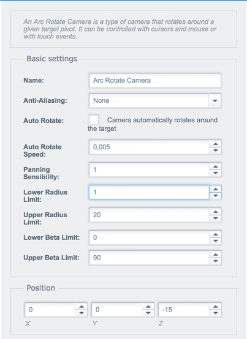

*Settings of the Arc Rotate Camera*

Let us talk about the settings of the camera and take a deeper look at them.

#### Zooming
The minimum and maximum zoom factors can be controlled using the *"lower radius limit"* and *"upper radius limit"*. The *"lower beta limit"* and *"upper beta limit"* control how much you can tilt the camera up and down. The setting *"Panning Sensibility"* defines the zoom speed when the user uses the mouse wheel to zoom.

#### Auto rotating
The camera can automatically rotate around the given pivot. To do so, enable the checkbox *"Auto Rotate"*. The value of the *"Auto Rotate Speed"* defines the increment of the *"alpha"* value of the camera per frame. Please keep in mind we're aiming for 60 frames per second, so the value shouldn't be too high otherwise the camera would spin around the target like crazy.

#### Anti-Aliasing
The camera also features anti-aliasing in 2 different intensities. The first option is *"FXAA"* (Fast Approximate Anti-Aliasing) which applies the smoothing as a per-pixel effect. In our internal tests the perfomance impact was low and we used it in almost every scene we've created. The second option is *"FSAA 4x"* (Full Scene Anti-Aliasing) with a 4x sampling of the scene. This type of anti-aliasing super-samples each full frame and renders it with four times the display resolution and then down-samples it to match the display resolution again. In our internal test we found out this type has a strong negative impact on performance and should only be used with very lightweight scenes and low poly 3D models, as otherwise the viewer would feel sluggish to the user, especially on lower end devices.

## Lights
The next topic we are going to talk about are lights. We've added different types of lights which are having a different purpose. The following types are supported by our editor:

- Directional light
- Point light
- Spot light
- Hemisphere light

### Directional light

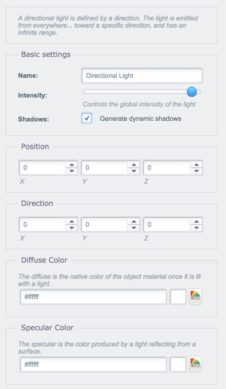

*Settings of the Directional Light*
 
As the name suggests this type of light is defined by a direction. It's emitted from everywhere towards a specific range. The most common types of directional light are front lighting, side lighting and back lighting. Diffused lighting occurs when light is scattered and does not seem to come from a discernible location - think of a cloudy day with dim light.

The *"Intensity"* obviously provides you with the ability to change the intensity of the light. Usually you don't want a diffused light to blast on your product with 100%, so you'd rather dim it down to a certain degree.

The option *"Shadows"* allows you to control if the light should be used as a source to generate dynamic shadows for your 3D objects in your scene. The shadow generator we're using to generate the dynamic shadows are using a soft shadows which lets the shadow looks better and removes hard edges.

The *"Position"* fieldset can be used to position the light in the scene. It has no impact of the light itself and is just there to help you to organize your scene internally.

The *"Direction"* fieldset contains the most important settings for the directional light. It lets you control the emitting direction of your light.

#### Colors
The *"Diffuse color"* lets you define the color of the light itself. 

On the other hand the *"Specular color"* lets you define the color produced by a light reflecting from a surface like the ground or another model in the scene. If you want to disable reflections all together you can set the color to `#000000`.

### Point Light

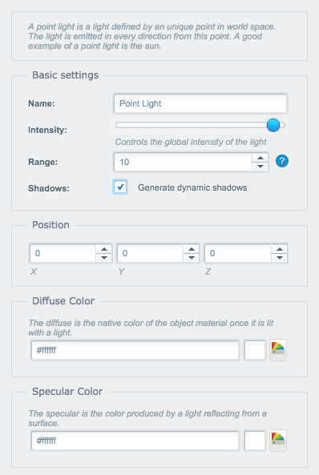

*Settings of the Point Light*

A point light is a light defined by an unique point in world space. The light is emitted in every direction from this point. A good example of a point light is the sun.

Lights are sharing the same settings most of the time, that's why I'm just covering the unique settings and point out when settings are having a different effect on your scene.

The *"Range"* setting defines how far the light goes within your scene. This is useful when you're using a point light inside a model of a lamp for example. In  this case you don't want the light to have an infinite range.

The *"Position"* fieldset is important for this type of light. It defines the point in world space where your light will be placed.

### Spot light

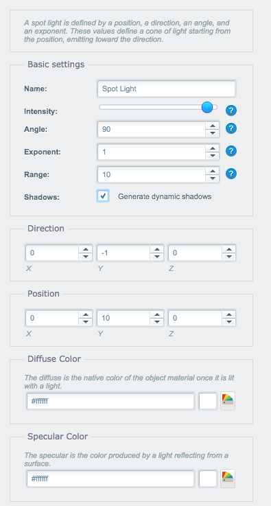

*Settings of the Spot Light*

A spot light is defined by a position, a direction, an angle, and an exponent. These values define a cone of light starting from the position, emitting toward the direction.

The spot light has a bunch of settings other lights don't have. Before we're talking about the settings of the light, we should take a look what a spot light looks like to get a better understanding of the settings.

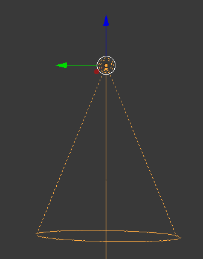

*Illustration of a Point Light*

The *"Angle"* setting defines the size of the spotlight's conical beam in radians.

The *"Exponent"* setting defines the speed of the decay of the light with distance. Imagine it like the lights max. distance.

The *"Range"* setting defines the maximum range of the light before it doesn't reach an object anymore.

The *"Direction"* fieldset is an important setting for the light. If you want your spot light to emit its light down for example you have to set the *"Y"* to *-1*.

### Hemisphere Light

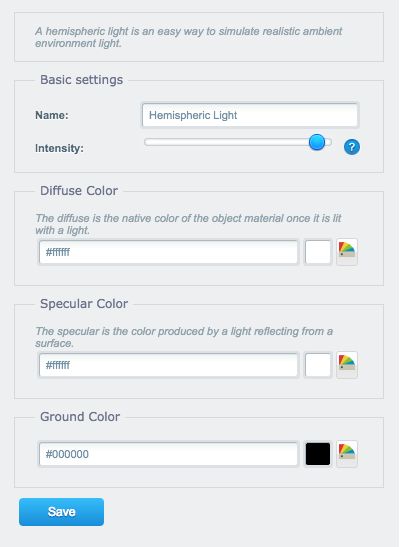

*Settings of the Hemisphere Light*

A hemispheric light is an easy way to simulate realistic ambient environment light. It's fading the color from the diffuse color to the ground color. Please note that the hemisphere light is unable to create dynamic shadows. The light source is positioned above the scene by default, that's why you can't define the position of it.

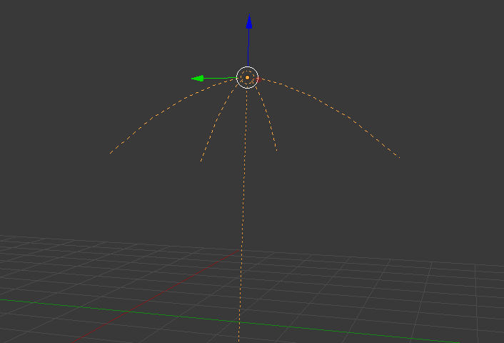

*Illustration of the Hemisphere Light*

The only unique setting for the Hemisphere Light is the property called *"Ground color"*. The hemisphere light fades the color from the diffuse color to the ground color. Imagine the Hemisphere light like a linear gradient. The diffuse color is the start color of the gradient and the ground color is the end value of the gradient.

## Basic geometry

The editor provides you with 3 basic geometry elements you can use throughout your scene. These elements are provided by the framework and have a very light impact on performance. We're featuring the available elements in this section.

The elements are sharing the same material settings. We'll cover these settings in a separate section.

### Cylinder

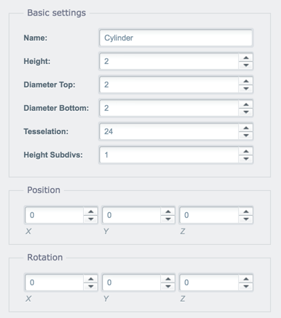

*Settings of the Cylinder element*

The cylinder in its simplest form is the surface formed by points at a fixed distance form a given straight line. The cylinder can also be used to create cones which is a cylinder which gets tighter either at the bottom or top of the element.

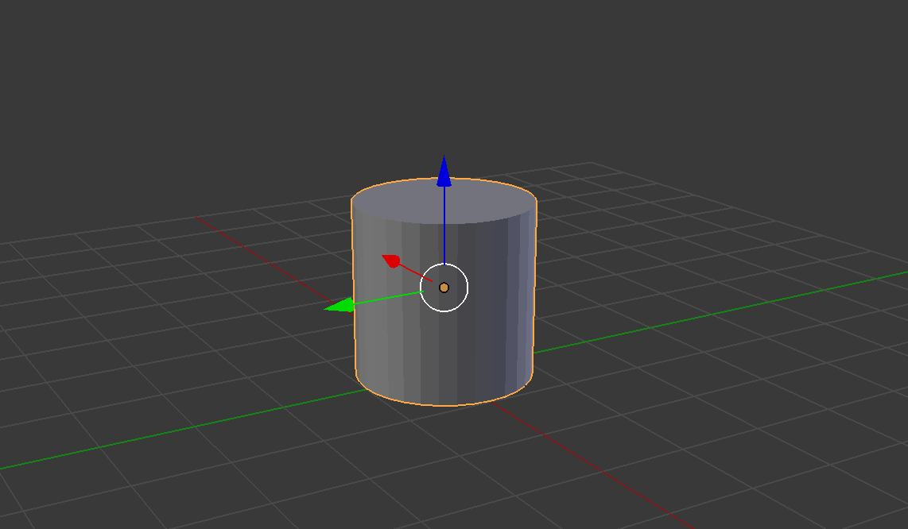

*Illustration of a Cylinder geometry*

The setting *"Height"* defines the height of the element using a defined unit in three dimensional space.

The *"Diameter Top"* property lets you define the width of the cylinder at the top of the element.

The *"Diameter Bottom"* property lets you define the width of the cylinder at the bottom of the element.

The property *"Tesselation"* is another interesting property of the cylinder. It defines how many sides should be created on the *Y*-axis. A lower value creates a hexagonal cyclinder instead of a round one.

The property *"Height Subdivs"* defines the resolution of the cylinder model. This property is mainly to optimize the performance and don't need to be changed by you in almost any case.

### Box

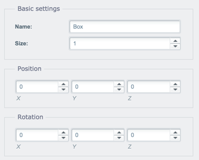

*Settings of the Box element*

The box is another simple element available due to the nature of the geometry. A box is an element build out of 6 planes with a equal edge length.

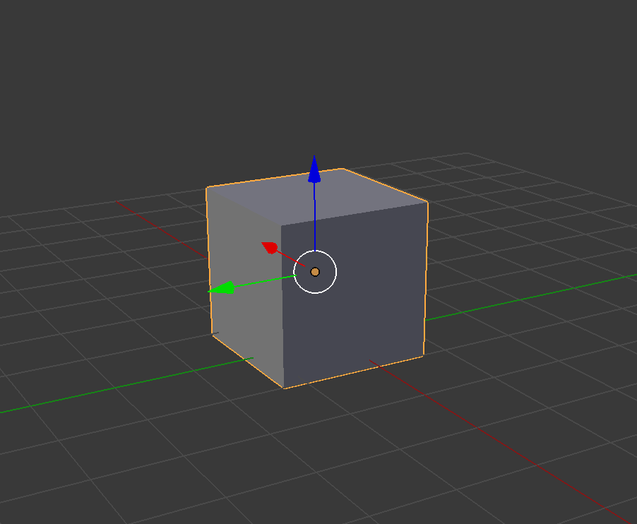

*Illustration of a Box geometry*

The box element just contains the setting *"Size"* which defines the edge length of the box. The value is using defined unit in three dimensional space.

### Ground

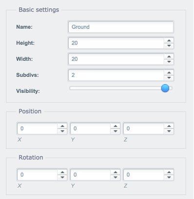

*Settings of the Ground element*

The ground / plane geometry element is the most simplest element available in the editor. It is more or less a two-dimensional surface with a defined size.

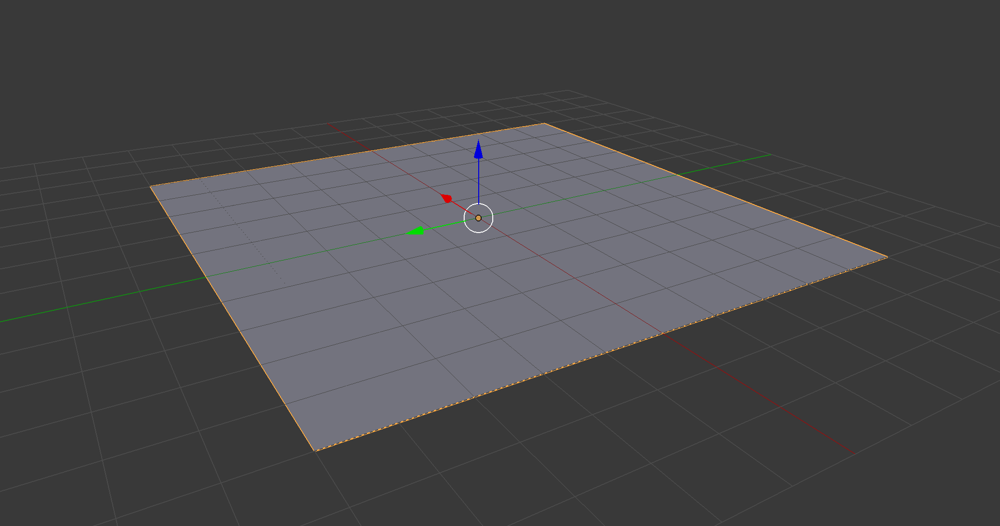

*Illustration of a Ground geometry*

The *"Width"* property defines the size of the *X*-axis. The *"Height"* property defines the size of the ground on the *Z*-axis. It may be confusing up first cause the term "height" usually refers to the *Y*-axis, but not in this case.

The setting *"Subdivs"* is similar to the *"Height Subdiv"* setting of the cylinder. It defines how many verticies are forming the ground plane. This is mainly for perfomance optimization and you don't have to change the value in most cases.

### Basic geometry texture & color settings
The basic geometry elements are coming with a bunch of different settings you can adjust to get the perfect result for the texture. Let's take a closer look at those settings:

#### Diffuse color / texture

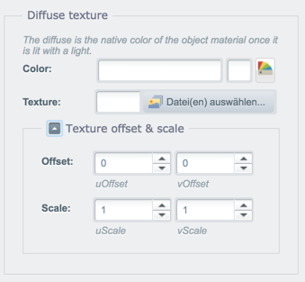

*Diffuse color / texture settings*

The diffuse color / texture will be displayed when a light shines on the element. You can either choose a color or a texture. When you're using a texture you can adjust the offset and the scale of the texture using the settings in the *"Texture offset & scale"* fieldset. This comes in handy when you're working with seamless textures and you want to scale it to fit the size of your object.

#### Ambient color / texture

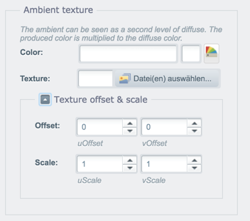

*Ambient color / texture settings*

The ambient texture / color can be seen as a second level of diffuse. The produced color is multiplied to the diffuse color. This comes in handy when you want to stack textures onto each other.

#### Specular color / texture

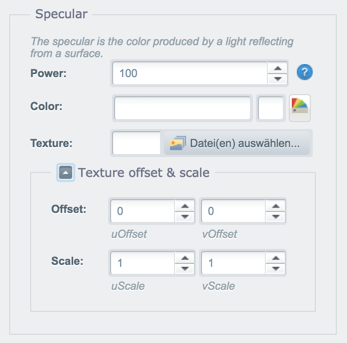

*Specular color / texture settings*

The specular color is the color produced by a light reflecting from the surface of the element. Please note that the ambient color / texture has an unique property *"Power"* which allows you to set the intensitity of the reflection. If you don't want to have any reflection on your model either set the color of the specular color to `#000000` or lower the *"Power"* value to zero.

#### Bump map

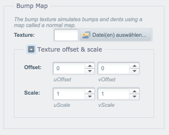

*Bump map settings*

The bump texture simulates bumps and dents using an image texture that is also known as a normal map. There are plenty of online converters which can create normal maps based on your diffuse/color texture. Please note that the *"Texture offset & scale"* fieldset of the diffuse texture will be ignored when using a bump map. You have to adjust the values for the bump map instead.

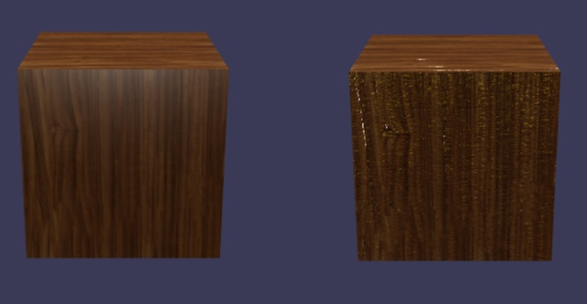

*Left side: Object with a diffuse texture, Right side: Object with diffuse texture & bump map*

## Import your own 3D models
We talked a lot about basic geometry and your own 3D models in the scene but we haven't covered on how to use your own models. First of all, I would like to cover which formats can you use with our editor:

- `*.obj`, `*.dae` & `*.babylon` are supported
	- Export from [Unity](https://github.com/BabylonJS/Babylon.js/tree/master/Exporters/Unity%205), [Blender](https://github.com/BabylonJS/Babylon.js/tree/master/Exporters/Blender), [Maya](https://github.com/BabylonJS/Babylon.js/tree/master/Exporters/Maya/Tools), [3ds Max](https://github.com/BabylonJS/Babylon.js/tree/master/Exporters/3ds%20Max) are available
	- A [command line tool](https://github.com/BabylonJS/Babylon.js/tree/master/Exporters/FBX) for converting `*.fbx` to `*.babylon` is also available

### Preparing your model

Before you can use your own 3D model on the web you have to prepare the model. First of all, we have to talk about file sizes. When you're 3D scanning your products, you're ending up with a highly detailed mesh and a file with a huge file size. Nobody want to load a 50 MB model + additional 15 MB for a texture. So you have to make sure to "scale down" the model. This technique is called "retopologizing". You're recalculating the mesh to a smaller polygon count and you have to bake the model to the new surface. Sketchfab has a great tutorial on [How to retopologize 3D scans into low poly game assets](https://blog.sketchfab.com/retopologise-3d-scans-low-poly-game-assets/) we used for our 3D scanned objects.

When you're satisfied with the file size of your model and associated texture, we can move on with the next step before we can upload it to your web server. When you're 3D scanning objects or using photogrammetry to create models you have to align, scale and center the model otherwise you'll experience problems when trying to align it with other elements in the scene.

In the following video I'm demonstrating how you can normalize a model in [blender](https://www.blender.org/):

<video controls style="max-width: 100%">
	<source src="http://assets.shopware.com/devdocs/blender-adjust-model.mp4">
</video>

*Video on how to normalize a 3D model in Blender*

### Setting up the model
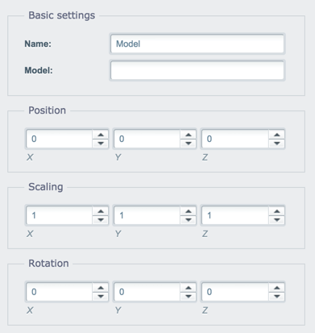

*3D model settings*

As you probably noticed in the screenshot above, the 3D model object in the editor doesn't contain a Media Manager field to select the model using the media manager. The supported 3D file are linking files inside the file to another file like textures, shaders and materials. To prevent issues with the file handling of our Media Manager we're using a absolute path for the *"Model"* setting. As an recommendation you should create a new folder inside the `files` directory to manage your models.

To insert your model, just place the absolute path to your model in the *"Model"* field. If you haven't scaled your model down propertly, you can use the fieldset *"Scaling"* to scale it accordantly.

After you inserted the model, you unfortunalty have to reload the module (i.e. close and open it up again) as we're using a download manager which manages the assets of your scene. 

## Assets - 3D scanned shoe

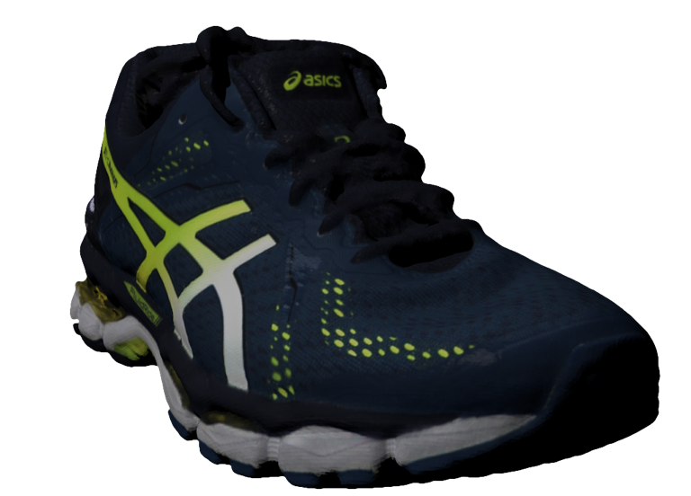

*Example image of the 3D scanned shoe*

To get you a jump start for the 3D product viewer we're providing you with a free 3D scanned shoe we used for all our tests. The shoe was scanned using the [Artec Eva](https://www.artec3d.com/3d-scanner/artec-eva).

- **Model**: Asics Gel-DS Trainer
- **File size**: 25.3 MB + 17.9 MB texture file in 4k
- **File format:** `.obj` + `.stl`
- **Verts**: 181,749
- **Faces**: 363,512
- **Tris**: 363,512

<a href="http://assets.shopware.com/devdocs/swag-shoe-scan.zip" class="landingpage--btn">
	Download 3D shoe model (23.5 MB)
</a>