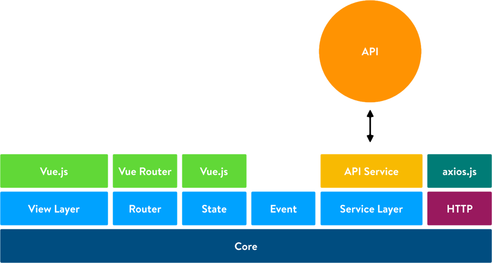

 ---
layout: labs
title: New backend
github_link: labs/new-backend/index.md
shopware_version: X
indexed: true
group: Labs
menu_title: New backend
menu_order: 200
---

The new Shopware backend for the next Shopware version is another very interesting topic we're researching right now. In this article we would like to cover some of the topics we're working on.

### User level
Third party developers are having different skill levels. To provide every user level with the ability to modify & extend the backend, we'll introduce multiple user levels. These user levels are providing different tools & classes to work with the backend.

## Architecture
### Thin layer
For the new backend one of our goals is that we want to be independent from the libraries and frameworks we're using. We're planning to create a thin layer between the libaries layer and the application layer. We're creating this layer with the purpose to abstract the library calls. This is important to get frequent library upgrades without modifiying the application to get it working again.

*Illustration thin layer architecture*

### Core layer
The new administration interface will be grouped in multiple layers. The first level will be the core layer which will be written framework-independent in ES6. The layer initializes the thin layer and bootstraps the application itself. In the bootstrapping phase of the application we'll be loading the core providers, setting up the CSRF token for the HTTP client & last but not least initializing the view layer.

### Services layer
The services layer provides the application with decoupled services which are mainly communicating with the REST API using the HTTP client from the core layer. The services are providing an unified interface for the CRUD operations of the REST API. To enrich the services with additional data you'll be able to decorate the services.

### Application layer

The application layer is the first layer which is using a specific framework to provide view components. These components are grouped in different section. We'll be adapting the [Atomic Design Pattern by Brad Frost](http://atomicdesign.bradfrost.com/table-of-contents/). Small components like buttons, fields, labels called "atoms". These "atoms" are the smallest possible component providing one purpose. A composition of multiple components for example a media selection (field, button & label) is called "molecule". The next bigger layer are the so called "organisms". A form with multiple fields is a good example for this case. The next bigger one is the "template". Multiple forms separated in multiple cards is a good example for a "template". The last layer is called "pages". Those are the actual administration modules containing multiple templates.
