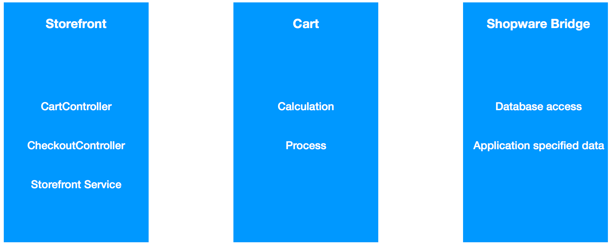

## First concept
On September 12th of 2016, we released a first concept for a new cart bundle. You can see the development process on <a href="https://github.com/shopware/shopware-cart-poc">Github</a>, where we created a new repository which allows the community to create pull requests and issues. The new repository contains a new bundle in `/engine/Shopware/Bundle/CartBundle` which contains a first proof of concept for a new cart process.
This article documents the current implementation and how it can be used. At the moment, the cart bundle isn't implemented in Shopware's frontend, rather it is only used for testing different calculations and processes.

## Usage

### Add an line item
Lets start with a simple example: *Add a product to cart*

```
public function addProductAction()
{
    /** @var CartBundle\Infrastructure\StoreFrontCartService $cartService */
    $cartService = $this->container->get('shopware_cart.store_front_cart_service');

    $cartService->add(
        new CartBundle\Domain\LineItem\LineItem(
            'SW10239',  //number
            CartBundle\Domain\Product\ProductProcessor::TYPE_PRODUCT,
            1 // quantity
        )
    );
}
```

### Remove a line item
Next we remove this item again using the cart identifier (see above `SW10239`)
```
public function removeAction()
{
    /** @var CartBundle\Infrastructure\StoreFrontCartService $cartService */
    $cartService = $this->container->get('shopware_cart.store_front_cart_service');

    $cartService->remove('SW10239');
}
```

### Get line items
To get access of all line items in cart, the `StoreFrontCartService` allows access on the calculated cart over `getCalculated()`.

```
public function showLineItemsAction()
{
    /** @var CartBundle\Infrastructure\StoreFrontCartService $cartService */
    $cartService = $this->container->get('shopware_cart.store_front_cart_service');

    $cartService->add(
        new CartBundle\Domain\LineItem\LineItem(
            $number = 'SW10239',
            CartBundle\Domain\Product\ProductProcessor::TYPE_PRODUCT,
            $quantity = 10
        )
    );
    $cartService->add(
        new CartBundle\Domain\LineItem\LineItem(
            $number = 'SW10009',
            CartBundle\Domain\Product\ProductProcessor::TYPE_PRODUCT,
            $quantity = 10
        )
    );

    /** @var CartBundle\Domain\Cart\CalculatedCart $cart */
    $cart = $cartService->getCalculated();

    /** @var CartBundle\Domain\LineItem\CalculatedLineItemInterface $lineItem */
    foreach ($cart->getLineItems() as $lineItem) {
        echo "\n\n line item: " . $lineItem->getIdentifier();
        echo "\n unit price: " . $lineItem->getPrice()->getUnitPrice();
        echo "\n quantity: " . $lineItem->getPrice()->getQuantity();
        echo "\n price : " . $lineItem->getPrice()->getPrice();
        echo "\n taxes : " . $lineItem->getPrice()->getCalculatedTaxes()->getAmount();

        /** @var CartBundle\Domain\Tax\CalculatedTax $tax */
        foreach ($lineItem->getPrice()->getCalculatedTaxes() as $tax) {
            echo "\n tax " . $tax->getTaxRate() . "% : " . $tax->getTax();
        }
    }
}
```

### Get cart amount
The cart amount is stored inside the `CalculatedCart` and can be accessed over `getPrice()`.
```php
public function showAmountAction()
{
    /** @var CartBundle\Infrastructure\StoreFrontCartService $cartService */
    $cartService = $this->container->get('shopware_cart.store_front_cart_service');

    $cartService->add(
        new CartBundle\Domain\LineItem\LineItem(
            $number = 'SW10239',
            CartBundle\Domain\Product\ProductProcessor::TYPE_PRODUCT,
            $quantity = 10
        )
    );
    $cartService->add(
        new CartBundle\Domain\LineItem\LineItem(
            $number = 'SW10009',
            CartBundle\Domain\Product\ProductProcessor::TYPE_PRODUCT,
            $quantity = 5
        )
    );

    /** @var CartBundle\Domain\Cart\CalculatedCart $cart */
    $cart = $cartService->getCalculated();

    echo "\n amount: " . $cart->getPrice()->getTotalPrice();
    echo "\n amount net: " . $cart->getPrice()->getNetPrice();
    echo "\n tax amount: " . $cart->getPrice()->getCalculatedTaxes()->getAmount();

    /** @var CartBundle\Domain\Tax\CalculatedTax $tax */
    foreach ($cart->getPrice()->getCalculatedTaxes() as $tax) {
        echo "\n tax " . $tax->getTaxRate() . "% : " . $tax->getTax();
    }
}
```

### Get deliveries
Each cart contains a collection of deliveries, in case that the customer is logged in (requires a delivery address).
This deliveries can be accessed over `getDeliveries()`. 
```
public function showDeliveriesAction()
{
    /** @var CartBundle\Infrastructure\StoreFrontCartService $cartService */
    $cartService = $this->container->get('shopware_cart.store_front_cart_service');
    $cartService->add(
        new CartBundle\Domain\LineItem\LineItem(
            $number = 'SW10239',
            CartBundle\Domain\Product\ProductProcessor::TYPE_PRODUCT,
            $quantity = 50
        )
    );
    $cartService->add(
        new CartBundle\Domain\LineItem\LineItem(
            $number = 'SW10009',
            CartBundle\Domain\Product\ProductProcessor::TYPE_PRODUCT,
            $quantity = 25
        )
    );

    /** @var CartBundle\Domain\Cart\CalculatedCart $cart */
    $cart = $cartService->getCalculated();

    /** @var CartBundle\Domain\Delivery\Delivery $delivery */
    foreach ($cart->getDeliveries() as $index => $delivery) {
        echo "\n\n ---------- \n delivery #" . $index;

        $price = $delivery->getPositions()->getPrices()->getTotalPrice();
        echo "\n amount of delivery: " . $price->getPrice();
        echo "\n tax amount of delivery: " . $price->getCalculatedTaxes()->getAmount();

        echo "\n\n address: ";
        echo ' ' . $delivery->getAddress()->getFirstname();
        echo ' ' . $delivery->getAddress()->getLastname();
        echo ' ' . $delivery->getAddress()->getStreet();
        echo ' ' . $delivery->getAddress()->getZipcode();
        echo ' ' . $delivery->getAddress()->getCity();

        echo "\n delivery date: ";
        echo $delivery->getDeliveryDate()->getEarliest()->format('Y-m-d');
        echo ' - ';
        echo $delivery->getDeliveryDate()->getLatest()->format('Y-m-d');

        /** @var CartBundle\Domain\Delivery\DeliveryPosition $position */
        foreach ($delivery->getPositions() as $i => $position) {
            echo "\n\n position " . $i;
            echo "\n quantity " . $position->getQuantity();
            echo "\n price in delivery: " . $position->getPrice()->getPrice();
        }

    }
}
```

## Architecture

### Cart layers
The cart passes through different states during the calculation process. In order to provide a valid state for each service layer, the states are reflected in different classes:
* `CartBundle\Domain\Cart\Cart`
    * Defines which line items have to be calculated inside the process
* `CartBundle\Domain\Cart\ProcessorCart`
    * Defines which line items have already been calculated and which deliveries have been generated 
* `CartBundle\Domain\Cart\CalculatedCart`
    * Contains a list of all calculated line items 
    * Contains a collection of all generated deliveries
    * Has a calculated price with total tax amounts, tax rules and net or gross prices

### Processor concept 
The following diagram shows the architecture behind the cart process for product calculation:   


The cart calculation is done in the `CartBundle\Domain\Cart\CartCalculator` class.  
This class contains a list of `CartBundle\Domain\Cart\CartProcessorInterface`, which are the access points for the Shopware core and third party developers in the cart process. 
```php
interface CartProcessorInterface
{
    public function process(
        CartBundle\Domain\Cart\Cart $cart,
        CartBundle\Domain\Cart\ProcessorCart $processorCart,
        CartContextInterface $context
    );
}

```

### Domain and Infrastructure layers
For the architecture design, we took great care to separate business logic from the database and Shopware dependencies.
That means all Shopware-specific operations such as database access, delivery information or price selections (with graduated prices or price groups) are separated into individual gateways that can be replaced with other data sources.
These layers are named **Domain** and **Infrastructure** and are placed on the first level of the `CartBundle`.
The domain layer should not have any dependencies to the Shopware core. That's the infrastructure/bundle layer.
Interactions with Shopware are defined over gateways. Applying this concept to the product processor described above leads to the following architecture:




## Price calculations
At the moment, the `CartBundle` contains the following calculation classes:
* `\Shopware\Bundle\CartBundle\Domain\Price\PriceCalculator`
    * Calculates a total price for a provided `PriceDefinition`
    * Calculates the gross/net unit price and total price
    * Uses tax calculation services for including/excluding taxes

* `\Shopware\Bundle\CartBundle\Domain\Price\PercentagePriceCalculator`
    * Calculates a percentage price based on a provided collection of prices (`PriceCollection`)
    * Sums all prices to a total amount and calculates a percentage price value
    * Calculates the percentage share of tax rules inside the provided prices and calculates the taxes percentage 
    * Example:
        * 100.00 € with 19% and 100.00€ with 7%
        * 10% should be calculated 
        * 200€ (price amount) * 10% => 20.00%
        * 50% of the price is based on 19% tax calculation
        * 50% of the price is based on  7% tax calculation
        
And the following tax calculation services:
* `\Shopware\Bundle\CartBundle\Domain\Tax\TaxRuleCalculator`
    * Tax calculation is based on a price with a simple tax rate
    * Example
        * 100.00 € should be calculated with a 19% tax rate
    
* `\Shopware\Bundle\CartBundle\Domain\Tax\PercentageTaxRuleCalculator`
    * Tax calculation is based on a percentage price value
    * Example: 
        * total price: 100.00 €
        * 90.00€ should be calculated with a 19% tax rate
        * 10.00€ should be calculated with a 7% tax rate

## Extensibility concept
All services in the CartBundle defined inside the service container, which means each service can be replaced or decorated. 

### Example - Discount for new customers
The following examples shows one possible solution for creating dynamic discounts for new customers.  
```
<?php

namespace CartExtension\Bundle\CartBundle\Domain;

use Doctrine\DBAL\Connection;
use Shopware\Bundle\CartBundle\Domain\Cart\Cart;
use Shopware\Bundle\CartBundle\Domain\Cart\CartContextInterface;
use Shopware\Bundle\CartBundle\Domain\Cart\CartProcessorInterface;
use Shopware\Bundle\CartBundle\Domain\Cart\ProcessorCart;
use Shopware\Bundle\CartBundle\Domain\LineItem\CalculatedLineItem;
use Shopware\Bundle\CartBundle\Domain\Price\PercentagePriceCalculator;

class NewCustomerDiscountProcessor implements CartProcessorInterface
{
    /**
     * @var Connection
     */
    private $connection;

    /**
     * @var PercentagePriceCalculator
     */
    private $percentagePriceCalculator;

    /**
     * @param Connection $connection
     * @param PercentagePriceCalculator $percentagePriceCalculator
     */
    public function __construct(
        Connection $connection,
        PercentagePriceCalculator $percentagePriceCalculator
    ) {
        $this->connection = $connection;
        $this->percentagePriceCalculator = $percentagePriceCalculator;
    }

    /**
     * Access point for cart process
     * @param Cart $cart
     * @param ProcessorCart $processorCart
     * @param CartContextInterface $context
     */
    public function process(
        Cart $cart,
        ProcessorCart $processorCart,
        CartContextInterface $context
    ) {
        //no logged in state?
        if (!$context->getCustomer()) {
            return;
        }

        //validate if customer should get discount
        if (!$this->isNewCustomer($context->getCustomer()->getId())) {
            return;
        }

        //get access to all goods inside the cart
        $goods = $processorCart->getLineItems()->filterGoods();

        //use core calculator for percentage price calculation with all goods prices
        $discount = $this->percentagePriceCalculator->calculatePrice(
            -10,
            $goods->getPrices(),
            $context
        );

        //add calculated discount to cart
        $processorCart->getLineItems()->add(
            new CalculatedLineItem('new-customer-discount', $discount)
        );
    }

    /**
     * Validates if the provided customer id is a new customer in the system
     * and should get the `new customer discount`
     *
     * @param int $customerId
     * @return bool
     */
    private function isNewCustomer($customerId)
    {
        $hasOrder = $this->connection->createQueryBuilder()
            ->select('1')
            ->from('s_order', 'orders')
            ->where('orders.userID = :id')
            ->andWhere('orders.ordernumber > 0')
            ->setMaxResults(1)
            ->setParameter(':id', $customerId)
            ->execute()
            ->fetch(\PDO::FETCH_COLUMN);

        return !$hasOrder;
    }
}
```
The first two conditions validate if a customer is logged in and if the customer has already made an order.
After the validation passes that the customer is a new customer, the processor first collects all calculated goods in the cart `$goods = $processorCart->getLineItems()->filterGoods();`.
To calculate the percentage discount for the `new customer discount` the processor uses the Shopware core calculator `\Shopware\Bundle\CartBundle\Domain\Price\PercentagePriceCalculator`.

The processor has to be registered over the `cart_processor` container tag. The priority defines at which position the calculator has to be executed (after product calculation, before voucher, ...).
```
<service id="cart_extension.new_customer_discount_processor" class="CartExtension\Bundle\CartBundle\Domain\NewCustomerDiscountProcessor">
    <argument type="service" id="dbal_connection" />
    <argument type="service" id="shopware_cart.percentage_price_calculator" />
    <tag name="cart_processor" priority="20000" />
</service>
```

### Example - Blacklisted products
The following examples shows a possible solution for preventing some products from entering the cart:

```
<?php

namespace CartExtension\Bundle\CartBundle\Domain;

use Shopware\Bundle\CartBundle\Domain\Cart\Cart;
use Shopware\Bundle\CartBundle\Domain\Cart\CartContextInterface;
use Shopware\Bundle\CartBundle\Domain\Cart\CartProcessorInterface;
use Shopware\Bundle\CartBundle\Domain\Cart\ProcessorCart;
use Shopware\Bundle\CartBundle\Domain\LineItem\LineItem;
use Shopware\Bundle\CartBundle\Domain\LineItem\LineItemCollection;
use Shopware\Bundle\CartBundle\Domain\Product\ProductProcessor;

class BlackListedProductProcessor implements CartProcessorInterface
{
    private $blackList = [
        'SW10239'
    ];

    public function process(
        Cart $cart,
        ProcessorCart $processorCart,
        CartContextInterface $context
    ) {
        /** @var LineItemCollection $products */
        $products = $cart->getLineItems()->filterType(ProductProcessor::TYPE_PRODUCT);

        /** @var LineItem $product */
        foreach ($products as $product) {
            if (in_array($product->getIdentifier(), $this->blackList)) {
                $cart->getLineItems()->remove($product->getIdentifier());
            }
        }
    }
}
```

The service is registered as follow:
```
<service id="cart_extension.black_listed_product_processor" class="CartExtension\Bundle\CartBundle\Domain\BlackListedProductProcessor">
    <tag name="cart_processor" priority="50000" />
</service>
```
Using a high priority defines an early position inside the cart calculation for this processor. The `\Shopware\Bundle\CartBundle\Domain\Product\ProductProcessor` is registered with priority 30000, which means it is executed after this blacklist processor.
